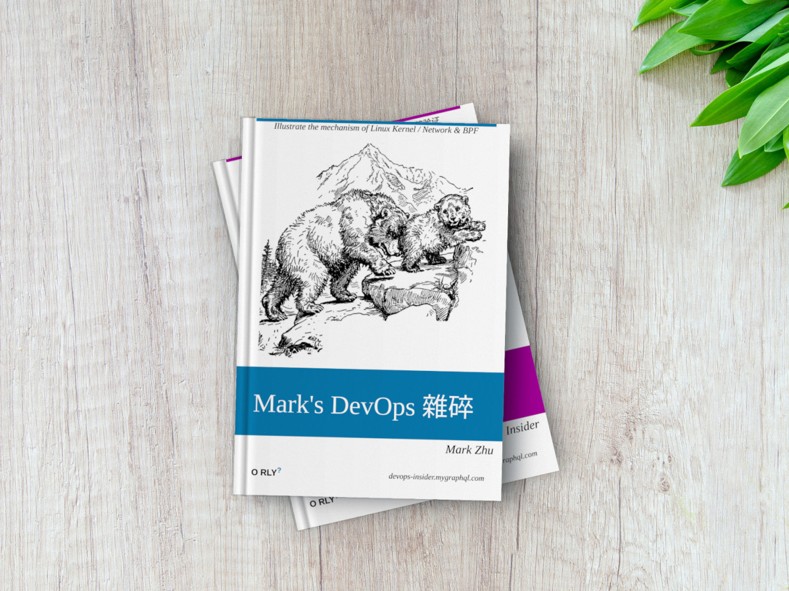

# 前言


```{warning}
这是一本编写中的书，现在只是草稿阶段。书名为《Mark 的 DevOps 沉思录》。
```

## 本书概述

### 本书不是什么

本书不是一本使用手册。更不是从使用者角度，教如何深入浅出学习 Istio。不会布道 Istio 有如何如何强大之功能，更不会教如何使用 Istio。这方面网上已经有太多非常优秀的书、文章、文档了。

> 🤷 : [Yet, another](https://en.wikipedia.org/wiki/Yet_another) Istio User Guide?  
> 🙅 : No!


### 本书是什么

本书中，我尝试用设计与实现角度，尽量系统地去思考：
- Istio 为什么是现在的样子
- 那些魔术配置背后的真相： Linux + Envoy 
- Istio 将来可能是什么样子


书里说的，只是在我研究与使用了 Istio 一段时间后，的思考与记录。我不是专家，更不是 Istio Committer。连互联网大厂员工也不是。只是排查过一些 Istio/Envoy 相关的功能与性能问题，浏览和 Debug 过一些 Istio/Envoy 的代码。

在研究 Istio 过程中。发现网上是有很多非常有价值的资讯。但是，要么主要是从使用者出发，没说实现机理；要么就是说了机理，也说得很好，但内容少了系统化和连贯性。

### 读者对象
本书主要讲 Istio/Envoy 的设计、实现机制。假设读者已经有一定的 Istio 使用经验。

### 书的访问地址
- [https://devops-insider.mygraphql.com](https://devops-insider.mygraphql.com)
- [https://devops-insider.readthedocs.io](https://devops-insider.readthedocs.io)
- [https://devops-insider.rtfd.io](https://devops-insider.rtfd.io)


### 关于作者
我叫 Mark Zhu，一个中年且头发少的程序员。

Blog: [https://blog.mygraphql.com/](https://blog.mygraphql.com/)


### 重要：风格、样式、本文的交互阅读方式 📖

#### 互动图书

可以这样说，我写作的大部时间不是花在文字上，是在绘图上。所以用电脑去读图，才是本书的正确打开方法。手机，只是个引流的阳谋。
这里的图大多比较复杂，不是 PPT 大饼图。所以，基本也不适合打印出纸质书。但我会让图与读者互动：

- 原创的图，多数是用 Draw.io 制作的 SVG 图片：`*.drawio.svg`。

复杂的图，建议 `用 draw.io 打开` ：
- 有的图片提供了 `用 draw.io 打开` 的链接，可以在浏览器用互动性更强的方式浏览:
  - 有的地方（带下划线的文字），链接到相关文档和代码行。
  - 鼠标放上去，会弹出 `hover` 窗口，提示更多的信息。如配置文件内容。

如果不喜欢 draw.io 那么直接看 SVG:
- 浏览 SVG 图片的正确姿势是浏览器中图片处右键，选择 `新 Tab 中打开图片` 。大的 SVG 图片，按下鼠标中键，自由滚动/拖动。
- SVG 图片可以点击链接，直接跳转到相应源码网页(或相关文档)，有时会精确到源码行。

#### 语言风格
由于本文不打算打印出版。也不是什么官方文档。所以语言上我是口语化的。如果读者的期望是阅读一本非常严肃的书，那么可能会失望。但不严肃不代表不严谨。

### 参与编写
如果你也对编写本书有兴趣，欢迎联系我。本书的出发点不是刷简历，也没这个能力。而且，这样的非`短平快` 且 `TL;DR` 书籍注定是小众货。


### Dedication 💞
First, to my dear parents, for showing me how to live a happy
and productive life. To my dear wife and our amazing kid – thanks for all your love and patience.


### Copyleft 声明
无论是文字还是图片，如果转载或修改，请注明原出处。