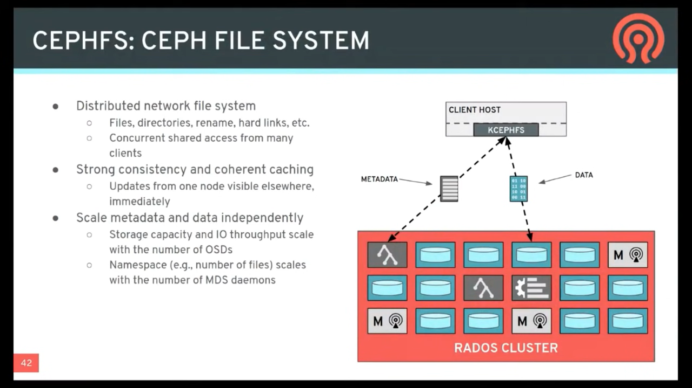
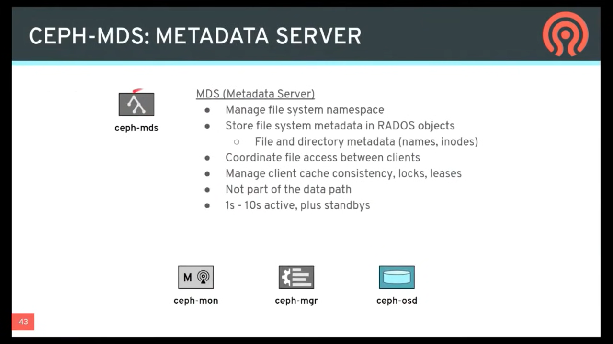
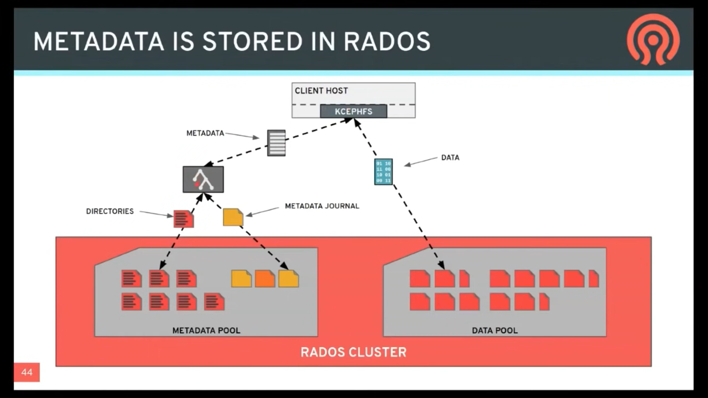
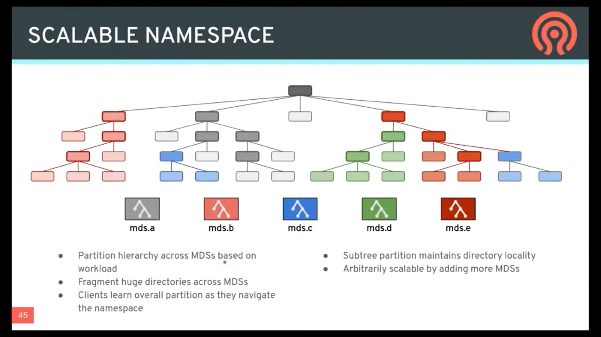

# (CephFS) CEPH FILE SYSTEM


The Ceph File System (CephFS) provides a POSIX-compliant filesystem as a service that is layered on top of the object-based Ceph Storage Cluster. CephFS files get mapped to objects that Ceph stores in the Ceph Storage Cluster. Ceph Clients mount a CephFS filesystem as a kernel object or as a Filesystem in User Space (FUSE).


The Ceph File System service includes the `Ceph Metadata Server (MDS)` deployed with the Ceph Storage cluster. The purpose of the `MDS` is to store all the **filesystem metadata (directories, file ownership, access modes, etc)** in high-availability Ceph Metadata Servers where the **metadata resides in memory**. The reason for the MDS (a daemon called `ceph-mds`) is that simple filesystem operations like listing a directory or changing a directory (`ls`, `cd`) would tax the Ceph OSD Daemons unnecessarily. So separating the metadata from the data means that the Ceph File System can provide high performance services without taxing the Ceph Storage Cluster.

CephFS separates the metadata from the data, storing the metadata in the MDS, and storing the file data in one or more objects in the Ceph Storage Cluster. The Ceph filesystem aims for POSIX compatibility. `ceph-mds` can run as a single process, or it can be distributed out to multiple physical machines, either for high availability or for scalability.

- **High Availability**: The extra `ceph-mds` instances can be standby, ready to take over the duties of any failed `ceph-mds` that was active. **This is easy because all the data, including the journal, is stored on RADOS**. The transition is triggered automatically by `ceph-mon`.
- **Scalability**: Multiple `ceph-mds` instances can be active, and they will split the directory tree into subtrees (and shards of a single busy directory), effectively balancing the load amongst all active servers.

Combinations of standby and active etc are possible, for example running 3 active `ceph-mds` instances for scaling, and one standby instance for high availability.


> [2019-JUN-27 :: Ceph Tech Talk - Intro to Ceph](https://youtu.be/PmLPbrf-x9g?t=3449)













## CEPHFS DELAYED DELETION

> https://docs.ceph.com/en/quincy/dev/delayed-delete/

The deletion of a file does not immediately remove its data. Each of the file’s underlying objects must be removed independently. If these objects were removed immediately, the client would have to send size_of_file / stripe_size * replication_count messages. This would consume significant bandwith and would slow the client unacceptably. If snapshots exist, their existence can prevent the deletion of objects associated with them.

In these cases, such files are (1) marked as deleted on the MDS and (2) deleted lazily.


## CEPH FILE SYSTEM introduction

> https://docs.ceph.com/en/quincy/cephfs/


The Ceph File System, or **CephFS**, is a POSIX-compliant file system built on top of Ceph’s distributed object store, **RADOS**. CephFS endeavors to provide a state-of-the-art, multi-use, highly available, and performant file store for a variety of applications, including traditional use-cases like shared home directories, HPC scratch space, and distributed workflow shared storage.

CephFS achieves these goals through the use of some novel architectural choices. Notably:

**file metadata is stored in a separate RADOS pool from file data**(文件的属性与目录结构，保存于独立的 RADOS pool。与 file data 隔离) and served via a resizable cluster of *Metadata Servers*, or **MDS**, which may scale to support higher throughput metadata workloads. 

Clients of the file system have direct access to RADOS for reading and writing file data blocks. For this reason, workloads may linearly scale with the size of the underlying RADOS object store; that is, there is no gateway or broker mediating data I/O for clients.

Access to data is coordinated through the cluster of MDS which serve as authorities for the state of the distributed metadata cache cooperatively maintained by clients and MDS. 

Mutations to metadata are aggregated by each MDS into a series of efficient writes to a journal on RADOS; no metadata state is stored locally by the MDS. This model allows for coherent and rapid collaboration between clients within the context of a POSIX file system.


CephFS is the subject of numerous academic papers for its novel designs and contributions to file system research. It is the oldest storage interface in Ceph and was once the primary use-case for RADOS. Now it is joined by two other storage interfaces to form a modern unified storage system: RBD (Ceph Block Devices) and RGW (Ceph Object Storage Gateway).

### GETTING STARTED WITH CEPHFS

For most deployments of Ceph, setting up a CephFS file system is as simple as:

```
ceph fs volume create <fs name>
```

The Ceph [Orchestrator](https://docs.ceph.com/en/quincy/mgr/orchestrator) will automatically create and configure MDS for your file system if the back-end deployment technology supports it (see [Orchestrator deployment table](https://docs.ceph.com/en/quincy/mgr/orchestrator/#current-implementation-status)). Otherwise, please [deploy MDS manually as needed](https://docs.ceph.com/en/quincy/cephfs/add-remove-mds).

Finally, to mount CephFS on your client nodes, see [Mount CephFS: Prerequisites](https://docs.ceph.com/en/quincy/cephfs/mount-prerequisites) page. Additionally, a command-line shell utility is available for interactive access or scripting via the [cephfs-shell](https://docs.ceph.com/en/quincy/man/8/cephfs-shell).


