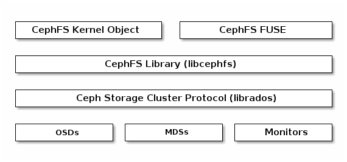

# (CephFS) CEPH FILE SYSTEM

The Ceph File System (CephFS) provides a POSIX-compliant filesystem as a service that is layered on top of the object-based Ceph Storage Cluster. CephFS files get mapped to objects that Ceph stores in the Ceph Storage Cluster. Ceph Clients mount a CephFS filesystem as a kernel object or as a Filesystem in User Space (FUSE).

The Ceph File System service includes the `Ceph Metadata Server (MDS)` deployed with the Ceph Storage cluster. The purpose of the `MDS` is to store all the **filesystem metadata (directories, file ownership, access modes, etc)** in high-availability Ceph Metadata Servers where the **metadata resides in memory**. The reason for the MDS (a daemon called `ceph-mds`) is that simple filesystem operations like listing a directory or changing a directory (`ls`, `cd`) would tax the Ceph OSD Daemons unnecessarily. So separating the metadata from the data means that the Ceph File System can provide high performance services without taxing the Ceph Storage Cluster.

CephFS separates the metadata from the data, storing the metadata in the MDS, and storing the file data in one or more objects in the Ceph Storage Cluster. The Ceph filesystem aims for POSIX compatibility. `ceph-mds` can run as a single process, or it can be distributed out to multiple physical machines, either for high availability or for scalability.

- **High Availability**: The extra `ceph-mds` instances can be standby, ready to take over the duties of any failed `ceph-mds` that was active. **This is easy because all the data, including the journal, is stored on RADOS**. The transition is triggered automatically by `ceph-mon`.
- **Scalability**: Multiple `ceph-mds` instances can be active, and they will split the directory tree into subtrees (and shards of a single busy directory), effectively balancing the load amongst all active servers.

Combinations of standby and active etc are possible, for example running 3 active `ceph-mds` instances for scaling, and one standby instance for high availability.

## CEPHFS DELAYED DELETION

> https://docs.ceph.com/en/quincy/dev/delayed-delete/

The deletion of a file does not immediately remove its data. Each of the file’s underlying objects must be removed independently. If these objects were removed immediately, the client would have to send size_of_file / stripe_size * replication_count messages. This would consume significant bandwith and would slow the client unacceptably. If snapshots exist, their existence can prevent the deletion of objects associated with them.

In these cases, such files are (1) marked as deleted on the MDS and (2) deleted lazily.

