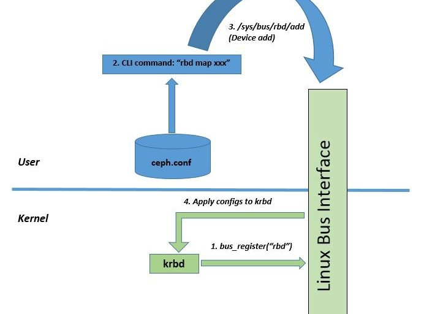
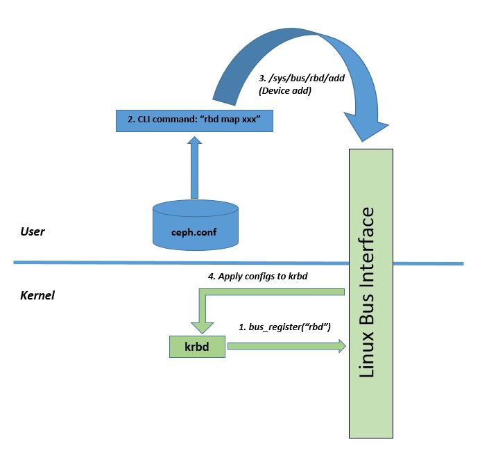

# Deep Dive Into Ceph’s Kernel Client

> [https://engineering.salesforce.com/deep-dive-into-cephs-kernel-client-edea75787528/](https://engineering.salesforce.com/deep-dive-into-cephs-kernel-client-edea75787528/)




Ceph is an open source, unified, distributed storage system that we use within Salesforce to build a block storage service. Ceph’s block storage implementation uses a client module (which runs on the same host where the application consuming storage would run) that can directly read and write data from data daemons (without requiring a gateway). The client module has two implementations depending on the ecosystem that the client integrates with:

1. librbd (user-space)
2. krbd (kernel module)

Librbd is typically used in virtual machine environments (such as KVMs or QEMU) and krbd is used in container and bare-metal environments. At Salesforce, we run Ceph in Docker containers and install the krbd module on hosts where the application containers are launched.

This article describes some of the internals of the implementation of the kernel client (krbd) within Ceph. Specifically, here are the topics it covers:

1. Initialization
2. How Ceph configs are ingested by the kernel module
3. Entry points in code to process configs
4. Handling connections
5. Security
6. Connection state machines

## krbd Initialization

The `krbd` is a Linux kernel module. It is implemented as a kernel block device under Linux’s `/sys/bus/` interface. The entire Ceph client implementation is in the kernel module (there is no user-space process or daemon associated with it).

Ceph clients require a config file (`ceph.conf`) to know how to reach the cluster as well as the cluster’s attributes. This config file typically includes the IP address(es) for the monitor, user credentials, and security attributes required for Ceph authentication (Cephx). All this configuration needs to be pushed down to the kernel module for initialization. Once this is done, the rest of the implementation, image or volume lifecycle, connection management, authentication, and state machines are fully implemented within the kernel module.

## Pushing Ceph Configs to Kernel Module

When you run ceph-deploy to install the client, it installs the client binary that is used to invoke CLI commands on the Ceph client (commands that start with prefix “`rbd`”).

## rbd CLI

One of the first commands the client invokes is:

```
rbd map <device-name> --pool <pool_name>
```

By default, `rbd` reads the config information from the `/etc/ceph/ceph.conf` file. This file can contain information such as monitor addresses (for the client to contact the monitor), OSD idle ttl, OSD keepalive timeout, OSD request timeout, secrets, etc). The full list of config options can be obtained here: https://docs.ceph.com/docs/jewel/man/8/rbd/#kernel-rbd-krbd-options.



The `rbd map` CLI command actually reads the `ceph.conf` file and pushes this config down to the krbd module using the Linux “bus” interface (`/sys/bus/<***extension\***>` – in our case, it will be `**/sys/bus/rbd/add**`):

> *The definition according to:* https://github.com/torvalds/linux/blob/master/include/linux/device.h
>
> A bus is a channel between the processor and one or more devices. For the purposes of the device model, all devices are connected via a bus, even if it is an internal, virtual, “platform” bus. Buses can plug into each other — a USB controller is usually a PCI device, for example. The device model represents the actual connections between buses and the devices they control.
>
> In the Linux device model, a bus is represented by the `bus_type` structure, defined in `linux/device.h`. This structure looks like:

```c
struct bus_type {
    char *name;
    struct subsystem subsys;
    struct kset drivers;
    struct kset devices;
    int (*match)(struct device *dev, struct device_driver *drv);
    struct device *(*add)(struct device * parent, char * bus_id);
    int (*hotplug) (struct device *dev, char **envp, 
                    int num_envp, char *buffer, int buffer_size);
    /* Some fields omitted */
};
```

The source code for this implementation is in the ceph/ceph git repository here: https://github.com/ceph/ceph/blob/master/src/krbd.cc

```c
extern "C" int krbd_map(struct krbd_ctx *ctx, const char *pool,
                        const char *image, const char *snap,
                        const char *options, char **pdevnode)
{
  ...
  // this invokes do_map, which invokes sysfs_write_rbd_add()
  r = map_image(ctx, pool, image, snap, options, &name); 
  
  if (r < 0)
    return r;
  ...}static int do_map(struct udev *udev, const char *pool, 
                  const char *image, const char *snap, 
                  const string& buf, string *pname)
{
   ...
   ...
   r = sysfs_write_rbd_add(buf); // this invokes sysfs_write_rbd()
   if (r < 0) {
     cerr << "rbd: sysfs write failed" << std::endl;
     goto out_mon;
   }
}static int sysfs_write_rbd(const char *which, const string& buf)
{
  // here, "which" == "add"
  const string s = string("/sys/bus/rbd/") + which; 
  ...
  r = safe_write(fd, buf.c_str(), buf.size()); 
  ...
}
```

## KRBD Config Parser

In the kernel module, the entry point for processing the configs is defined in `drivers/block/rbd.c` (https://github.com/ceph/ceph-client/blob/for-linus/drivers/block/rbd.c):

```
static ssize_t rbd_add(struct bus_type *bus, const char *buf, size_t count)
```

## Connection Setup

The kernel module is fully responsible for setting up TCP connections with the monitors and OSDs, watching these connections and reestablishing them, on failures, authentication (Cephx protocol) — all from within the kernel!

```c
rbd_add(struct bus_type *bus, const char *buf, size_t count)
   |-> do_rbd_add(struct bus_type *bus, const char *buf, size_t cnt)
        |-> rbd_get_client(struct ceph_options *ceph_opts)
             |-> rbd_client_create(struct ceph_options *ceph_opts)
                  |-> ceph_create_client(struct ceph_options *opt, 
                                         void *private) 
                                         in net/ceph/ceph_common.cstruct ceph_client *ceph_create_client(struct ceph_options *opt, void *private)
{
    ...
    /* subsystems */
    // in net/ceph/mon_client.c
    err = ceph_monc_init(&client->monc, client); 
    if (err < 0)
        goto fail;
    // in net/ceph/osd_client.c
    err = ceph_osdc_init(&client->osdc, client); 
    if (err < 0)
        goto fail_monc;
    ...
}
```

## Mon Client Initialization

Entry function: `ceph_monc_init()`

This function first builds a temporary monmap (`build_initial_monmap()`) with IP addresses provided by mount (this happens each time the client is establishing new connections to the monitor). After this it initializes the authentication data structures (invokes `ceph_auth_init()`) and prepares the following messages to walk through the initial handshake on the connection:

- `CEPH_MSG_MON_SUBSCRIBE` (msg Id: 15)
- `CEPH_MSG_MON_SUBSCRIBE_ACK` (msg Id: 16)
- `CEPH_MSG_AUTH` (msg Id: 17)
- `CEPH_MSG_AUTH_REPLY` (msg Id: 18)

## Connection initialization

Entry function: `ceph_con_init()`

At this point, it invokes `ceph_con_init()` (in `net/ceph/messenger.c`) to initialize the connections to the monitor(s) and move the connections through a state machine. `ceph_con_init()` initializes the socket and invokes a worker function that asynchronously does the connection setup.

```c
void ceph_con_init(struct ceph_connection *con, void *private,
                   const struct ceph_connection_operations *ops,
                   struct ceph_messenger *msgr)
{
    ...
    ...
    con_sock_state_init(con);    INIT_DELAYED_WORK(&con->work, ceph_con_workfn);    ...
```

`ceph_con_workfn()` walks the connection through the following **socket** states (`ceph_connection` -> `sock_state`) to get it into the `ESTABLISHED` state.

```
/*
 *      Socket state - transitions (connection state is different from socket state)
 *      --------
 *      | NEW* |  transient initial state
 *      --------
 *          | con_sock_state_init()
 *          v
 *      ----------
 *      | CLOSED |  initialized, but no socket (and no
 *      ----------  TCP connection)
 *       ^      \
 *       |       \ con_sock_state_connecting()
 *       |        ----------------------
 *       |                              \
 *       + con_sock_state_closed()       \
 *       |+---------------------------    \
 *       | \                          \    \
 *       |  -----------                \    \
 *       |  | CLOSING |  socket event;  \    \
 *       |  -----------  await close     \    \
 *       |       ^                        \   |
 *       |       |                         \  |
 *       |       + con_sock_state_closing() \ |
 *       |      / \                         | |
 *       |     /   ---------------          | |
 *       |    /                   \         v v
 *       |   /                    --------------
 *       |  /    -----------------| CONNECTING |  socket created, 
 *       |  |   /                 --------------  TCP connect   
 *       |  |   |                                 initiated
 *       |  |   | con_sock_state_connected()
 *       |  |   v
 *      -------------
 *      | CONNECTED |  TCP connection established
 *      -------------
 *
 * State values for ceph_connection->sock_state; NEW is assumed to be 0.
 *//*
 *      Connection state - transitions 
 *           --------
 *          | CLOSED |<----<-----------------<-----------<-                     
 *           --------      |                    |          |
 *              |          | On failures        |          |
 *              v          |                    |          |
 *            --------     |                    |          |
 *      ---->| PREOPEN |----                     |          |
 *     |      --------                           ^          ^
 *     |         | ceph_tcp_connect()            |          |
 *     |         v                               |          |
 *     ^    -------------                        |          |
 *     |    | CONNECTING |-----------------------           |
 *     |    -------------                                   |
 *     |         |  Read and process banner ("ceph v027"),  |    
 *     |         |  prepare capabilities to send to peer    |
 *     |         |                                          |
 *     |         v                                          |
 *     |    --------------                                   |
 *     |    | NEGOTIATING |----------------------------------     
 *     |    --------------   
 *    -------   |  Read connect_reply, auth capabilites
 *   |STANDBY|  |  from peer
 *    -------   |
 *     |        v
 *     |       -----                                          
 *     <----- |OPEN |--------------------------------------->     
 *             ----- (Complete final handshake ack)          
 *
```

## Connection Callback Registrations

Here is the structure defined in `include/linux/ceph/messenger.h` that defines callbacks for handling connection events on the monitor connection (as well as connections to osds):


```c
In include/linux/ceph/messenger.h:struct ceph_connection_operations {
    struct ceph_connection *(*get)(struct ceph_connection *);
    void (*put)(struct ceph_connection *);    /* handle an incoming message. */
    void (*dispatch) (struct ceph_connection *con, struct ceph_msg *m);    /* authorize an outgoing connection */
    struct ceph_auth_handshake *(*get_authorizer) (
                struct ceph_connection *con,
                   int *proto, int force_new);
    int (*verify_authorizer_reply) (struct ceph_connection *con);
    int (*invalidate_authorizer)(struct ceph_connection *con);    /* there was some error on the socket (disconnect, whatever) */
    void (*fault) (struct ceph_connection *con);    /* a remote host as terminated a message exchange session, and 
     * messages we sent (or they tried to send us) may be lost. */
    void (*peer_reset) (struct ceph_connection *con);    struct ceph_msg * (*alloc_msg) (struct ceph_connection *con,
                    struct ceph_msg_header *hdr,
                    int *skip);    void (*reencode_message) (struct ceph_msg *msg);    int (*sign_message) (struct ceph_msg *msg);
    int (*check_message_signature) (struct ceph_msg *msg);
};In net/ceph/mon_client.c: static const struct ceph_connection_operations mon_con_ops = {
    .get = con_get,
    .put = con_put,
    .dispatch = dispatch,
    .fault = mon_fault,
    .alloc_msg = mon_alloc_msg,
};In net/ceph/osd_client.c: static const struct ceph_connection_operations osd_con_ops = {
    .get = get_osd_con,
    .put = put_osd_con,
    .dispatch = dispatch,
    .get_authorizer = get_authorizer,
    .verify_authorizer_reply = verify_authorizer_reply,
    .invalidate_authorizer = invalidate_authorizer,
    .alloc_msg = alloc_msg,
    .reencode_message = osd_reencode_message,
    .sign_message = osd_sign_message,
    .check_message_signature = osd_check_message_signature,
    .fault = osd_fault,
};
```

Once the client has gone through the connection state machines, it receives:

1. Mon map (`ceph_monc_handle_map()` in `net/ceph/mon_client.c`)
2. Osd map (`ceph_osdc_handle_map()` in `net/ceph/osd_client.c`)

If the config file on the ceph client (`/etc/ceph/ceph.conf`) includes information about all monitors in the cluster, the client establishes connections with all the monitors in the config file. However, let’s say you have 5 monitors in the cluster, but the `/etc/ceph/ceph.conf` has only one monitor specified. In this case, the client establishes a connection with the monitor specified in the config. If the connection to this monitor breaks (`mon_fault()` -> `reopen_session()`), the client picks another monitor at random (the client has the list of all monitors from the monmap that it would have received).

The OSD map received on the monitor connection triggers the creation of OSD client structures and connections.

## krbd Source Directories in Kernel

Source files:

- `drivers/block/rbd.c`
- `drivers/block/rbd_types.h`
- `net/ceph/`

Header files:

- `include/linux/ceph`

## Wrap up

This article gives you a deep dive into the krbd client within Ceph and how it has been fully implemented within the kernel. It also provides specific pointers into the Ceph source code for entry points into various functionality that’s been implemented in the kernel client.


