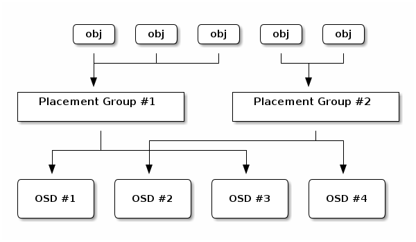
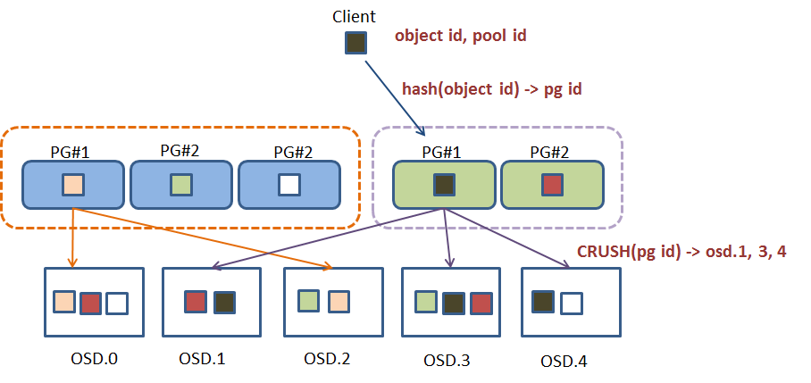
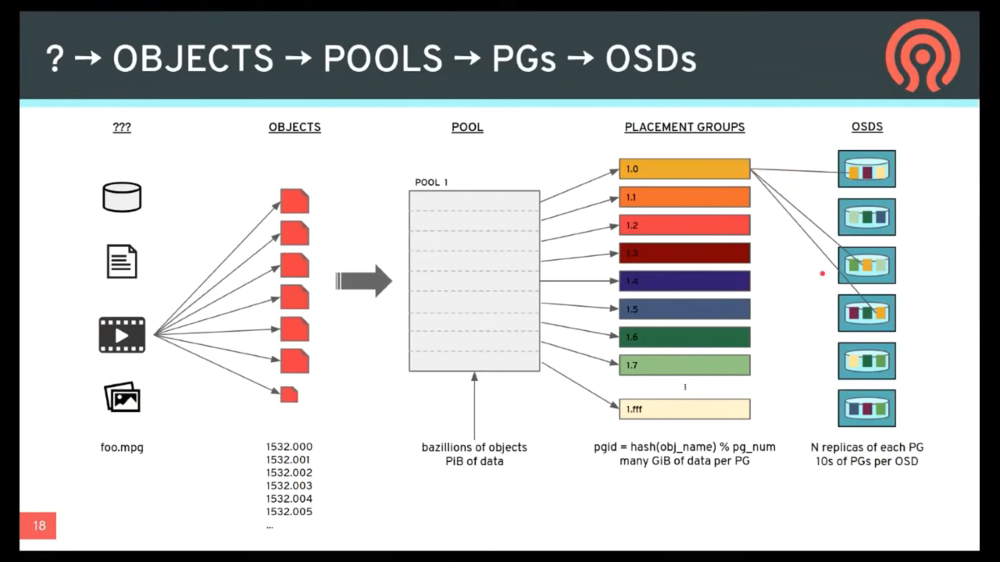
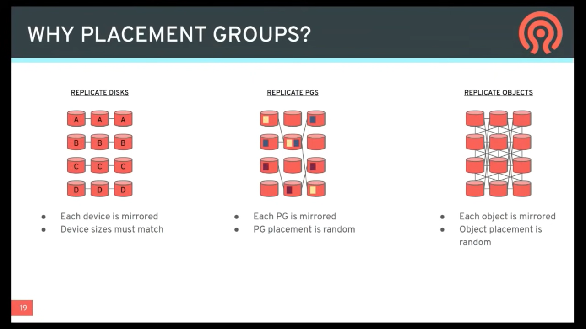
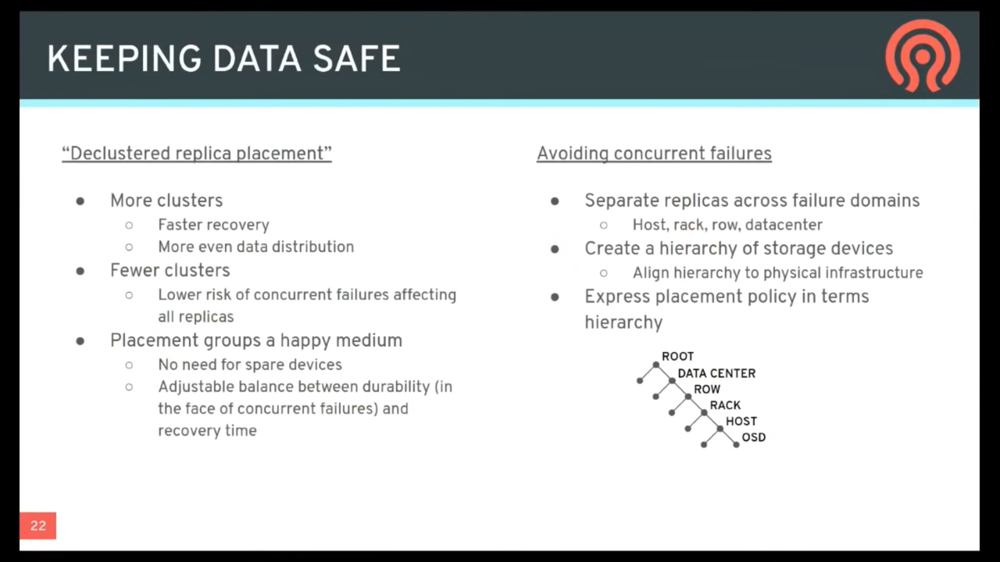

# ceph object 定位（重要）


ceph 如何找到一个 object 的位置？


## CLUSTER MAP


> https://docs.ceph.com/en/quincy/architecture/#cluster-map


Ceph depends upon Ceph Clients and Ceph OSD Daemons having knowledge of the cluster topology, which is inclusive of 5 maps collectively referred to as the “`Cluster Map`”:

1. **The Monitor Map:** Contains the cluster `fsid`, the position, name address and port of each monitor. It also indicates the current epoch, when the map was created, and the last time it changed. To view a monitor map, execute `ceph mon dump`.
2. **The OSD Map:** Contains the cluster `fsid`, when the map was created and last modified, a list of pools, replica sizes, PG numbers, a list of OSDs and their status (e.g., `up`, `in`). To view an OSD map, execute `ceph osd dump`.
3. **The PG Map:** Contains the PG version, its time stamp, the last OSD map epoch, the full ratios, and details on each placement group such as the PG ID, the Up Set, the Acting Set, the state of the PG (e.g., `active + clean`), and data usage statistics for each pool.
4. **The CRUSH Map:** Contains a list of storage devices, the failure domain hierarchy (e.g., device, host, rack, row, room, etc.), and rules for traversing the hierarchy when storing data. To view a CRUSH map, execute `ceph osd getcrushmap -o {filename}`; then, decompile it by executing `crushtool -d {comp-crushmap-filename} -o {decomp-crushmap-filename}`. You can view the decompiled map in a text editor or with `cat`.
5. **The MDS Map:** Contains the current MDS map epoch, when the map was created, and the last time it changed. It also contains the pool for storing metadata, a list of metadata servers, and which metadata servers are `up` and `in`. To view an MDS map, execute `ceph fs dump`.


Each map maintains an iterative history of its operating state changes. Ceph Monitors maintain a master copy of the cluster map including the cluster members, state, changes, and the overall health of the Ceph Storage Cluster.


## DYNAMIC CLUSTER MANAGEMENT

> https://docs.ceph.com/en/quincy/architecture/#dynamic-cluster-management

### ABOUT POOLS
The Ceph storage system supports the notion(概念) of ‘Pools’, which are logical partitions for storing objects.


Ceph Clients retrieve a [Cluster Map](https://docs.ceph.com/en/quincy/architecture/#cluster-map) from a Ceph Monitor, and write objects to pools. 

- The pool’s `size` 
- The pool’s or number of replicas, 
- the CRUSH rule 
- the number of placement groups

 determine how Ceph will place the data.


Pools set at least the following parameters:

- Ownership/Access to Objects
- The Number of `Placement Groups`, and
- The CRUSH Rule to Use.

See [Set Pool Values](https://docs.ceph.com/en/quincy/rados/operations/pools#set-pool-values) for details.


## MAPPING PGS TO OSDS

> https://docs.ceph.com/en/quincy/architecture/#mapping-pgs-to-osds

Each pool has a number of placement groups. CRUSH maps PGs to OSDs dynamically. When a Ceph Client stores objects, CRUSH will map each object to a placement group.

Mapping objects to placement groups creates a layer of indirection between the Ceph OSD Daemon and the Ceph Client. The Ceph Storage Cluster must be able to grow (or shrink) and rebalance where it stores objects dynamically. If the Ceph Client “knew” which Ceph OSD Daemon had which object, that would create a tight coupling between the Ceph Client and the Ceph OSD Daemon. Instead, the CRUSH algorithm maps each object to a placement group and then maps each placement group to one or more Ceph OSD Daemons. **This layer of indirection allows Ceph to rebalance dynamically when new Ceph OSD Daemons and the underlying OSD devices come online**. The following diagram depicts how CRUSH maps objects to placement groups, and placement groups to OSDs.



With a copy of the cluster map and the CRUSH algorithm, the client can compute exactly which OSD to use when reading or writing a particular object.


> https://ceph-doc.readthedocs.io/en/latest/Data_Placement/


### CALCULATING PG IDS

When a Ceph Client binds to a Ceph Monitor, it retrieves the latest copy of the [Cluster Map](https://docs.ceph.com/en/quincy/architecture/#cluster-map). With the cluster map, the client knows about all of the monitors, OSDs, and metadata servers in the cluster. **However, it doesn’t know anything about object locations.**

> <mark>Object locations get computed. Object 的位置中算法计算出来</mark>

The only input required by the client is:

-  the object ID 
- the pool. 

It’s simple: Ceph stores data in named pools (e.g., “liverpool”). When a client wants to store a named object (e.g., “john,” “paul,” “george,” “ringo”, etc.) it calculates a placement group using:

- the object name, a hash code, 
- the number of PGs in the pool and 
- the pool name. 

Ceph clients use the following steps to compute PG IDs.

1. The client inputs the pool name and the object ID. (e.g., pool = “liverpool” and object-id = “john”)
2. Ceph takes the object ID and hashes it.
3. Ceph calculates the hash modulo the number of PGs. (e.g., `58`) to get a PG ID.
4. Ceph gets the pool ID given the pool name (e.g., “liverpool” = `4`)
5. Ceph prepends the pool ID to the PG ID (e.g., `4.58`).

Computing object locations is much faster than performing object location query over a chatty session. The CRUSH algorithm allows a client to compute where objects *should* be stored, and enables the client to contact the primary OSD to store or retrieve the objects.


> https://ceph-doc.readthedocs.io/en/latest/Data_Placement/

Ceph 是採用間接 mapping 的方法來計算 object 該寫入的 OSD 位置



> When a Ceph Client binds to a Ceph Monitor, it retrieves the latest copy of the Cluster Map. With the cluster map, the client knows about all of the monitors, OSDs, and metadata servers in the cluster. **However, it doesn’t know anything about object locations.**

#### Steps

1. 要將一個 object 寫入到 pool 時可以取得 object ID 和 pool ID
2. 對 object ID做 hash 之後會對應到某一個 PG, 此PG的ID就會為 [Pool ID].[PG number]
3. 拿到 PG ID 就可以透過 CRUSH 演算法和 cluster map 去找到此PG所對應到的OSD

> ***Object locations get computed !!! (所有的計算都是在 client 端做)\***


#### Example

> The client inputs the pool ID and the object ID. (e.g., pool = “liverpool” and object-id = “john”) *Ceph takes the object ID and hashes it.* Ceph calculates the hash modulo the number of PGs. (e.g., 58) to get a PG ID. *Ceph gets the pool ID given the pool name (e.g., “liverpool” = 4)* Ceph prepends the pool ID to the PG ID (e.g., 4.58). * Computing object locations is much faster than performing object location query over a chatty session. The CRUSH algorithm allows a client to compute where objects should be stored, and enables the client to contact the primary OSD to store or retrieve the objects.


> https://www.thomas-krenn.com/de/wiki/Datei:Ceph-osd-crush-map.png


> [2019-JUN-27 :: Ceph Tech Talk - Intro to Ceph](https://www.youtube.com/watch?v=PmLPbrf-x9g&t=725s)










## PG (PLACEMENT GROUP) NOTES

> https://docs.ceph.com/en/quincy/dev/placement-group/#pg-placement-group-notes

PG = “placement group”. When placing data in the cluster, objects are mapped into PGs, and those PGs are mapped onto OSDs. **We use the indirection so that we can group objects, which reduces the amount of per-object metadata we need to keep track of and processes we need to run** (it would be prohibitively expensive to track eg the placement history on a per-object basis). Increasing the number of PGs can reduce the variance in per-OSD load across your cluster, but each PG requires a bit more CPU and memory on the OSDs that are storing it. We try and ballpark it at 100 PGs/OSD, although it can vary widely without ill effects depending on your cluster. You hit a bug in how we calculate the initial PG number from a cluster description.

There are a couple of different categories of PGs; the 6 that exist (in the original emailer’s ceph -s output) are “local” PGs which are tied to a specific OSD. However, those aren’t actually used in a standard Ceph configuration.


### MAPPING ALGORITHM (SIMPLIFIED)


\> How does the Object->PG mapping look like, do you map more than one object on

\> one PG, or do you sometimes map an object to more than one PG? How about the

\> mapping of PGs to OSDs, does one PG belong to exactly one OSD?

\>

\> Does one PG represent a fixed amount of storage space?

- <mark>Many objects map to one PG.</mark>

- <mark>Each object maps to exactly one PG.</mark>

- <mark>One PG maps to a single list of OSDs, where the first one in the list is the `primary` and the rest are `replicas`. </mark>
- Many PGs can map to one OSD.


<mark>A PG represents nothing but a grouping of objects;</mark> you configure the number of PGs you want, number of OSDs * 100 is a good starting point , and all of your stored objects are pseudo-randomly evenly distributed to the PGs. So a PG explicitly does NOT represent a fixed amount of storage; it represents 1/pg_num’th of the storage you happen to have on your OSDs.

Ignoring the finer points of CRUSH and custom placement, it goes something like this in pseudocode:

```python
locator = object_name
obj_hash = hash(locator)
pg = obj_hash % num_pg
OSDs_for_pg = crush(pg)  # returns a list of OSDs
primary = osds_for_pg[0]
replicas = osds_for_pg[1:]
```

If you want to understand the crush() part in the above, imagine a perfectly spherical datacenter in a vacuum ;) that is, if all OSDs have weight 1.0, and there is no topology to the data center (all OSDs are on the top level), and you use defaults, etc, it simplifies to consistent hashing; you can think of it as:

```python
def crush(pg):
   all_osds = ['osd.0', 'osd.1', 'osd.2', ...]
   result = []
   # size is the number of copies; primary+replicas
   while len(result) < size:
       r = hash(pg)
       chosen = all_osds[ r % len(all_osds) ] #计算 PG 的主 OSD
       if chosen in result:
           # OSD can be picked only once
           continue
       result.append(chosen)
   return result   
```


> [2019-JUN-27 :: Ceph Tech Talk - Intro to Ceph](https://www.youtube.com/watch?v=PmLPbrf-x9g&t=725s)


