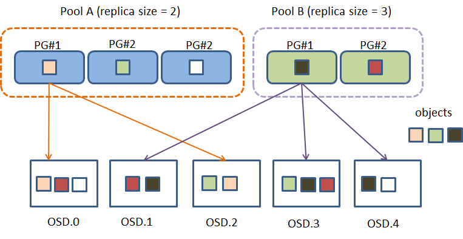

# ceph Placement Group (PG)

> https://docs.ceph.com/en/quincy/rados/operations/placement-groups/#placement-groups

> https://ceph-doc.readthedocs.io/en/latest/Data_Placement/

### Why Placement Group ?

PG 也是一個邏輯層概念, 可以把他想成是一群 object 的集合, 加入PG這一層是為了能夠更好的分散 object 和計算 object 位置並且達到系統的擴充性

Ceph 的設計上是去避免單點故障(single point of failure)去影響整個系統, 所以 Client 是直接去對 OSD 寫入 object 的, 如果沒有 PG 這一層的話, 當 object 數量達到數以萬計的時候要去計算 object 的位置會非常困難且消耗資源, 因為這些 object 都分別寫到不同的 OSD 當中

- 將 objects 集合成一個 PG 的最大好處就是降低了要追蹤和處理 metadata 的數量, 節省大量計算資源

  > 不需要去記錄每一個 object 的位置和 metadata, 只要去管理 PG 的 metadata 就好, 而 PG 的數量級遠遠低於 object 的數量級

- 增加 PG 數量可均衡每一個 OSD 的附載, 提高資料存取的併行度

- 分隔故障域，提高數據的可靠性 (減少大量的資料搬移)

### Summary

- Pool 裡面包含了 objects
- PG 裡面包含了所有在 Pool 裡面的一群 objects (一個 PG有多個 object)
- 一個 object 只會屬於一個 PG
- 一個 PG 可以對應到多個 OSD

## PEERING

> https://docs.ceph.com/en/quincy/dev/peering/

- *Peering*

the process of bringing all of the OSDs that store a Placement Group (PG) into agreement about the state of all of the objects (and their metadata) in that PG. Note that agreeing on the state does not mean that they all have the latest contents.

- *Acting set*

the ordered list of OSDs who are (or were as of some epoch) responsible for a particular PG.

- *Up set*

the ordered list of OSDs responsible for a particular PG for a particular epoch according to CRUSH. Normally this is the same as the *acting set*, except when the *acting set* has been explicitly overridden via *PG temp* in the OSDMap.

## 好文
> [https://access.redhat.com/documentation/en-us/red_hat_ceph_storage/4/html/storage_strategies_guide/placement_groups_pgs#pg_calculator](https://access.redhat.com/documentation/en-us/red_hat_ceph_storage/4/html/storage_strategies_guide/placement_groups_pgs#pg_calculator)
