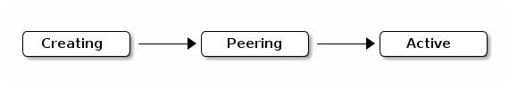

# ceph Placement Group (PG)

> https://docs.ceph.com/en/quincy/rados/operations/placement-groups/#placement-groups

> https://ceph-doc.readthedocs.io/en/latest/Data_Placement/


### Why Placement Group ?

PG 也是一個邏輯層概念, 可以把他想成是一群 object 的集合, 加入PG這一層是為了能夠更好的分散 object 和計算 object 位置並且達到系統的擴充性

Ceph 的設計上是去避免單點故障(single point of failure)去影響整個系統, 所以 Client 是直接去對 OSD 寫入 object 的, 如果沒有 PG 這一層的話, 當 object 數量達到數以萬計的時候要去計算 object 的位置會非常困難且消耗資源, 因為這些 object 都分別寫到不同的 OSD 當中

- 將 objects 集合成一個 PG 的最大好處就是降低了要追蹤和處理 metadata 的數量, 節省大量計算資源

  > 不需要去記錄每一個 object 的位置和 metadata, 只要去管理 PG 的 metadata 就好, 而 PG 的數量級遠遠低於 object 的數量級

- 增加 PG 數量可均衡每一個 OSD 的附載, 提高資料存取的併行度

- 分隔故障域，提高數據的可靠性 (減少大量的資料搬移)

### Summary

- Pool 裡面包含了 objects
- PG 裡面包含了所有在 Pool 裡面的一群 objects (一個 PG有多個 object)
- 一個 object 只會屬於一個 PG
- 一個 PG 可以對應到多個 OSD


## PG 创建时机

> https://docs.ceph.com/en/latest/rados/operations/monitoring-osd-pg/#creating

PGs are created when you create a pool(只创建 pool 是就已经同时创建了所有 PG): the command that creates a pool specifies the total number of PGs for that pool, and when the pool is created all of those PGs are created as well. Ceph will echo `creating` while it is creating PGs. After the PG(s) are created, the OSDs that are part of a PG’s Acting Set will peer. Once peering is complete, the PG status should be `active+clean`. This status means that Ceph clients begin writing to the PG.




## PEERING

> https://docs.ceph.com/en/quincy/dev/peering/

- *Peering*

the process of bringing all of the OSDs that store a Placement Group (PG) into agreement about the state of all of the objects (and their metadata) in that PG. Note that agreeing on the state does not mean that they all have the latest contents.

- *Acting set*

the ordered list of OSDs who are (or were as of some epoch) responsible for a particular PG.

- *Up set*

the ordered list of OSDs responsible for a particular PG for a particular epoch according to CRUSH. Normally this is the same as the *acting set*, except when the *acting set* has been explicitly overridden via *PG temp* in the OSDMap.


## 命令查找 object 位置

> https://docs.ceph.com/en/latest/rados/operations/monitoring-osd-pg/#finding-an-object-location

To store object data in the Ceph Object Store, a Ceph client must:

1. Set an object name
2. Specify a [pool](https://docs.ceph.com/en/latest/rados/operations/pools)

The Ceph client retrieves the latest cluster map, the CRUSH algorithm calculates how to map the object to a PG, and then the algorithm calculates how to dynamically assign the PG to an OSD. To find the object location given only the object name and the pool name, run a command of the following form:

```
ceph osd map {poolname} {object-name} [namespace]
```

Exercise: Locate an Object

As an exercise, let’s create an object. We can specify an object name, a path to a test file that contains some object data, and a pool name by using the `rados put` command on the command line. For example:

```
rados put {object-name} {file-path} --pool=data
rados put test-object-1 testfile.txt --pool=data
```

To verify that the Ceph Object Store stored the object, run the following command:

```
rados -p data ls
```

To identify the object location, run the following commands:

```
ceph osd map {pool-name} {object-name}
ceph osd map data test-object-1
```

Ceph should output the object’s location. For example:

```
osdmap e537 pool 'data' (1) object 'test-object-1' -> pg 1.d1743484 (1.4) -> up ([0,1], p0) acting ([0,1], p0)
```

To remove the test object, simply delete it by running the `rados rm` command. For example:

```
rados rm test-object-1 --pool=data
```

As the cluster evolves, the object location may change dynamically. One benefit of Ceph’s dynamic rebalancing is that Ceph spares you the burden of manually performing the migration. For details, see the [Architecture](https://docs.ceph.com/en/latest/architecture) section.


## Good Article
> - [https://access.redhat.com/documentation/en-us/red_hat_ceph_storage/4/html/storage_strategies_guide/placement_groups_pgs#pg_calculator](https://access.redhat.com/documentation/en-us/red_hat_ceph_storage/4/html/storage_strategies_guide/placement_groups_pgs#pg_calculator)
> - https://docs.ceph.com/en/latest/rados/operations/monitoring-osd-pg/
> - https://docs.ceph.com/en/latest/rados/operations/placement-groups/
>
> 
