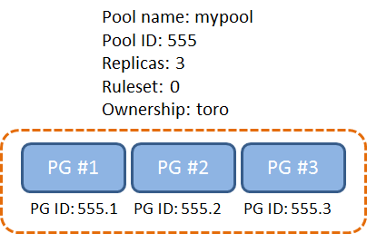

# POOL

> https://docs.ceph.com/en/quincy/rados/operations/pools/#


Pools are logical partitions that are used to store objects.


Pools provide:

- **Resilience**: It is possible to set the number of OSDs that are allowed to fail without any data being lost. If your cluster uses replicated pools, the number of OSDs that can fail without data loss is the number of replicas. For example: a typical configuration stores an object and two additional copies (that is: `size = 3`), but you can configure the number of replicas on a per-pool basis. For [erasure coded pools](https://docs.ceph.com/en/quincy/rados/operations/erasure-code), resilience is defined as the number of coding chunks (for example, `m = 2` in the **erasure code profile**).
- **Placement Groups**: You can set the number of placement groups for the pool. A typical configuration targets approximately 100 placement groups per OSD, providing optimal balancing without consuming many computing resources. **When setting up multiple pools, be careful to set a reasonable number of placement groups for each pool and for the cluster as a whole**. Note that each PG belongs to a specific pool: when multiple pools use the same OSDs, make sure that the **sum** of PG replicas per OSD is in the desired PG per OSD target range. Use the [pgcalc](https://old.ceph.com/pgcalc/) tool to calculate the number of placement groups to set for your pool.
- **CRUSH Rules**: When data is stored in a pool, the placement of the object and its replicas (or chunks, in the case of erasure-coded pools) in your cluster is governed by CRUSH rules. Custom CRUSH rules can be created for a pool if the default rule does not fit your use case.
- **Snapshots**: The command `ceph osd pool mksnap` creates a snapshot of a pool.


> https://ceph-doc.readthedocs.io/en/latest/Data_Placement/

簡單說 Pool 就是 PG 的集合, 一個Pool內會有好幾個PG (目前ceph default 是8), 一個Pool內有多少個PG會影響資料的分散程度, 所以PG太小不太好, PG太大也沒有好處只會消耗更多計算資源 [XX]

下面是兩個pool, 分別各有3個PG, PG 的 ID 前面會帶有 pool 的 ID 當作 prefix 


> [2019-JUN-27 :: Ceph Tech Talk - Intro to Ceph](https://www.youtube.com/watch?v=PmLPbrf-x9g&t=725s)


### Why Pool ?

有Pool這個邏輯層會比較好一次管理和設定這麼多個PG




### How

#### List Pools

```bash
ceph osd lspools
```


#### CREATE A POOL

Before creating pools, refer to the [Pool, PG and CRUSH Config Reference](https://docs.ceph.com/en/quincy/rados/configuration/pool-pg-config-ref). Ideally, you should override the default value for the number of placement groups in your Ceph configuration file, as the default is NOT ideal. For details on placement group numbers refer to [setting the number of placement groups](https://docs.ceph.com/en/quincy/rados/operations/placement-groups#set-the-number-of-placement-groups)

> Note
>
> Starting with Luminous, all pools need to be associated to the application using the pool. See [Associate Pool to Application](https://docs.ceph.com/en/quincy/rados/operations/pools/#id1) below for more information.

For example:

```
osd_pool_default_pg_num = 128
osd_pool_default_pgp_num = 128
```

To create a pool, execute:

```
ceph osd pool create {pool-name} [{pg-num} [{pgp-num}]] [replicated] \
     [crush-rule-name] [expected-num-objects]
ceph osd pool create {pool-name} [{pg-num} [{pgp-num}]]   erasure \
     [erasure-code-profile] [crush-rule-name] [expected_num_objects] [--autoscale-mode=<on,off,warn>]
```


#### ASSOCIATE POOL TO APPLICATION

> https://docs.ceph.com/en/quincy/rados/operations/pools/#associate-pool-to-application


Pools need to be associated with an application before use. Pools that will be used with CephFS or pools that are automatically created by RGW are automatically associated. Pools that are intended for use with RBD should be initialized using the `rbd` tool (see [Block Device Commands](https://docs.ceph.com/en/quincy/rbd/rados-rbd-cmds/#create-a-block-device-pool) for more information).


For other cases, you can manually associate a free-form application name to a pool.:

```
ceph osd pool application enable {pool-name} {application-name}
```

Note

CephFS uses the application name `cephfs`, RBD uses the application name `rbd`, and RGW uses the application name `rgw`.


#### SET POOL QUOTAS

You can set pool quotas for the maximum number of bytes and/or the maximum number of objects per pool:

```
ceph osd pool set-quota {pool-name} [max_objects {obj-count}] [max_bytes {bytes}]
```

For example:

```
ceph osd pool set-quota data max_objects 10000
```

To remove a quota, set its value to `0`.

#### SHOW POOL STATISTICS

To show a pool’s utilization statistics, execute:

```
rados df
```

Additionally, to obtain I/O information for a specific pool or all, execute:

```
ceph osd pool stats [{pool-name}]
```


