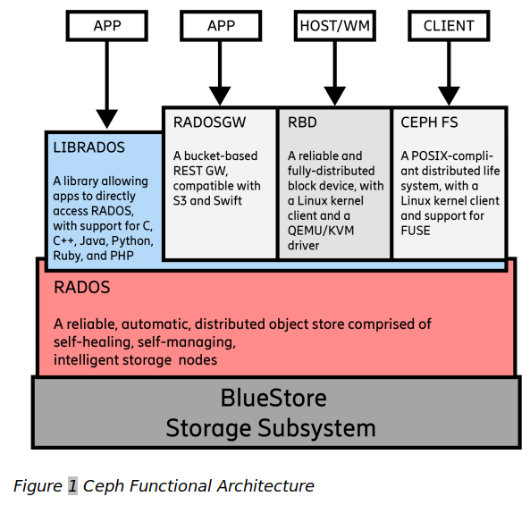

# Ceph

## INTRO TO CEPH

> [Ceph 官方文档: https://docs.ceph.com/en/latest/start/intro/](https://docs.ceph.com/en/latest/start/intro/)


Ceph is a single storage solution that supports multiple storage models:

- File
- Block
- Object

Ceph has a set of components that support the file, block, and object storage models. These components translate the operations of a specific storage model into the Ceph internal storage model. Ceph at its core is an object storage solution with GWs for the file, block, and object storage models. The RADOS subsystem is a distributed object storage system. Underneath RADOS is the `BlueStore` subsystem, which handles data on storage devices.



Ceph has a `client layer` and a `server layer`.


## Ceph Objects

Ceph supports objects at two levels:

- Ceph supports operations by client applications on objects according to the S3 protocol (and the rarely used Swift protocol).
- Ceph internally records information for file, block, and object storage services using *`Ceph objects`*.

A *`Ceph object`* is a chunk of information that Ceph records on storage devices. The following are some of the more common pieces of information recorded in *Ceph objects*:

- File data
- Block data
- S3 or Swift object data
- File metadata

## Components

- **Monitors**: A [Ceph Monitor](https://docs.ceph.com/en/latest/glossary/#term-Ceph-Monitor) (`ceph-mon`) maintains maps of the cluster state, including the monitor map, manager map, the OSD map, the MDS map, and the CRUSH map. These maps are critical cluster state required for Ceph daemons to coordinate with each other. Monitors are also responsible for managing authentication between daemons and clients. At least three monitors are normally required for redundancy and high availability.
- **Managers**: A [Ceph Manager](https://docs.ceph.com/en/latest/glossary/#term-Ceph-Manager) daemon (`ceph-mgr`) is responsible for keeping track of runtime metrics and the current state of the Ceph cluster, including storage utilization, current performance metrics, and system load. The Ceph Manager daemons also host python-based modules to manage and expose Ceph cluster information, including a web-based [Ceph Dashboard](https://docs.ceph.com/en/latest/mgr/dashboard/#mgr-dashboard) and [REST API](https://docs.ceph.com/en/latest/mgr/restful). At least two managers are normally required for high availability.
- **Ceph OSDs**: An Object Storage Daemon ([Ceph OSD](https://docs.ceph.com/en/latest/glossary/#term-Ceph-OSD), `ceph-osd`) stores data, handles data replication, recovery, rebalancing, and provides some monitoring information to Ceph Monitors and Managers by checking other Ceph OSD Daemons for a heartbeat. At least three Ceph OSDs are normally required for redundancy and high availability.
- **MDSs**: A [Ceph Metadata Server](https://docs.ceph.com/en/latest/glossary/#term-Ceph-Metadata-Server) (MDS, `ceph-mds`) stores metadata on behalf of the [Ceph File System](https://docs.ceph.com/en/latest/glossary/#term-Ceph-File-System) (i.e., Ceph Block Devices and Ceph Object Storage do not use MDS). Ceph Metadata Servers allow POSIX file system users to execute basic commands (like `ls`, `find`, etc.) without placing an enormous burden on the Ceph Storage Cluster.


## RADOS
```{toctree}
rados/rados.md
```

## Ceph Client

```{toctree}
ceph-client/krbd/krbd.md
```

## Observability

```{toctree}
observability/observability.md
```
