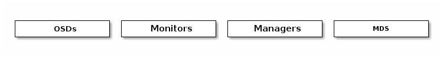
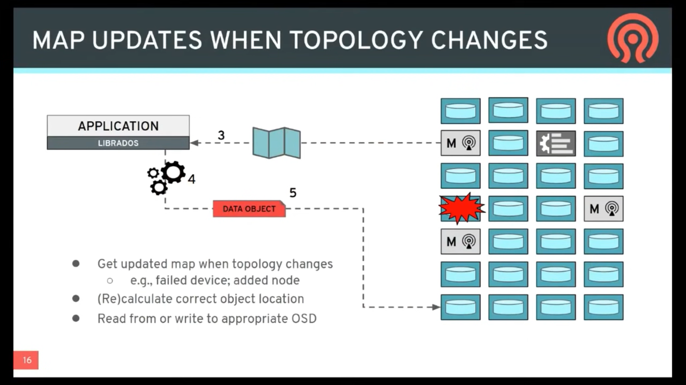
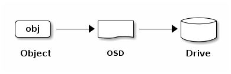
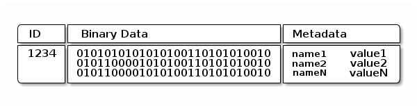

# Ceph

## INTRO TO CEPH

> [Ceph 官方文档: https://docs.ceph.com/en/latest/start/intro/](https://docs.ceph.com/en/latest/start/intro/)
>
> https://docs.ceph.com/en/quincy/architecture/


Ceph is a single storage solution that supports multiple storage models:

- File
- Block
- Object

Ceph has a set of components that support the file, block, and object storage models. These components translate the operations of a specific storage model into the Ceph internal storage model. Ceph at its core is an object storage solution with GWs for the file, block, and object storage models. The RADOS subsystem is a distributed object storage system. Underneath RADOS is the `BlueStore` subsystem, which handles data on storage devices.


Ceph has a `client layer` and a `server layer`.


## Ceph Objects

Ceph supports objects at two levels:

- Ceph supports operations by client applications on objects according to the S3 protocol (and the rarely used Swift protocol).
- Ceph internally records information for file, block, and object storage services using *`Ceph objects`*.

A *`Ceph object`* is a chunk of information that Ceph records on storage devices. The following are some of the more common pieces of information recorded in *Ceph objects*:

- File data
- Block data
- S3 or Swift object data
- File metadata

## Components

- **Monitors**: A [Ceph Monitor](https://docs.ceph.com/en/latest/glossary/#term-Ceph-Monitor) (`ceph-mon`) maintains maps of the cluster state, including the monitor map, manager map, the OSD map, the MDS map, and the CRUSH map. These maps are critical cluster state required for Ceph daemons to coordinate with each other. Monitors are also responsible for managing authentication between daemons and clients. At least three monitors are normally required for redundancy and high availability.
- **Managers**: A [Ceph Manager](https://docs.ceph.com/en/latest/glossary/#term-Ceph-Manager) daemon (`ceph-mgr`) is responsible for keeping track of runtime metrics and the current state of the Ceph cluster, including storage utilization, current performance metrics, and system load. The Ceph Manager daemons also host python-based modules to manage and expose Ceph cluster information, including a web-based [Ceph Dashboard](https://docs.ceph.com/en/latest/mgr/dashboard/#mgr-dashboard) and [REST API](https://docs.ceph.com/en/latest/mgr/restful). At least two managers are normally required for high availability.
- **Ceph OSDs**: An Object Storage Daemon ([Ceph OSD](https://docs.ceph.com/en/latest/glossary/#term-Ceph-OSD), `ceph-osd`) stores data, handles data replication, recovery, rebalancing, and provides some monitoring information to Ceph Monitors and Managers by checking other Ceph OSD Daemons for a heartbeat. At least three Ceph OSDs are normally required for redundancy and high availability.
- **MDSs**: A [Ceph Metadata Server](https://docs.ceph.com/en/latest/glossary/#term-Ceph-Metadata-Server) (MDS, `ceph-mds`) stores metadata on behalf of the [Ceph File System](https://docs.ceph.com/en/latest/glossary/#term-Ceph-File-System) (i.e., Ceph Block Devices and Ceph Object Storage do not use MDS). Ceph Metadata Servers allow POSIX file system users to execute basic commands (like `ls`, `find`, etc.) without placing an enormous burden on the Ceph Storage Cluster.
  - 主要就是 Ceph File System 使用， ceph Block 不使用。





> Storage cluster clients and each Ceph OSD Daemon use the CRUSH algorithm to efficiently compute information about data location, instead of having to depend on a central lookup table. Ceph’s high-level features include a native interface to the Ceph Storage Cluster via librados, and a number of service interfaces built on top of librados.
>
> 用 CRUSH 算法定位对象，而非中心化的保存对象位置信息。


> [2019-JUN-27 :: Ceph Tech Talk - Intro to Ceph](https://www.youtube.com/watch?v=PmLPbrf-x9g&t=725s)

.png)





## STORING DATA

The Ceph Storage Cluster receives data from [Ceph Client](https://docs.ceph.com/en/quincy/glossary/#term-Ceph-Client)s–whether it comes through a [Ceph Block Device](https://docs.ceph.com/en/quincy/glossary/#term-Ceph-Block-Device), [Ceph Object Storage](https://docs.ceph.com/en/quincy/glossary/#term-Ceph-Object-Storage), the [Ceph File System](https://docs.ceph.com/en/quincy/glossary/#term-Ceph-File-System) or a custom implementation you create using `librados`– which is stored as RADOS objects. Each object is stored on an [Object Storage Device](https://docs.ceph.com/en/quincy/glossary/#term-Object-Storage-Device). Ceph OSD Daemons handle read, write, and replication operations on storage drives. With the older Filestore back end, each RADOS object was stored as a separate file on a conventional filesystem (usually XFS). With the new and default BlueStore back end, objects are stored in a monolithic database-like fashion.




Ceph OSD Daemons store data as objects in a flat namespace (e.g., no hierarchy of directories). An object has an identifier, binary data, and metadata consisting of a set of name/value pairs. The semantics are completely up to [Ceph Client](https://docs.ceph.com/en/quincy/glossary/#term-Ceph-Client)s. For example, `CephFS` uses metadata to store file attributes such as the file owner, created date, last modified date, and so forth.

> `CephFS` 使用元数据来存储文件属性，例如文件所有者、创建日期、最后修改日期等。



> Note: An object ID is unique across the entire cluster, not just the local filesystem.


## cpeh-mapping（重要）

```{toctree}
ceph-mapping/ceph-mapping.md
```


## data-striping（数据分片与IO并发）
```{toctree}
data-striping.md
```


## RADOS

```{toctree}
rados/rados.md
```

## ceph pool
```{toctree}
ceph-pool/ceph-pool.md
```


### ceph-pg
```{toctree}
ceph-pg/ceph-pg.md
```

## RBD - Ceph Block Device
```{toctree}
rbd/rbd.md
```

## CephFS
```{toctree}
CephFS/CephFS.md
```


## bluestore
```{toctree}
bluestore/bluestore.md
```


## OSD
```{toctree}
osd/osd.md
```

## Ceph Client

```{toctree}
ceph-client/krbd/krbd.md
```

## Observability

```{toctree}
observability/observability.md
```

## rook
```{toctree}
rook/rook.md
```


