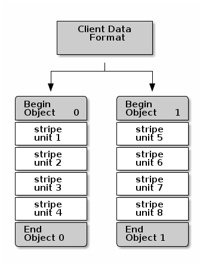
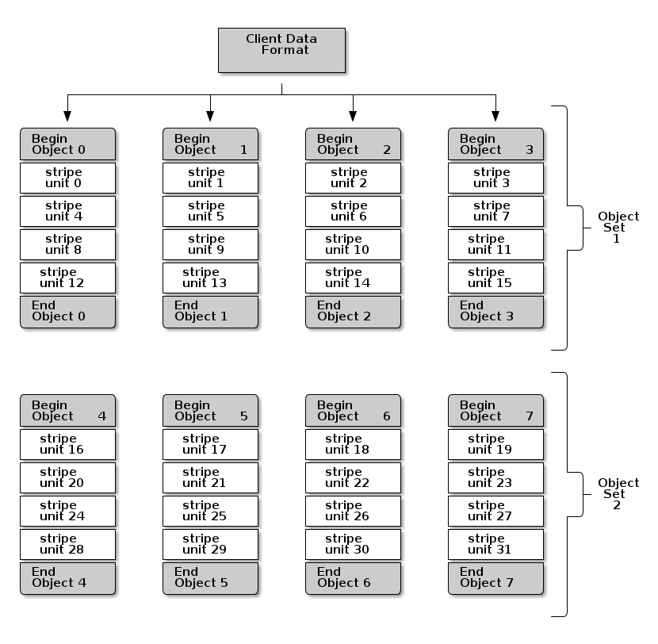

# data-striping（数据分片与IO并发）

> https://docs.ceph.com/en/quincy/architecture/#data-striping

Storage devices have throughput limitations, which impact performance and scalability. So storage systems often support striping–storing sequential pieces of information across multiple storage devices–to increase throughput and performance. The most common form of data striping comes from RAID. The RAID type most similar to Ceph’s striping is RAID 0, or a ‘striped volume’. Ceph’s striping offers the throughput of RAID 0 striping, the reliability of n-way RAID mirroring and faster recovery.

Ceph provides three types of clients: Ceph Block Device, Ceph File System, and Ceph Object Storage. A Ceph Client converts its data from the representation format it provides to its users (a block device image, RESTful objects, CephFS filesystem directories) into objects for storage in the Ceph Storage Cluster.

> Tips: 
>
> The objects Ceph stores in the Ceph Storage Cluster are not striped. Ceph Object Storage, `Ceph Block Device`, and the Ceph File System stripe their data over multiple `Ceph Storage Cluster objects`. Ceph Clients that write directly to the Ceph Storage Cluster via `librados` must perform the striping (and parallel I/O) for themselves to obtain these benefits.

The simplest Ceph striping format involves a `stripe count of 1 object`. Ceph Clients write stripe units to a Ceph Storage Cluster object until the object is at its maximum capacity, and then create another object for additional stripes of data. The simplest form of striping may be sufficient for small block device images, S3 or Swift objects and CephFS files. However, this simple form doesn’t take maximum advantage of Ceph’s ability to distribute data across placement groups, and consequently doesn’t improve performance very much. The following diagram depicts the simplest form of striping:

If you anticipate large images sizes, large S3 or Swift objects (e.g., video), or large CephFS directories, you may see considerable read/write performance improvements by striping client data over multiple objects within an object set. Significant write performance occurs when the client writes the stripe units to their corresponding objects in parallel. Since objects get mapped to different placement groups and further mapped to different OSDs, each write occurs in parallel at the maximum write speed. A write to a single drive would be limited by the head movement (e.g. 6ms per seek) and bandwidth of that one device (e.g. 100MB/s). By spreading that write over multiple objects (which map to different placement groups and OSDs) Ceph can reduce the number of seeks per drive and combine the throughput of multiple drives to achieve much faster write (or read) speeds.

## object set

In the following diagram, client data gets striped across an object set (`object set 1` in the following diagram) consisting of 4 objects, where the first stripe unit is `stripe unit 0` in `object 0`, and the fourth stripe unit is `stripe unit 3` in `object 3`. 

After writing the fourth stripe, the client determines if the object set is full. If the object set is not full, the client begins writing a stripe to the first object again (`object 0` in the following diagram). 

If the object set is full, the client creates a new object set (`object set 2` in the following diagram), and begins writing to the first stripe (`stripe unit 16`) in the first object in the new object set (`object 4` in the diagram below).

Three important variables determine how Ceph stripes data:

- **Object Size:** Objects in the Ceph Storage Cluster have a maximum configurable size (e.g., 2MB, 4MB, etc.). The object size should be large enough to accommodate many stripe units, and should be a multiple of the stripe unit.
  - 每个子 object 的最大空间
- **Stripe Width:** Stripes have a configurable unit size (e.g., 64kb). The Ceph Client divides the data it will write to objects into equally sized stripe units, except for the last stripe unit. A stripe width, should be a fraction of the Object Size so that an object may contain many stripe units.
  - 分片最小单元
- **Stripe Count:** The Ceph Client writes a sequence of stripe units over a series of objects determined by the stripe count. The series of objects is called an object set. After the Ceph Client writes to the last object in the object set, it returns to the first object in the object set.
  - 就是上面的 Object Set 中 object 的数量。

1. Once the Ceph Client has striped data to stripe units and mapped the stripe units to objects, 
2. Ceph’s CRUSH algorithm maps the objects to placement groups, 
3. the placement groups to Ceph OSD Daemons before the objects are stored as files on a storage drive.

> Since a client writes to a single pool, all data striped into objects get mapped to placement groups in the same pool. So they use the same CRUSH map and the same access controls.
>
> 每个 ceph client 只能使用一个 `ceph pool`

