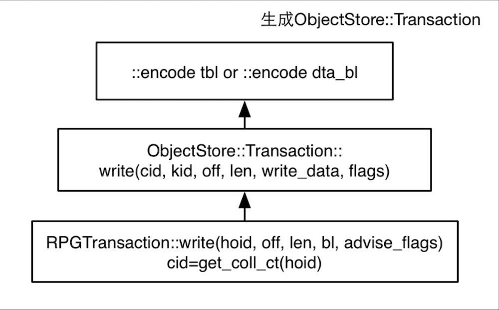

# ceph 写流程

## ceph 写流程 - bean-li.github.io/ceph-write-flow

> From: http://bean-li.github.io/ceph-write-flow/


### 前言

前面花了两篇博客的篇幅介绍了读流程。写流程和读流程相比，有大量的流程走向是公用的，我将这些公共的流程总结如下：


对于读流程而言，相对比较简单，这也是我们先介绍读流程的原因。先设置一个小目标，达成之后，对总体的大目标也有好处，相当于将大任务分解成了几个小任务。

从 execute_ctx 开始，读写流程开始严重的分叉，下图是读流程的流程图


### 写流程的三个侧面

写流程之所以比读流程复杂，原因在于读流程只需要去Primary OSD读取响应的Object即可，而写流程牵扯到多个OSD。下图来自Ceph的官方文档：

> 
>
> From: https://docs.ceph.com/en/quincy/architecture/

写流程之所以比读流程复杂源于多个方面，

- 牵扯多个OSD的写入，如何确保多副本之间一致性 （PGLog）
- 对于单个OSD的写入，如何确保最终的一致性 （Journal and FileStore）
- 多个副本所在的OSD，如果状态不是active ＋ clean

多种因素造成了写流程的异常复杂。本人功力有限，所以先从主干流程介绍起。这个写流程，打算至少从三个侧重点分别介绍：

- 第一个篇侧重在Primary OSD和Secondary OSD的交互流程，即Primary 如何将写相关的任务发送给Secondary OSD，Secondary OSD又如何发送自己的完成进度给Primary OSD， Primary OSD收到相关的进度，又采取了什么样的行动，以及Primary如何给Client发送响应
- 第二篇文章侧重于数据部分，即各个OSD 收到写入的请求之后，从filestore层面做了哪些的事情，在不同的完成阶段，会做哪些事情
- 第三篇文章会侧重于PGLog，为了确保各个副本的一致性，出了写入数据，事务操作也会纪录PGLog，一旦某个出现异常，可以根据PGLog的信息，确定哪个OSD的数据是最可靠的，从发起数据的同步。

因为写入的流程异常的复杂，因此，介绍A侧面的时候，尽量不涉及B和C侧面，否则所有细节纠缠在一起，就会将设计思想淹没在无数的细节之中，这并不利于我们理解写入流程。

### 准备事务（prepare_transaction）

ceph的读和写显著的不同在于读基本上只需要从Primary OSD中读取（offset，length）指定部分的内容即可，不牵扯到多个OSD之间的交互，而且读并没有对存储作出改变。 而写则不然，首先，ceph支持多副本，也支持纠删码（本系列暂不考虑纠删码），写入本身就牵扯到多个OSD之间的互动。其次，正常情况自不必说，但是多个副本之间的写入可能会在某个副本出现问题，副本之间需要能够确定哪个副本的数据已经正确写入，哪个副本的数据还未写入完毕，这就加剧了ceph写入的复杂程度。

本文只介绍Primary 和Secondary之间的消息交互，作为整个写入过程的整体框架。

对于写入而言，execute_ctx函数中第一个比较重要的函数是 prepare_transaction。这个函数顾名思义，就是用来准备transaction事务的。但是我们前面一起研读过read 的代码，prepare_transaction有点言不由衷，事实上，prepare_transaction有点挂羊头卖狗肉，该函数中的do_osd_ops函数直接将完成了读操作的核心步骤，并非做什么准备工作。

但是对于写入而言，该函数不再挂羊头卖狗肉，正而八经地做准备工作。我们开始学习该函数了哪些事情.

和之前一样，execute_ctx调用了prepare_tranasction，而prepare_transaction调用了do_osd_ops。我们来看do_osd_ops做了哪些事情：

瞿天善绘制了一张图，详细介绍了对于write流程，do_osd_ops做的事情:


其核心代码在此：

```
case CEPH_OSD_OP_WRITE:
      ++ctx->num_write;      

     { 
          ....
		  if (seq && (seq > op.extent.truncate_seq) &&
		            (op.extent.offset + op.extent.length > oi.size)) {
			  // old write, arrived after trimtrunc
			  op.extent.length = (op.extent.offset > oi.size ? 0 : oi.size - op.extent.offset);
			  dout(10) << " old truncate_seq " << op.extent.truncate_seq << " < current " << seq
				   << ", adjusting write length to " << op.extent.length << dendl;
			  bufferlist t;
			  t.substr_of(osd_op.indata, 0, op.extent.length);
			  osd_op.indata.swap(t);
		  }
			if (op.extent.truncate_seq > seq) {
			  // write arrives before trimtrunc
			  if (obs.exists && !oi.is_whiteout()) {
			    dout(10) << " truncate_seq " << op.extent.truncate_seq << " > current " << seq
				     << ", truncating to " << op.extent.truncate_size << dendl;
			    t->truncate(soid, op.extent.truncate_size);
			    oi.truncate_seq = op.extent.truncate_seq;
			    oi.truncate_size = op.extent.truncate_size;
			    if (op.extent.truncate_size != oi.size) {
			      ctx->delta_stats.num_bytes -= oi.size;
			      ctx->delta_stats.num_bytes += op.extent.truncate_size;
			      oi.size = op.extent.truncate_size;
			    }
			  } else {
			    dout(10) << " truncate_seq " << op.extent.truncate_seq << " > current " << seq
				     << ", but object is new" << dendl;
			    oi.truncate_seq = op.extent.truncate_seq;
			    oi.truncate_size = op.extent.truncate_size;
			  }
			}
			result = check_offset_and_length(op.extent.offset, op.extent.length, cct->_conf->osd_max_object_size);
			if (result < 0)
			  break;
			if (pool.info.require_rollback()) {
			  t->append(soid, op.extent.offset, op.extent.length, osd_op.indata, op.flags);
			} else {
			  t->write(soid, op.extent.offset, op.extent.length, osd_op.indata, op.flags);
			}
		
			maybe_create_new_object(ctx);
			if (op.extent.offset == 0 && op.extent.length >= oi.size)
			  obs.oi.set_data_digest(osd_op.indata.crc32c(-1));
			else if (op.extent.offset == oi.size && obs.oi.is_data_digest())
			  obs.oi.set_data_digest(osd_op.indata.crc32c(obs.oi.data_digest));
			else
			  obs.oi.clear_data_digest();
			write_update_size_and_usage(ctx->delta_stats, oi, ctx->modified_ranges,
						    op.extent.offset, op.extent.length, true);

  }
  break;
```

对于多副本的写入，该函数的眼在：

```
     t->write(soid, op.extent.offset, op.extent.length, osd_op.indata, op.flags);  
```

是的，do_osd_ops的核心功能就是瞿天善那张非常详细图的中心位置的子图，产生出ObjectStore::Transaction



我们一起阅读os/ObjectStore.h中的写操作：

```
   /**
     * Write data to an offset within an object. If the object is too
     * small, it is expanded as needed.  It is possible to specify an
     * offset beyond the current end of an object and it will be
     * expanded as needed. Simple implementations of ObjectStore will
     * just zero the data between the old end of the object and the
     * newly provided data. More sophisticated implementations of
     * ObjectStore will omit the untouched data and store it as a
     * "hole" in the file.
     */
    void write(const coll_t& cid, const ghobject_t& oid, uint64_t off, uint64_t len,
	       const bufferlist& write_data, uint32_t flags = 0) {
      uint32_t orig_len = data_bl.length();
      Op* _op = _get_next_op();
      _op->op = OP_WRITE;
      _op->cid = _get_coll_id(cid);
      _op->oid = _get_object_id(oid);
      _op->off = off;
      _op->len = len;
      ::encode(write_data, data_bl);

      assert(len == write_data.length());
      data.fadvise_flags = data.fadvise_flags | flags;
      if (write_data.length() > data.largest_data_len) {
        	data.largest_data_len = write_data.length();
	        data.largest_data_off = off;
	        data.largest_data_off_in_data_bl = orig_len + sizeof(__u32);  // we are about to
      }
      data.ops++;
    }
```

这一部分是很容易理解的，就是说把操作码设置为OP_WRITE，记录好要写入的object和coll，将offset 和length设置正确，同时将要写入的data纪录下来，后续ObjectStore部分（更具体地说是filestore），就可以根据上述信息，完成写入底层对象存储的动作。

上述内容仅仅是一个部分，之前也提过，除了data，还有PGLog，这部分内容是为了纪录各个副本之间的写入情况，预防异常发生。prepare_transaction函数的最后，会调用finish_ctx函数，finish_ctx函数里就会调用ctx->log.push_back就会构造pg_log_entry_t插入到vector log里。

PGLog后续会有专门文章介绍，我们按下不表，包括ReplicatedBackend::submit_transaction里调用parent->log_operation将PGLog序列化到transaction里，这些内容我们都不会在本文介绍。

### 消息流动

有这么一张图，可以粗略地介绍Primary OSD和Replica OSD之间的消息流动，本文的重点也是介绍这个：

> 
>
> from: https://www.usenix.org/system/files/login/articles/73508-maltzahn.pdf

从上图可以看出，client只会和Primary OSD之间有消息交互，至于其它副本的数据写入，要靠Primary OSD发送请求通知它们，当然当Replica OSD写完之后，需要发送消息告知Primary OSD， Primary OSD汇总各个OSD的写入情况，在合适的时机给Client发送响应信息。

注意，无论是Primary OSD还是 Replica OSD，写入都分成2个阶段，第一阶段是写入Journal，写入Journal成功，第一阶段的任务就算完成了，当Replica OSD如果完成了第一阶段的任务，写入了Journal，就会给Primary OSD发送第一个消息，表示第一阶段的任务完成了。如果Primary同时收到了所有的OSD的消息，确认所有OSD上的第一阶段任务完成，就会给Client回复第一个消息，表示写入已经完成。

注意，第一阶段是写入Journal，因此，Journal如果是SSD这种比较快速的设备，会极大地改善写入请求的处理速度。

我们从上图中也可以看出每一个Replica OSD给Primary OSD发送了2个消息，其中第二个消息，对应的是第二阶段任务的完成。当Journal中的数据向OSD的data partition写入成功后，第二阶段任务就算完成了，Replica OSD就会给Primary OSD发送第二个消息。当Primary OSD搜集齐了所有OSD都完成了的消息之后，就会确认整体第二阶段的任务完成，就会给Client消息，通知数据可读。

很粗略，基本是简单地介绍了消息流动图，但是，我们是研究ceph internal的，这么粗略是不能原谅的。很多细节都隐藏在这些笼统的描述中。比如，Primary在什么时机将写入的消息发送给Replica OSD，消息类型是什么；又比如，完成第一阶段和第二阶段过程之后，Replica OSD分别给Primary OSD发送了什么消息，而Primary OSD又是如何处理这些消息的；再比如Primary OSD 如何判断 所有的OSD是否都完成了第一阶段的任务？

注意，上面笼统的描述中，介绍了当Primary OSD发现所有的OSD都完成了第一阶段任务，则发送消息给client，告知client写入完成，第二阶段的任务亦然，这表明，Primary OSD必须有数据结构能够纪录下各个OSD的完成情况，这个数据结构是什么呢？

这个数据结构就是in_progress_ops !
