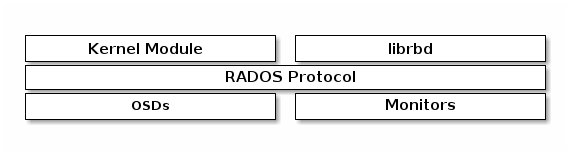

# CEPH BLOCK DEVICE

> https://docs.ceph.com/en/quincy/architecture/#ceph-block-device

A Ceph Block Device stripes a block device image over **multiple objects** in the Ceph Storage Cluster, where each object gets mapped to a placement group and distributed, and the placement groups are spread across separate ceph-osd daemons throughout the cluster.

Thin-provisioned snapshottable Ceph Block Devices are an attractive option for virtualization and cloud computing. In virtual machine scenarios, people typically deploy a Ceph Block Device with the `rbd` network storage driver in QEMU/KVM, where the host machine uses `librbd` to provide a block device service to the guest. Many cloud computing stacks use `libvirt` to integrate with hypervisors. You can use thin-provisioned Ceph Block Devices with QEMU and `libvirt` to support OpenStack and CloudStack among other solutions.

While we do not provide `librbd` support with other hypervisors at this time, you may also use Ceph Block Device kernel objects to provide a block device to a client. Other virtualization technologies such as Xen can access the Ceph Block Device kernel object(s). This is done with the command-line tool `rbd`.

## Introduction

> https://docs.ceph.com/en/quincy/rbd/

A block is a sequence of bytes (often 512). Block-based storage interfaces are a mature and common way to store data on media including HDDs, SSDs, CDs, floppy disks, and even tape. The ubiquity of block device interfaces is a perfect fit for interacting with mass data storage including Ceph.

Ceph block devices are thin-provisioned, resizable, and store data striped over multiple OSDs. Ceph block devices leverage RADOS capabilities including snapshotting, replication and strong consistency. Ceph block storage clients communicate with Ceph clusters through kernel modules or the `librbd` library.

> Kernel modules can use Linux page caching. For `librbd`-based applications, Ceph supports [RBD Caching](https://docs.ceph.com/en/quincy/rbd/rbd-config-ref/).

## How to

> https://docs.ceph.com/en/quincy/rbd/rados-rbd-cmds/

## Good article
> https://ceph.io/en/news/blog/search/?q=rbd
> https://ceph.io/en/news/blog/2015/ceph-validate-that-the-rbd-cache-is-active/
> https://ceph.io/en/news/blog/2015/ceph-activate-rbd-readhead/