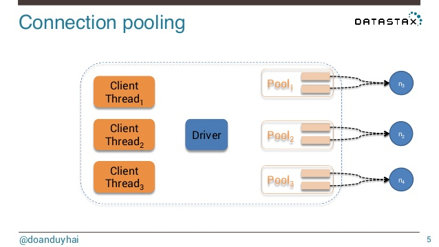
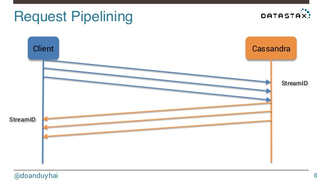
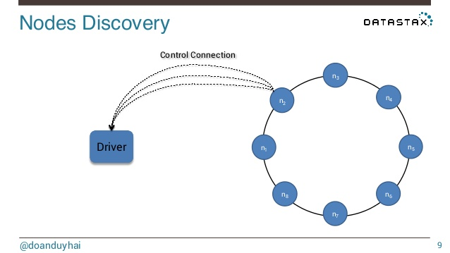
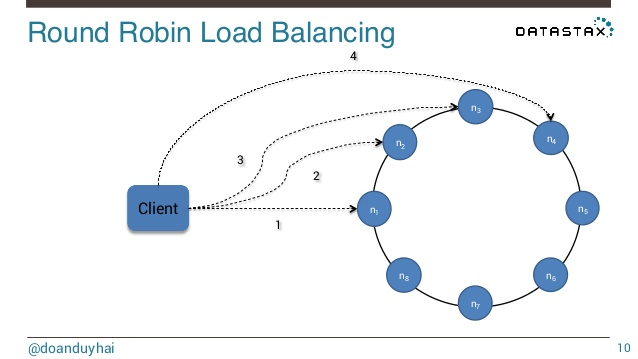
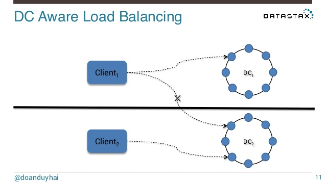

> https://www.slideshare.net/doanduyhai/cassandra-drivers-and-libraries
>
> 













> Jeff Carpenter, Eben Hewitt - Cassandra The Definitive Guide, Third Edition Distributed Data at Web Scale - O'Reilly Media (2022)

### Connection pooling

Because the CQL native protocol is asynchronous, it allows multiple simultaneous requests per connection; the maximum is 128 simultaneous requests in protocol v2, while v3 and later allow up to 32,768 simultaneous requests. Because of this larger number of simultaneous requests, fewer connections per node are required. In fact, the default is a single connection per node.

[Connection pool](https://oreil.ly/zUY-B) settings are configurable via the `advanced.connection` configuration options, including the number of connections to use for local and remote hosts, and the maximum number of simultaneous requests per connection (defaults to 1,024). While the v4 driver does not provide the ability to scale the number of connections up and down as with previous versions, you can adjust these settings by updating the configuration file, and the changes will be applied at the next time the configuration file is reloaded.

The driver uses a connection heartbeat to make sure that connections are not closed prematurely by intervening network devices. This defaults to 30 seconds but can be overridden using the `advanced.heartbeat` configuration options.

### Node discovery

A `CqlSession` maintains a *control connection* to the first node it connects with, which it uses to maintain information on the state and topology of the cluster. Using this connection, the driver will discover all the nodes currently in the cluster, and you can obtain this information through the `Metadata.getNodes()` operation, which returns a list of `com.datastax.oss.driver.api.core.metadata.Node` objects to represent each node. You can view the state of each node through the `Node.getState()` operation, or you can register an implementation of the `com.datastax.oss.driver.api.core.metadata.NodeStateListener` interface to receive callbacks when nodes are added or removed from the cluster, or when they are up or down. This state information is also viewable in the driver logs, which we’ll discuss shortly.

## Debugging and Monitoring

The Java driver provides features for monitoring and debugging your client’s use of Cassandra, including facilities for logging and metrics. There are also capabilities for query tracing and tracking slow queries, which you’ll learn about in [Chapter 13](javascript:void(0)).

### Driver logging

As you will learn in [Chapter 11](javascript:void(0)), Cassandra uses a logging API called Simple Logging Facade for Java (SLF4J). The Java driver uses the SLF4J API for [logging](https://oreil.ly/1Nr9a) as well. In order to enable logging on your Java client application, you need to provide a compliant SLF4J implementation on the classpath, such as [Logback](http://logback.qos.ch/) (used by the Reservation Service) or Log4j. The Java driver provides information at multiple levels; the `ERROR`, `WARN`, and `INFO` levels are the most useful to application developers.

You configure logging by taking advantage of Logback’s configuration mechanism, which supports separate configuration for test and production environments. Logback inspects the classpath first for the file *logback-test.xml* representing the test configuration, and then if no test configuration is found, it searches for the file *logback.xml*. Here’s an example extract from a *logback.xml* configuration file that enables the `INFO` log level for the Java driver:

```
<configuration>
  <!-- other appenders and loggers -->
  <logger name="com.datastax.oss.driver" level="INFO"/>
</configuration>
```

For more detail on Logback configuration, including sample configuration files for test and production environments, see the [configuration page](https://oreil.ly/wyKXy) or the Reservation Service implementation.

### Driver metrics

Sometimes it can be helpful to monitor the behavior of client applications over time in order to detect abnormal conditions and debug errors. The Java driver collects [metrics](https://oreil.ly/RL4tQ) on its activities and makes these available using the [Dropwizard Metrics library](https://github.com/dropwizard/metrics). The driver reports metrics on connections, task queues, queries, and errors such as connection errors, read and write timeouts, retries, and speculative executions. A full list of metrics is available in the [reference configuration](https://oreil.ly/ktuSE).

You can access the Java driver metrics locally via the `CqlSession.getMetrics()` operation. The Metrics library can also integrate with the Java Management Extensions (JMX) to allow remote monitoring of metrics. We’ll discuss the remote monitoring of metrics from Cassandra nodes in [Chapter 11](javascript:void(0)), and the same techniques apply to gathering metrics from client applications. JMX reporting is disabled by default in the v4 drivers (it was enabled by default in v3), but can be configured.

