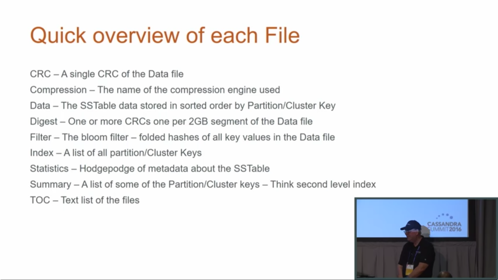

# Data Files

> Jeff Carpenter, Eben Hewitt - Cassandra The Definitive Guide, Third Edition Distributed Data at Web Scale - O'Reilly Media (2022)

When SSTables are written to the filesystem during a flush, there are actually several files that are written per SSTable. Let’s take a look at the default location under the *$CASSANDRA_HOME/data/data* directory to see how the files are organized on disk.

> **Forcing SSTables to Disk**
>
> If you’re following along with the exercises in this book on a real Cassandra node, you may want to execute the `nodetool flush` command at this point, as you may not have entered enough data yet for Cassandra to have flushed data to disk automatically. You’ll learn more about this command in Chapter 12.

Looking in the *data* directory, you’ll see a directory for each keyspace. These directories, in turn, contain a directory for each table, consisting of the table name plus a UUID. The purpose of the UUID is to distinguish between multiple schema versions.

Each of these directories contains SSTable files that contain the stored data. Here is an example directory path: *hotel/hotels-3677bbb0155811e5899aa9fac1d00bce*.

Each SSTable is represented by multiple files that share a common naming scheme. The files are named according to the pattern `<version>-<generation>-<implementation>-<component>.db`. The significance of the pattern is as follows:

- version

  A two-character sequence representing the major/minor version of the SSTable format. For example, the version for the 4.0 release is *na*. You can learn more the about various versions in the `org.apache.cassandra.io.sstable.Descriptor` class

- generation

  An index number that is incremented every time a new SSTable is created for a table

- implementation

  A reference to the implementation of the `org.apache.cassandra.io.sstable.format.SSTableWriter` interface in use. As of the 4.0 release the value is “big,” which references the “Bigtable format” found in the `org.apache.cassandra.io.sstable.format.big.BigFormat` class

Each SSTable is broken up into multiple files or *components*. These are the components as of the 3.0 release:

- *Data.db*

  These are the files that store the actual data and are the only files that are preserved by Cassandra’s backup mechanisms, which you’ll learn about in Chapter 12.

- *CompressionInfo.db*

  Provides metadata about the compression of the *Data.db* file.

- *Digest.crc32*

  Contains a CRC32 checksum for the **-Data.db* file.

- *Filter.db*

  Contains the Bloom filter for this SSTable.

- *Index.db*

  Provides row and column offsets within the corresponding **-Data.db* file. The contents of this file are read into memory so that Cassandra knows exactly where to look when reading datafiles.

- *Summary.db*

  A sample of the index for even faster reads.

- *Statistics.db*

  Stores statistics about the SSTable that are used by the `nodetool tablehistograms` command.

- *TOC.txt*

  Lists the file components for this SSTable.

Older releases support different versions and filenames. Releases prior to 2.2 prepend the keyspace and table name to each file, while 2.2 and later releases leave these out because they can be inferred from the directory name.

We’ll investigate some tools for working with SSTable files in Chapter 12.

## Part 2

