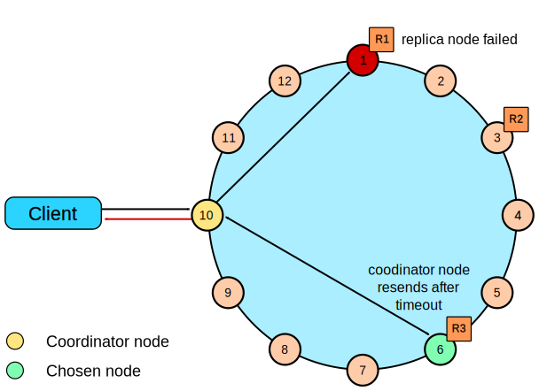

# Reading

## Read Consistency Levels

.assets/image-20221017160440159.png)

## The Cassandra Read Path

Now let’s take a look at what happens when a client requests data. This is known as the *read path*. We’ll describe the read path from the perspective of a query for a single partition key, starting with the interactions between nodes shown in Figure 9-3.

.assets/image-20221017160529058.png)

Figure 9-3. Interactions between nodes on the read path

The read path begins when a client initiates a read query to the coordinator node. As on the write path, the coordinator uses the partitioner to determine the replicas, and checks that there are enough replicas up to satisfy the requested consistency level. Another similarity to the write path is that a remote coordinator is selected per data center for any read queries that involve multiple data centers.

If the coordinator is not itself a replica, the coordinator then sends a read request to the fastest replica, as determined by the dynamic `snitch`. The coordinator node also sends a *`digest request`* to the other replicas. A digest request is similar to a standard read request, **except the replicas return a digest, or hash, of the requested data**.

The coordinator calculates the digest hash for data returned from the fastest replica and compares it to the digests returned from the other replicas. If the digests are consistent, and the desired consistency level has been met, then the data from the fastest replica can be returned. If the digests are not consistent, then the coordinator must perform a read repair, as discussed in the following section.

Figure 9-4 shows the interactions that take place within each replica node to process read requests.

.assets/image-20221017160746807.png)

When the replica node receives the read request, it first checks the row cache. If the row cache contains the data, it can be returned immediately. The row cache helps speed read performance for rows that are accessed frequently. We’ll discuss the pros and cons of row caching in Chapter 13.

If the data is not in the row cache, the replica node searches for the data in memtables and SSTables. There is only a single memtable for a given table, so that part of the search is straightforward. However, there are potentially many physical SSTables for a single Cassandra table, each of which may contain a portion of the requested data.

Cassandra implements several features to optimize the SSTable search: key caching, Bloom filters, SSTable indexes, and summary indexes.

The first step in searching SSTables on disk is to use a Bloom filter to determine whether the requested partition does not exist in a given SSTable, which would make it unnecessary to search that SSTable.

If the SSTable passes the Bloom filter, Cassandra checks the key cache to see if it contains the offset of the partition key in the SSTable. The key cache is implemented as a map structure in which the keys are a combination of the SSTable file descriptor and partition key, and the values are offset locations into SSTable files. The key cache helps to eliminate seeks within SSTable files for frequently accessed data, because the data can be read directly.

If the offset is not obtained from the key cache, Cassandra uses a two-level index stored on disk in order to locate the offset. The first-level index is the *`partition summary`*, which is used to obtain an offset for searching for the partition key within the second-level index, the *`partition index`*. The `partition index` is where the offset into the SSTable for the partition key is stored.

If the offset for the partition key is found, Cassandra accesses the SSTable at the specified offset and starts reading data. In the 3.6 release, a chunk cache was added to store chunks of data from SSTables that are accessed frequently; you’ll learn more about this in Chapter 13.

**Once data has been obtained from all of the SSTables, Cassandra merges the SSTable data and memtable data by selecting the value with the latest timestamp for each requested column.**

Finally, the merged data can be added to the row cache (if enabled) and returned to the client or coordinator node. A digest request is handled in much the same way as a regular read request, with the additional step that a digest is calculated on the result data and returned instead of the data itself.

> .assets/Screenshot_2018-07-10-08-54-20-174_YouTube (1).png)

> https://academy.datastax.com/resources/brief-introduction-apache-cassandra
>
> .assets/11d1c31b-ab36-4472-9cac-f33ca24db577.png)

## Read Repair

//TODO

## Deleting

//TODO

## Rapid read protection using speculative_retry

> https://docs.datastax.com/en/cassandra-oss/3.x/cassandra/dml/dmlClientRequestsRead.html

Rapid read protection allows Cassandra to still deliver read requests when the originally selected replica nodes are either down or taking too long to respond. If the table has been configured with the [`speculative_retry`](https://docs.datastax.com/en/cql-oss/3.3/cql/cql_reference/cqlCreateTable.html#tabProp__morespeculativeRetry) property, the coordinator node for the read request will retry the request with another replica node if the original replica node exceeds a configurable timeout value to complete the read request.

Recovering from replica node failure with rapid read protection

