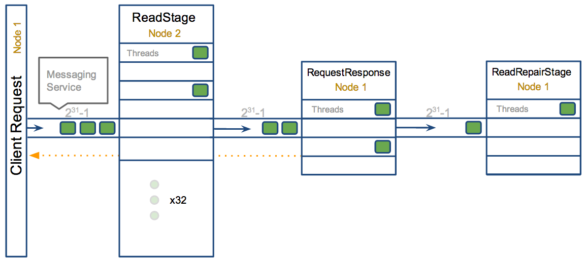

# Thread Pool

> https://blog.pythian.com/guide-to-cassandra-thread-pools/

## Concepts

Cassandra is based off of a [Staged Event Driven Architecture](https://en.wikipedia.org/wiki/Staged_event-driven_architecture) (SEDA).  This separates different tasks in stages that are connected by a messaging service.  Each like task is grouped into a stage having a queue and thread pool (ScheduledThreadPoolExecutor more specifically for the Java folks).  Some stages skip the messaging service and queue tasks immediately on a different stage if it exists on the same node.  Each of these queues can be backed up if execution at a stage is being over run.  This is a common indication of an issue or performance bottleneck.To demonstrate take for example a read request:

[](https://blog.pythian.com/wp-content/uploads/blog.png)

**NOTE:** FOR THE SAKE OF THIS EXAMPLE THE DATA EXISTS ON A DIFFERENT NODE THEN THE INITIAL REQUEST, BUT IN SOME SCENARIOS THIS COULD ALL BE ON A SINGLE NODE.  THERE ARE ALSO MULTIPLE PATHS A READ MAY TAKE.  THIS IS JUST FOR DEMONSTRATION PURPOSES.

1. NODE1> The request is queued from `node1` on the `ReadStage` of `node2` with the task holding a reference to a callback
2. NODE2> The `ReadStage` will pull the task off the queue once one of its 32 threads become available
3. NODE2> The task will execute to and compute the resulting Row, which will be sent off to the `RequestResponse` stage of `node1`
4. NODE1> One of the four threads in the `RequestResponseStage` will process the task, and pass the resulting Row to the callback referenced from step 1 which will return to the client.
5. NODE1> It will also possibly kick off an async read repair task on `node1` to be processed in the `ReadRepairStage` once one of its four threads become available

The `ReadRepairStage` and how long it takes to process its work is not in the feedback loop from the client.  This means if the rate of reads occurs at a rate higher than the rate of read repairs the queue will grow until it is full without the client application ever noticing.  At the point of the queue being full (varies between stages, more below) the act of enqueueing a task will block.

In some stages the processing of these tasks are not critical.  These tasks are marked as “`DROPPABLE`” meaning the first thing the stage will do when executing it is to check if its exceeded past a timeout from when it was created.  If the timeout has passed it will throw it away instead of processing.

## Accessing metrics

### TPStats

For manual debugging this is the output given by

```
nodetool tpstats

Pool Name                    Active   Pending      Completed   Blocked  All time blocked
ReadStage                         0         0         113702         0                 0
RequestResponseStage              0         0              0         0                 0
MutationStage                     0         0         164503         0                 0
ReadRepairStage                   0         0              0         0                 0
ReplicateOnWriteStage             0         0              0         0                 0
GossipStage                       0         0              0         0                 0
AntiEntropyStage                  0         0              0         0                 0
MigrationStage                    0         0              0         0                 0
MemoryMeter                       0         0             35         0                 0
MemtablePostFlusher               0         0           1427         0                 0
FlushWriter                       0         0             44         0                 0
MiscStage                         0         0              0         0                 0
PendingRangeCalculator            0         0              1         0                 0
commitlog_archiver                0         0              0         0                 0
InternalResponseStage             0         0              0         0                 0
HintedHandoff                     0         0              0         0                 0

Message type           Dropped
RANGE_SLICE                  0
READ_REPAIR                  0
PAGED_RANGE                  0
BINARY                       0
READ                         0
MUTATION                     0
_TRACE                       0
REQUEST_RESPONSE             0
COUNTER_MUTATION             0
```

The description of the pool values (Active, Pending, etc) is defined in [the table below](https://blog.pythian.com/guide-to-cassandra-thread-pools/#jmx). The second table lists dropped tasks by message type, for more information on that [read below](https://blog.pythian.com/guide-to-cassandra-thread-pools/#droppable).

| MBean Attribute       | tpstats name     | Description                                                  |
| --------------------- | ---------------- | ------------------------------------------------------------ |
| ActiveCount           | Active           | Number of tasks pulled off the queue with a Thread currently processing. |
| PendingTasks          | Pending          | Number of tasks in queue waiting for a thread                |
| CompletedTasks        | Completed        | Number of tasks completed                                    |
| CurrentlyBlockedTasks | Blocked          | When a pool reaches its max thread count (configurable or set per stage, more below) it will begin queuing until the max size is reached.  When this is reached it will block until there is room in the queue. |
| TotalBlockedTasks     | All time blocked | Total number of tasks that have been blocked                 |


## Droppable Messages

The second table in nodetool tpstats displays a list of messages that were DROPPABLE. These ran after a given timeout set per message type so was thrown away. In JMX these are accessible via org.apache.cassandra.net:MessagingService or org.apache.cassandra.metrics:DroppedMessage. The following table will provide a little information on each type of message.

| Message Type     | Stage                                                        | Notes                                                        |
| ---------------- | ------------------------------------------------------------ | ------------------------------------------------------------ |
| BINARY           | n/a                                                          | This is deprecated and no longer has any use                 |
| _TRACE           | n/a (special)                                                | Used for recording traces (nodetool settraceprobability) Has a special executor (1 thread, 1000 queue depth) that throws away messages on insertion instead of within the execute |
| MUTATION         | [MutationStage](https://blog.pythian.com/guide-to-cassandra-thread-pools/#MutationStage) | If a write message is processed after its timeout (write_request_timeout_in_ms) it either sent a failure to the client or it met its requested consistency level and will relay on hinted handoff and read repairs to do the mutation if it succeeded. |
| COUNTER_MUTATION | [MutationStage](https://blog.pythian.com/guide-to-cassandra-thread-pools/#MutationStage) | If a write message is processed after its timeout (write_request_timeout_in_ms) it either sent a failure to the client or it met its requested consistency level and will relay on hinted handoff and read repairs to do the mutation if it succeeded. |
| READ_REPAIR      | [MutationStage](https://blog.pythian.com/guide-to-cassandra-thread-pools/#MutationStage) | Times out after write_request_timeout_in_ms                  |
| READ             | [ReadStage](https://blog.pythian.com/guide-to-cassandra-thread-pools/#ReadStage) | Times out after read_request_timeout_in_ms. No point in servicing reads after that point since it would of returned error to client |
| RANGE_SLICE      | [ReadStage](https://blog.pythian.com/guide-to-cassandra-thread-pools/#ReadStage) | Times out after range_request_timeout_in_ms.                 |
| PAGED_RANGE      | [ReadStage](https://blog.pythian.com/guide-to-cassandra-thread-pools/#ReadStage) | Times out after request_timeout_in_ms.                       |
| REQUEST_RESPONSE | [RequestResponseStage](https://blog.pythian.com/guide-to-cassandra-thread-pools/#RequestResponseStage) | Times out after request_timeout_in_ms. Response was completed and sent back but not before the timeout |


## Stage Details

Below lists a majority of exposed stages as of 2.0.7, but they tend to be a little volatile so if they do not exist don’t be surprised.  The heading of each section is correlates with the name of the stage from nodetool tpstats. The notes on the stages mostly refer to the 2.x data but some references to things in 1.2. 1.1 and previous versions are not considered at all in making of this document.

Alerts; given as a boolean expression, are intended as a starting point and should be tailored to specific use cases and environments in the case of many false positives.

When listed as “number of processors” its value is retrieved first by the system property “cassandra.available_processors” which can be overridden by adding a

-Dcassandra.available_processors

to JVM_OPTS. Falls back to default of [Runtime.availableProcessors](https://docs.oracle.com/javase/7/docs/api/java/lang/Runtime.html#availableProcessors())

### Index

| [ReadStage](https://blog.pythian.com/guide-to-cassandra-thread-pools/#ReadStage) | [RequestResponseStage](https://blog.pythian.com/guide-to-cassandra-thread-pools/#RequestResponseStage) | [MutationStage](https://blog.pythian.com/guide-to-cassandra-thread-pools/#MutationStage) | [ReadRepairStage](https://blog.pythian.com/guide-to-cassandra-thread-pools/#ReadRepairStage) |
| ------------------------------------------------------------ | ------------------------------------------------------------ | ------------------------------------------------------------ | ------------------------------------------------------------ |
| [ReplicateOnWriteStage](https://blog.pythian.com/guide-to-cassandra-thread-pools/#ReplicateOnWriteStage) | [GossipStage](https://blog.pythian.com/guide-to-cassandra-thread-pools/#GossipStage) | [AntiEntropyStage](https://blog.pythian.com/guide-to-cassandra-thread-pools/#AntiEntropyStage) | [MigrationStage](https://blog.pythian.com/guide-to-cassandra-thread-pools/#MigrationStage) |
| [MemtablePostFlusher](https://blog.pythian.com/guide-to-cassandra-thread-pools/#MemtablePostFlusher) | [FlushWriter](https://blog.pythian.com/guide-to-cassandra-thread-pools/#FlushWriter) | [MiscStage](https://blog.pythian.com/guide-to-cassandra-thread-pools/#MiscStage) | [InternalResponseStage](https://blog.pythian.com/guide-to-cassandra-thread-pools/#InternalResponseStage) |
| [HintedHandoff](https://blog.pythian.com/guide-to-cassandra-thread-pools/#HintedHandoff) | [MemoryMeter](https://blog.pythian.com/guide-to-cassandra-thread-pools/#MemoryMeter) | [PendingRangeCalculator](https://blog.pythian.com/guide-to-cassandra-thread-pools/#PendingRangeCalculator) | [commitlog_archiver](https://blog.pythian.com/guide-to-cassandra-thread-pools/#commitlog_archiver) |
| [AntiEntropySessions](https://blog.pythian.com/guide-to-cassandra-thread-pools/#AntiEntropySessions) |                                                              |                                                              |                                                              |

### ReadStage

Performing a local read. Also includes deserializing data from row cache.  If there are pending values this can cause increased read latency.  This can spike due to disk problems, poor tuning, or over loading your cluster.  In many cases (not disk failure) this is resolved by adding nodes or tuning the system.

| JMX beans:         | org.apache.cassandra.request.ReadStage                       |
| ------------------ | ------------------------------------------------------------ |
|                    | org.apache.cassandra.metrics.ThreadPools.request.ReadStage   |
| Number of threads: | [concurrent_reads](https://www.datastax.com/docs/1.0/configuration/node_configuration#concurrent-reads) (default: 32) |
| Max pending tasks: | 231-1                                                        |
| Alerts:            | pending > 15 \|\| blocked > 0                                |

### RequestResponseStage

When a response to a request is received this is the stage used to execute any callbacks that were created with the original request

| JMX beans:         | org.apache.cassandra.request.RequestResponseStage            |
| ------------------ | ------------------------------------------------------------ |
|                    | org.apache.cassandra.metrics.ThreadPools.request.RequestResponseStage |
| Number of threads: | [number of processors](https://blog.pythian.com/guide-to-cassandra-thread-pools/#stagedetails) |
| Max pending tasks: | 231-1                                                        |
| Alerts:            | pending > 15 \|\| blocked > 0                                |

### MutationStage

Performing a local including:

- insert/updates
- Schema merges
- commit log replays
- hints in progress

Similar to ReadStage, an increase in pending tasks here can be caused by disk issues, over loading a system, or poor tuning. If messages are backed up in this stage, you can add nodes, tune hardware and configuration, or update the data model and use case.

| JMX beans:         | org.apache.cassandra.request.MutationStage                   |
| ------------------ | ------------------------------------------------------------ |
|                    | org.apache.cassandra.metrics.ThreadPools.request.MutationStage |
| Number of threads: | [concurrent_writers](https://www.datastax.com/docs/1.0/configuration/node_configuration#concurrent-writes) (default: 32) |
| Max pending tasks: | 231-1                                                        |
| Alerts:            | pending > 15 \|\| blocked > 0                                |

### ReadRepairStage

Performing read repairs. Chance of them occurring is configurable per column family with read_repair_chance. More likely to back up if using CL.ONE (and to lesser possibly other non-CL.ALL queries) for reads and using multiple data centers. It will then be kicked off asynchronously outside of the queries feedback loop, demonstrated in the [diagram above](https://blog.pythian.com/guide-to-cassandra-thread-pools/#concepts). Note that this is not very likely to be a problem since does not happen on all queries and is fast providing good connectivity between replicas. The repair being droppable also means that after write_request_timeout_in_ms it will be thrown away which further mitigates this. If pending grows attempt to lower the rate for high read CFs:

ALTER TABLE column_family WITH read_repair_chance = 0.01;

| JMX beans:         | org.apache.cassandra.request.ReadRepairStage                 |
| ------------------ | ------------------------------------------------------------ |
|                    | org.apache.cassandra.metrics.ThreadPools.request.ReadRepairStage |
| Number of threads: | [number of processors](https://blog.pythian.com/guide-to-cassandra-thread-pools/#stagedetails) |
| Max pending tasks: | 231-1                                                        |
| Alerts:            | pending > 15 \|\| blocked > 0                                |

### ReplicateOnWriteStage

*CounterMutation in 2.1*, also counters changing dramatically so post 2.0 should consider this obsolete. Performs counter writes on non-coordinator nodes and replicates after a local write. This includes a read so can be pretty expensive. Will back up if the rate of writes exceed the rate that the mutations can occur. Particularly possible with CL.ONE and high counter increment workloads.

| JMX beans:         | org.apache.cassandra.request.ReplicateOnWriteStage           |
| ------------------ | ------------------------------------------------------------ |
|                    | org.apache.cassandra.metrics.ThreadPools.request.ReplicateOnWriteStage |
| Number of threads: | concurrent_replicates (default: 32)                          |
| Max pending tasks: | 1024 x [number of processors](https://blog.pythian.com/guide-to-cassandra-thread-pools/#stagedetails) |
| Alerts:            | pending > 15 \|\| blocked > 0                                |

### GossipStage

Post 2.0.3 there should no longer be issue with pending tasks. Instead monitor logs for a message:

Gossip stage has {} pending tasks; skipping status check ...

Before that change, in particular older versions of 1.2, with a lot of nodes (100+) while using vnodes can cause a lot of cpu intensive work that caused the stage to get behind.
Been known to of been caused with out of sync schemas. Check NTP working correctly and attempt nodetool resetlocalschema or the more drastic deleting of system column family folder.

| JMX beans:         | org.apache.cassandra.internal.GossipStage                    |
| ------------------ | ------------------------------------------------------------ |
|                    | org.apache.cassandra.metrics.ThreadPools.internal.GossipStage |
| Number of threads: | 1                                                            |
| Max pending tasks: | 231-1                                                        |
| Alerts:            | pending > 15 \|\| blocked > 0                                |

### AntiEntropyStage

Repairing consistency. Handle repair messages like merkle tree transfer (from Validation compaction) and streaming.

| JMX beans:         | org.apache.cassandra.internal.AntiEntropyStage               |
| ------------------ | ------------------------------------------------------------ |
|                    | org.apache.cassandra.metrics.ThreadPools.internal.AntiEntropyStage |
| Number of threads: | 1                                                            |
| Max pending tasks: | 231-1                                                        |
| Alerts:            | pending > 15 \|\| blocked > 0                                |

### MigrationStage

Making schema changes

| JMX beans:         | org.apache.cassandra.internal.MigrationStage                 |
| ------------------ | ------------------------------------------------------------ |
|                    | org.apache.cassandra.metrics.ThreadPools.internal.MigrationStage |
| Number of threads: | 1                                                            |
| Max pending tasks: | 231-1                                                        |
| Alerts:            | pending > 15 \|\| blocked > 0                                |

### MemtablePostFlusher

Operations after flushing the memtable. Discard commit log files that have had all data in them in sstables. Flushing non-cf backed secondary indexes.

| JMX beans:         | org.apache.cassandra.internal.MemtablePostFlusher            |
| ------------------ | ------------------------------------------------------------ |
|                    | org.apache.cassandra.metrics.ThreadPools.internal.MemtablePostFlusher |
| Number of threads: | 1                                                            |
| Max pending tasks: | 231-1                                                        |
| Alerts:            | pending > 15 \|\| blocked > 0                                |

### FlushWriter

Sort and write memtables to disk. A vast majority of time this backing up is from over running disk capability. The sorting can cause issues as well however. In the case of sorting being a problem, it is usually accompanied with high load but a small amount of actual flushes (seen in cfstats). Can be from huge rows with large column names. i.e. something inserting many large values into a cql collection. If overrunning disk capabilities, it is recommended to add nodes or tune the configuration.

| JMX beans:         | org.apache.cassandra.internal.FlushWriter                    |
| ------------------ | ------------------------------------------------------------ |
|                    | org.apache.cassandra.metrics.ThreadPools.internal.FlushWriter |
| Number of threads: | [memtable_flush_writers](https://www.datastax.com/docs/1.1/configuration/node_configuration#memtable-flush-writers) (1 per data directory) |
| Max pending tasks: | [memtable_flush_queue_size](https://www.datastax.com/docs/1.1/configuration/node_configuration#memtable-flush-queue-size) (default: 4) |
| Alerts:            | pending > 15 \|\| blocked > 0                                |

### MiscStage

Snapshotting, replicating data after node remove completed.

| JMX beans:         | org.apache.cassandra.internal.MiscStage                     |
| ------------------ | ----------------------------------------------------------- |
|                    | org.apache.cassandra.metrics.ThreadPools.internal.MiscStage |
| Number of threads: | 1                                                           |
| Max pending tasks: | 231-1                                                       |
| Alerts:            | pending > 15 \|\| blocked > 0                               |

### InternalResponseStage

Responding to non-client initiated messages, including bootstrapping and schema checking

| JMX beans:         | org.apache.cassandra.internal.InternalResponseStage          |
| ------------------ | ------------------------------------------------------------ |
|                    | org.apache.cassandra.metrics.ThreadPools.internal.InternalResponseStage |
| Number of threads: | [number of processors](https://blog.pythian.com/guide-to-cassandra-thread-pools/#stagedetails) |
| Max pending tasks: | 231-1                                                        |
| Alerts:            | pending > 15 \|\| blocked > 0                                |

### HintedHandoff

Sending missed mutations to other nodes. Usually a symptom of a problem elsewhere so dont treat as root issue. Can use nodetool disablehandoff to prevent further saving. Can also use JMX (nodetool truncatehints) to clear the handoffs for specific endpoints or all of them with org.apache.cassandra.db:HintedHandoffManager operations. This must be followed up with repairs!

| JMX beans:         | org.apache.cassandra.internal.HintedHandoff                  |
| ------------------ | ------------------------------------------------------------ |
|                    | org.apache.cassandra.metrics.ThreadPools.internal.HintedHandoff |
| Number of threads: | [max_hints_delivery_threads](https://www.datastax.com/documentation/cassandra/2.0/cassandra/configuration/configCassandra_yaml_r.html?scroll=reference_ds_qfg_n1r_1k__advProps) (default: 1) |
| Max pending tasks: | 231-1                                                        |
| Alerts:            | pending > 15 \|\| blocked > 0                                |

### MemoryMeter

Measures memory usage and live ratio of a memtable. The pending should not grow beyond size of number of memtables (front ended by set to prevent duplicates). This can take minutes for large memtables.

| JMX beans:         | org.apache.cassandra.internal.MemoryMeter                    |
| ------------------ | ------------------------------------------------------------ |
|                    | org.apache.cassandra.metrics.ThreadPools.internal.MemoryMeter |
| Number of threads: | 1                                                            |
| Max pending tasks: | 231-1                                                        |
| Alerts:            | pending > column_family_count \|\| blocked > 0               |

### PendingRangeCalculator

Calculates the token ranges based on bootstrapping and leaving nodes. Instead of blocking this stage discards tasks when one already in progress so no value in monitoring

| JMX beans:         | org.apache.cassandra.internal.PendingRangeCalculator         |
| ------------------ | ------------------------------------------------------------ |
|                    | org.apache.cassandra.metrics.ThreadPools.internal.PendingRangeCalculator |
| Number of threads: | 1                                                            |
| Max pending tasks: | 1                                                            |

### commitlog_archiver

(Renamed CommitLogArchiver in 2.1) Executes a command to copy (or user defined command) commit log files for recovery. Read more at [DataStax Dev Blog](https://www.datastax.com/docs/1.1/configuration/commitlog_archiving)

Alerts:pending > 15 || blocked > 0

| JMX beans:         | org.apache.cassandra.internal.commitlog_archiver             |
| ------------------ | ------------------------------------------------------------ |
|                    | org.apache.cassandra.metrics.ThreadPools.internal.commitlog_archiver |
| Number of threads: | 1                                                            |
| Max pending tasks: | 231-1                                                        |

### AntiEntropySessions

Number of active repairs that are in progress. Will not show up until after a repair has been run so any monitoring utilities should be able to handle it not existing.

Alerts:pending > 1 || blocked > 0

| JMX beans:         | org.apache.cassandra.internal.AntiEntropySessions            |
| ------------------ | ------------------------------------------------------------ |
|                    | org.apache.cassandra.metrics.ThreadPools.internal.AntiEntropySessions |
| Number of threads: | 4                                                            |
| Max pending tasks: | 231-1                                                        |
