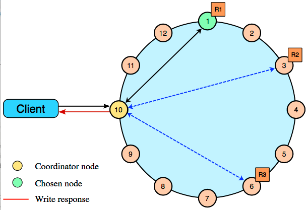

# Writing

> Jeff Carpenter, Eben Hewitt - Cassandra The Definitive Guide, Third Edition Distributed Data at Web Scale - O'Reilly Media (2022)

## Write Consistency Levels

.assets/image-20221017155321401.png)

## The Cassandra Write Path

The *write path* describes how data modification queries initiated by clients are processed, eventually resulting in the data being stored on disk. We’ll examine the write path in terms of both interactions between nodes and the internal process of storing data on an individual node. An overview of the write path interactions between nodes in a multiple data center cluster is shown in Figure 9-1.

The write path begins when a client initiates a write query to a Cassandra node that serves as the coordinator for this request. The coordinator node uses the partitioner to identify which nodes in the cluster are replicas, according to the replication factor for the keyspace. The coordinator node may itself be a replica, especially if the client is using a token-aware load balancing policy. If the coordinator knows that there are not enough replicas up to satisfy the requested consistency level, it returns an error immediately.

Next, the coordinator node sends simultaneous write requests to all local replicas for the data being written. If the cluster spans multiple data centers, the *local coordinator* node selects a *remote coordinator* in each of the other data centers to forward the write to the replicas in that data center. Each of the remote replicas acknowledges the write directly to the original coordinator node.

This ensures that all nodes will get the write as long as they are up. Nodes that are down will not have consistent data, but they will be repaired via one of the anti-entropy mechanisms: `hinted handoff`, read repair, or anti-entropy repair.

The coordinator waits for the replicas to respond. Once a sufficient number of replicas have responded to satisfy the consistency level, the coordinator acknowledges the write to the client. If a replica doesn’t respond within the timeout, it is presumed to be down, and a hint is stored for the write. A hint does not count as a successful replica write unless the consistency level `ANY` is used.

.assets/image-20221017155416433.png)

Figure 9-1. Interactions between nodes on the write path

Figure 9-2 depicts the interactions that take place within each replica node to process a write request. These steps are common in databases that share the log-structured merge tree design we explored in Chapter 6.

.assets/image-20221017155631835.png)

First, the replica node receives the write request and immediately writes the data to the commit log. Next, the replica node writes the data to a memtable. If row caching is used and the row is in the cache, the row is invalidated. We’ll discuss caching in more detail under the read path.

If the write causes either the commit log or memtable to pass its maximum thresholds, a flush is scheduled to run. We’ll learn how to tune these thresholds in Chapter 13.

At this point, the write is considered to have succeeded and the node can reply to the coordinator node or client.

After returning, the node executes a flush if one was scheduled. The contents of each memtable are stored as SSTables on disk, and the commit log is cleared. After the flush completes, additional tasks are scheduled to check if compaction is needed, and then a compaction is performed if necessary.

> .assets/Screenshot_2018-07-10-08-54-08-724_YouTube (1).png)

> https://academy.datastax.com/resources/brief-introduction-apache-cassandra
>
> .assets/b696e6e9-024d-4cbd-a0fc-95ab225efd3f.png)
>
> 

### Commit log files

Cassandra writes commit logs to the filesystem as binary files. By default, the commit log files are found under the *$CASSANDRA_HOME/data/commitlog* directory.

Commit log files are named according to the pattern `CommitLog-<version><timestamp>`.log. For example: *`CommitLog-7-1566780133999.log`*. The *version* is an integer representing the commit log format. For example, the version for the 4.0 release is 7. You can find the versions in use by release in the `org.apache.cassandra.db.commitlog.CommitLogDescriptor` class.

### SSTable files
{doc}`/database/cassandra/cassandra-data-files`

## Ref

> https://docs.datastax.com/en/cassandra-oss/3.x/cassandra/dml/dmlClientRequestsWrite.html
>
> The coordinator sends a write request to *all* replicas that own the row being written. As long as all replica nodes are up and available, they will get the write regardless of the [consistency level](https://docs.datastax.com/en/cassandra-oss/3.x/cassandra/dml/dmlConfigConsistency.html) specified by the client. The write consistency level determines how many replica nodes must respond with a success acknowledgment in order for the write to be considered successful. Success means that the data was written to the commit log and the memtable as described in [how data is written](https://docs.datastax.com/en/cassandra-oss/3.x/cassandra/dml/dmlHowDataWritten.html).
>
> The coordinator node forwards the write to replicas of that row, and responds to the client once it receives write acknowledgments from the number of nodes specified by the consistency level. Exceptions:
>
> - If the coordinator cannot write to enough replicas to meet the requested consistency level, it throws an `Unavailable `Exception and does not perform any writes.
> - If there are enough replicas available but the required writes don't finish within the timeout window, the coordinator throws a `Timeout` Exception.
>
> For example, in a single datacenter 10-node cluster with a replication factor of 3, an incoming write will go to all 3 nodes that own the requested row. If the write consistency level specified by the client is `ONE`, the first node to complete the write responds back to the coordinator, which then proxies the success message back to the client. A consistency level of `ONE` means that it is possible that 2 of the 3 replicas can miss the write if they happen to be down at the time the request is made. If a replica misses a write, the row is made consistent later using one of the [built-in repair mechanisms](https://docs.datastax.com/en/cassandra-oss/3.x/cassandra/operations/opsRepairNodesTOC.html): hinted handoff, read repair, or anti-entropy node repair.
>
> Single datacenter cluster with 3 replica nodes and consistency set to ONE
