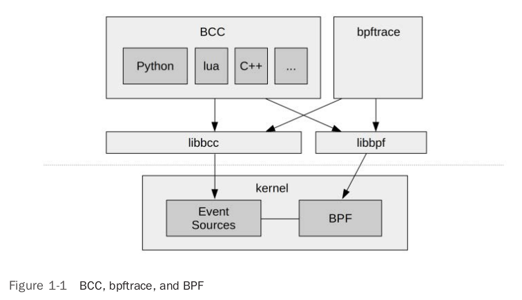

# 图解 eBPF 基础库 libbpf 示例流程

如果你学习 eBPF。那么你不久就会发现，几乎所有 eBPF 的架构，包括 `BCC`/`bpftrace` 在内，都在用户态使用了 `libbpf` 这个 helper lib。




*from [BPF Performance Tools] - Brendan Gregg*


在  `BCC`/`bpftrace`  刚兴起之时， libbpf 还是个小 BB，API 抽象不足，只能用作底层库，为 BCC/bpftrace 做脚手架。但当小 BB 发展到 libbpf 1.0 时，情况有了变化。API 界面的抽象和友好程度增加了，加上人们开始对轻量化 BPF 运行条件，一次编译到处运行([BPF CO-RE](https://nakryiko.com/posts/bpf-portability-and-co-re/)) 的期待越来越高。 libbpf 开始备受关注。


而我个人想研究 libbpf 的目的是想了解内核加载与运行 BPF 程序的接口和抽象概念。要了解内核如何抽象 BPF 设计和概念，当然可以直接看源码。但我认为看 BPF 用户状与内核态的 API 设计，足以应对大部分需求。也比较好控制方向不迷失。


同理，学习 libbpf 当然可以直接看原码。但时候，看设计者如何使用（调用）自己的源码，比直接看源码来得直观与快捷。一个例子胜过 N 个道理。

libbpf 提供了一个很好的，轻度使用 libbpf 的示例：

[https://github.com/libbpf/libbpf-bootstrap](https://github.com/libbpf/libbpf-bootstrap)


下面以其中的 [minimal](https://github.com/libbpf/libbpf-bootstrap#minimal) 来说明一个最简单的 BPF 程序加载与运行过程。

## 入口

我们先看看程序的用户态与内核态（真正 BPF 程序） 的入口。不要被吓跑。这里只要目标是让你对主要的步骤有个高层次的感性的了解，不是要深入分析。

一般，BPF 程序都由内核态部分、用户态部分组成。

- `内核态部分`多为监听内核事件，在事件发生时回调程序，并在处理事件后，更新与用户态程序的共享 Map 或 perf event。
- `用户态部分`一般负责加载和初始化`内核态部分`  ，然后监听 Map 或 perf event 的更新，计算后告知用户结果。

### 用户态程序入口

[minimal.c](https://github.com/libbpf/libbpf-bootstrap/blob/77f7c4b72ee319b81e5d0829a37c61c250322782/examples/c/minimal.c/#L14) :

```c
#include <stdio.h>
#include <unistd.h>
#include <sys/resource.h>
#include <bpf/libbpf.h>
#include "minimal.skel.h"

static int libbpf_print_fn(enum libbpf_print_level level, const char *format, va_list args)
{
	return vfprintf(stderr, format, args);
}

int main(int argc, char **argv)
{
	struct minimal_bpf *skel;
	int err;
...

	/* Open BPF application */
    // 1.解释内嵌在本程序(minimal) 中的 BPF程序（二进制 ELF 格式）。加载到堆内存
	skel = minimal_bpf__open();
	if (!skel) {
		fprintf(stderr, "Failed to open BPF skeleton\n");
		return 1;
	}

	/* ensure BPF program only handles write() syscalls from our process */
    // 修改 BPF 二进制 ELF 格式中的 .bss section 中的 my_pid 的初始值为当前进程。
	skel->bss->my_pid = getpid();

	/* Load & verify BPF programs */
    // 2.调用内核 BPF 相关 syscall。完成相关的 BP F程序加载与 map 的初始化过程。
	err = minimal_bpf__load(skel);
	if (err) {
		fprintf(stderr, "Failed to load and verify BPF skeleton\n");
		goto cleanup;
	}

	/* Attach tracepoint handler */
    // 3.把 BPF 程序绑定到内核的 tracepoint 事件上。完成后，事件发生时，内核将回调这个 BPF 程序。
	err = minimal_bpf__attach(skel);
	if (err) {
		fprintf(stderr, "Failed to attach BPF skeleton\n");
		goto cleanup;
	}

	printf("Successfully started! Please run `sudo cat /sys/kernel/debug/tracing/trace_pipe` "
	       "to see output of the BPF programs.\n");

	for (;;) {
		/* trigger our BPF program */
        //4. 打印输出到 fd=1，本质上是调用了 syscall write()
		fprintf(stderr, ".");
		sleep(1);
	}

...
}
```


### 内核态 BPF 程序

[minimal.bpf.c](https://github.com/libbpf/libbpf-bootstrap/blob/77f7c4b72ee319b81e5d0829a37c61c250322782/examples/c/minimal.bpf.c/#L11) :

```c
#include <linux/bpf.h>
#include <bpf/bpf_helpers.h>

char LICENSE[] SEC("license") = "Dual BSD/GPL";

int my_pid = 0;// 将由用户态程序更新。

// 监听 tp/syscalls/sys_enter_write 事件。只要是 syscall write()，都属于这个事件类型。
SEC("tp/syscalls/sys_enter_write")
int handle_tp(void *ctx)
{
	int pid = bpf_get_current_pid_tgid() >> 32 /*获得调用 syscall write() 的进程 pid*/;

	if (pid != my_pid)
		return 0;

	bpf_printk("BPF triggered from PID %d.\n", pid);

	return 0;
}

```


## make 与 ELF section

Make 的主要过程如下：


*[上图如排版有问题，请点这里用 Draw.io 打开](https://app.diagrams.net/?ui=sketch#Uhttps%3A%2F%2Fdevops-insider.mygraphql.com%2Fzh_CN%2Flatest%2F_images%2Fminimal-make.drawio.svg)*


### make 内核态 BPF

在 make 的过程中，实际上是执行了：

```bash
clang -g -O2 -D__TARGET_ARCH_x86 -I.output -I../../libbpf/include/uapi -I../../vmlinux/x86/ 
-idirafter /usr/lib/llvm-14/lib/clang/14.0.0/include -idirafter /usr/local/include -idirafter 
/usr/include/x86_64-linux-gnu -idirafter /usr/include \
-target bpf  -c minimal.bpf.c -o .output/minimal.bpf.o
```

最后一行就是重点。输入是 `minimal.bpf.c`。输出是 `minimal.bpf.o`。这是一个 ELF 格式的文件。这个文件将会嵌入到应用中。`minimal.bpf.o` section 如下：

```
$ readelf -aW minimal.bpf.o

Section Headers:
  [Nr] Name              Type            Address          Off    Size   ES Flg Lk Inf Al
  [ 0]                   NULL            0000000000000000 000000 000000 00      0   0  0
  [ 1] .strtab           STRTAB          0000000000000000 00055b 0000a2 00      0   0  1
  [ 2] .text             PROGBITS        0000000000000000 000040 000000 00  AX  0   0  4
  [ 3] tp/syscalls/sys_enter_write PROGBITS        0000000000000000 000040 000068 00  AX  0   0  8
  [ 4] .reltp/syscalls/sys_enter_write REL             0000000000000000 000498 000020 10   I 13   3  8
  [ 5] license           PROGBITS        0000000000000000 0000a8 00000d 00  WA  0   0  1
  [ 6] .bss              NOBITS          0000000000000000 0000b8 000004 00  WA  0   0  4
  [ 7] .rodata           PROGBITS        0000000000000000 0000b8 00001c 00   A  0   0  1
  [ 8] .BTF              PROGBITS        0000000000000000 0000d4 00025d 00      0   0  4
  [ 9] .rel.BTF          REL             0000000000000000 0004b8 000030 10   I 13   8  8
  [10] .BTF.ext          PROGBITS        0000000000000000 000334 0000a0 00      0   0  4
  [11] .rel.BTF.ext      REL             0000000000000000 0004e8 000070 10   I 13  10  8
  [12] .llvm_addrsig     LOOS+0xfff4c03  0000000000000000 000558 000003 00   E  0   0  1
  [13] .symtab           SYMTAB          0000000000000000 0003d8 0000c0 18      1   5  8
```


Test BPF call:

```c
libc.so.6!syscall() (syscall.S:38)
sys_bpf(unsigned int size, union bpf_attr * attr, enum bpf_cmd cmd) (/home/labile/opensource/libbpf-bootstrap/libbpf/src/bpf.c:75)
sys_bpf_fd(unsigned int size, union bpf_attr * attr, enum bpf_cmd cmd) (/home/labile/opensource/libbpf-bootstrap/libbpf/src/bpf.c:83)
bpf_map_create(enum bpf_map_type map_type, const char * map_name, __u32 key_size, __u32 value_size, __u32 max_entries, const struct bpf_map_create_opts * opts) (/home/labile/opensource/libbpf-bootstrap/libbpf/src/bpf.c:201)
probe_kern_array_mmap() (/home/labile/opensource/libbpf-bootstrap/libbpf/src/libbpf.c:4674)
kernel_supports(const struct bpf_object * obj, enum kern_feature_id feat_id) (/home/labile/opensource/libbpf-bootstrap/libbpf/src/libbpf.c:4909)
kernel_supports(const struct bpf_object * obj, enum kern_feature_id feat_id) (/home/labile/opensource/libbpf-bootstrap/libbpf/src/libbpf.c:4897)
bpf_object__sanitize_maps(struct bpf_object * obj) (/home/labile/opensource/libbpf-bootstrap/libbpf/src/libbpf.c:7356)
bpf_object_load(struct bpf_object * obj) (/home/labile/opensource/libbpf-bootstrap/libbpf/src/libbpf.c:7735)
bpf_object__load(struct bpf_object * obj) (/home/labile/opensource/libbpf-bootstrap/libbpf/src/libbpf.c:7786)
bpf_object__load_skeleton(struct bpf_object_skeleton * s) (/home/labile/opensource/libbpf-bootstrap/libbpf/src/libbpf.c:12375)
minimal_bpf__load(struct minimal_bpf * obj) (/home/labile/opensource/libbpf-bootstrap/examples/c/.output/minimal.skel.h:90)
main(int argc, char ** argv) (/home/labile/opensource/libbpf-bootstrap/examples/c/minimal.c:34)
```

