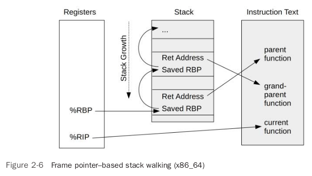
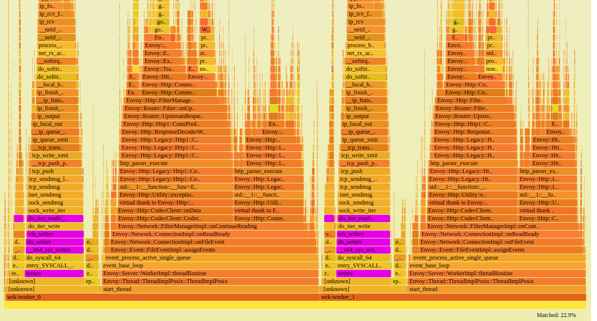
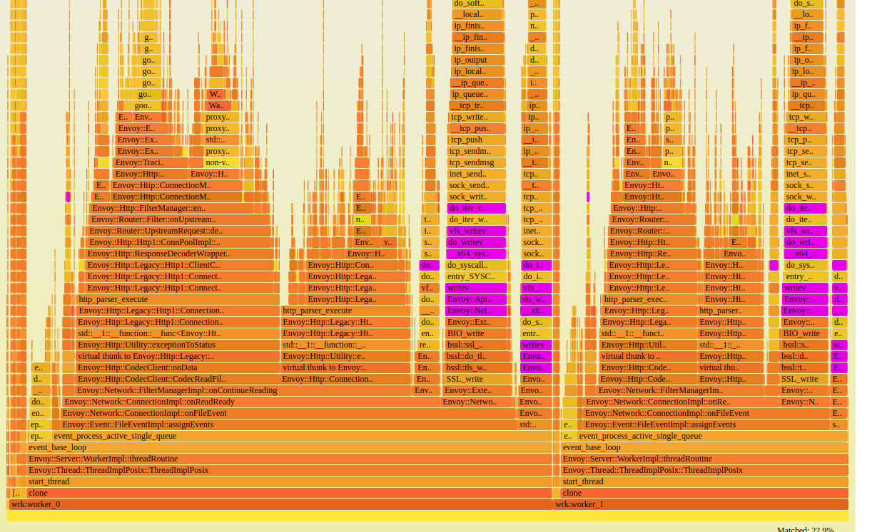

|      |      |      |
| ---- | ---- | ---- |
|      |      |      |
|      |      |      |
|      |      |      |

### Frame Pointer–Based Stacks

gcc with `-fno-omit-frame-pointer option`



> The gcc compiler currently defaults to omitting the frame pointer and using RBP as a
> general-purpose register, which breaks frame pointer-based stack walking. This default can
> be reverted using the -fno-omit-frame-pointer option
>
> 

### debuginfo/DWARF

> Additional debugging information is often available for software as debuginfo packages, which
> contain ELF debuginfo files in the DWARF format. These include sections that debuggers such
> as gdb(1) can use to walk the stack trace, even when no frame pointer register is in use. The ELF
> sections are **.eh_frame and .debug_frame**
>
>  **BPF does not currently support this technique of stack walking**: It is processor intensive and
> requires reading ELF sections that may not be faulted in. This makes it challenging to implement
> in the limited interrupt-disabled BPF context.
> Note that the BPF front ends BCC and bpftrace do support debuginfo files for symbol resolution.

### Last Branch Record (LBR)

> Last branch record is an Intel processor feature to record branches in a hardware buffer, including
> function call branches. This technique has no overhead and can be used to reconstruct a stack
> trace. However, it is limited in depth depending on the processor, and may only support recording
> 4 to 32 branches. Stack traces for production software, especially Java, can exceed 32 frames.
> **LBR is not currently supported by BPF**, but it may be in the future. A limited stack trace is better
> than no stack trace!

### ORC

> A new debug information format that has been devised for stack traces, Oops Rewind Capability
> (ORC), is less processor intensive than DWARF [36]. ORC uses .orc_unwind and .orc_unwind_ip ELF
> sections, and it has so far been implemented for the Linux kernel. On register-limited architectures, it
> may be desirable to compile the kernel without the frame pointer and use ORC for stack traces instead.
> ORC stack unwinding is available in the kernel via the perf_callchain_kernel() function, which
> BPF calls. This means BPF also supports ORC stack traces. **ORC stacks have not yet been developed
> for user space.**

### Symbols

>Stack traces are currently recorded in the kernel as an array of addresses that are later translated to
>symbols (such as function names) by a user-level program. There can be situations where symbol
>mappings have changed between collection and translation, resulting in invalid or missing
>translations. This is discussed in Section 12.3.4 in Chapter 12. Possible future work includes
>adding support for symbol translation in the kernel, so that the kernel can collect and translate a
>stack trace immediately.

## GNU libc miss stack example

Frame Pointer–Based Stacks  Miss:




debuginfo/DWARF:

```bash
perf record -g --call-graph dwarf -F 99 -o fortio-l2-dwarf.perfdata -p `pgrep -f envoy.*forti` -- sleep 30
```




### Compile glibc

https://www.linuxfromscratch.org/lfs/view/9.0-systemd/chapter05/glibc.html

https://askubuntu.com/questions/1284873/compile-glibc-2-3-with-linuxthreads

https://tldp.org/HOWTO/html_single/Glibc-Install-HOWTO/

https://www.explorelinux.com/compiling-glibc-on-ubuntu-18-04/
