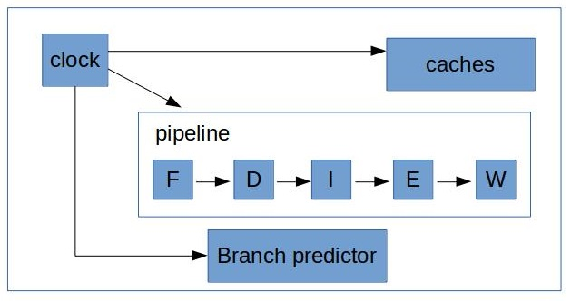
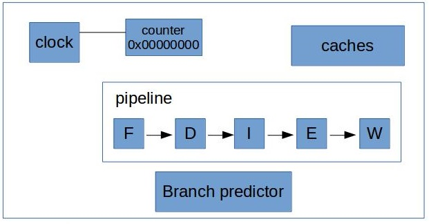
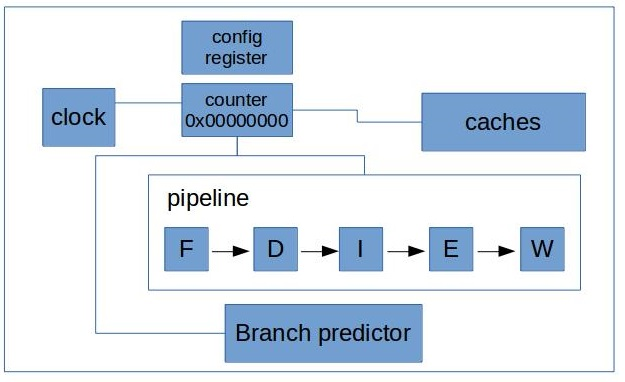

# PMU counters and profiling basics

> [https://easyperf.net/blog/2018/06/01/PMU-counters-and-profiling-basics](https://easyperf.net/blog/2018/06/01/PMU-counters-and-profiling-basics)


One way of analyzing performance of an application is instrumenting and then running it. Instrumenting means source code modification in such a way that allows us to grab some information about how our app executes. For example, we can measure number of calls for particular function, number of loop interations, etc. Theoretically, with this approach we can profile our application right within the application itself. However, it is not really the desired way to do it, because it is very time consuming, require recompilation each time we want to collect new metrics, and brings runtime overhead and noise in the measurements.

We all know that, no surprise. The other way is to use profiling tools like perf and Vtune that will collect statistics without instrumenting the binary. I’m using those profiling tools very extensively but understanding how they work came to me not so long time ago. In this article I will try to uncover some basic principles of how those tools work.

## CPU mental model and simplest PMU counter

In a really simplified view our processor looks like this:



Just for a moment let’s imagine that it is how things physically lay out on a die. I also omitted lots of things on this diagram, but it’s not really much important right now, just bear with me.

There is a clock generator that sends pulses to every piece of the system to make everything moving to the next stage. This is called a cycle. If we add just a little bit of silicon and connect it to the pulse generator we can count a number of cycles, yay!



This is the simplest possible counter. It is called a `counter` for a reason of course, it’s purpose is to count certain events. Every time a new pulse comes out our counter is incremented by 1. In reality counter is just yet another HW register. You can sample it from time to time to know how many clockticks passed.

Counting cycles is great, however, that’s not super helpful if we want to collect statistics about, say, L1 cache or our execution units.

## So, how about counting more?

We can connect our counter to other units just by laying out the wires from every element we interested in to our counter.




Notice, that I added one more element to the figure, it’s a configuration register. Because now we need a way to tell “now I want to sneak into L1” and “now I want to return back to counting cycles”.

I should also point out that this is not everything that is needed for our beautiful counters to work. We also need special assembly instructions to read the value from the counter and write to the config register. In order for those instructions to work we need physical paths from execution units to all the counters to be able to pull the values from it.

With only one counter it’s possible to count only one thing at a time. Ough! You maybe already guessed where I’m going with this. Each additional counter increases complexity and amount of wires quite significantly. And of course we have a limited amount of physical paths on a die.

In practice, architects don’t try to connect every component with every counter, because it increases amount of wires. Instead they try to put counters in a different places on a die to be as closer as possible to the components they are intended to observe. And also they connect each component to at least 2 different counters, so that it’s guaranteed to be able to count two different events at the same time. Taking in consideration our example, it will look something like this:


Usually there is also one global register that controls all the other counters. For example, with it you can turn all the counters on and off. And that also requires physical paths from the global configuration registers to all the counters in the processor.

## Fixed and programmable counters

In practice most of the CPUs have PMU (Performance Monitoring Unit) with fixed and programmable counters. Fixed PMC (Performance Monitoring Counter) always measures the same thing inside the core. With programmable counter it’s up to user to choose what he wants to measure.

I believe for the most Intel Core processors, number of fully programmable counters is 4 (per logical core) and usually 3 fixed function counters (per logical core). Fixed counters usually are set to count core clocks, reference clocks, instructions retired. More details can be found in [Intel® 64 and IA-32 Architectures Software Developer’s Manual, Volume 3B, Part2, Chapter 18.2.2](https://software.intel.com/sites/default/files/managed/7c/f1/253669-sdm-vol-3b.pdf).

For my IvyBridge processor here is the output of `cpuid` command:

```
$ cpuid
...
   Architecture Performance Monitoring Features (0xa/eax):
      version ID                               = 0x3 (3)
      number of counters per logical processor = 0x4 (4)
      bit width of counter                     = 0x30 (48)
...
   Architecture Performance Monitoring Features (0xa/edx):
      number of fixed counters    = 0x3 (3)
      bit width of fixed counters = 0x30 (48)
...
```

Similar information can be grepped out from the kernel message buffer right after the system is booted:

```
$ dmesg
...
[    0.061530] Performance Events: PEBS fmt1+, IvyBridge events, 16-deep LBR, full-width counters, Intel PMU driver.
[    0.061550] ... version:                3
[    0.061550] ... bit width:              48
[    0.061551] ... generic registers:      4
[    0.061551] ... value mask:             0000ffffffffffff
[    0.061552] ... max period:             00007fffffffffff
[    0.061552] ... fixed-purpose events:   3
[    0.061553] ... event mask:             000000070000000f
...
```

## MSRs - model specific registers

PMU counters and configuration registers are implemented as MSR (Model Specific Registers) registers. What that means is that number of counters and their width can vary from model to model and you can’t rely on the same number of counters in your CPU, you should always query that first, using cpuid.

MSRs are accessed via the `RDMSR` and `WRMSR` instruction. Certain counter registers can be accessed via the `RDPMC` instruction. More information and details are available in Volume 2B of the Programmer’s Reference Manual.

## Counting vs. Sampling

Typical use case for such a counter would be:

```
- disable counting
- set all the counters to 0
- configure evenst that we want to measure
- enable counting
- run the application
- disable counting
- read the values of the counters
```

This process is also called characterizing, and this is what such tools do!

This method allows you to collect overall statistics about execution of the application. This is, for example, what `perf stat` will output if I will run it on `ls` and try to additionally collect 3 advanced counters:

```
$ perf stat -e r5301b1,r53010e,r5301c2,instructions,cycles,ref-cycles -- ls
<output of ls command>

 Performance counter stats for 'ls':

           2142223      r5301b1                   # UOPS_EXECUTED.CORE                                  
           2217291      r53010e                   # UOPS_ISSUED.ANY                                  
           2084935      r5301c2                   # UOPS_RETIRED.ALL                                  
           1553280      instructions              #    0,75  insn per cycle                                            
           2078230      cycles                                                      
           3062668      ref-cycles                                                  

       0,001497400 seconds time elapsed
```

Note, that some data was collected “for free”, based on fixed PMCs (see above). Also perf is not showing the name of the counter in the output, it was added by me. Codes for the counters (that I put in parameters to perf) can be obtained with the method described [here](http://www.bnikolic.co.uk/blog/hpc-prof-events.html).

As you can see, there are no details about the hottest functions or the line of code which caused the biggest amount of cache misses, etc. It just raw statistics for the whole runtime. Basically, during the whole runtime each counter measured only one thing. There were no multiplexing between them.

In Intel Vtune Amplifier there is analysis which is called “general-exploration” and it’s capable of collecting lots of counters during the runtime, but it’s obviously does that by multiplexing between them in the runtime. Multiplexing adds more overhead (because we need to switch counters in the runtime) and decreases the precision.

There is one caveat to this. In particular: what happens when the counter overflows? In this situation you can handle OS exception, and inside this handler you can:

```
- stop counting
- increment the number of overflows in some variable in SW
- clear the counter to zero
- start counting again
```

There is for sure more things that we need to care about, but before going into more sophisticated things lets consider another fundamental concept called “sampling”.

## Sampling and profiling

If you take an OS exception anyway, there is a lot of information you can get from it. For example, you can capture IP (instruction pointer). So if you will dump your IP at the time when the counter overflows, (ta-dam!) you know the place in your program where the event occurred.

Say we have our PMU counter of 32-bit width. If you start to count clockticks with such a counter and capture overflows, suddenly you will stop your application approximately each 1 second (2^32 cycles, and if the CPU frequency 4.3 GHz) and know what your application executes in this particular moment. And this is more detailed but still quite simplified process of profiling:

```
- set counter to 0
- enable counting
- wait for the overflow and disable counting when it happens
- inside the interrupt handler capture IP, registers state, etc.
- repeat the process
```

The problem in this case is that we only sample every 1 second, which might not be the good precision. To have a finer granularity we can start not at a counter being zeroed out, but at a maximum value minus some threshold. So, if we want to count every 100 ms, we set initial value to `0xFFFFFFFF - 0x19999999`, where `0x19999999` represent the number of clockticks in 100ms. And in this case we will receive an interrupt after 0x19999999 clocks.

Typically very few amount of work is done by the profiling tool during collection of samples. Then there is a separate post-processing stage sometimes called “finalization” which parses all the raw samples, organizes them and convert them into human readable form.

In linux perf profiling associates with `perf record` command. More examples about using perf you can find in the [great article](http://www.brendangregg.com/perf.html) by Brendan Gregg. The similar capabilities for Intel Vtune Amplifier are “hotspot” and “advanced-hotspot” analysis.

Sampling at a smaller intervals increases the overhead (because of more interrupts) and makes the size of collected data bigger. On the other side, counting involves almost no runtime overhead. I will write more about the topic of overhead and how profilers deal with that in my next articles.

That’s all for today, in my next post I will dig more into profiling and write about two advanced sampling techniques: PEBS and LBR.
