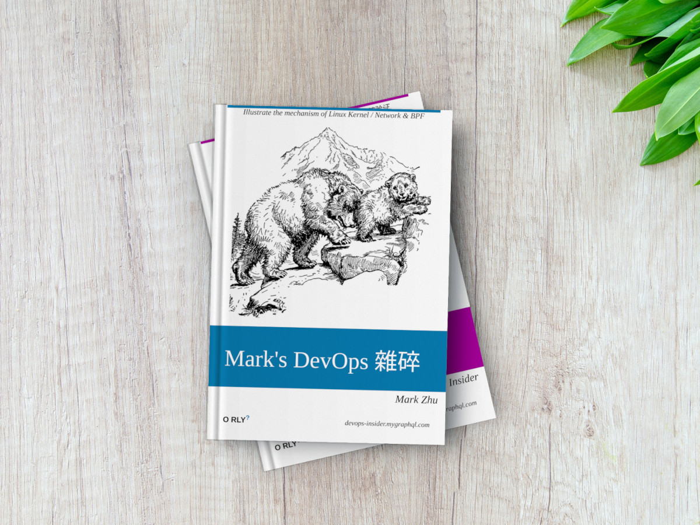

# 前言


```{attention}
这是一本编写中的 “书”，主要内容整理自我的 Blog: [blog.mygraphql.com](https://blog.mygraphql.com)与其它网上资料的学习笔记。书名为《Mark's DevOps 雜碎》，英文名《Mark's DevOps Chop Suey》。
```

## 本书概述

### 本书是什么

与其说是 “书”，不如说是一个系统化和支持搜索的 Blog 与其它网上资料的学习笔记。 老实说，不是传统意义上的，连贯与结构紧密的 “书”。

不知不觉 IT 从业快 20 年了。最近几年来，总觉得应该写点什么。我尝试过写 Blog，但 Blog 毕竟是比较零散的结构。有以下问题：
- 不能结构化知识体系
- 搜索不好用

在编写我的另一本书 [Istio & Envoy 内幕](https://istio-insider.mygraphql.com/) 过程中，看到了 `sphinx` 的精准排版，加上 `Read The Docs` 的搜索增强与托管服务。我觉得用书的形式去梳理、归纳贯通那些本来就很体系化、严谨的知识点，会更方便浏览与搜索。

### “雜碎(Chop Suey)” 是什么

:::{figure-md} 雜碎(Chop Suey)


*雜碎(Chop Suey)*
:::


> **以下引用自某报：**
> <mark>雜碎是舊式北美中餐的招牌菜，英文 `chop suey` 是 `廣府話` 譯音，意謂炒什錦，材料一般包括雞絲、牛肉絲、豬肉絲等肉類或蝦，以及大白菜絲、青椒絲、芹菜絲、洋蔥絲、雪豌豆和豆芽等。</mark>  
> 
> 傳說清末重臣 `李鴻章` 1896 年訪美時，美國人打聽他愛吃食品，中餐館隨口說是雜碎，這道菜就因名人效應而風行起來。現存紐約美國華人博物館的美國最早雜碎餐館菜單，是 1879 年波士頓宏發樓菜單，說明這道菜早於李鴻章訪美前即存在。
清末民初文化名人 `梁啟超` 1903 年遊歷美國後撰成《新大陸遊記》，文中提到當時光是紐約就有三四百家雜碎館，全美華人以雜碎館維生者逾三千人。不過梁對雜碎觀感不佳，文中寫道：「然其所謂雜碎者，烹飪殊劣，中國人從無就食者。」

如果看完上面解释，还是要为这个词 `上岗上线`，那么，就请吧。


### 读者对象

喜欢较真，但有容错心理准备的人。

### 书的访问地址
- [https://devops-insider.mygraphql.com](https://devops-insider.mygraphql.com)
- [https://devops-insider.readthedocs.io](https://devops-insider.readthedocs.io)
- [https://devops-insider.rtfd.io](https://devops-insider.rtfd.io)

### 关于作者

我叫 Mark Zhu，一个中年且头发少的程序员。我不是 Linux/BPF 专家，更不是 Linux/BPF Committer。连互联网大厂员工也不是。

为什么水平有限还学人家写书？因为这句话：
> 你不需要很厲害才能開始，但你需要開始才會很厲害。

Blog: [https://blog.mygraphql.com/](https://blog.mygraphql.com/)  
为方便读者关注 Blog 与本书的更新，开了个同步的 `微信公众号`：

:::{figure-md} 微信公众号:Mark的Cloud与BPF雜碎


*微信公众号:Mark的Cloud与BPF雜碎*
:::


### 参与编写
如果你也对编写本书有兴趣，欢迎联系我。本书的出发点不是刷简历，也没这个能力。而且，这样的非`短平快` 且 `TL;DR` 书籍注定是小众货。


### Dedication 💞
First, to my dear parents, for showing me how to live a happy
and productive life. To my dear wife and our amazing kid – thanks for all your love and patience.


### Copyleft 声明
无论是文字还是图片，如果转载或修改，请注明原出处。

### 意见反馈
由于自称是交互图书，读者的反馈当然非常重要。如果你发现书中的错误，或者有更好的建议，不妨来这里提 Issue:  
[https://github.com/labilezhu/devops-insider/issues](https://github.com/labilezhu/devops-insider/issues)


## 目录
```{toctree}
:caption: 目录
:maxdepth: 3
:includehidden:

kernel/index.md
lang/c/index.md
database/database.md
istio/index.md
```