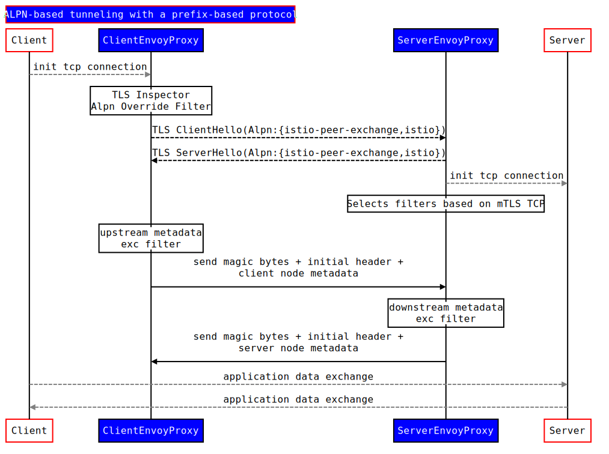

# Understanding TCP telemetry collection

In this task, you used Istio configuration to automatically generate and report metrics for all traffic to a TCP service within the mesh. TCP Metrics for all active connections are recorded every `15s` by default and this timer is configurable via [`tcpReportingDuration`](https://istio.io/latest/docs/reference/config/proxy_extensions/stats/#PluginConfig). Metrics for a connection are also recorded at the end of the connection.

### TCP attributes

Several TCP-specific attributes enable TCP policy and control within Istio. These attributes are generated by Envoy Proxies and obtained from Istio using Envoy’s Node Metadata. Envoy forwards Node Metadata to Peer Envoys using ALPN based tunneling and a prefix based protocol. We define a new protocol `istio-peer-exchange`, that is advertised and prioritized by the client and the server sidecars in the mesh. ALPN negotiation resolves the protocol to `istio-peer-exchange` for connections between Istio enabled proxies, but not between an Istio enabled proxy and any other proxy. This protocol extends TCP as follows:

1. TCP client, as a first sequence of bytes, sends a magic byte string and a length prefixed payload.
2. TCP server, as a first sequence of bytes, sends a magic byte sequence and a length prefixed payload. These payloads are protobuf encoded serialized metadata.
3. Client and server can write simultaneously and out of order. The extension filter in Envoy then does the further processing in downstream and upstream until either the magic byte sequence is not matched or the entire payload is read.

_TCP Attribute Flow_

