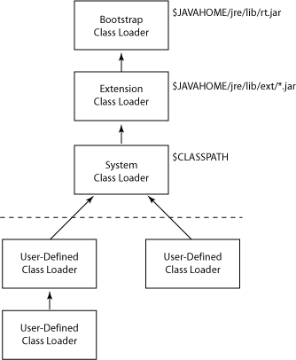
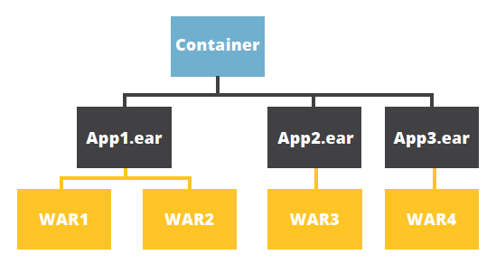

## 内置 Classloader

#### Bootstrap Class Loader

Java classes are loaded by an instance of *java.lang.ClassLoader*. However, class loaders are classes themselves. Hence, the question is, who loads the *java.lang.ClassLoader* itself*?*

This is where the bootstrap or primordial class loader comes into the picture.

It's mainly responsible for loading JDK internal classes, typically *rt.jar* and other core libraries located in *$JAVA_HOME/jre/lib directory*. Additionally, **Bootstrap class loader serves as a parent of all the other \*ClassLoader\* instances**.

**This bootstrap class loader is part of the core JVM and is written in native code** as pointed out in the above example. Different platforms might have different implementations of this particular class loader.

#### Extension Class Loader

The **extension class loader is a child of the bootstrap class loader and takes care of loading the extensions of the standard core Java classes** so that it's available to all applications running on the platform.

Extension class loader loads from the JDK extensions directory, usually *$JAVA_HOME/lib/ext* directory or any other directory mentioned in the *java.ext.dirs* system property.

#### System Class Loader

The system or application class loader, on the other hand, takes care of loading all the application level classes into the JVM. **It loads files found in the classpath environment variable, \*-classpath\* or \*-cp\* command line option**. Also, it's a child of Extensions classloader.

## Web Container

## 委托模式

Class loaders follow the delegation model where **on request to find a class or resource, a \*ClassLoader\* instance will delegate the search of the class or resource to the parent class loader**.

Let's say we have a request to load an application class into the JVM. The system class loader first delegates the loading of that class to its parent extension class loader which in turn delegates it to the bootstrap class loader.

Only if the bootstrap and then the extension class loader is unsuccessful in loading the class, the system class loader tries to load the class itself.

## 可视性

In addition, **children class loaders are visible to classes loaded by its parent class loaders**.

For instance, classes loaded by the system class loader have visibility into classes loaded by the extension and Bootstrap class loaders but not vice-versa.

To illustrate this, if Class A is loaded by an application class loader and class B is loaded by the extensions class loader, then both A and B classes are visible as far as other classes loaded by Application class loader are concerned.

Class B, nonetheless, is the only class visible as far as other classes loaded by the extension class loader are concerned.

## 参考

* https://www.baeldung.com/java-classloaders
* https://sites.google.com/site/sureshdevang/java-classloader-hierarchy
* https://www.jrebel.com/blog/how-to-use-java-classloaders