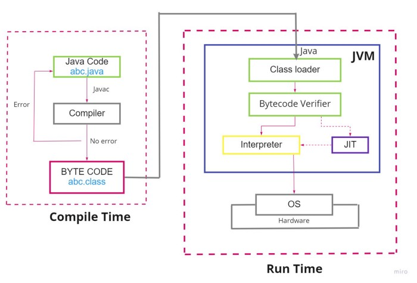
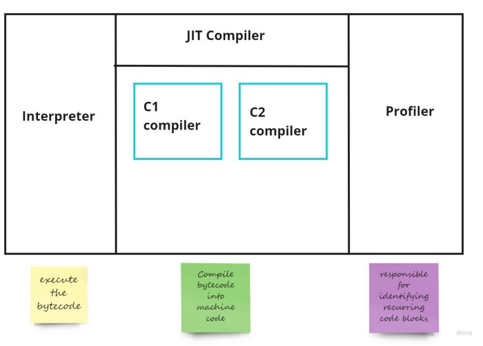

# Java Compiler


### How does a program run on a Virtual Machine?
>https://medium.com/nerd-for-tech/jit-java-just-in-time-jit-compiler-af1cc86fe53b



### Execution Engine



### Compile Levels

> https://developer.amd.com/wordpress/media/2013/12/JavaApplicationPerformanceTuningForAMDEPYC.pdf

The HotSpot JVM contains two JIT-compilers, namely the C1 (client) compiler and the C2 
(server) compiler. C1 and C2 runs within the context of the application (along with the 
application) and compiles the “hot” methods of the application at various compilation levels. 

* C1  compiles the interpreted methods (after some threshold of “hotness”) at the optimization levels, 1, 2, and 3
* C2 compiles the methods at the highest level of optimization of level 4.


### Options

> https://ionutbalosin.com/2020/01/hotspot-jvm-performance-tuning-guidelines/

 - **-XX:-TieredCompilation** 
 
 It disables the intermediate compilation tiers (Tier 1, Tier 2, and Tier 3) so that a method is either Interpreted or compiled at the maximum optimization level by C2 JIT (basically it uses only Tier 0, and Tier 4).
 
 **Note**: disabling **TieredCompilation** will (i) minimize the number of Compiler threads, (ii) simplify the compilation policy (i.e. based on method invocation and backedge counters but without detailed profiled information), and (iii) reduce the amount of JIT-compiled code, hence **minimizing CodeCache usage**. 

- **-XX:CICompilerCount**

**how many threads are available for the compiling process.**

To change this number we can use the flag "**-XX:CICompilerCount=$NUMBER**".

- **-XX:CompileThreshold**

the threshold for native compilation, in other words, how many times a method should run to be compiled into native code (tier 4).

To change this we can use the flag "**-XX:CompileThreshold=$N**".

- **-XX:+PrintCompilation**

Here is an example of the output:

```
50    1       3       java.lang.StringLatin1::hashCode (42 bytes)53    2       3       java.lang.Object::<init> (1 bytes)53    3       3       java.lang.String::isLatin1 (19 bytes)54    4       3       java.util.concurrent.ConcurrentHashMap::tabAt (22 bytes)
60    5       3       java.lang.String::charAt (25 bytes)
60    6       3       java.lang.StringLatin1::charAt (28 bytes)
60    7       3       java.lang.String::coder (15 bytes)
...
88   40     n 0       java.lang.invoke.MethodHandle::linkToSpecial(LLLLLLLL)L (native)   (static)
88   39   !   3       java.util.concurrent.ConcurrentHashMap::putVal (432 bytes)
90   41     n 0       java.lang.System::arraycopy (native)   (static)
91   42       3       java.lang.String::length (11 bytes)
...
129    3       3       java.lang.String::isLatin1 (19 bytes)   made not entrant
...
138  150     n 0       java.lang.Object::getClass (native)
```

Most lines of the compilation log have the following format:

```
**timestamp compilation_id attributes tiered_level method_name size deopt**
```

### De-optimisations
One thing that could happen is that the code gets de-optimised, which is basically like **a rollback of a previous compilation**.


## Ref

https://theboreddev.com/analysing-jit-compilation-in-jvm/


```{toctree}
java-compiler-tuning.md
```