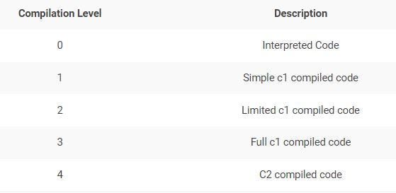
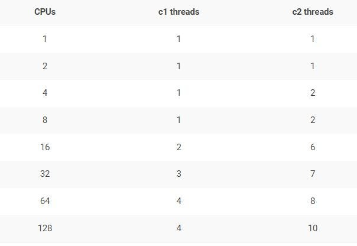

# Java Compiler Tuning


## TieredCompilation

There are four tiers of compilations:




| Tier level | Meaning                       |
| ---------- | ----------------------------- |
| 0          | The code has been interpreted |
| 1          | Simple C1 compilation         |
| 2          | Limited C1 compilation        |
| 3          | Full C1 compilation           |
| 4          | C2 compilation                |


```
-XX:+TieredCompilation
-XX:TieredStopAtLevel=N
```


If CPU spike is caused because of c2 compiler threads alone, you can turn-off c2 compilation alone. You can pass ‘-XX:TieredStopAtLevel=3’. When you pass this ‘-XX:TieredStopAtLevel’ argument with value 3, then only c1 compilation will be enabled and c2 compilation will be disabled.


When you say ‘-XX:TieredStopAtLevel=3’ then code will be compiled only upto ‘Full c1 compiled code’ level. C2 compilation will be stopped.


> https://www.baeldung.com/jvm-tiered-compilation#2-setting-thresholds-for-levels
>
> We should note that the **JVM doesn't use the generic \*CompileThreshold\* parameter when tiered compilation is enabled**.


### Disabling Tiered Compilation

> https://www.baeldung.com/jvm-tiered-compilation#1-disabling-tiered-compilation

We may disable tiered compilation by setting the *–XX:-TieredCompilation* flag*.* When we set this flag, the JVM will not transition between compilation levels. As a result, we'll need to select which JIT compiler to use: C1 or C2.

Unless explicitly specified, the JVM decides which JIT compiler to use based on our CPU. For multi-core processors or 64-bit VMs, the JVM will select C2. In order to disable C2 and only use C1 with no profiling overhead, we can apply the *-XX:TieredStopAtLevel=1* parameter.

To completely disable both JIT compilers and run everything using the interpreter, we can apply the *-Xint* flag. However, we should note that **disabling JIT compilers will have a negative impact on performance**.


### Compilation Thresholds  - 推迟或提早 触发JIT

> https://dev.to/yousef_zook/java-performance-4-working-with-the-jit-compiler-1ak4

Compilation is based on two counters in the JVM:

- the number of times the method has been called, - and the number of times any loops in the method have branched back. **Branching back** can effectively be thought of as the number of times a loop has completed execution, either because it reached the end of the loop itself or because it executed a branching statement like `continue`.


Tunings affect these thresholds. When `tiered compilation` is disabled, standard compilation is triggered by the value of the `-XX:CompileThreshold=N` flag. The default value of N is `10,000`. Changing the value of the `CompileThreshold` flag will cause the compiler to choose to compile the code sooner (or later) than it normally would have. Note, however, that although there is one flag here, the threshold is calculated by adding the sum of the back-edge loop counter plus the method entry counter.


changing the flags `-XX:Tier3InvocationThreshold=N` (default 200) to get C1 to compile a method more quickly, and `-XX:Tier4InvocationThreshold=N` (default 5000) to get C2 to compile a method more quickly. Similar flags are available for the back-edge threshold.


> https://www.oreilly.com/library/view/java-performance-the/9781449363512/ch04.html

This chapter has been somewhat vague in defining just what triggers the compilation of code. The major factor involved here is how often the code is executed; once it is executed a certain number of times, its compilation threshold is reached, and the compiler deems that it has enough information to compile the code.

There are tunings that affect these thresholds, which are discussed in this section. However, this section is really designed to give you better insight into how the compiler works (and introduce some terms). There is really only one case where the compilation thresholds might need to be tuned; that is discussed at the end of this section.

Compilation is based on two counters in the JVM: the number of times the method has been called, and the number of times any loops in the method have branched back. Branching back can effectively be thought of as the number of times a loop has completed execution, either because it reached the end of the loop itself or because it executed a branching statement like `continue`.

When the JVM executes a Java method, it checks the sum of those two counters and decides whether or not the method is eligible for compilation. If it is, the method is queued for compilation (see [Compilation Threads](https://www.oreilly.com/library/view/java-performance-the/9781449363512/ch04.html#CompilationThreads) for more details about queuing). This kind of compilation has no official name but is often called standard compilation.

But what if the method has a really long loop—or one that never exits and provides all the logic of the program? In that case, the JVM needs to compile the loop without waiting for a method invocation. So every time the loop completes an execution, the branching counter is incremented and inspected. If the branching counter has exceeded its individual threshold, then the loop (and not the entire method) becomes eligible for compilation.

This kind of compilation is called *on-stack replacement* (OSR), because even if the loop is compiled, that isn’t sufficient: the JVM has to have the ability to start executing the compiled version of the loop while the loop is still running. When the code for the loop has finished compiling, the JVM replaces the code (on-stack), and the next iteration of the loop will execute the much-faster compiled version of the code.

Standard compilation is triggered by the value of the `-XX:CompileThreshold=`*`N`* flag. The default value of `N` for the client compiler is 1,500; for the server compiler it is <mark>10,000</mark>. Changing the value of the `CompileThreshold` flag will cause the the compiler to choose to compile the code sooner (or later) than it normally would have. Note, however, that although there is one flag here, the threshold is calculated by adding the sum of the back-edge loop counter plus the method entry counter.


#### CompileThresholdScaling - 触发JIT系数

> https://docs.oracle.com/en/java/javase/17/docs/specs/man/java.html
>
```
-XX:CompileThresholdScaling=scale
```

Provides unified control of first compilation. This option controls when methods are first compiled for both the tiered and the nontiered modes of operation. The `CompileThresholdScaling` option has a floating point value between 0 and +Inf and scales the thresholds corresponding to the current mode of operation (both tiered and nontiered). 

- Setting `CompileThresholdScaling` to a value less than 1.0 results in earlier compilation while values greater than 1.0 delay compilation. 

- Setting `CompileThresholdScaling` to 0 is equivalent to disabling compilation.


```bash
bash-4.4$ java -XX:+PrintFlagsFinal cp . Main  | grep -i Threshold
     intx CompileThreshold                         = 10000                                  {pd product} {default}
   double CompileThresholdScaling                  = 1.000000                                  {product} {default}
     intx Tier3BackEdgeThreshold                   = 60000                                     {product} {default}
     intx Tier3CompileThreshold                    = 2000                                      {product} {default}
     intx Tier3InvocationThreshold                 = 200                                       {product} {default}
     intx Tier3MinInvocationThreshold              = 100                                       {product} {default}
     intx Tier4BackEdgeThreshold                   = 40000                                     {product} {default}
     intx Tier4CompileThreshold                    = 15000                                     {product} {default}
     intx Tier4InvocationThreshold                 = 5000                                      {product} {default}
     intx Tier4MinInvocationThreshold              = 600                                       {product} {default}


bash-4.4$ java -XX:+PrintFlagsFinal -XX:CompileThresholdScaling=1.5 -cp . Main | grep -i Threshold                                                                
     intx CompileThreshold                         = 15000                                  {pd product} {ergonomic}
   double CompileThresholdScaling                  = 1.500000                                  {product} {command line}
     intx Tier3BackEdgeThreshold                   = 90000                                     {product} {ergonomic}
     intx Tier3CompileThreshold                    = 3000                                      {product} {ergonomic}
     intx Tier3InvocationThreshold                 = 300                                       {product} {ergonomic}
     intx Tier3MinInvocationThreshold              = 150                                       {product} {ergonomic}
     intx Tier4BackEdgeThreshold                   = 60000                                     {product} {ergonomic}
     intx Tier4CompileThreshold                    = 22500                                     {product} {ergonomic}
     intx Tier4InvocationThreshold                 = 7500                                      {product} {ergonomic}
     intx Tier4MinInvocationThreshold              = 900                                       {product} {ergonomic}
```


## Compiler threads

> https://medium.com/@RamLakshmanan/jvm-c1-c2-compiler-thread-high-cpu-consumption-b99acc604f1d


when a method (or loop) becomes eligible for compilation, it is queued for compilation. That queue is processed by one or more background threads.

- These queues are not strictly first in, first out; methods whose invocation counters are higher have priority.
- The C1 and C2 compilers have different queues, each of which is processed by (potentially multiple) different threads.




***Fig: Default c1, c2 compiler thread count\***


You can change the compiler thread count by passing `-XX:CICompilerCount=N`  (要求 N>=2，因包括 C1 与 C2 compiler 两类 threads) JVM argument to your application.


One-third of the count you specify in ‘-XX:CICompilerCount’ will be allocated to the c1 compiler threads. Remaining thread count will be allocated to c2 compiler threads. Say suppose you are going to 6 threads (i.e., ‘-XX:CICompilerCount=6’), then 2 threads will be allocated to c1 compiler threads and 4 threads will be allocated to c2 compiler threads.


```
-XX:+UseDynamicNumberOfCompilerThreads
```

Dynamically create compiler thread up to the limit specified by `-XX:CICompilerCount`. This option is enabled by default.


```
-XX:+BackgroundCompilation
```

Enables background compilation. This option is enabled by default. To disable background compilation, specify `-XX:-BackgroundCompilation` (this is equivalent to specifying `-Xbatch`).


```
-XX:CICompilerCount=*threads*
```

Sets the number of compiler threads to use for compilation. By default, the number of compiler threads is selected automatically depending on the number of CPUs and memory available for compiled code. The following example shows how to set the number of threads to 2:

> ```
> -XX:CICompilerCount=2
> ```


### CompilerThreadPriority


```
-XX:CompilerThreadPriority=<n>
```

减少JIT编译器线程优先级

您可以使用`-XX:CompilerThreadPriority=<n>`降低JIT编译器线程的优先级。您可以在那里使用的值与操作系统有关。

在 Linux 下，就是非Nice 的值了。


> https://man7.org/linux/man-pages/man3/setpriority.3p.html
>
> ```
>   int setpriority(int which, id_t who, int nice);
> ```
>
> 
>
> https://github.com/openjdk/jdk/blob/d072c40ff175c653802796673baef47e24038891/src/hotspot/os/bsd/os_bsd.cpp#L1905
>
> ```
>  int ret = setpriority(PRIO_PROCESS, thread->osthread()->thread_id(), newpri);
> ```
>
> https://man7.org/linux/man-pages/man3/getpriority.3p.html
>
> ```
> The setpriority() function shall set the `nice` value of a process, process group, or user to  value+{NZERO}.
> 
>        Target processes are specified by the values of the which and who
>        arguments. The which argument may be one of the following values:
>        PRIO_PROCESS, PRIO_PGRP, or PRIO_USER, indicating that the who
>        argument is to be interpreted as a process ID, a process group
>        ID, or an effective user ID, respectively. A 0 value for the who
>        argument specifies the current process, process group, or user.      
> 
>        The nice value set with setpriority() shall be applied to the
>        process. If the process is multi-threaded, the nice value shall
>        affect all system scope threads in the process.
>        
>        The default nice value is {NZERO}; lower nice values shall cause
>        more favorable scheduling. While the range of valid nice values
>        is [0,{NZERO}*2-1], implementations may enforce more restrictive
>        limits. If value+{NZERO} is less than the system's lowest
>        supported nice value, setpriority() shall set the nice value to
>        the lowest supported value; if value+{NZERO} is greater than the
>        system's highest supported nice value, setpriority() shall set
>        the nice value to the highest supported value.
> ```


需要注意的是，对于非 root 用户。`-XX:CompilerThreadPriority=<n>` 需要配合 `-XX:ThreadPriorityPolicy=1` 使用，方可生效。


```
java -XX:CompilerThreadPriority=10 -XX:ThreadPriorityPolicy=1 -cp . Main

OpenJDK 64-Bit Server VM warning: -XX:ThreadPriorityPolicy=1 may require system level permission, e.g., being the root user. If the necessary permission is not possessed, changes to priority will be silently ignored.
```


#### 介绍 Linux 进程优先级 Priority 与 Nice 值

> https://www.tecmint.com/set-linux-process-priority-using-nice-and-renice-commands/

There are a total of **140** priorities and two distinct priority ranges implemented in Linux. 

- The first one is a nice value (**niceness**) which ranges from `-20` (highest priority value) to `19` (lowest priority value) and the default is `0`, this is what we will uncover in this guide. 

- The other is the real-time priority, which ranges from **1** to **99** by default, then **100** to **139** are meant for user-space.


##### Difference Between PR or PRI and NI

This, therefore, means that:

- `NI` – is the nice value, which is a user-space concept, while
- `PR` or `PRI` – is the process’s actual priority, as seen by the Linux kernel.


##### How To Calculate PR or PRI Values

```
Total number of priorities = 140
Real time priority range(PR or PRI):  0 to 99 
User space priority range: 100 to 139
```

Nice value range (NI): -20 to 19

```
PR = 20 + NI
PR = 20 + (-20 to + 19)
PR = 20 + -20  to 20 + 19
PR = 0 to 39 which is same as 100 to 139.
```


## Code cache

> https://dev.to/yousef_zook/java-performance-4-working-with-the-jit-compiler-1ak4

```
    Java HotSpot(TM) 64-Bit Server VM warning: CodeCache is full. Compiler has been disabled.
    Java HotSpot(TM) 64-Bit Server VM warning: Try increasing the code cache size using -XX:ReservedCodeCacheSize=
```


```
-XX:ReservedCodeCacheSize=N
-XX:InitialCodeCacheSize=N
-XX:CodeCacheExpansionSize
```


Resizing the cache happens in the background and doesn’t really affect performance, so setting the `ReservedCodeCacheSize` size (i.e., setting the maximum code cache size) is all that is generally needed.


In Java 11, the code cache is segmented into three parts:

- Nonmethod code
- Profiled code
- Nonprofiled code By default, the code cache is sized the same way (up to 240 MB), and you can still adjust the total size of the code cache by using the ReservedCodeCacheSize flag.

You’ll rarely need to tune these segments individually, but if so, the flags are as follows:

- `-XX:NonNMethodCodeHeapSize=N` for the nonmethod code
- `-XX:ProfiledCodeHapSize=N` for the profiled code
- `-XX:NonProfiledCodeHapSize=N` for the nonprofiled code


The “**non-method**” code heap contains non-method code such as compiler buffers and bytecode interpreters. This code type stays in the code cache forever. The code heap has a fixed size of 3 MB and the remaining code cache is distributed evenly among the profiled and non-profiled code heaps.


The “**profiled**” code heap contains lightly optimized, profiled methods with a short lifetime.


And the “**non-profiled**” code heap contains fully optimized, non-profiled methods with a potentially long lifetime.


If you are using **Java 8 or above** then the max size will be **240 megabytes** but if you disable tiered compilation with the option **-XX:-TieredCompilation**, then the default size is **48 megabytes**.


https://xmlandmore.blogspot.com/2014/08/jdk-8-revisiting-reservedcodecachesize.html


## Inspection flag

### jstat

#### jstat -compiler

```bash
~> jstat -compiler `pgrep --newest java` 1s 99999

Compiled Failed Invalid   Time   FailedType FailedMethod
   42282      1       0   267.01          1 net/bytebuddy/pool/TypePool$Default$LazyTypeDescription$GenericTypeToken$Resolution$Raw$RawAnnotatedType of
   42287      1       0   267.02          1 net/bytebuddy/pool/TypePool$Default$LazyTypeDescription$GenericTypeToken$Resolution$Raw$RawAnnotatedType of
   42287      1       0   267.02          1 net/bytebuddy/pool/TypePool$Default$LazyTypeDescription$GenericTypeToken$Resolution$Raw$RawAnnotatedType of
   42289      1       0   267.02          1 net/bytebuddy/pool/TypePool$Default$LazyTypeDescription$GenericTypeToken$Resolution$Raw$RawAnnotatedType of
```


#### jstat -printcompilation

```bash
jstat -printcompilation `pgrep --newest java` 2s 9999

Compiled  Size  Type Method
   25342     18    1 org/apache/cxf/transports/http/configuration/HTTPClientPolicy isAutoRedirect
```


### jcmd


```bash
$jcmd `pgrep --newest java` help

Compiler.CodeHeap_Analytics
Compiler.codecache
Compiler.codelist
Compiler.directives_add
Compiler.directives_clear
Compiler.directives_print
Compiler.directives_remove
Compiler.perfmap
Compiler.queue

$ jcmd `pgrep --newest java` Compiler.CodeHeap_Analytics

CodeCache overview
--------------------------------------------------------

         Reserved size :  245760 KB
        Committed size :   32064 KB
  Unallocated capacity :  214680 KB

$ jcmd `pgrep --newest java`  Compiler.queue
186174:
Current compiles: 
C2 CompilerThread0  12704       4       org.apache.cxf.jaxrs.utils.JAXRSUtils::selectResourceClass (349 bytes)

C1 compile queue:
Empty

C2 compile queue:
Empty
```


### PrintCompilation

You can pass `-XX:+PrintCompilation` JVM argument to your application. It will print details about your application’s compilation process. It will facilitate you to tune the compilation process further.


> https://julio-falbo.medium.com/understand-jvm-and-jit-compiler-part-2-cc6f26fff721

```
50    1       3       java.lang.StringLatin1::hashCode (42 bytes)
53    2       3       java.lang.Object::<init> (1 bytes)
53    3       3       java.lang.String::isLatin1 (19 bytes)
54    4       3       java.util.concurrent.ConcurrentHashMap::tabAt (22 bytes)
60    5       3       java.lang.String::charAt (25 bytes)
60    6       3       java.lang.StringLatin1::charAt (28 bytes)
60    7       3       java.lang.String::coder (15 bytes)
…
88   40     n 0       java.lang.invoke.MethodHandle::linkToSpecial(LLLLLLLL)L (native)   (static)
88   39   !   3       java.util.concurrent.ConcurrentHashMap::putVal (432 bytes)
90   41     n 0       java.lang.System::arraycopy (native)   (static)
91   42       3       java.lang.String::length (11 bytes)
...
129    3       3       java.lang.String::isLatin1 (19 bytes)   made not entrant
...
138  150     n 0       java.lang.Object::getClass (native)
```


format:

```
timestamp compilation_id attributes tiered_level method_name size deopt
```

The **timestamp** (milliseconds) here is the time after the compilation has finished (relative to 0, which is when the JVM started).

The **compilation_id** is an internal task identifier. Usually, this number will simply increase monotonically, but sometimes you can see those out of sync. This happens, normally, when we have multiple compilation threads and means that those compilation threads are running out of order (faster or slower). So, it is just a function of thread scheduling.

The **attributes field** is a string with five characters that indicate the state of the code that is being compiled. If a specific attribute applies to the given compilation, the character for that specific attribute will be printed, otherwise, blank will be printed. The characters are:

```
% - The compilation is OSR (on-stack replacement).
s - The method is synchronized.
! - The method has an exception handler.
b - Compilation occurred in blocking mode.
n - Compilation occurred for a wrapper to a native method.

made non entrant    compilation was wrong/incomplete, no future callers will use this version
made zombie         code is not in use and ready for GC
```

The first of these attributes (**%**) refers to **on-stack replacement** (**OSR**). We need to remember that JIT compilation is an asynchronous process. So, when the JVM decides that a certain block of code should be compiled, that block of code is put in a queue*. Instead of waiting for the compilation, the JVM will continue interpreting the method, and the next time the method is called, the JVM will execute the compiled version of the method (assuming the compilation has finished).


Now let’s consider a long-running loop, according to Scott Oaks, the JVM will notice that the loop itself should be compiled and will queue* that code for compilation. But that isn’t sufficient, the JVM has to have the ability to start executing the compiled version of the loop while the loop is still running — it would be inefficient to wait until the loop and enclosing method exit (which may not even happen). Hence, when the code for the loop has finished compiling, the JVM replaces the code (on the stack), and the next iteration of the loop will execute the much faster-compiled version of the code.

**This is OSR**, **that is, the code now is running in the most optimal way possible!**

**These queues are not strictly first in, first out; methods whose invocation counters are higher have priority. So even when a program starts execution and has lots of code to compile, this priority order helps ensure that the most important code will be compiled first. (This is another reason the compilation ID in the PrintCompilation output can appear out of order.)*


The next two attributes (**s** and **!**) are easy to understand. The “**s**” means that the method is synchronized and the “**!”** means that the method has an exception handler as mentioned before.

The blocking flag (**b**) will never be printed by default in current versions of Java. It indicates that the compilation did not occur in the background.

The native attribute (**n**) indicates that the JVM generated a compiled code to facilitate the call into a native method.

#### tiered_level

If tiered compilation has been disabled (with the option **-XX:-TieredCompilation**), the next field (**tiered_level**) will be blank. Otherwise, it will be a number indicating which tier has completed compilation. This number can go from 0 to 4 and the meaning is:

At tier 0, the code was not compiled, the code was just interpreted.

At tiers 1, 2, 3 the code was compiled by **C1** with different amounts of extra profiling. The most optimized of them are tier 1 since it has no profiling overhead.

At tier 4 the code is compiled by **C2**. It means that now the code was compiled at the highest possible level of compilation and was added in the code cache.


If you saw C1, C2, and deoptimization, and didn’t understand, don’t worry, I’ll explain what they are below!

There are actually 2 compilers built into the JVM called **C1 (also called Client Compiler)** and **C2 (also called Server Compiler)**.

The **C1** compiler is able to do the first **three levels of compilation**. Each is progressively more complex than the last one and the **C2** compiler is responsible to do the **fourth level**.

The JVM decides what level of compilation to apply to a given block of code based on how often it is running and how complex or time-consuming it is. **It is called “profiling” the code**, so for any method which has a number of one to three, the code has been compiled using the C1 compiler and the higher the number is, the more “profiled” the code is.


#### deoptimization


To finish, in some cases there is a message at the end of the compilation line that will indicate that some sort of **deoptimization (deopt)** has occurred, and they can be “**made not entrant**” or “**made zombie**”.

...

So, in other words, the JIT needs to re-optimize if the previous assumption was wrong, it is also called ***Deoptimization\***.


> https://blog.joda.org/2011/08/printcompilation-jvm-flag.html

The `-XX:+PrintCompilation` flag output looks something like this:

```
1  sb   java.lang.ClassLoader::loadClassInternal  (6 bytes) 	
2  b    java.lang.String::lastIndexOf  (12 bytes)
3  s!b  java.lang.ClassLoader::loadClass  (58 bytes)
```

Flags correspond to:

```
b    Blocking compiler (always set for client)	
*    Generating a native wrapper	
%    On stack replacement	
!    Method has exception handlers	
s    Synchronized method	
```

As Rajiv points on, once you find the offending method, you can tell the JVM to bypass it by creating a .hotspot_compiler file in your current working directory with an exclude statement. For example,

```
exclude java/lang/String indexOf
```

This would stop the `java.lang.String.indexOf() `method from being compiled.


So, here is my updated table of flags:

```
b    Blocking compiler (always set for client)
*    Generating a native wrapper
%    On stack replacement (where the compiled code is running)
!    Method has exception handlers
s    Method declared as synchronized
n    Method declared as native
made non entrant    compilation was wrong/incomplete, no future callers will use this version
made zombie         code is not in use and ready for GC
```

### LogCompilation

> https://julio-falbo.medium.com/understand-jvm-and-jit-compiler-part-3-556d3f21df9f

There are 2 flags that will help us to generate a file that provides us more information and these flags are **-XX:+UnlockDiagnosticVMOptions** and **-XX:+LogCompilation**.


```
-XX:+LogCompilation
```

Enables logging of compilation activity to a file named `hotspot.log` in the current working directory. You can specify a different log file path and name using the `-XX:LogFile` option.

By default, this option is disabled and compilation activity isn't logged. The `-XX:+LogCompilation` option has to be used together with the `-XX:UnlockDiagnosticVMOptions` option that unlocks diagnostic JVM options.

You can enable verbose diagnostic output with a message printed to the console every time a method is compiled by using the `-XX:+PrintCompilation` option.


> https://github.com/AdoptOpenJDK/jitwatch


### PrintCodeCache

> https://julio-falbo.medium.com/understand-jvm-and-jit-compiler-part-4-9738194ad06e


We can easily see information about our Code Cache enabling a JVM option called: **`-XX:+PrintCodeCache`**.

If you are running with **Java9+,** the output will be something similar to this:

```
CodeHeap 'non-profiled nmethods': size=120032Kb used=67Kb max_used=67Kb free=119964Kb
 bounds [0x0000000115e8f000, 0x00000001160ff000, 0x000000011d3c7000]
CodeHeap 'profiled nmethods': size=120028Kb used=248Kb max_used=248Kb free=119779Kb
 bounds [0x000000010e958000, 0x000000010ebc8000, 0x0000000115e8f000]
CodeHeap 'non-nmethods': size=5700Kb used=1045Kb max_used=1058Kb free=4654Kb
 bounds [0x000000010e3c7000, 0x000000010e637000, 0x000000010e958000]
 total_blobs=617 nmethods=211 adapters=244
 compilation: enabled
              stopped_count=0, restarted_count=0
 full_count=0
```


