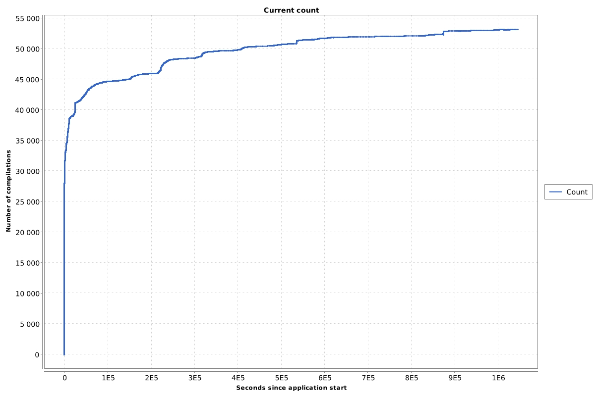
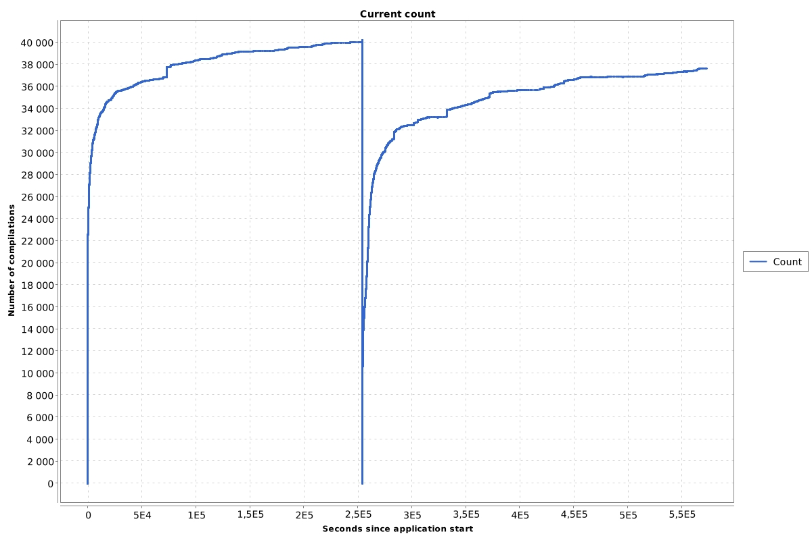

#  JVM logs - JIT logs

> From https://krzysztofslusarski.github.io/2021/08/25/monday-jit.html

## JVM logs

If you enable compilation log at debug level (`-Xlog:jit+compilation=debug`) you can find such an entries:

```
[2021-07-23T08:36:43.130+0200] 178       3       java.util.zip.ZipUtils::CENCOM (9 bytes)
[2021-07-23T08:36:43.130+0200] 183 %     4       java.util.zip.ZipFile$Source::hashN @ 2 (26 bytes)
[2021-07-23T08:36:43.329+0200] 586  s    3       java.io.ByteArrayOutputStream::write (32 bytes)
[2021-07-23T08:36:43.434+0200] 682   !   2       java.util.concurrent.ConcurrentHashMap::computeIfAbsent (576 bytes)
[2021-07-23T08:36:43.436+0200] 685     n 0       jdk.internal.misc.Unsafe::putInt (native)   
[2021-07-23T08:36:49.836+0200] 2376      3       java.util.LinkedList$ListItr::hasNext (20 bytes)   made not entrant
[2021-07-23T08:38:40.001+0200] 2376      3       java.util.LinkedList$ListItr::hasNext (20 bytes)   made zombie
```

A little explanation what these values mean:

- The first number is the **compilation id**

- Next columns contain set of

   

  flags

  :

  - *%* - means *on stack replacement*, long story short it is a compilation of a loop, not a method
  - *s* - compiled method is declared as *synchronized*
  - *!* - compiled method has at least one exception handler
  - *n* - compiled method is native
  - *b* - compilation is blocking application thread from continuing its work

- Next we have a

   

  tier

   

  number:

  - *0* - no compilation
  - *1* - a compilation done by **C1** compiler
  - *2* - a compilation done by **C1** compiler with counting of a method/loop executions
  - *3* - a compilation done by **C1** compiler with enabled profiling
  - *4* - a compilation done by **C2** compiler

- Next we have a string with a **method name** (without signature)

- Next (in brackets) we have bytecode **method size**

- At the end we may have a

   

  mark

  :

  - *made not entrant* - the compilation is no longer valid
  - *made zombie* - the compilation is no longer used by the application and can be removed

## A classic compilation of a method

```
[2021-07-23T08:36:45.801+0200] 2376       3       java.util.LinkedList$ListItr::hasNext (20 bytes)
[2021-07-23T08:36:49.835+0200] 4950       4       java.util.LinkedList$ListItr::hasNext (20 bytes)
[2021-07-23T08:36:49.836+0200] 2376       3       java.util.LinkedList$ListItr::hasNext (20 bytes)   made not entrant
[2021-07-23T08:38:40.001+0200] 2376       3       java.util.LinkedList$ListItr::hasNext (20 bytes)   made zombie
```

This is a most wanted type of compilation. The method is compiled at **tier 3**. After profiling is completed, there is a new compilation at **tier 4**. When a better compilation is done, the old compilation is marked as *made not entrant*. When the old compilation is no longer used, it is marked as *made zombie*.

## Chart

We can present number of compilation in time at chart:



When is such a log useful? Well, when your chart looks like this:



That compilation number drop in the middle is not a restart of the JVM, it is flushing the whole *code cache*. Why can such a thing happen? We will get to it :)
