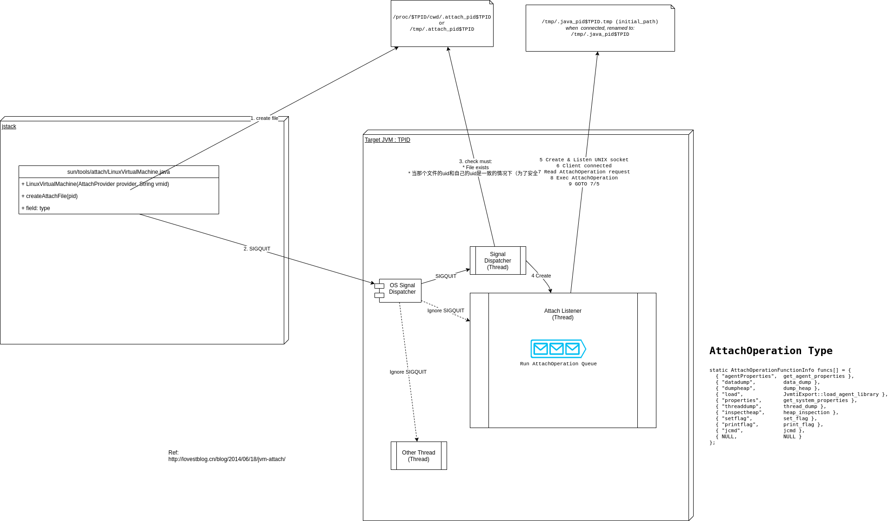

> http://lovestblog.cn/blog/2014/06/18/jvm-attach/


## Attach是什么

```log
jstack $PID

"Attach Listener" daemon prio=5 tid=0x00007fb0c6800800 nid=0x440b waiting on condition [0x0000000000000000]
   java.lang.Thread.State: RUNNABLE

"Signal Dispatcher" daemon prio=5 tid=0x00007fb0c4815800 nid=0x4d03 runnable [0x0000000000000000]
   java.lang.Thread.State: RUNNABLE
....
```


”Attach Listener”和“Signal Dispatcher”，这两个线程是我们这次要讲的Attach机制的关键，先偷偷告诉各位，其实Attach Listener这个线程在jvm起来的时候可能并没有的，后面会细说。


## Attach能做些什么

总结起来说，比如内存dump，线程dump，类信息统计(比如加载的类及大小以及实例个数等)，动态加载agent(使用过btrace的应该不陌生)，动态设置vm flag(/nfs/shareset/home/blog/content/zh/notes/java/attach)，打印vm flag，获取系统属性等，这些对应的源码(AttachListener.cpp)如下

```cpp
static AttachOperationFunctionInfo funcs[] = {
  { "agentProperties",  get_agent_properties },
  { "datadump",         data_dump },
  { "dumpheap",         dump_heap },
  { "load",             JvmtiExport::load_agent_library },
  { "properties",       get_system_properties },
  { "threaddump",       thread_dump },
  { "inspectheap",      heap_inspection },
  { "setflag",          set_flag },
  { "printflag",        print_flag },
  { "jcmd",             jcmd },
  { NULL,               NULL }
};
```

## Attach在jvm里如何实现的

前面也提到了，jvm在启动过程中可能并没有启动Attach Listener这个线程，可以通过jvm参数来启动.




# Container aware
https://github.com/apangin/jattach

# Java 10 update to support container

> https://jarekprzygodzki.dev/post/generating-jvm-memory-dumps-from-jre/

Prior to Java 10 jmap, jstack and jcmd could not attach from a process on the host machine to a JVM running inside a Docker container because of how the attach mechanism interacts with pid and mount namespaces. Java 10 [fixes this](https://bugs.openjdk.java.net/browse/JDK-8179498) by the JVM inside the container finding its PID in the root namespace and using this to watch for a JVM attachment.