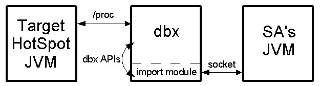

> http://openjdk.java.net/groups/hotspot/docs/Serviceability.html
> https://www.usenix.org/legacy/events/jvm01/full_papers/russell/russell_html/index.html

### Access to the Remote Process

When the SA is launched, it uses java.lang.Runtime.exec() to launch a subordinate dbx process. It sends commands to dbx to load and execute a small piece of self-contained C++ code, called an import module (Figure 4), and either to attach to the target HotSpot JVM (causing it to be suspended, as with any program being debugged) or to load a core file. The import module communicates with dbx via a small set of internal APIs and with the SA using a custom text-based protocol over a socket, and provides the SA with the above debugging primitives. The SA itself is written entirely in Java.

