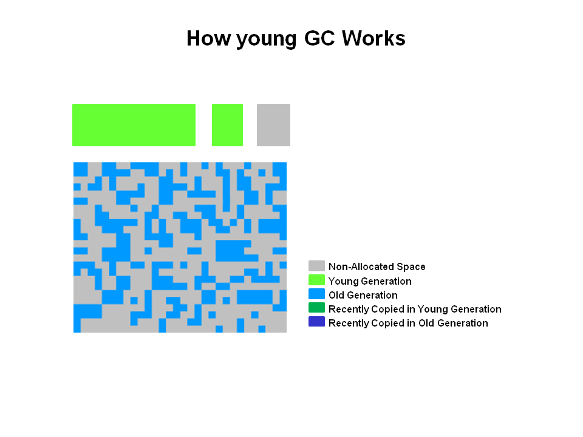
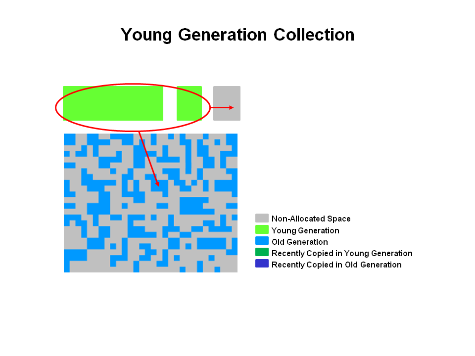
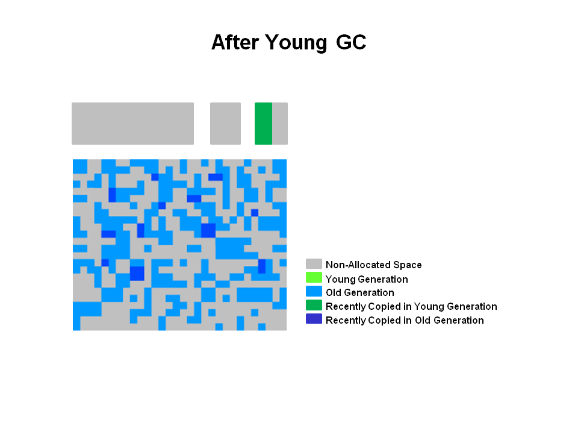
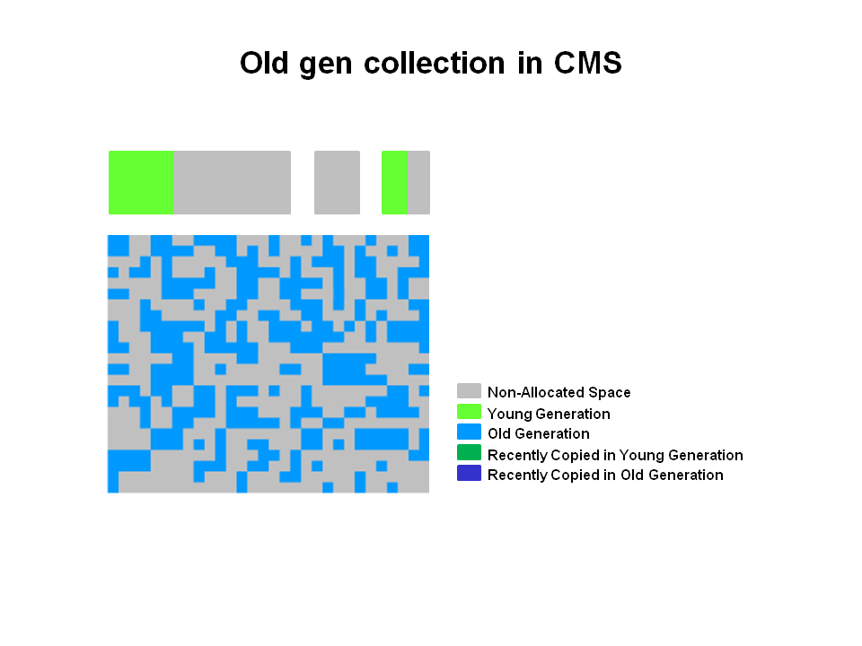
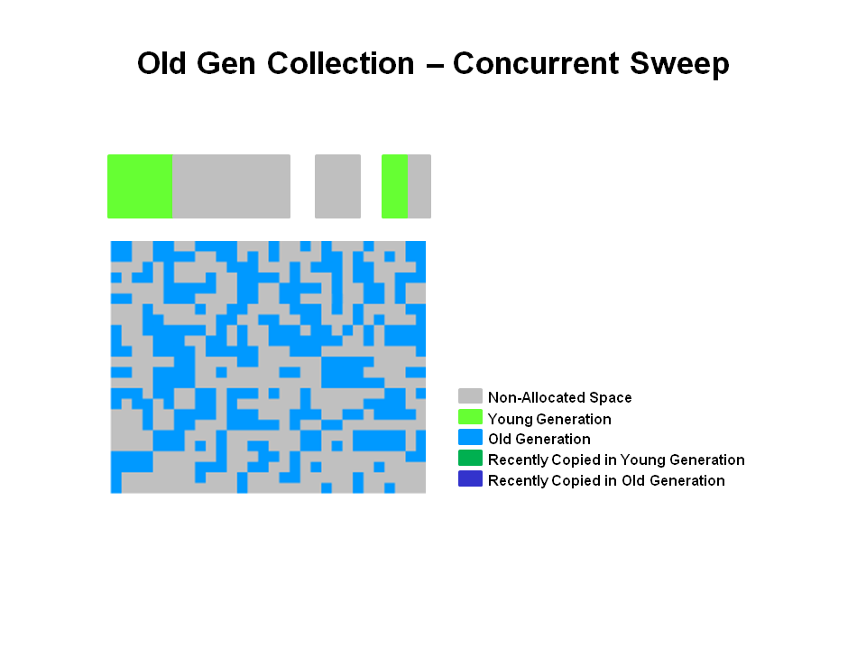
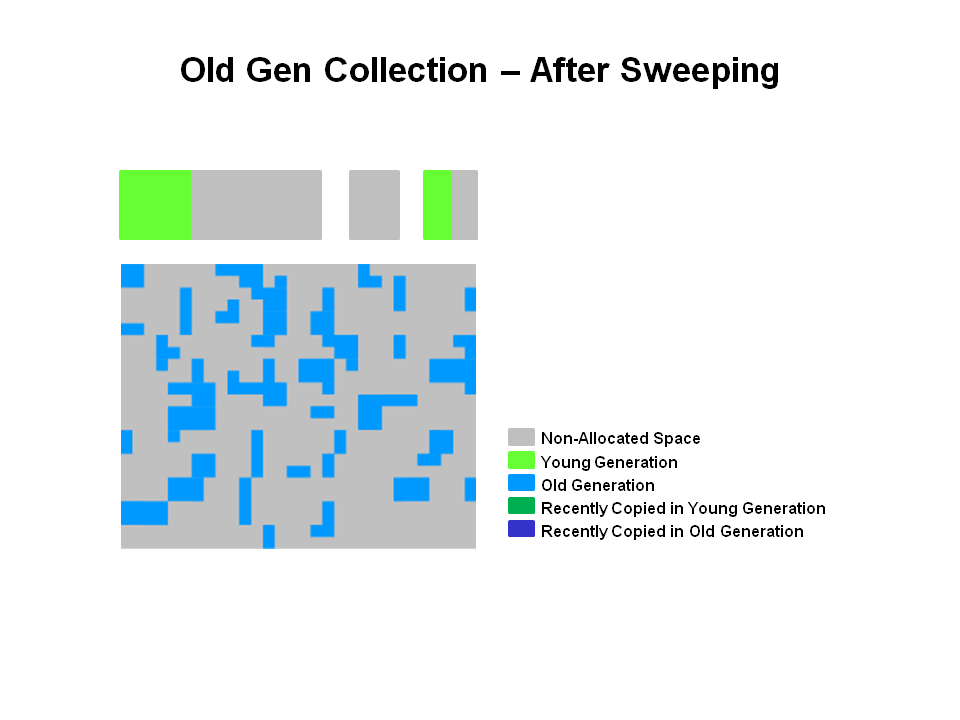

> https://www.oracle.com/technetwork/tutorials/tutorials-1876574.html


2. **How Young GC works in CMS**

The young generation is colored light green and the old generation in blue. This is what the CMS might look like if your application has been running for a while. Objects are scattered around the old generation area.



With CMS, old generation objects are deallocated in place. They are not moved around. The space is not compacted unless there is a full GC.

3. **Young Generation Collection**
Live objects are copied from the Eden space and survivor space to the other survivor space. Any older objects that have reached their aging threshold are promoted to old generation.




4. **After Young GC**
After a young GC, the Eden space is cleared and one of the survivor spaces is cleared.


Newly promoted objects are shown in dark blue on the diagram. The green objects are surviving young generation objects that have not yet been promoted to old generation.


5. **Old Generation Collection with CMS**

Two stop the world events take place: initial mark and remark. When the old generation reaches a certain occupancy rate, the CMS is kicked off.



(1) Initial mark is a short pause phase where live (reachable) objects are marked. 
(2) Concurrent marking finds live objects while the application continues to execute. Finally, in the 
(3) remark phase, objects are found that were missed during (2) concurrent marking in the previous phase.


6. **Old Generation Collection - Concurrent Sweep**

Objects that were not marked in the previous phase are deallocated in place. There is no compaction.



Note: Unmarked objects == Dead Objects

7. **Old Generation Collection - After Sweeping**

After the (4) Sweeping phase, you can see that a lot of memory has been freed up. You will also notice that no compaction has been done.




### fragmentation 

> https://blogs.oracle.com/poonam/can-young-generation-size-impact-the-application-response-times

There were ‘ParNew promotion’ and ‘CMS concurrent mode’ failures.

```
[GC: [ParNew (promotion failed): 528684K->529315K(613440K), 0.0234550 secs] [CMS: [CMS-concurrent-sweep: 2.807/3.322 secs] [Times: user=5.09 sys=0.15, real=3.32 secs]  (concurrent mode failure): 4425412K->3488043K(7707072K), 10.4466460 secs] 4954097K->3488043K(8320512K), [CMS Perm : 389189K->388749K(653084K)] , 10.4703900 secs] [Times: user=10.61 sys=0.00, real=10.46 secs]
```

Increasing the young gen size helped address all the above points:

1.  It helped in reducing the ParNew collections frequency
2.  It helped in reducing premature promotions of objects into the old gen, and that helped combat CMS fragmentation
3.  With reduced fragmentation, the rising ParNew GC times also became stable.


