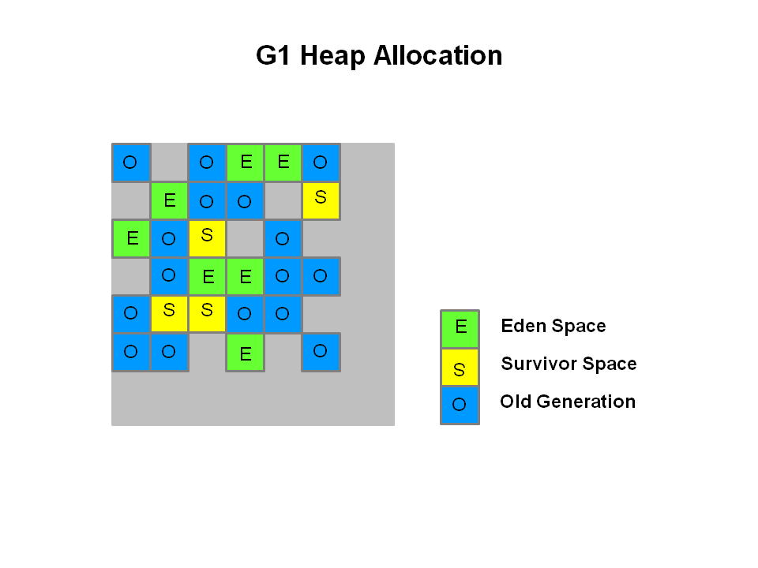
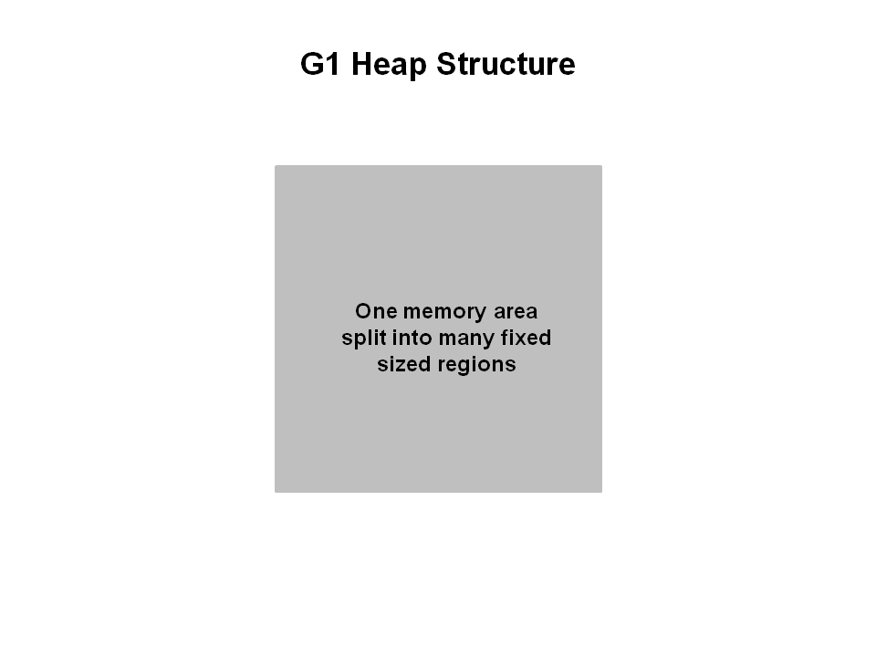
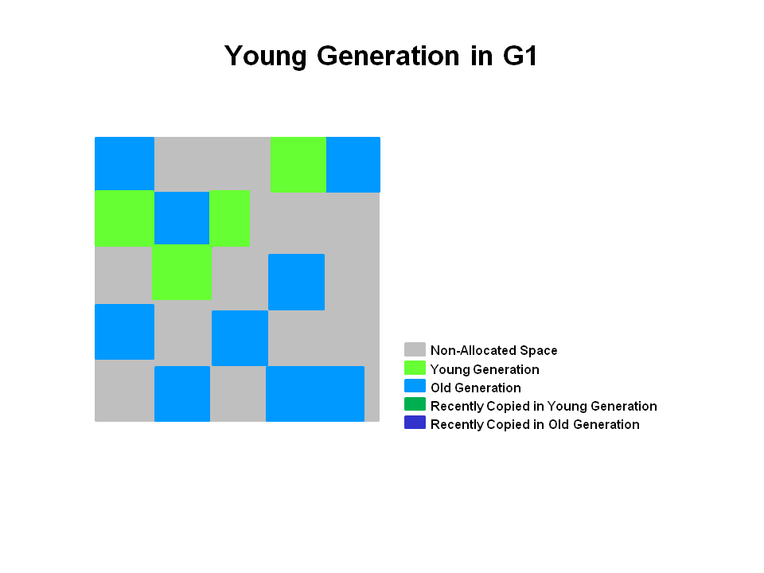
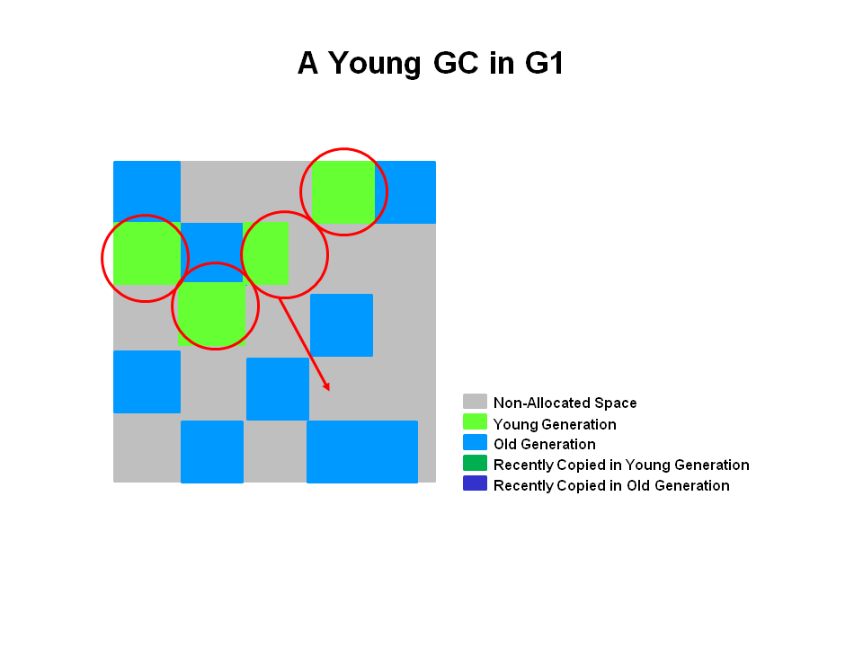
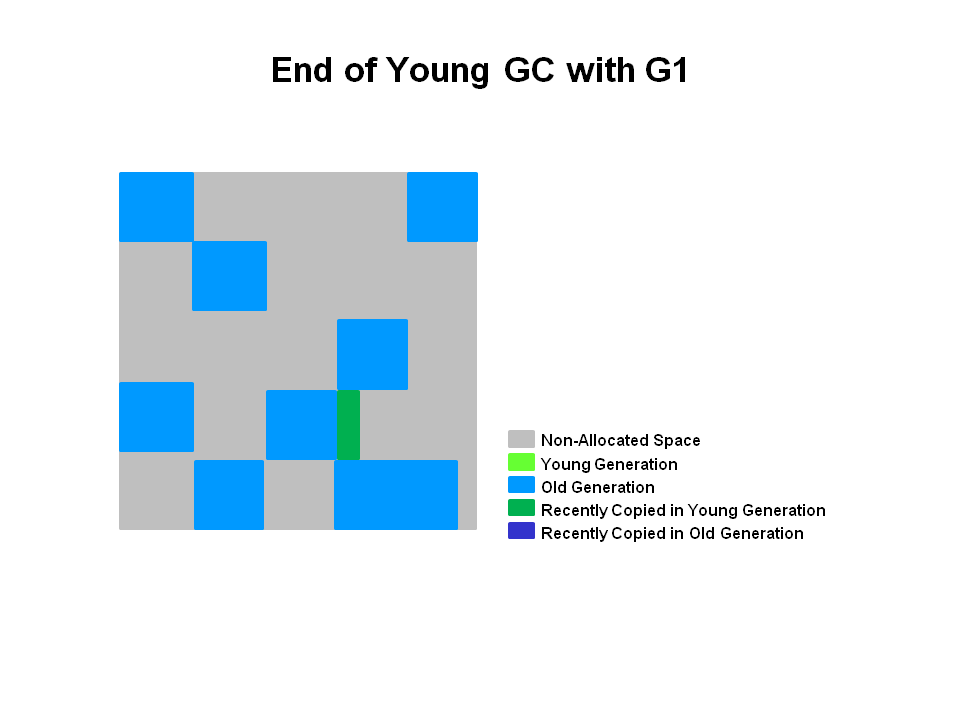
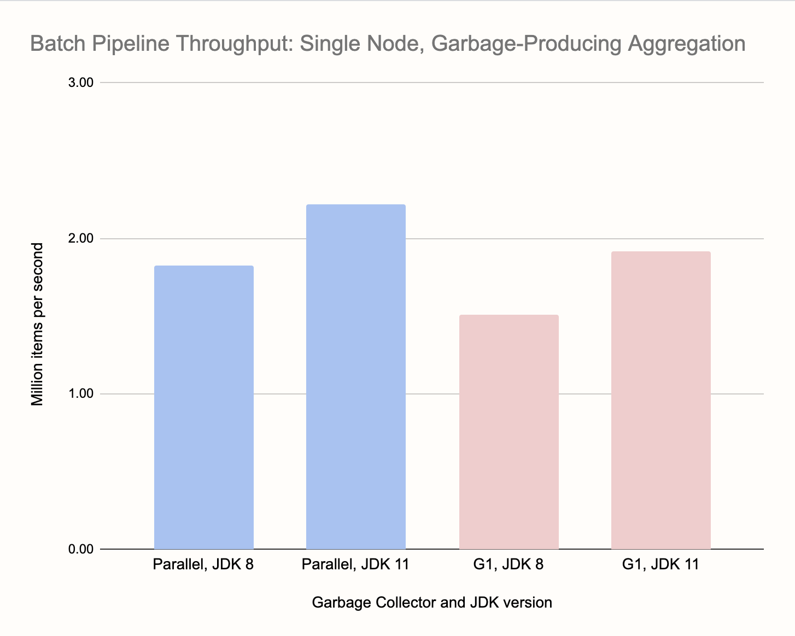

> https://www.oracle.com/technetwork/tutorials/tutorials-1876574.html

The G1 collector is designed for applications that:

-   Can operate concurrently with applications threads like the CMS collector.
-   Compact free space without lengthy GC induced pause times.
-   Need more predictable GC pause durations.
-   Do not want to sacrifice a lot of throughput performance.
-   Do not require a much larger Java heap.

G1 is planned as the long term replacement for the Concurrent Mark-Sweep Collector (CMS). Comparing G1 with CMS, there are differences that make G1 a better solution. One difference is that **G1 is a compacting collector**. G1 compacts sufficiently to completely **avoid the use of fine-grained free lists** for allocation, and instead **relies on regions**. This considerably simplifies parts of the collector, and mostly eliminates potential fragmentation issues. Also, G1 offers more predictable garbage collection pauses than the CMS collector, and allows users to specify desired pause targets.

The G1 collector takes a different approach.

The heap is partitioned into a set of equal-sized heap regions, **each a contiguous range of virtual memory. Certain region sets are assigned the same roles (eden, survivor, old) as in the older collectors**, but there is not a fixed size for them. This provides greater flexibility in memory usage.

1. G1 performs a concurrent global marking phase to determine the liveness of objects throughout the heap. 
2. After the mark phase completes, G1 knows which regions are mostly empty. **It collects in these regions first**, which usually yields a large amount of free space. This is why this method of garbage collection is called Garbage-First. 
3. As the name suggests, G1 concentrates its collection and compaction activity on the areas of the heap that are likely to be full of reclaimable objects(顾名思义，G1 将其收集和压缩活动集中在堆中可能充满可回收对象的区域), that is, garbage. G1 uses a pause prediction model to meet a user-defined pause time target and selects the number of regions to collect based on the specified pause time target.
4. The regions identified by G1 as ripe for reclamation are garbage collected using evacuation. G1 copies objects from one or more regions of the heap to a single region on the heap, and in the process both compacts and frees up memory.

> - **G1 vs CMS**
 > CMS (Concurrent Mark Sweep ) garbage collector does not do compaction. ParallelOld garbage collection performs only whole-heap compaction, which results in considerable pause times.

Note: G1 has both concurrent (runs along with application threads, e.g., refinement, marking, cleanup) and parallel (multi-threaded, e.g., stop the world) phases. Full garbage collections are still single threaded, but if tuned properly your applications should avoid full GCs.

#### G1 Footprint

If you migrate from the ParallelOldGC or CMS collector to G1, you will likely see a larger JVM process size. This is largely related to "accounting" data structures such as Remembered Sets and Collection Sets.

**Remembered Sets** or RSets track object references into a given region. There is one RSet per region in the heap. The RSet enables the parallel and independent collection of a region. The overall footprint impact of RSets is less than 5%.

**Collection Sets** or CSets the set of regions that will be collected in a GC. All live data in a CSet is evacuated (copied/moved) during a GC. Sets of regions can be Eden, survivor, and/or old generation. CSets have a less than 1% impact on the size of the JVM.

#### Recommended Use Cases for G1

The first focus of G1 is to provide a solution for users running applications that require large heaps with limited GC latency. This means heap sizes of around 6GB or larger, and stable and predictable pause time below 0.5 seconds.

Applications running today with either the CMS or the ParallelOldGC garbage collector would benefit switching to G1 if the application has one or more of the following traits.

-   Full GC durations are too long or too frequent.
-   The rate of object allocation rate or promotion varies significantly.
-   Undesired long garbage collection or compaction pauses (longer than 0.5 to 1 second)

**Note:** If you are using CMS or ParallelOldGC and your application is not experiencing long garbage collection pauses, it is fine to stay with your current collector. Changing to the G1 collector is not a requirement for using the latest JDK.

## The G1 Garbage Collector Step by Step

### G1 Young GC

**G1 Heap Structure**

The heap is one memory area split into many fixed sized regions.

Region size is chosen by the JVM at startup. The JVM generally targets around 2000 regions varying in size from 1 to 32Mb.

**G1 Heap Allocation**
In reality, these regions are mapped into logical representations of Eden, Survivor, and old generation spaces.

The colors in the picture shows which region is associated with which role. Live objects are evacuated (i.e., copied or moved) from one region to another. Regions are designed to be collected in parallel with or without stopping all other application threads.

As shown regions can be allocated into Eden, survivor, and old generation regions. In addition, there is a fourth type of object known as `Humongous` regions. These regions are designed to hold **objects that are 50% the size of a standard region or larger**. They are stored as a set of contiguous regions. Finally the last type of regions would be the unused areas of the heap.

Note: At the time of this writing, collecting humongous objects has not been optimized. Therefore, you should avoid creating objects of this size.

**Young Generation in G1**
The heap is split into approximately 2000 regions. Minimum size is 1Mb and maximum size is 32Mb. Blue regions hold old generation objects and green regions hold young generation objects.

Note that the regions are not required to be contiguous like the older garbage collectors.

**A Young GC in G1**

Live objects are evacuated (i.e., copied or moved) to one or more survivor regions. If the aging threshold is met, some of the objects are promoted to old generation regions.

This is a stop the world (STW) pause. Eden size and survivor size is calculated for the next young GC. Accounting information is kept to help calculate the size. Things like the pause time goal are taken into consideration.

This approach makes it very easy to resize regions, making them bigger or smaller as needed.

**End of a Young GC with G1**

Live objects have been evacuated to survivor regions or to old generation regions.

-   The heap is a single memory space split into regions.
-   Young generation memory is composed of a set of non-contiguous regions. This makes it easy to resize when needed.
-   Young generation garbage collections, or young GCs, are stop the world events. All application threads are stopped for the operation.
-   The young GC is done in parallel using multiple threads.
-   Live objects are copied to new survivor or old generation regions.

### G1 Old Generation Collection

> https://www.oracle.com/technetwork/tutorials/tutorials-1876574.html

Like the CMS collector, the G1 collector is designed to be a low pause collector for old generation objects. 

#### Summary of Old Generation GC

In summary, there are a few key points we can make about the G1 garbage collection on the old generation.

-   Concurrent Marking Phase

    -   Liveness information is calculated concurrently while the application is running.
    -   This liveness information identifies which regions will be best to reclaim during an evacuation pause.
    -   There is no sweeping phase like in CMS.

-   Remark Phase

    -   Uses the Snapshot-at-the-Beginning (SATB) algorithm which is much faster then what was used with CMS.
    -   Completely empty regions are reclaimed.

-   Copying/Cleanup Phase

    -   Young generation and old generation are reclaimed at the same time.
    -   Old generation regions are selected based on their liveness.

## Options

**`-XX:+UseG1GC`** - Tells the JVM to use the G1 Garbage collector.

**-XX:MaxGCPauseMillis=200** - Sets a target for the maximum GC pause time. This is a soft goal, and the JVM will make its best effort to achieve it. Therefore, the pause time goal will sometimes not be met. The default value is 200 milliseconds.

**-XX:InitiatingHeapOccupancyPercent=45** - Percentage of the (entire) heap occupancy to start a concurrent GC cycle. It is used by G1 to trigger a concurrent GC cycle based on the occupancy of the entire heap, not just one of the generations. A value of 0 denotes 'do constant GC cycles'. The default value is 45 (i.e., 45% full or occupied).

**What is an Evacuation Failure?**

A promotion failure that happens when a JVM runs out of heap regions during the GC for either survivors and promoted objects. The heap can't expand because it is already at max. This is indicated in the GC logs when using `-XX:+PrintGCDetails` by **`to-space overflow`**. This is expensive!

-   GC still has to continue so space has to be freed up.
-   Unsuccessfully copied objects have to be tenured in place.
-   Any updates to RSets of regions in the CSet have to be regenerated.
-   All of these steps are expensive.

**How to avoid Evacuation Failure**

To avoid evacuation failure, consider the following options.

-   Increase heap size

-   Increase the **`-XX:G1ReservePercent=n`**, the default is 10.
-   G1 creates a false ceiling by trying to leave the reserve memory free in case more 'to-space' is desired.

-   Start the marking cycle earlier
-   Increase the number of marking threads using the **`-XX:ConcGCThreads=n`** option.

| Option and Default Value | Description |
| --- |  --- |
| -XX:+UseG1GC | Use the Garbage First (G1) Collector |
| -XX:MaxGCPauseMillis=n | Sets a target for the maximum GC pause time. This is a soft goal, and the JVM will make its best effort to achieve it. |
| -XX:InitiatingHeapOccupancyPercent=n | Percentage of the (entire) heap occupancy to start a concurrent GC cycle. It is used by GCs that trigger a concurrent GC cycle based on the occupancy of the entire heap, not just one of the generations (e.g., G1). A value of 0 denotes 'do constant GC cycles'. The default value is 45. |
| -XX:NewRatio=n | Ratio of new/old generation sizes. The default value is 2. |
| -XX:SurvivorRatio=n | Ratio of eden/survivor space size. The default value is 8. |
| -XX:MaxTenuringThreshold=n | Maximum value for tenuring threshold. The default value is 15. |
| -XX:ParallelGCThreads=n | Sets the number of threads used during parallel phases of the garbage collectors. The default value varies with the platform on which the JVM is running. |
| -XX:ConcGCThreads=n | Number of threads concurrent garbage collectors will use. The default value varies with the platform on which the JVM is running. |
| -XX:G1ReservePercent=n | Sets the amount of heap that is reserved as a false ceiling to reduce the possibility of promotion failure. The default value is 10. |
| -XX:G1HeapRegionSize=n | With G1 the Java heap is subdivided into uniformly sized regions. This sets the size of the individual sub-divisions. The default value of this parameter is determined ergonomically based upon heap size. The minimum value is 1Mb and the maximum value is 32Mb. |

## Logging GC with G1
> https://www.oracle.com/technetwork/tutorials/tutorials-1876574.html
> https://blogs.oracle.com/poonam/understanding-g1-gc-logs

#### G1 on Java 8 is bad
> https://hazelcast.com/blog/performance-of-modern-java-on-data-heavy-workloads-part-1/

* On modern JDK versions, the G1 is one monster of a collector. It handles heaps of dozens of GB with ease (we tried 60 GB), keeping maximum GC pauses within 200 ms. Under extreme pressure it doesn’t show brittleness with catastrophic failure modes. Instead the Full GC pauses rise into the low seconds range. Its Achilles’ heel is the upper bound on the GC pause in favorable low-pressure conditions, which we couldn’t push lower than 20-25 ms.

* JDK 8 is an antiquated runtime. The default Parallel collector enters huge Full GC pauses and the G1, although having less frequent Full GCs, is stuck in an old version that uses just one thread to perform it, resulting in even longer pauses. Even on a moderate heap of 12 GB, the pauses were exceeding 20 seconds for Parallel and a full minute for G1. The ConcurrentMarkSweep collector is strictly worse than G1 in all scenarios, and its failure mode are multi-minute Full GC pauses.

> https://jet-start.sh/blog/2020/06/09/jdk-gc-benchmarks-part2

## Benchmark
> https://jet-start.sh/blog/2020/06/23/jdk-gc-benchmarks-rematch

