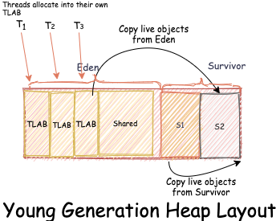
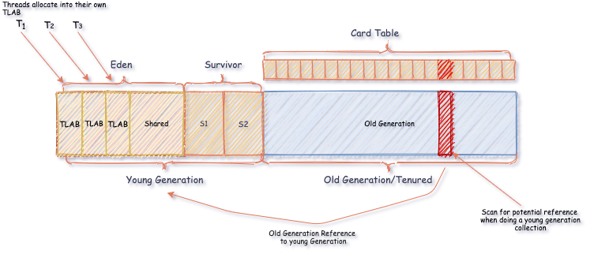
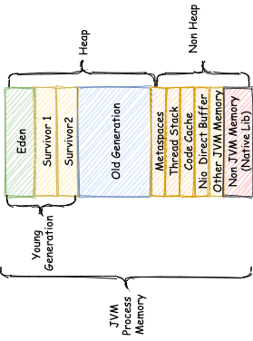

> http://abiasforaction.net/understanding-jvm-garbage-collection-part-3/

## Young Generation
To be precise, all newly created objects are allocated space in Eden. At startup, both of the survivor spaces are empty. At any given point in time, one of the survivor spaces (S1, S2) is always empty. During a minor GC, live objects are relocated from Eden and the “populated survivor space” into the “empty survivor space”. The GC maintains a counter called “age” for every object. An object’s age is incremented every time the object is moved from one heap area to another. Each object in the Java heap has a header. This header tracks the object age, i.e. the number of GC cycles an object has survived. The object age is tracked by utilising a few of the bits of this header. Objects are copied between survivor spaces a certain number of times before being eventually promoted to the Old Generation space. The process of promoting an object to the old generation is called aging. The actual threshold/age can is tuneable via the `-XX:+MaxTenuringThreshold`. By default, this value is 15 GC cycles.

The garbage collection of the young generation is called a minor garbage collection or Minor GC. A Minor GC is triggered when the JVM is unable to allocate new objects. Typically minor GC’s employ a Mark and Copy GC algorithm as opposed to a Mark, Sweep, and Compact algorithm. After a minor GC, the entire Eden space is empty. All live objects from the Eden space are moved to a survivor space. This also holds true for the populated survivor space. All objects from one of the survivor spaces are cleared and copied into the other space, which was previously empty. During a Minor GC, the Old Generation is not collect. Minor GC’s necessitate stop-the-world pauses.

* TLAB

Memory allocation poses concurrency problems as multiple application threads can compete for the same memory area. Locking memory segments/areas during allocation is a simple solution. Locking, although simple, has the potential to severely slow down memory allocation. Eden is essentially a shared mutable state that multiple application threads are competing for. Efficiently managing Eden is a must to ensure quick memory allocation. Thread Local Allocation Buffer (TLAB) to the rescue. Eden is split into sub-areas called (TLAB). Every thread is assigned a TLAB. Each thread allocates memory into its own TLAB. Since each thread only allocates into its own TLAB, memory allocation takes place without an expensive synchronisation penalty. Allocating into a TLAB is as simple as allocating memory and bumping a pointer. If allocation inside a particular TLAB fails, the allocation is attempted in the shared Eden space. **Allocation in the shared space is slower as this allocation needs to be synchronised.** If the shared Eden space does not have enough space, then a minor GC is triggered, i.e. GC on the Young Generation. If the GC fails to free sufficient free memory inside Eden, the object is allocated in the Old Generation.

## Old Generation

* `Full GC` vs `Major GC`
The term full GC and major GC are a source of confusion. Although there are is no formal definition, a full GC refers to cleaning the entire heap while a major GC just refers to cleaning tenured. A full GC is both a minor and major garbage collection. The JVM reports every Major Collection as Full GC.[^6]. This is because a major GC is triggered as a result of a minor GC. When the heap is full, a minor GC is triggered. If the minor GC cannot find enough space in tenured, it triggers a major GC, i.e., a full GC.

* Card table

Generally, a **Write barrier + card-table** are used to track potential old-generation to young generation references. Cards tables are populated using a write barrier. Every time an old generation object is mutated, a write barrier is used to update the card table. GC records the old to young generation references with the help of the card table. A card table is a bitmap that spans the entire old generation. When a potential young generation reference is created, the associated bit is flipped. A flipped bit indicates the need for the young generation to be scanned for potential references.

