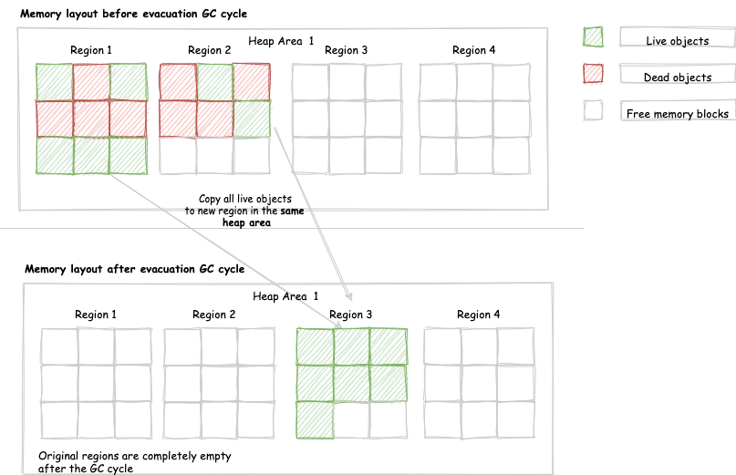

> http://abiasforaction.net/understanding-jvm-garbage-collection-part-1/

## GC Phases
> http://abiasforaction.net/understanding-jvm-garbage-collection-part-2/

* Mark
* Sweep
* compaction phase

-   **Mark Phase** -- The mark phase involves tracing the entire heap for live objects. The JVM does the following during the mark phase:
    -   The GC holds a pointer to every object allocated on the heap, known as the "allocation list", aka "ordinary object pointer (oop) table". Garbage collection iterates through every pointer in the allocation list and clears the mark bit, i.e. makes them eligible for collection.
    -   Find all live objects by navigating from their corresponding GC root and setting the mark bit.
-   **Sweep Phase** -- The sweep phase identifies dead objects by:
    -   Looping through the allocation list again
        -   Free memory where the mark bit is clear
        -   Removing identified dead objects from the allocation list.

-   **compaction phase** -- The above two phases by themselves will leave memory fragmented. In order to remove fragmentation, a number of GC algorithms have a compaction phase. This phase relocates objects, so that allocated memory is contiguous. Since objects are relocated in memory all pointers/references to that object are also updated.

## GC algorithms attributes

GC algorithms employ various variations to the above three steps depending on what they are trying to achieve. Popular variations of these phases are:

* Mark Sweep 
* Mark Sweep And Compact
* Mark and Copy aka Copying Collectors

### Mark Sweep
There is no memory movement to build contiguous memory blocks. The natural consequence of this approach is memory fragmentation. The **CMS collector** is an excellent example of a GC algorithm that only employs the mark and sweep phases

### Mark Sweep And Compact
The **SerialGC and ParallelGC** are good examples of collectors that use the Mark, Sweep, and Compact phases.

### Mark and Copy aka Copying Collectors
Both the mark and copy happen during the marking phase, i.e. copying live objects as they are encountered. The entire GC cycle can take place in a single tracing pass. This makes it a good fit for sparsely populated heaps(人烟稀少的堆).

### Mark and Compact aka Evacuating Collectors 

vs `Mark-and-copy` :

The mark and compact variations omit the sweep phase. Instead of removing dead objects (sweeping) live objects are moved into a contiguous heap area aka regions. This strategy seems very similar to the mark-and-copy variation. **The main difference is that mark-and-copy targets a different memory region and empties the current region. The Mark and Compact target’s the same memory region.**  

Mark-and-copy is designed to work on sparsely populated heaps. In contrast, mark-and-compact is designed to suit any kind of heap. The diagram below illustrates an evacuating collectors memory layout before and after a GC cycle.

The key thing to notice is that an evacuating collector is moving objects in the same heap area. The heap is divided into regions and objects are moved from one region to another.