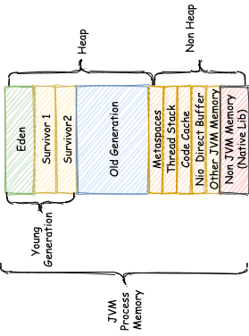

> http://abiasforaction.net/understanding-jvm-garbage-collection-part-4/

* **Mutation/Mutating Thread/Application Threads**: GC literature often uses the term **mutating threads**. Mutating threads refers to application thread that is changing object references. A mutating thread is a thread that is performing the mutation, i.e. modifying object references and thus modifying the object graph. The mutation rate is the rate at which references are updated in memory. GC literature also refers to these threads as application threads.

* **Safe point**

Safe point’s are used in a number of situations, i.e., not just GC. These include:

-   GC pauses
-   Code deoptimisation
-   Flushing code cache
-   Hot swapping of classes.
-   During various debug operation

* **Time to Safe point** -- The time taken for all application threads to come to a stop is known as **Time To Safe point (TTSP)**. It is the difference between when the safe point call is issued and when the application threads come to a halt.

-   **Moving Collectors** -- Moving collectors move objects into new areas and update all references to an object. This happens after a GC cycle. A **non-moving collector** will leave all live objects in the same memory location. This often leads to memory fragmentation. There are two types of moving collectors:

    -   **Evacuating/Copying Collector** -- A evacuating collector is a type of moving collector. An evacuating GC is one where the memory region collected is left completely empty. All live objects are moved to another memory region. Evacuating collectors perform well since there is no memory compaction overhead. Evacuating collectors naturally defragment memory.
    -   **Compacting Collector** -- A compacting collector is also a type of moving collector. The main goal of a compacting collector is to eliminate memory fragmentation. A compacting GC eliminates memory fragmentation by ensuring that all allocated memory is arranged in a single contiguous region at the end of a GC cycle.

-   **Incremental Collector** -- Incremental GC performs a single GC cycle in phases. Incremental GC's interleave a GC cycle in favour of application progress. Incremental GC's run for a specified period doing part of the GC work. Incremental collectors may pause due to various conditions. The collector could terminate due to numerous reasons such as a time budget or a higher priority GC phase that needs carrying out. Incremental collectors would have done some productive work in the allocated time. This is in contrast to a phase that needs to be fully complete for it to have been productive.

