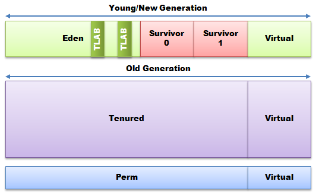

# Java Garbage Collection Distilled


> https://mechanical-sympathy.blogspot.com/2013/07/java-garbage-collection-distilled.html


### Java Garbage Collection Distilled

Serial, Parallel, Concurrent, CMS, G1, Young Gen, New Gen, Old Gen, Perm Gen, Eden, Tenured, Survivor Spaces, Safepoints, and the hundreds of JVM startup flags. Does this all baffle you when trying to tune the garbage collector while trying to get the required throughput and latency from your Java application? If it does then do not worry, you are not alone. Documentation describing garbage collection feels like man pages for an aircraft. Every knob and dial is detailed and explained but nowhere can you find a guide on how to fly. This article will attempt to explain the tradeoffs when choosing and tuning garbage collection algorithms for a particular workload.

The focus will be on Oracle Hotspot JVM and OpenJDK collectors as those are the ones in most common usage. Towards the end other commercial JVMs will be discussed to illustrate alternatives.

**The Tradeoffs**

Wise folk keep telling us, *“You do not get something for nothing”*. When we get something we usually have to give up something in return. When it comes to garbage collection we play with 3 major variables that set targets for the collectors:

1. **Throughput:** The amount of work done by an application as a ratio of time spent in GC. Target throughput with ‑XX:GCTimeRatio=99 ; 99 is the default equating to 1% GC time.
2. **Latency:** The time taken by systems in responding to events which is impacted by pauses introduced by garbage collection. Target latency for GC pauses with ‑XX:MaxGCPauseMillis=<n>.
3. **Memory:** The amount of memory our systems use to store state, which is often copied and moved around when being managed. The set of active objects retained by the application at any point in time is known as the Live Set. Maximum heap size –Xmx<n> is a tuning parameter for setting the heap size available to an application.

**Note:** Often Hotspot cannot achieve these targets and will silently continue without warning, having missed its target by a great margin.

Latency is a distribution across events. It may be acceptable to have an increased average latency to reduce the worst-case latency, or make it less frequent. We should not interpret the term “real-time” to mean the lowest possible latency; rather real-time refers to having deterministic latency regardless of throughput.

For some application workloads, throughput is the most important target. An example would be a long running batch-processing job; it does not matter if a batch job is occasionally paused for a few seconds while garbage collection takes place, as long as the overall job can be completed sooner.

For virtually all other workloads, from human facing interactive applications to financial trading systems, if a system goes unresponsive for anything more than a few seconds or even milliseconds in some cases, it can spell disaster. In financial trading it is often worthwhile to trade off some throughput in return for consistent latency. We may also have applications that are limited by the amount of physical memory available and have to maintain a footprint, in which case we have to give up performance on both latency and throughput fronts.

Tradeoffs often play out as follows:

- To a large extent the cost of garbage collection, as an amortized cost, can be reduced by providing the garbage collection algorithms with more memory.
- The observed worst-case latency-inducing pauses due to garbage collecting can be reduced by containing the live set and keeping the heap size small.
- The frequency with which pauses occur can be reduced by managing the heap and generation sizes, and by controlling the application’s object allocation rate.
- The frequency of large pauses can be reduced by concurrently running the GC with the application, sometimes at the expense of throughput.

**Object Lifetimes**

Garbage collection algorithms are often optimised with the expectation that most objects live for a very short period of time, while relatively few live for very long. In most applications, objects that live for a significant period of time tend to constitute a very small percentage of objects allocated over time. In garbage collection theory this observed behavior is often known as “*infant mortality*” or the “*weak generational hypothesis*”. For example, loop Iterators are mostly short lived whereas static Strings are effectively immortal.

Experimentation has shown that generational garbage collectors can usually support an order-of-magnitude greater throughput than non-generational collectors do, and thus are almost ubiquitously used in server JVMs. By separating the generations of objects, we know that a region of newly allocated objects is likely to be very sparse for live objects. Therefore a collector that scavenges for the few live objects in this new region and copies them to another region for older objects can be very efficient. Hotspot garbage collectors record the age of an object in terms of the number of GC cycles survived.

**Note:** If your application consistently generates a lot of objects that live for a fairly long time then expect your application to be spending a significant portion of its time garbage collecting, and expect to be spending a significant portion of your time tuning the Hotspot garbage collectors. This is due to the reduced GC efficiency that happens when the generational “filter” is less effective, and resulting cost of collecting the longer living generations more frequently. Older generations are less sparse, and as a result the efficiency of older generation collection algorithms tends to be much lower. Generational garbage collectors tend to operate in two distinct collection cycles: Minor collections, when short-lived objects are collected, and the less frequent Major collections, when the older regions are collected.

**Stop-The-World Events**

The pauses that applications suffer during garbage collection are due to what are known as stop-the-world events. For garbage collectors to operate it is necessary, for practical engineering reasons, to periodically stop the running application so that memory can be managed. Depending on the algorithms, different collectors will stop-the-world at specific points of execution for varying durations of time. To bring an application to a total stop it is necessary to pause all the running threads. Garbage collectors do this by signaling the threads to stop when they come to a “*safepoint*”, which is a point during program execution at which all GC roots are known and all heap object contents are consistent. Depending on what a thread is doing it may take some time to reach a safepoint. Safepoint checks are normally performed on method returns and loop back edges, but can be optimized away in some places making them more dynamically rare. For example, if a thread is copying a large array, cloning a large object, or executing a monotonic counted loop with a finite bound, it may be many milliseconds before a safepoint is reached. Time To Safepoint (TTSP) is an important consideration in low-latency applications. This time can be surfaced by enabling the ‑XX:+PrintGCApplicationStoppedTime flag in addition to the other GC flags.

**Note:** For applications with a large number of running threads, when a stop-the-world event occurs a system will undergo significant scheduling pressure as the threads resume when released. Therefore algorithms with less reliance on stop-the-world events can potentially be more efficient.

**Heap Organisation in Hotspot**

To understand how the different collectors operate it is best to explore how the Java heap is organised to support generational collectors.

*Eden* is the region where most objects are initially allocated. The *survivor* spaces are a temporary store for objects that have survived a collection of the Eden space. Survivor space usage will be described when minor collections are discussed. Collectively Eden and the survivor spaces are known as the *“young”* or *“new”* generation.

Objects that live long enough are eventually promoted to the *tenured* space.

The *perm* generation is where the runtime stores objects it “knows” to be effectively immortal, such as Classes and static Strings. Unfortunately the common use of class loading on an ongoing basis in many applications makes the motivating assumption behind the perm generation wrong, i.e. that classes are immortal. In Java 7 interned Strings were moved from *permgen* to tenured, and from Java 8 the perm generation is no more and will not be discussed in this article. Most other commercial collectors do not use a separate perm space and tend to treat all long living objects as tenured.

**Note:** The Virtual spaces allow the collectors to adjust the size of regions to meet throughput and latency targets. Collectors keep statistics for each collection phase and adjust the region sizes accordingly in an attempt to reach the targets.

**Object Allocation**

To avoid contention each thread is assigned a Thread Local Allocation Buffer (TLAB) from which it allocates objects. Using TLABs allows object allocation to scale with number of threads by avoiding contention on a single memory resource. Object allocation via a TLAB is a very cheap operation; it simply bumps a pointer for the object size which takes roughly 10 instructions on most platforms. Heap memory allocation for Java is even cheaper than using malloc from the C runtime.


[](https://4.bp.blogspot.com/-7aT-vEsf1ck/UeV-q1u2qUI/AAAAAAAAAIs/9PK5-OpEL5I/s1600/Generations.png)

**Note:** Whereas individual object allocation is very cheap, the rate at which *minor* collections must occur is directly proportional to the rate of object allocation.

When a TLAB is exhausted a thread simply requests a new one from the Eden space. When Eden has been filled a minor collection commences.

Large objects (-XX:PretenureSizeThreshold=<n>) may fail to be accommodated in the young generation and thus have to be allocated in the old generation, e.g. a large array. If the threshold is set below TLAB size then objects that fit in the TLAB will not be created in the old generation. The new G1 collector handles large objects differently and will be discussed later in its own section.

**Minor Collections**

A minor collection is triggered when Eden becomes full. This is done by copying all the live objects in the new generation to either a survivor space or the tenured space as appropriate. Copying to the tenured space is known as promotion or tenuring. Promotion occurs for objects that are sufficiently old (– XX:MaxTenuringThreshold=<n>), or when the survivor space overflows.

*Live* objects are objects that are reachable by the application; any other objects cannot be reached and can therefore be considered dead. In a minor collection, the copying of live objects is performed by first following what are known as *GC Roots*, and iteratively copying anything reachable to the survivor space. GC Roots normally include references from application and JVM-internal static fields, and from thread stack-frames, all of which effectively point to the application’s reachable object graphs.

In generational collection, the GC Roots for the new generation’s reachable object graph also include any references from the old generation to the new generation. These references must also be processed to make sure all reachable objects in the new generation survive the minor collection. Identifying these cross-generational references is achieved by use of a “*card table*”. The Hotspot card table is an array of bytes in which each byte is used to track the potential existence of cross-generational references in a corresponding 512 byte region of the old generation. As references are stored to the heap, “store barrier” code will mark cards to indicate that a potential reference from the old generation to the new generation may exist in the associated 512 byte heap region. At collection time, the card table is used to scan for such cross-generational references, which effectively represent additional GC Roots into the new generation. Therefore a significant fixed cost of minor collections is directly proportional to the size of the old generation.

There are two survivor spaces in the Hotspot new generation, which alternate in their “*to-space*” and “*from-space*” roles. At the beginning of a minor collection, the to-space survivor space is always empty, and acts as a target copy area for the minor collection. The previous minor collection’s target survivor space is part of the from-space, which also includes Eden, where live objects that need to be copied may be found.

The cost of a minor GC collection is usually dominated by the cost of copying objects to the survivor and tenured spaces. Objects that do not survive a minor collection are effectively free to be dealt with. The work done during a minor collection is directly proportional to the number of live objects found, and not to the size of the new generation. The total time spent doing minor collections can be almost be halved each time the Eden size is doubled. Memory can therefore be traded for throughput. A doubling of Eden size will result in an increase in collection time per-collection cycle, but this is relatively small if both the number of objects being promoted and size of the old generation is constant.

**Note:** In Hotspot minor collections are stop-the-world events. This is rapidly becoming a major issue as our heaps get larger with more live objects. We are already starting to see the need for concurrent collection of the young generation to reach pause-time targets.

**Major Collections**

Major collections collect the *old* generation so that objects can be promoted from the *young* generation. In most applications, the vast majority of program state ends up in the old generation. The greatest variety of GC algorithms exists for the old generation. Some will compact the whole space when it fills, whereas others will collect *concurrently* with the application in an effort to prevent it from filling up.

The old generation collector will try to predict when it needs to collect to avoid a promotion failure from the young generation. The collectors track a fill threshold for the old generation and begin collection when this threshold is passed. If this threshold is not sufficient to meet promotion requirements then a “*FullGC*” is triggered. A FullGC involves promoting all live objects from the young generations followed by a collection and compaction of the old generation. Promotion failure is a very expensive operation as state and promoted objects from this cycle must be unwound so the FullGC event can occur.

**Note:** To avoid promotion failure you will need to tune the padding that the old generation allows to accommodate promotions (‑XX:PromotedPadding=<n>).

**Note:** When the Heap needs to grow a FullGC is triggered. These heap-resizing FullGCs can be avoided by setting –Xms and –Xmx to the same value.

Other than a FullGC, a compaction of the old generation is likely to be the largest stop-the-world pause an application will experience. The time for this compaction tends to grow linearly with the number of live objects in the tenured space.

The rate at which the tenured space fills up can sometimes be reduced by increasing the size of the survivor spaces and the age of objects before being promoted to the tenured generation. However, increasing the size of the survivor spaces and object age in Minor collections (–XX:MaxTenuringThreshold=<n>) before promotion can also increase the cost and pause times in the minor collections due to the increased copy cost between survivor spaces on minor collections.

**Serial Collector**

The Serial collector (-XX:+UseSerialGC) is the simplest collector and is a good option for single processor systems. It also has the smallest footprint of any collector. It uses a single thread for both minor and major collections. Objects are allocated in the tenured space using a simple bump the pointer algorithm. Major collections are triggered when the tenured space is full.

**Parallel Collector**

The Parallel collector comes in two forms. The *Parallel collector* (‑XX:+UseParallelGC) which uses multiple threads to perform minor collections of the young generation and a single thread for major collections on the old generation. The *Parallel Old collector* (‑XX:+UseParallelOldGC) , the default since Java 7u4, uses multiple threads for minor collections and multiple threads for major collections. Objects are allocated in the tenured space using a simple bump the pointer algorithm. Major collections are triggered when the tenured space is full.

On multiprocessor systems the Parallel Old collector will give the greatest throughput of any collector. It has no impact on a running application until a collection occurs, and then will collect in parallel using multiple threads using the most efficient algorithm. This makes the Parallel Old collector very suitable for batch applications.

The cost of collecting the old generations is affected by the number of objects to retain to a greater extent than by the size of the heap. Therefore the efficiency of the Parallel Old collector can be increased to achieve greater throughput by providing more memory and accepting larger, but fewer, collection pauses.

Expect the fastest minor collections with this collector because the promotion to tenured space is a simple bump the pointer and copy operation.

For server applications the Parallel Old collector should be the first port-of-call. However if the major collection pauses are more than your application can tolerate then you need to consider employing a concurrent collector that collects the tenured objects concurrently while the application is running.

**Note:** Expect pauses in the order of one to five seconds per GB of live data on modern hardware while the old generation is compacted.

**Note:** The parallel collector can sometimes gain performance benefits from -XX:+UseNUMA on multi-socket CPU server applications by allocating Eden memory for threads local to the CPU socket. It is a shame this feature is not available to the other collectors.

**Concurrent Mark Sweep (CMS) Collector**

The CMS (-XX:+UseConcMarkSweepGC) collector runs in the Old generation collecting tenured objects that are no longer reachable during a major collection. It runs concurrently with the application with the goal of keeping sufficient free space in the old generation so that a promotion failure from the young generation does not occur.

Promotion failure will trigger a FullGC. CMS follows a multistep process:

1. *Initial Mark* : Find GC Roots.
2. *Concurrent Mark*: Mark all reachable objects from the GC Roots.
3. *Concurrent Pre-clean*: Check for object references that have been updated and objects that have been promoted during the concurrent mark phase by remarking.
4. *Re-mark* : Capture object references that have been updated since the Pre-clean stage.
5. *Concurrent Sweep*: Update the free-lists by reclaiming memory occupied by dead objects.
6. *Concurrent Reset*: Reset data structures for next run.

As tenured objects become unreachable, the space is reclaimed by CMS and put on free-lists. When promotion occurs, the free-lists must be searched for a suitable sized hole for the promoted object. This increases the cost of promotion and thus increases the cost of the Minor collections compared to the Parallel Collector.

**Note**: CMS is not a compacting collector, which over time can result in old generation fragmentation. Object promotion can fail because a large object may not fit in the available holes in the old generation. When this happens a “*promotion failed*” message is logged and a FullGC is triggered to compact the live tenured objects. For such compaction-driven FullGCs, expect pauses to be worse than major collections using the Parallel Old collector because CMS uses only a single thread for compaction.

CMS is mostly concurrent with the application, which has a number of implications. First, CPU time is taken by the collector, thus reducing the CPU available to the application. The amount of time required by CMS grows linearly with the amount of object promotion to the tenured space. Second, for some phases of the concurrent GC cycle, all application threads have to be brought to a safepoint for marking GC Roots and performing a parallel re-mark to check for mutation.

**Note**: If an application sees significant mutation of tenured objects then the re-mark phase can be significant, at the extremes it may take longer than a full compaction with the Parallel Old collector.

CMS makes FullGC a less frequent event at the expense of reduced throughput, more expensive minor collections, and greater footprint. The reduction in throughput can be anything from 10%-40% compared to the Parallel collector, depending on promotion rate. CMS also requires a 20% greater footprint to accommodate additional data structures and “floating garbage” that can be missed during the concurrent marking that gets carried over to the next cycle.

High promotion rates and resulting fragmentation can sometimes be reduced by increasing the size of both the young and old generation spaces.

**Note**: CMS can suffer “*concurrent mode failures*”, which can be seen in the logs, when it fails to collect at a sufficient rate to keep up with promotion. This can be caused when the collection commences too late, which can sometimes be addressed by tuning. But it can also occur when the collection rate cannot keep up with the high promotion rate or with the high object mutation rate of some applications. If the promotion rate, or mutation rate, of the application is too high then your application might require some changes to reduce the promotion pressure. Adding more memory to such a system can sometimes make the situation worse, as CMS would then have more memory to scan.

**Garbage First (G1) Collector**

G1 (-XX:+UseG1GC) is a new collector introduced in Java 6 and now officially supported as of Java 7u4. It is a partially concurrent collecting algorithm that also tries to compact the tenured space in smaller incremental stop-the-world pauses to try and minimize the FullGC events that plague CMS because of fragmentation. G1 is a generational collector that organizes the heap differently from the other collectors by dividing it into a large number (~2000) of fixed size regions of variable purpose, rather than contiguous regions for the same purpose.


[](https://4.bp.blogspot.com/-ChiqGJABesw/UeWOQhvU_pI/AAAAAAAAAI8/WyDl-7ndJyQ/s1600/G1.png)

G1 takes the approach of concurrently marking regions to track references between regions, and to focus collection on the regions with the most free space. These regions are then collected in stop-the-world pause increments by *evacuating* the live objects to an empty region, thus compacting in the process.  The regions to be collected in a cycle are known as the *Collection Set*.

Objects larger than 50% of a region are allocated in humongous regions, which are a multiple of region size. Allocation and collection of humongous objects can be very costly under G1, and to date has had little or no optimisation effort applied.

The challenge with any compacting collector is not the moving of objects but the updating of references to those objects. If an object is referenced from many regions then updating those references can take significantly longer than moving the object. G1 tracks which objects in a region have references from other regions via the “*Remembered Sets*”. Remember Sets are collections of cards that have been marked for mutation. If the Remembered Sets become large then G1 can significantly slow down. When evacuating objects from one region to another, the length of the associated stop-the-world event tends to be proportional to the number of regions with references that need to be scanned and potentially patched.

Maintaining the Remembered Sets increases the cost of minor collections resulting in pauses greater than those seen with Parallel Old or CMS collectors for Minor collections.

G1 is target driven on latency –XX:MaxGCPauseMillis=<n>, default value = 200ms. The target will influence the amount of work done on each cycle on a best-efforts only basis. Setting targets in tens of milliseconds is mostly futile, and as of this writing targeting tens of milliseconds has not been a focus of G1.

G1 is a good general-purpose collector for larger heaps that have a tendency to become fragmented when an application can tolerate pauses in the 0.5-1.0 second range for incremental compactions. G1 tends to reduce the frequency of the worst-case pauses seen by CMS because of fragmentation at the cost of extended minor collections and incremental compactions of the old generation. Most pauses end up being constrained to regional rather than full heap compactions.

Like CMS, G1 can also fail to keep up with promotion rates, and will fall back to a stop-the-world FullGC. Just like CMS has “*concurrent mode failure*”, G1 can suffer an evacuation failure, seen in the logs as “*to-space overflow*”. This occurs when there are no free regions into which objects can be evacuated, which is similar to a promotion failure. If this occurs, try using a larger heap and more marking threads, but in some cases application changes may be necessary to reduce allocation rates.

A challenging problem for G1 is dealing with popular objects and regions. Incremental stop-the-world compaction works well when regions have live objects that are not heavily referenced from other regions. If an object or region is popular then the Remembered Set will be large, and G1 will try to avoid collecting those objects. Eventually it can have no choice, which results in very frequent mid-length pauses as the heap gets compacted.

**Alternative Concurrent Collectors**

CMS and G1 are often called mostly concurrent collectors. When you look at the total work performed it is clear that the young generation, promotion and even much of the old generation work is not concurrent at all. CMS is mostly concurrent for the old generation; G1 is much more of a stop-the-world incremental collector. Both CMS and G1 have significant and regularly occurring stop-the-world events, and worst-case scenarios that often make them unsuitable for strict low-latency applications, such a financial trading or reactive user interfaces.

Alternative collectors are available such as Oracle JRockit Real Time, IBM Websphere Real Time, and Azul Zing. The JRockit and Websphere collectors have latency advantages in most cases over CMS and G1 but often see throughput limitations and still suffer significant stop-the-world events. Zing is the only Java collector know to this author that can be truly concurrent for collection and compaction while maintaining a high-throughput rate for all generations. Zing does have some sub-millisecond stop-the-world events but these are for phase shifts in the collection cycle that are not related to live object set size.

JRockit RT can achieve typical pause times in the tens of milliseconds for high allocation rates at contained heap sizes but occasionally has to fail back to full compaction pauses. Websphere RT can achieve single-digit millisecond pause times via constrained allocation rates and live set sizes. Zing can achieve sub-millisecond pauses with high allocation rates by being concurrent for all phases, including during minor collections. Zing is able to maintain this consistent behavior regardless of heap size, allowing the user to apply large heap sizes as needed for keeping up with application throughput or object model state needs, without fear of increased pause times.

For all the concurrent collectors targeting latency you have to give up some throughput and gain footprint. Depending on the efficiency of the concurrent collector you may give up a little throughput but you are always adding significant footprint. If truly concurrent, with few stop-the-world events, then more CPU cores are needed to enable the concurrent operation and maintain throughput.

**Note:** All the concurrent collectors tend to function more efficiently when sufficient space is allocated. As a starting point rule of thumb, you should budget a heap of at least two to three times the size of the live set for efficient operation. However, space requirements for maintaining concurrent operation grows with application throughput, and the associated allocation and promotion rates. So for higher throughput applications a higher heap-size to live set ratio may be warranted. Given the huge memory spaces available to today’s systems footprint is seldom an issue on the server side.

**Garbage Collection Monitoring & Tuning**

To understand how your application and garbage collector are behaving, start your JVM with at least the following settings:

```
-verbose:gc
-Xloggc:
-XX:+PrintGCDetails
-XX:+PrintGCDateStamps
-XX:+PrintTenuringDistribution
-XX:+PrintGCApplicationConcurrentTime 
-XX:+PrintGCApplicationStoppedTime
```

Then load the logs into a tool like [Chewiebug](https://github.com/chewiebug/GCViewer) for analysis.

To see the dynamic nature of GC, launch JVisualVM and install the Visual GC plugin. This will enable you to see the GC in action for your application as below.


[](https://2.bp.blogspot.com/-tVJuQwc9_JI/UeWRX92IXwI/AAAAAAAAAJM/h6NTyDzVzzc/s1600/Figure3.JPG)

To get an understanding of your applcations’ GC needs, you need representative load tests that can be executed repeatedly. As you get to grips with how each of the collectors work then run your load tests with different configurations as experiments until you reach your throughput and latency targets. It is important to measure latency from the end user perspective. This can be achieved by capturing the response time of every test request in a histogram, e.g. [HdrHistogram](https://github.com/giltene/HdrHistogram) or [Disruptor Histogram](https://github.com/LMAX-Exchange/disruptor/blob/master/src/main/java/com/lmax/disruptor/collections/Histogram.java). If you have latency spikes that are outside your acceptable range, then try and correlate these with the GC logs to determine if GC is the issue. It is possible other issues may be causing latency spikes. Another useful tool to consider is [jHiccup](http://www.jhiccup.com/) which can be used to track pauses within the JVM and across a system as a whole. Measure your idle systems for a few hours with jHiccup and you will often be very surprised.

If latency spikes are due to GC then invest in tuning CMS or G1 to see if your latency targets can be meet. Sometimes this may not be possible because of high allocation and promotion rates combined with low-latency requirements. GC tuning can become a highly skilled exercise that often requires application changes to reduce object allocation rates or object lifetimes. If this is the case then a commercial trade-off between time and resource spent on GC tuning and application changes, verses, purchasing one of the commercial concurrent compacting JVMs such as JRockit Real Time or Azul Zing may be required.
