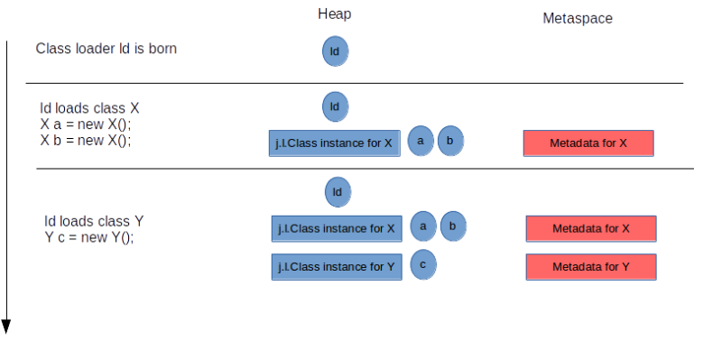
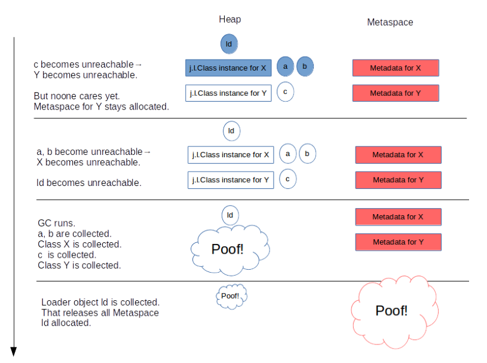
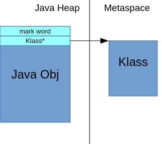
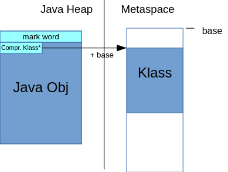

# metaspace

## What is metaspace

> https://stuefe.de/posts/metaspace/what-is-metaspace/

Class metadata are the runtime representation of java classes within a JVM process - basically any information the JVM needs to work with a Java class. That includes, but is not limited to, runtime representation of data from the [JVM class file format](https://docs.oracle.com/javase/specs/jvms/se8/html/jvms-4.html).

Examples:

-   the "Klass" structure - the VM-internal representation of runtime state of a java class. This includes both vtable and itable.
-   Method metadata - runtime equivalent of the [method_info](https://docs.oracle.com/javase/specs/jvms/se8/html/jvms-4.html#jvms-4.6) in the class file, containing things like the [bytecode](https://docs.oracle.com/javase/specs/jvms/se8/html/jvms-4.html#jvms-4.7.3), [exception table](https://docs.oracle.com/javase/specs/jvms/se8/html/jvms-4.html#jvms-4.7.5), [constants](https://docs.oracle.com/javase/specs/jvms/se8/html/jvms-4.html#jvms-4.7.2), etc.
-   The [constant pool](https://docs.oracle.com/javase/specs/jvms/se8/html/jvms-4.html#jvms-4.4)
-   Annotations
-   method counters collected at runtime as a base for JIT decisions
-   etc.

#### When does Metaspace get allocated?

#### When does Metaspace get released?

#### Not return mem to OS

All or a part of that memory may be retained within the JVM; it may be reused for future class loading, but at the moment it remains unused within the JVM process.

#### MaxMetaspaceSize, CompressedClassSpaceSize

There are two parameters to limit Metaspace size:

-   `-XX:MaxMetaspaceSize` determines the maximum **committed** size the Metaspace is allowed to grow. It is by default unlimited.
-   `-XX:CompressedClassSpaceSize` determines the **virtual** size of one important portion of the Metaspace, the *Compressed Class Space*. Its default value is 1G (note: reserved space, not committed).

We will talk about this in more detail, see [Sizing Metaspace](https://stuefe.de/posts/metaspace/sizing-metaspace).

#### compressed class pointers
Each Java object has, in its header, a reference to a native structure living outside the Java heap in Metaspace: the [*Klass*](http://hg.openjdk.java.net/jdk/jdk11/file/1ddf9a99e4ad/src/hotspot/share/oops/klass.hpp#l78) structure.

When using compressed class pointers, that reference is a 32bit value. In order to find the real 64bit address of that structure, we add a known common base to it, and potentially also left-shift the value by three bits:

That technique places a technical restriction on where to allocate those `Klass` structures:

*Each possible location of a Klass structure must fall within a range of 4G (unshifted mode)|32G(shifted mode), to be reachable with a 32bit offset from a common base^[1](https://stuefe.de/posts/metaspace/what-is-compressed-class-space/#fn:1)^.*

When allocating memory from the system via a system API like malloc(3) or mmap(3), the addresses are chosen by the system and may be of any value fitting the type range. So on 64bit platforms, there is of course no guarantee that subsequent allocations would yield addresses within the range limit. E.g. one mmap(3) call could map at 0x0000000700000000, one at 0x0000000f00000000.

Therefore we **have to use a single mmap() call to establish the region** for `Klass` objects. So we would need to know the size of this region upfront, and it cannot be larger than 32G. It also can never be reliably extended, since the address range beyond its end may already be occupied.

These restrictions are harsh. They are also only really needed for Klass structures, not for other class metadata: only **Klass instances are currently being addressed with compressed references. The other metadata get addressed with 64bit pointers and hence can be placed anywhere.**

So it was decided to split the metaspace into two parts: a "non-class part" and a "class part":

-   The class part, housing `Klass` structures, has to be allocated as one contiguous region which cannot be larger than 32G.

-   The non-class part, containing everything else, does not.

The size of the compressed class space is determined by `-XX:CompressedClassSpaceSize`. Because we need to know the size of the class space upfront, that parameter cannot be empty. If omitted, it **defaults to 1GB**.

Since a Klass structure is, on average, 1K in size, a Compressed Class Space with **1G default size will be able to host about a million Klass structures** (see Sizing Metaspace). This is the only real limit to the number of classes we can load.

Also note that `CompressedClassPointers` get disabled when we run without `CompressedOops`. This happens if we either manually switch CompressedOops off via `-XX:-CompressedOops`, or if the Java heap is larger or equal to 32G.

