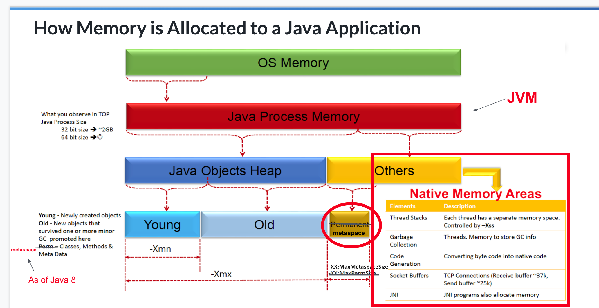
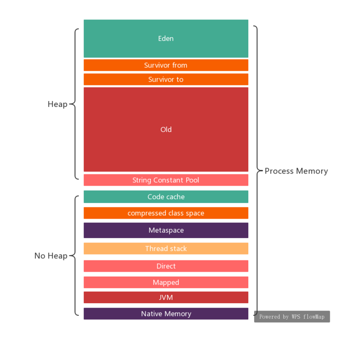
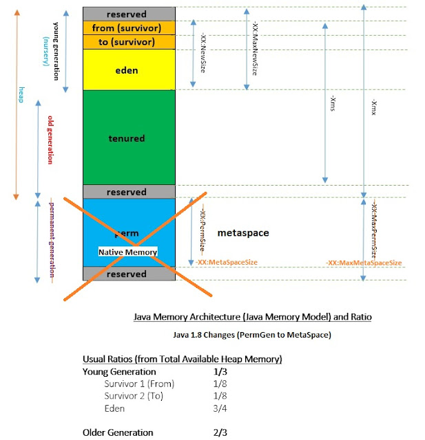
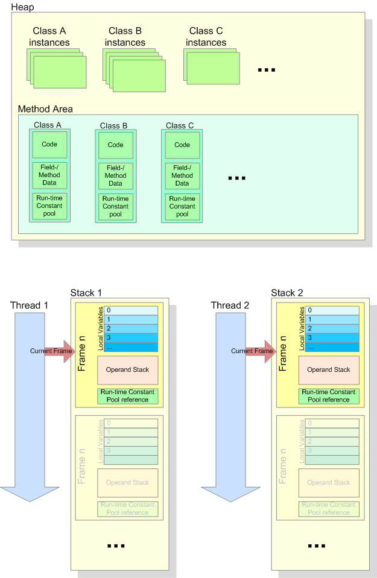
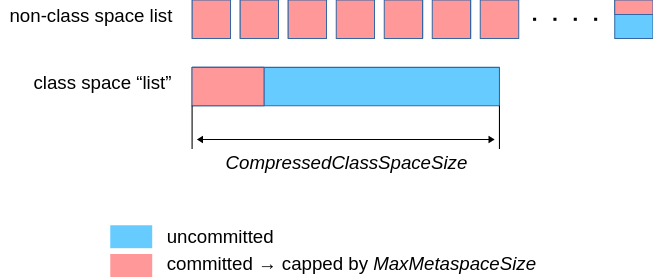
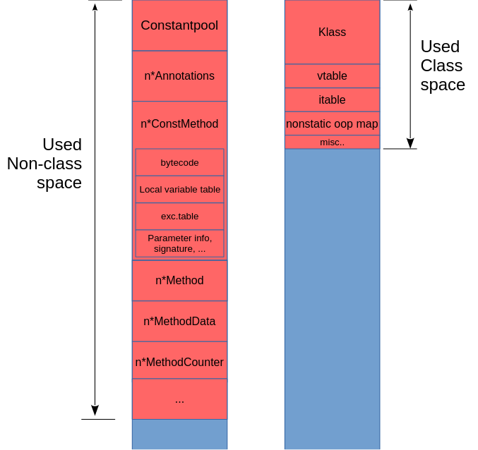
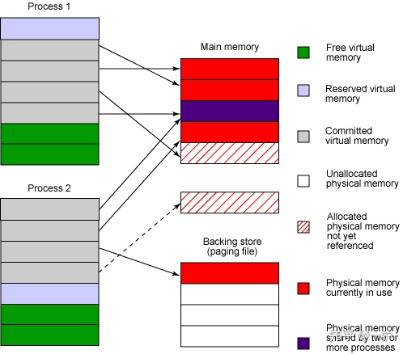

## Memory parts


> https://jkutner.github.io/2017/04/28/oh-the-places-your-java-memory-goes.html

Java Heap Size + Metaspace + CodeCache + DirectByteBuffers + Jvm-native-c++-heap.

-   **Heap** - The heap is where your Class instantiations or "Objects" are stored.
-   **Thread stacks** - Each thread has its own call stack. The stack stores primitive local variables and object references along with the call stack (list of method invocations) itself. The stack is cleaned up as stack frames move out of context so there is no GC performed here.
-   **Metaspace** - Metaspace stores the Class definitions of your Objects, and some other metadata.
-   **Code cache** - The JIT compiler stores native code it generates in the code cache to improve performance by reusing it.
-   **Buffer pools** - Many libraries and frameworks allocate buffers outside of the heap to improve performance. These buffer pools can be used to share memory between Java code and native code, or map regions of a file into memory.
-   **OS memory** - The operating system keeps heap and stacks for a Java process independent of the heap and stacks managed by the JVM itself. There is also memory consumed for each native library loaded (such as `libjvm.so`). This is usually very small.

> https://support.cloudbees.com/hc/en-us/articles/360042655312-Diagnosing-Java-Native-Memory-Issues
> 

> https://www.twblogs.net/a/5d80afd1bd9eee541c349550?lang=zh-cn


> https://dzone.com/articles/evolution-of-the-java-memory-architecture-java-17


> https://www.labcorner.de/run-time-data-structure-of-a-java-virtual-machine/


## JVM Parameters

-   Heap size, limited by "**-Xmx**"
-   Metaspace, limited by "**-XX:MaxMetaspaceSize=**"
-   Thread stacks, stack size ("**-Xss"**) times the number of threads
-   DirectMemory, limited by "**-XX:MaxDirectMemorySize**"
-   CodeCache, limited by "**-XX:ReservedCodeCacheSize"**
-   GC and Symbols that we won't discuss here
-   `+UseContainerSupport` default `true`

## Parts detail

### Metaspace
> https://stuefe.de/posts/metaspace/sizing-metaspace/

**MaxMetaspaceSize** and **CompressedClassSpaceSize** are our knobs to control Metaspace size.

Now, these parameters can be a tad confusing. For one, there are two of them, and they have subtly different meanings, and they influence each other.

-   **MaxMetaspaceSize** : This is a "soft" limit on the maximum of **committed** Metaspace. It includes both non-class and class space. It is "soft" in the sense as there is not pressing technical reason to this limit beyond the wish to have a limit. It is entirely optional and in fact off by default.

-   **CompressedClassSpaceSize** : This is a hard limit, defining the **virtual** size of the compressed class space. "Hard" since we need to fix it at VM start and can never change it. If we omit it, it defaults to 1G.



The red portion is the sum of the committed portion of Metaspace, including both non-class space nodes and the one giant class-space node. This sum is limited by `-XX:MaxMetaspaceSize`. Attempting to commit more memory than `-XX:MaxMetaspaceSize` will result in an **OutOfMemoryError("Metaspace")**.

On the other hand, `-XX:CompressedClassSpaceSize` determines the **reserved** size of the one giant class-space node. It includes both the committed part and the (blue) still uncommitted part. If that node is full, we will get an **OutOfMemoryError("Compressed Class Space")**.

For each loaded class there will be space allocated from class metadata from both class and non-class space. Now, what goes where?:



#### Metaspace default size
`MaxMetaspaceSize` is by default unlimited whereas `CompressedClassSpaceSize` is sized to 1G. This means the only limit we would hit is `CompressedClassSpaceSize`.

#### interned String pool
> https://stackoverflow.com/questions/10578984/what-is-java-string-interning
 In Java 8, PermGen (Permanent Generation) space is removed and replaced by Meta Space. The String pool memory is moved to the heap of JVM. 


#### +UseContainerSupport
> https://www.atamanroman.dev/articles/usecontainersupport-to-the-rescue/


`-XX:+UseContainerSupport` allows the JVM to read cgroup limits like available CPUs and RAM from the host machine and configure itself accordingly. **The flag is available on Java 8u191+**. Default is `true`.

The old (and somewhat broken) flags -XX:{Min|Max}RAMFraction are now deprecated.

There is a new flag -XX:MaxRAMPercentage, that takes a value between 0.0 and 100.0 and defaults to 25.0. So if there is a 1 GB memory limit, the JVM heap is limited to ~250 MB by default.

**Please note that setting -Xmx and -Xms disables the automatic heap sizing.**

## Os view

### mmap() and 'commited' memory
> https://man7.org/linux/man-pages/man2/mmap.2.html
```c
void *mmap(void *addr, size_t length, int prot, int flags, int fd, off_t offset);

       The prot argument describes the desired memory protection of the
       mapping (and must not conflict with the open mode of the file).
       It is either PROT_NONE or the bitwise OR of one or more of the
       following flags:

       PROT_EXEC
              Pages may be executed.

       PROT_READ
              Pages may be read.

       PROT_WRITE
              Pages may be written.

       PROT_NONE
              Pages may not be accessed.
```

> https://stackoverflow.com/questions/12916603/what-s-the-purpose-of-mmap-memory-protection-prot-none

PROT_NONE allocates a contiguous virtual memory region with no permissions granted.

This can be useful, as other have mentioned, to implement guards (pages that on touch cause segfaults, both for bug hunting and security purposes) or "magic" pointers where values within a PROT_NONE mapping are to be interpreted as something other than a pointer.

Another use is when an **application wishes to map multiple independent mappings as a virtually contiguous mapping**. This would be done by first mmapping a large enough chunk with PROT_NONE, and then performing other mmap calls with the `MAP_FIXED` flag and an address set within the region of the PROT_NONE mapping (the use of MAP_FIXED automatically unmaps part of mappings that are being "overridden").

Example:
```
grep -- --- /proc/self/maps
 61 MB  00007FA0C42C5000-00007FA0C8000000 ---p 00000000 00:00 0
```

#### java 'commited' memory

> https://unix.stackexchange.com/questions/353676/what-is-the-purpose-of-seemingly-unusable-memory-mappings-in-linux

OpenJDK ... uses PROT_NONE mappings to reserve uncommitted address space (which is then committed with [mprotect](https://man7.org/linux/man-pages/man2/mprotect.2.html) calls, as needed).

```c
 int mprotect(void *addr, size_t len, int prot);
```

The natural assumption is that it wishes to have contiguous heap memory for some reason.

It uses PROT_NONE to reserve space, until it actually needs it. The original context of this comment is a discussion about Linux VM overcommit: using unaccessible mappings avoids requiring any commitment from the kernel (until the mapping is needed & made accessible), in case the kernel is configure for strict commit mode.

Ref: [The "too small to fail" memory-allocation rule](https://lwn.net/Articles/627728/)

> [Java内存占用分析](https://zhuanlan.zhihu.com/p/350828180)

reserved 和 committed memory
在每个区块中包括了reserved memory和committed memory 大小

reserved memory 是JVM 通过mmaped 申请的虚拟地址空间，权限是PROT_NONE，在页表中已经存在了记录（entries），保证了其他进程不会被占用，但是JVM还不能直接使用这块内存

committed memory 是JVM向操作系统实际分配的内存（malloc/mmap）,mmaped权限是 PROT_READ | PROT_WRITE，这块内存可以被直接使用


## commands
```bash
jmap -heap $PID
```

##### RSS 和 committed，reservered memory
关于committed,reserved以及rss之间的关系: 首先这几个变量之间没有等量的关系

reservered memory不一定都是committed memory，要出去PROT_NONE的部分
committed memory不一定都是resident memory，因为malloc/mmap is lazy unless told otherwise. Pages are only backed by physical memory once they're accessed.



malloc 和mmap
在输出中还能看到内存申请的方式malloc和mmap两种方式各自申请了多少，在linux中可以通过brk，sbrk，malloc，mmap函数进行内存申请。

brk和sbrk分别是调整堆顶的brk指针的指向，一种是相对，一种是绝对位置的调整

### RSS/PSS
> [Troubleshooting Native Memory Leaks in Java Applications](https://blogs.oracle.com/poonam/troubleshooting-native-memory-leaks-in-java-applications)
> RSS though may not be a reliable way to measure the process size accurately. There is a known issue that RSS does not report the memory size of a process correctly if the process uses multi-mapping i.e. it maps multiple ranges of the virtual memory to the same range in the physical memory. Note that the ZGC collector of the JVM uses multi-mapping, so RSS won’t report the correct memory size of the process running with ZGC. We should use PSS instead!

`PSS` stands for **Proportional Set Size**


## Tools
https://github.com/cloudfoundry/java-buildpack-memory-calculator


## Ref
https://blogs.oracle.com/poonam/troubleshooting-native-memory-leaks-in-java-applications
https://blogs.oracle.com/poonam/running-on-a-64bit-platform-and-still-running-out-of-memory