# The ultimate monitoring of the JVM application - out of the box

> From https://krzysztofslusarski.github.io/2021/09/04/jmx.html

## Context

Most of the applications I saw were deployed at the virtual machine. Most of them used *Spring Boot* with *Tomcat* as a web server and *Hikari* as a connection pool. In this article I’m going to show you metrics from that technology. If you are using others, you need to find corresponding metrics by yourself. The JMX mbean names are taken from the **Java 11** with the **G1GC**.

Mind that some of the following metrics may have no sense in the cloud.

## Foreword

This article is very long because there are a lot of metrics that you should focus on. In my applications I have all of those metrics gathered in one dashboard. It is the first place I look when there is some outage. That dashboard doesn’t tell me the exact cause of the outage, but directs me to the source of the problem.

## Hardware

Let’s start from the bottom. We have **four** crucial hardware components that almost all applications use:

- **CPU**
- **RAM**
- **Disk**
- **Network**

Mind that there are other components, like disk controllers, bridges and so on, but I’m going to focus on those four.

### CPU

#### CPU utilization chart (7 days)

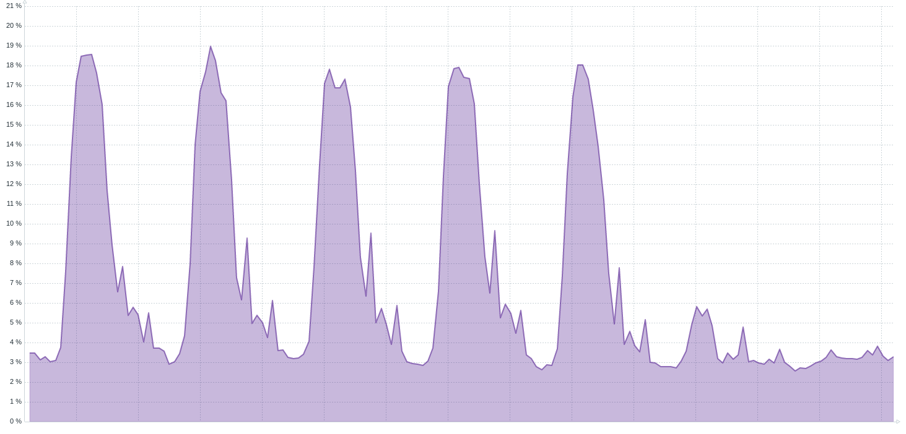

Possible failures:

- The **100%** utilization of **all** cores
- The **100%** utilization of **one** core

In this situation you need to check if that resource is utilized by your JVM. The first one can be easily diagnosed by **JMX**, I’m going to cover that later. The second one I usually diagnose at **OS** level using `pidstat -t <time interval>`.

### RAM

#### Available memory chart (7 days)

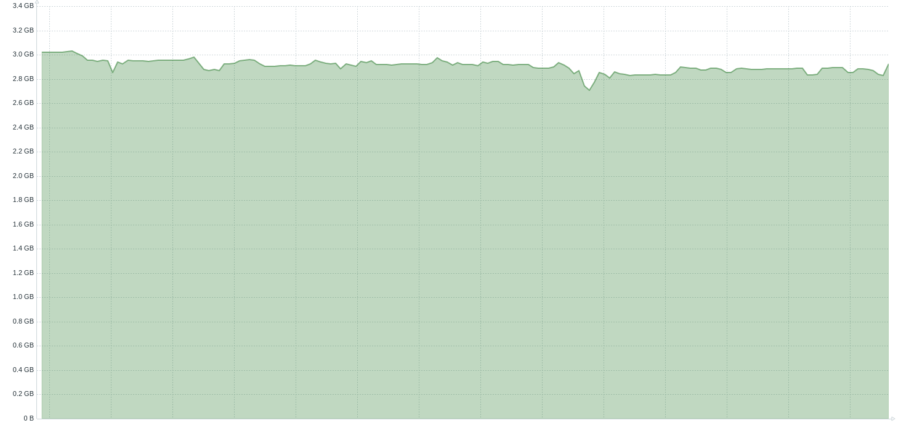 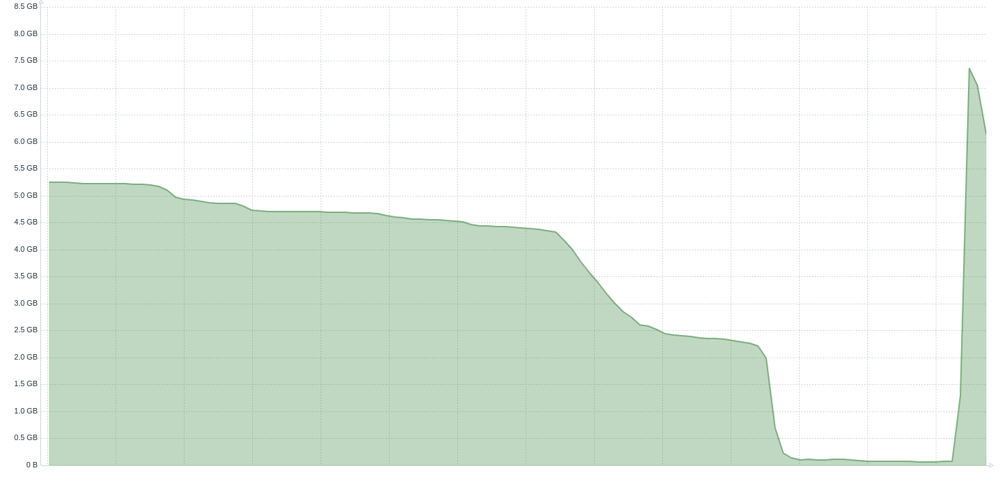

You need to understand the difference between **available** and **free** memory. I suggest you read the beginning of the `man free` at Linux. Long story short, your OS has internal caches and buffers. Those are used to help the performance of your application. Your OS can use them if there is enough memory available. If your application needs the memory used before by cache/buffer, the OS will remove that cache/buffer to make that memory available for you.

Simplifying:

- **Available memory** - how much memory is available for your application
- **Free memory** - how much memory is not used by any application and OS

Possible failures:

- **0 bytes** of the available memory - this is a situation where out-of-memory killer kicks in
- The available memory drops to the level, where crucial cache/buffer is removed

The first situation is shown in the second chart above. The available memory dropped to **0**, OOM killer killed the JVM. In that situation you need to check the OS logs to find out which process ate that memory.

The second situation is easy to diagnose when you look also at your next resource.

### Disk

#### IO operations (reads/writes) chart (1 day)

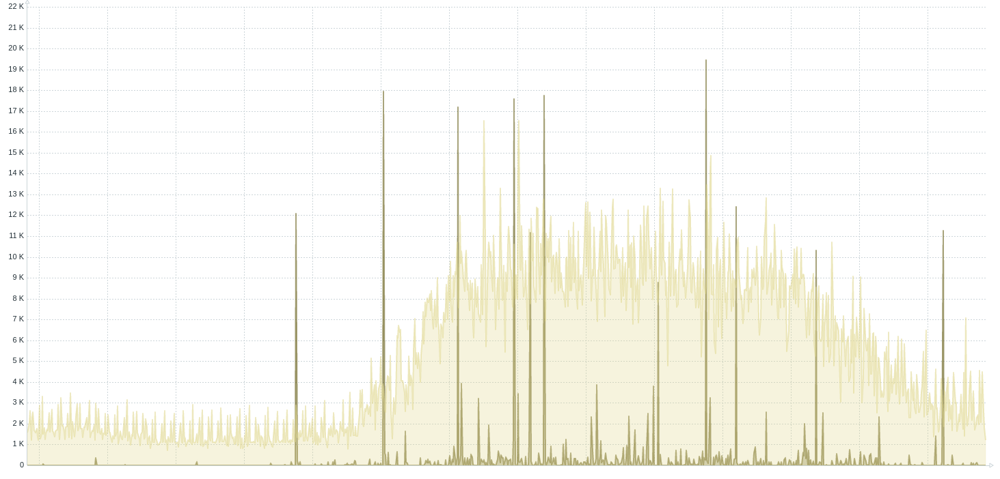 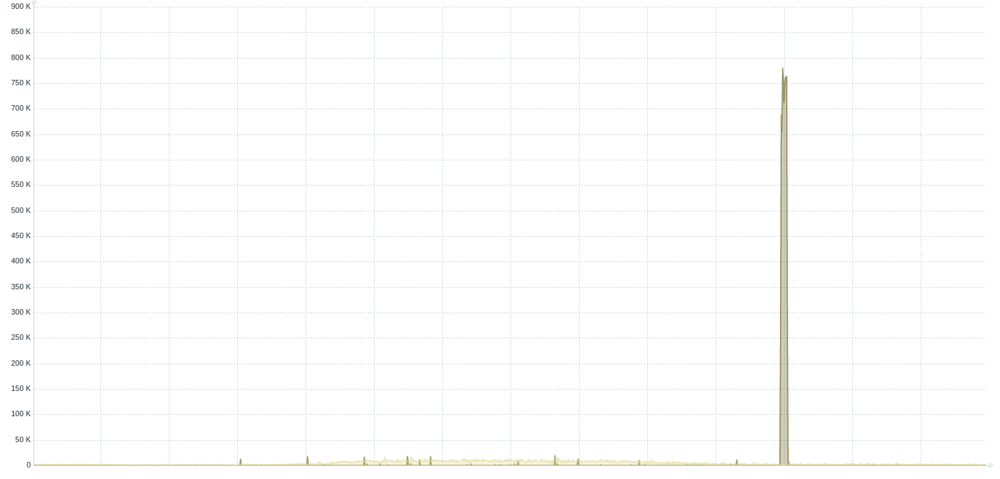

Possible failures:

- **Huge increase** of IO operations

The IO operations don’t appear out of nowhere. If the increase of **IO reads** is correlated with reduction of **available memory** then you probably have a situation where a crucial cache/buffer is removed (shown at second chart above). In that situation you need to check **RAM** consumption to check which process eats the memory.

The increase of **IO operations** can be done by your JVM, you can check it with `pidstat -d <time interval>` at Linux. If that is your problem I suggest using the **async-profiler** in **wall** mode. With that profiler you can easily find the part of your code that is using the IO.

### Network

#### Net transfer (in/out) chart (1 day)

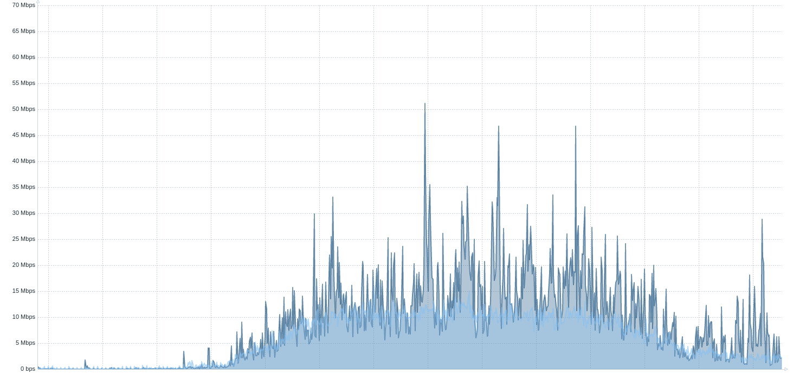

Possible failures:

- **Huge increase** of the traffic
- No traffic

In the first situation first you need to check if that traffic is done by your JVM. There are multiple tools to check it, I like the `nethogs`. If that traffic is generated by the JVM then, again, the **async-profiler** at **wall** mode is going to show you what part of your application generates it.

If there is no traffic, then:

- You should check your health check endpoint if this is a way you inform other applications about the availability of your system
- You should check your service discovery/load balancer if you are using one, maybe there is some failure

## JVM (from JMX)

### CPU (again)

#### CPU utilization chart (7 days)

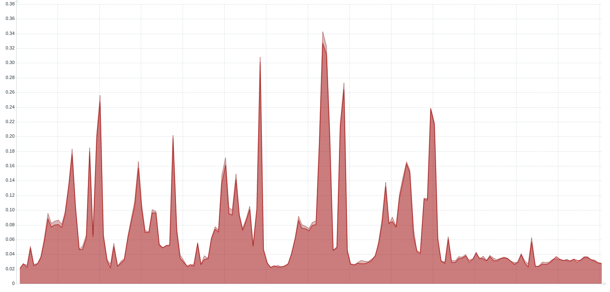 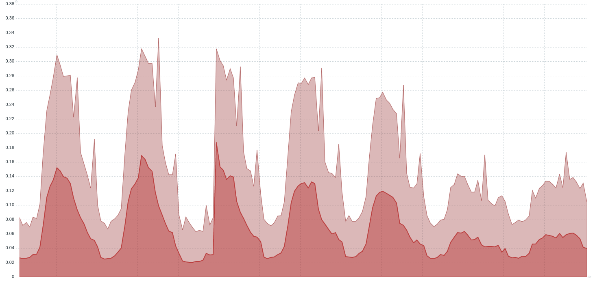 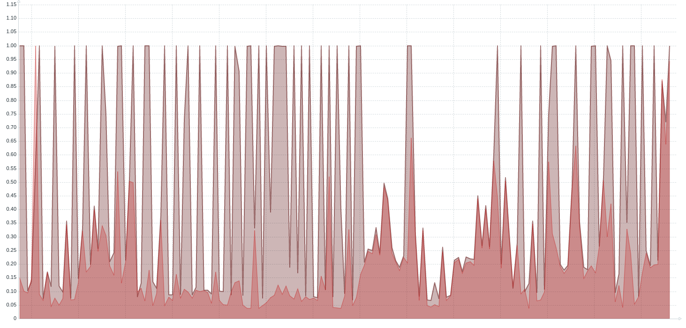

- Object name - `java.lang:type=OperatingSystem`
- Attributes - `SystemCpuLoad` and `ProcessCpuLoad`

The JVM reports through the JMX two metrics, the CPU utilization from OS level (which is the same as the first metric in this article), and how much of that utilization is done by that JVM. Comparing those two values can give you the information if your application is responsible for the utilization. The last chart above shows the case where the application cannot perform well, because another process consumes a whole CPU.

### Heap after GC

I’ve already written why that metric is useful in the [previous article](https://krzysztofslusarski.github.io/2021/07/17/monday-hagc.html).

#### Heap after GC chart (7 days)

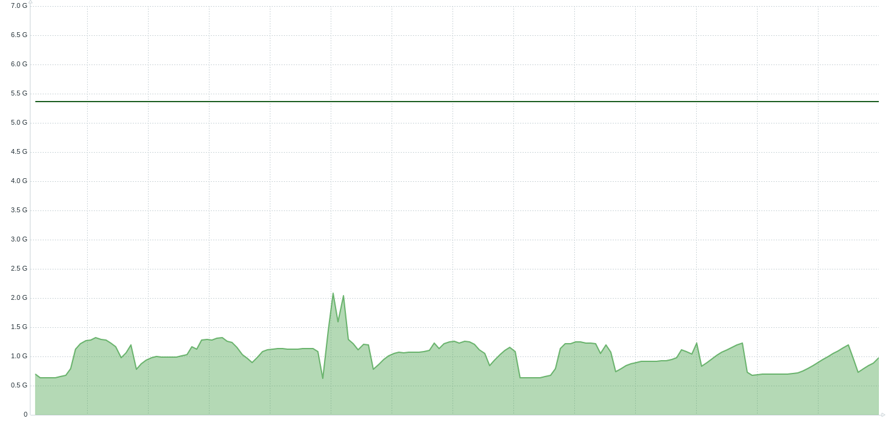 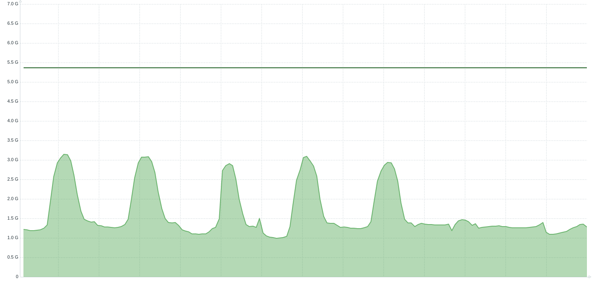 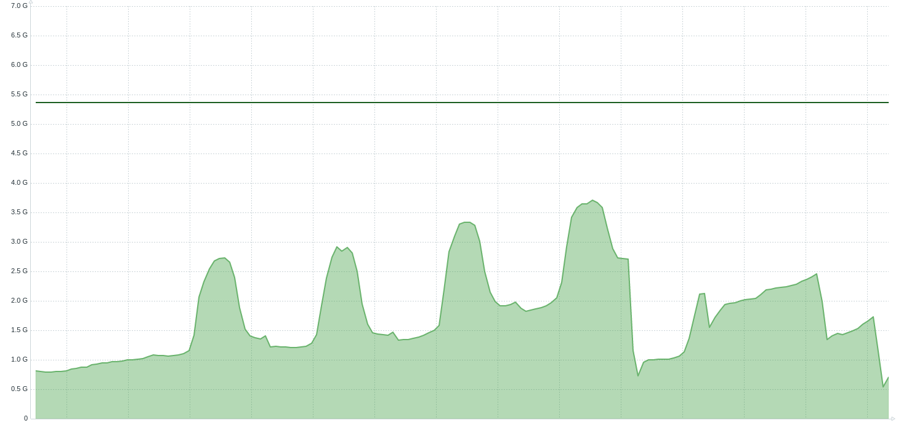

The committed, and the max heap size can be obtained from:

- Object name - `java.lang:type=Memory`
- Attribute - `HeapMemoryUsage` - a complex type with `max` and `committed` attributes

The heap after GC can be obtained from:

- Object name - `java.lang:name=G1 Young Generation,type=GarbageCollector`
- Attribute - `LastGcInfo` - a complex type with `memoryUsageAfterGc` attribute

I use that chart to find out if there is a **heap memory leak**. Check the [previous article](https://krzysztofslusarski.github.io/2021/07/17/monday-hagc.html) for details. The last chart above shows the memory leak. If you have a memory leak in your application then you have to analyze the **heap dump**.

### Heap before GC

I’ve already written why that metric is useful in the [previous article](https://krzysztofslusarski.github.io/2021/07/28/monday-hbgc.html).

#### Heap before GC chart (7 days)

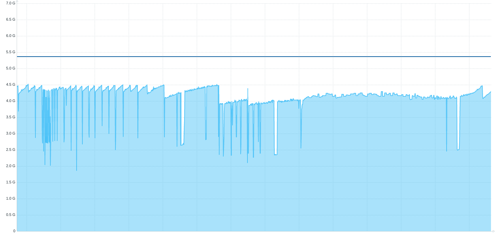 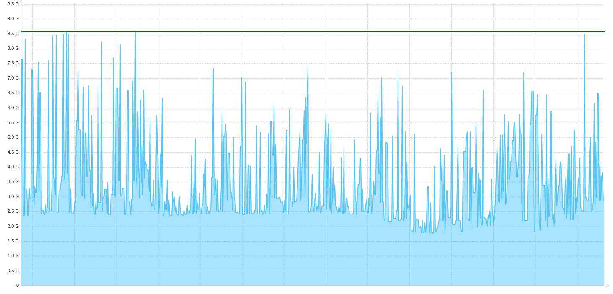

The committed, and the max heap size can be obtained from:

- Object name - `java.lang:type=Memory`
- Attribute - `HeapMemoryUsage` - a complex type with `max` and `committed` attributes

The heap before GC can be obtained from:

- Object name - `java.lang:name=G1 Young Generation,type=GarbageCollector`
- Attribute - `LastGcInfo` - a complex type with `memoryUsageBeforeGc` attribute

I use that chart to find out if the heap **is wasted**, because the **GC** starts its work too early. Check the [previous article](https://krzysztofslusarski.github.io/2021/07/28/monday-hbgc.html) for details. The second chart above shows the application where the **GC** runs inefficiently. If you have such a situation then you need to analyze the **GC log**.

### Full GC count (G1GC)

#### Full GC count chart (7 days)

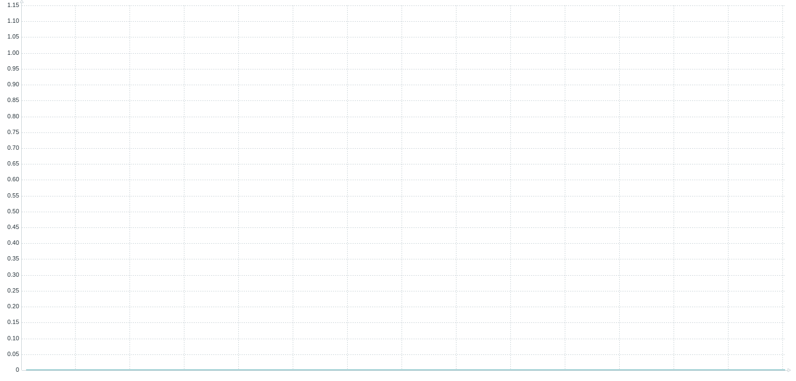 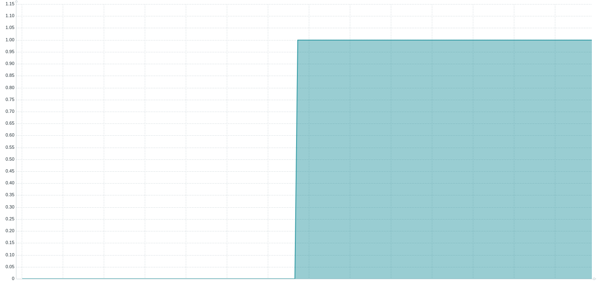 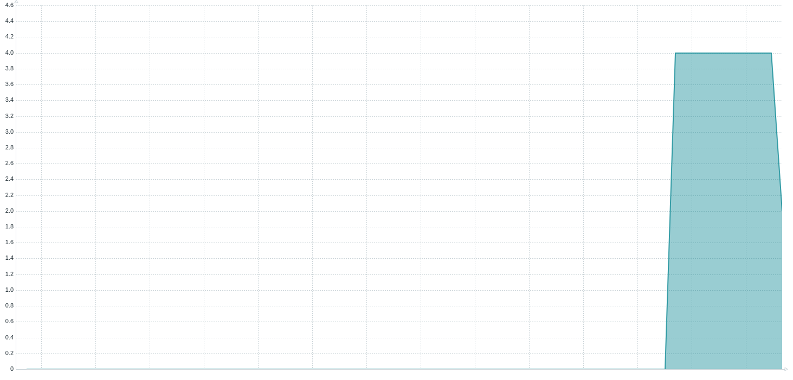 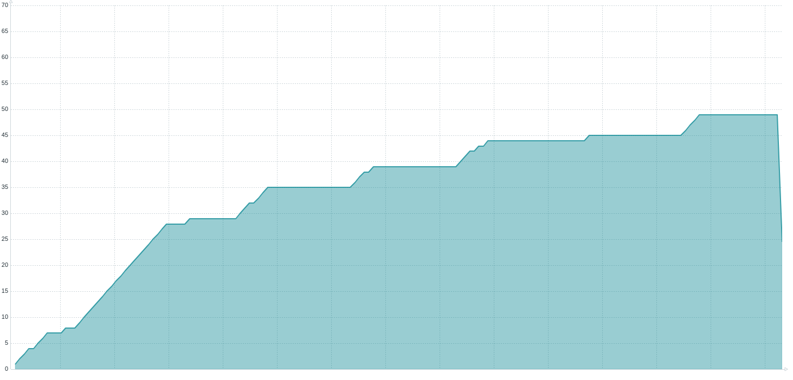 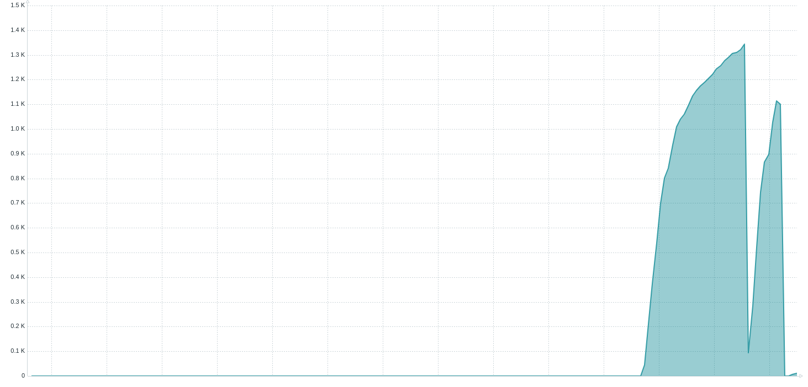

- Object name - `java.lang:name=G1 Old Generation,type=GarbageCollector`
- Attributes - `CollectionCount`

The best situation is presented at the first chart: **0 full GCs**. Possible failures:

- **Single Full GC** (second chart) - for the most of the applications this is not a problem, but yours might be different
- **Few Full GCs** in a short period (third chart)
- **Periodic Full GC** (forth chart) - covered in the [previous article](https://krzysztofslusarski.github.io/2021/05/16/fullgc.html)
- **Multiple Full GCs** (fifth chart)

If you have a first situation, and it is a problem for you then you need to analyze **GC logs**. This is a place with information why the **G1GC** has to run that phase.

If you have a second situation, it usually means that your application runs a part of code that needs almost all the free heap. What I usually do in that situation is to check the **access log**, and the **application log** to find out what was going on in the time of full GCs. The *continuous profiling* is also useful in that case.

The last situation usually means that your application runs a part of code that needs more heap than you have. It usually ends with `OutOfMemoryError`. I strongly recommend you to enable `-XX:+HeapDumpOnOutOfMemoryError`, it will dump you a **heap dump** when such a situation occurs, which is the best way to find the cause of it.

### Code cache size

#### Code cache size chart (7 days)

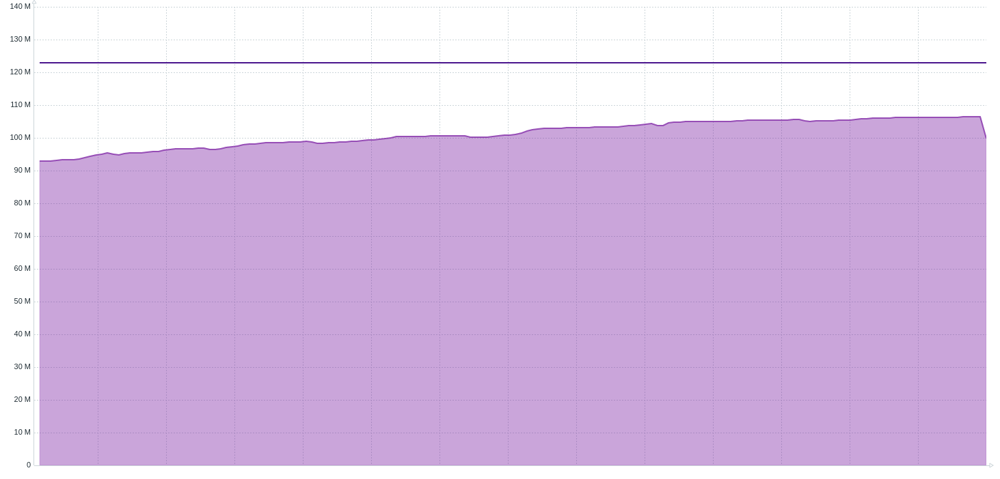

- Object name - `java.lang:name=CodeHeap 'non-profiled nmethods',type=MemoryPool` and `java.lang:name=CodeHeap 'profiled nmethods',type=MemoryPool`
- Attributes - `Usage` - a complex type with `max` and `committed` attributes

Possible failures:

- **Not enough** code cache for a new compilation

The *code cache* contains the *JIT compilations*. If that part of memory cannot fit a new compilation then the whole *JIT* disables. After that, your application starts degrading the performance. You need to remember that the *code cache* can be **fragmented**. As a rule of thumb I assume that if the application uses **>=90%** of that part of a memory, then that part needs to be increased.

### Off-heap usage

#### Off-heap usage charts (7 days)

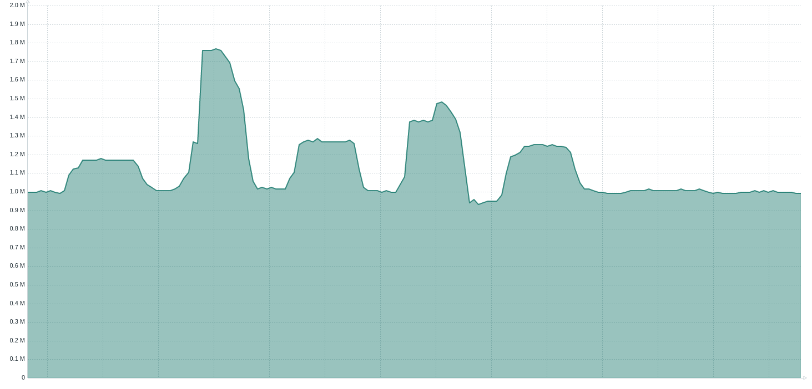 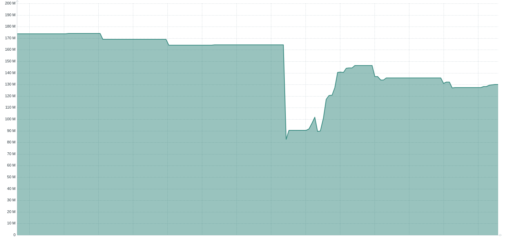

- Object name - `java.nio:name=direct,type=BufferPool` and `java.nio:name=mapped,type=BufferPool`
- Attributes - `MemoryUsed`

Possible failures:

- **Too much** memory allocated

Most of the time the off-heap is used by frameworks/libraries. Those metrics are useful for control, if there is no memory leak in this area.

To find out what part of your code allocates the memory with these two mechanisms you can use:

- **Heap dump** for `DirectByteBuffer`
- **Heap dump** and `pmap` from OS level for `FileChannel`

### Loaded class count

### Loaded class count chart (7 days)

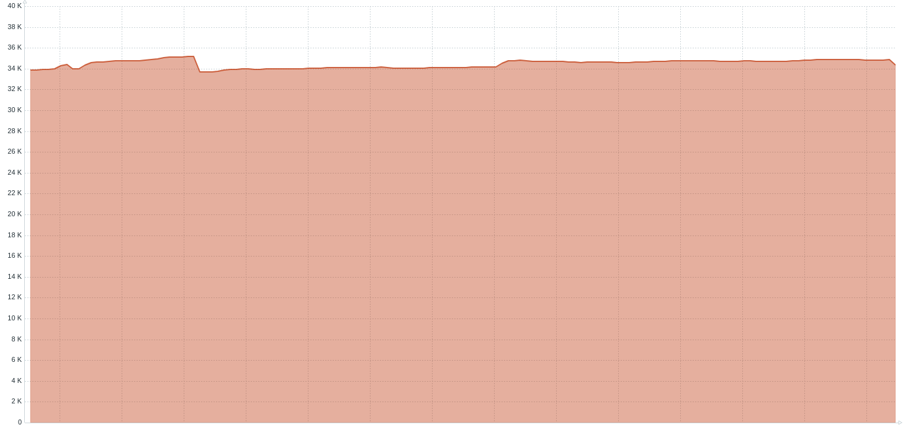

- Object name - `java.lang:type=ClassLoading`
- Attributes - `LoadedClassCount`

Possible failures:

- **Memory leak at Metaspace**

This problem was common in **EJB servers**. If you do not use hot swap, context reload, there is a little chance you have this leak. You need to remember that it is completely normal for that chart to be ascending. There are mechanisms (like the evil **reflection**) which create classes at runtime. If you think there is a memory leak the first think you should look at are [classloader logs](https://krzysztofslusarski.github.io/2021/09/02/monday-class.html).

The **heap dump** is also useful in that situation. It contains all class definitions and can tell you why they are alive.

### Hikari active connection count

#### Hikari active connection count chart (7 days)

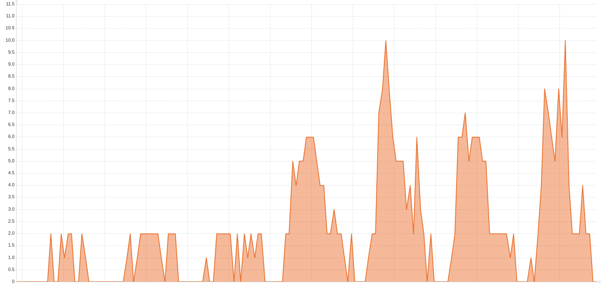

- Object name - `com.zaxxer.hikari:type=Pool (<pool name>)`
- Attributes - `ActiveConnections`

This metric is useful for scaling and sizing your application. It tells you how many active connections you need to your database. If this value is too big for you, your code may spend too much time with the opened transaction. The way I’m finding such a situation in *Spring framework* is to take output for **async-profiler** in **wall** mode and look for long methods covered with `invokeWithinTransaction` method.

### Hikari threads awaiting connection

#### Hikari threads awaiting connection chart (7 days)

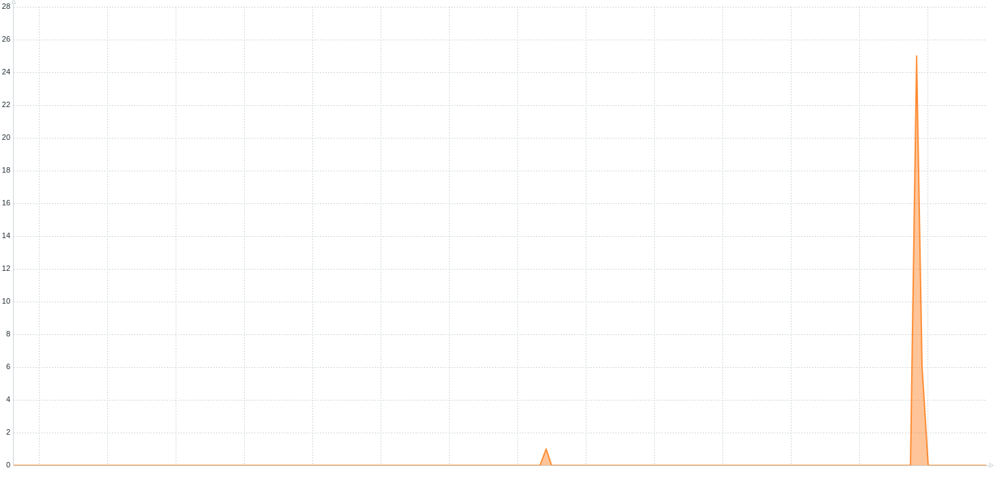

- Object name - `com.zaxxer.hikari:type=Pool (<pool name>)`
- Attributes - `ThreadsAwaitingConnection`

Possible failures:

- A rapid increase from **0**
- A constant value over **0**

The second situation is simple, your database connection pool has too low size to handle all the requests. Either your pool is too short, or you have a situation I’ve explained in the previous chapter.

The first situation (second chart above) means that you have one of the following issues:

- A load to your application increased
- Your database slowed down
- Your application needed more time in transaction

The last situation can be diagnosed the same way I’ve written above. The easiest way to diagnose the second option is to start from database level. There are dedicated tools to monitor that area like *Oracle Enterprise Manager*

### Tomcat connection count

#### Tomcat connection count charts (7/5 days)

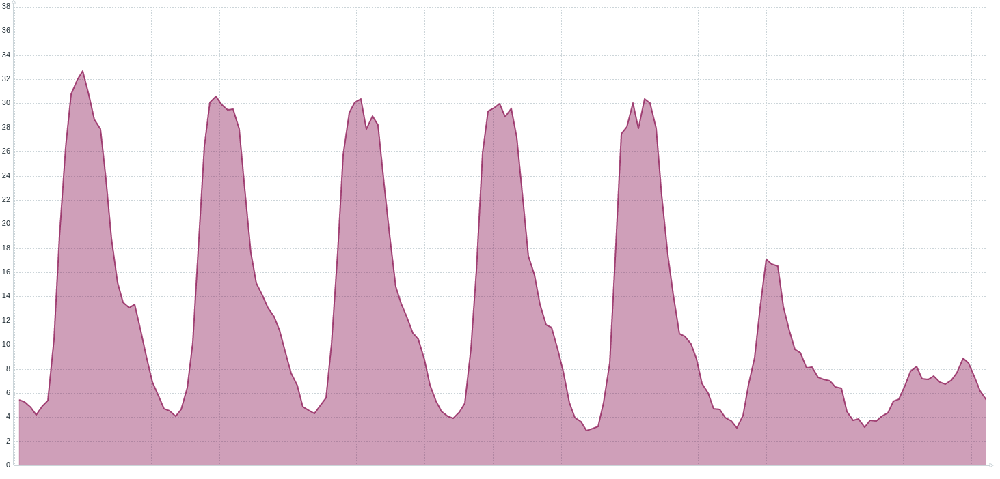 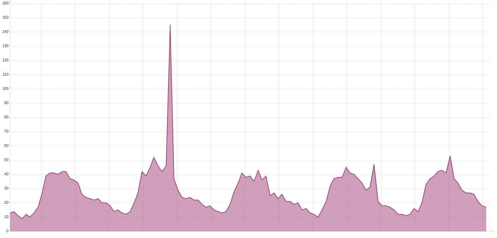

- Object name - `Tomcat:type=ThreadPool,name="<pool name>"`
- Attributes - `connectionCount`

Possible failures:

- **Huge increase** in a **short** period

This metric tells you how many connections are established to your server. If it is increasing rapidly then most probably you encounter one of the following situations:

- The number of requests is increasing
- The time for your application to handle the request is increasing

You need to remember that if your application slows down the number of incoming requests don’t decrease. The only way for an application server to handle the same amount of requests with slower application is to create more *worker threads* and accept more connections. If it is your case (the second chart above) then you need to find why your application is slower, the best way from my experiences is **async-profiler** in **wall** mode.

### Created thread count

#### Created thread count chart (7 days)

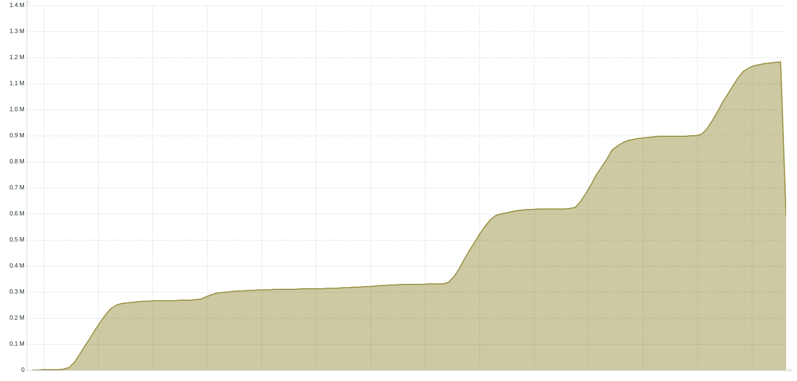

- Object name - `java.lang:type=Threading`
- Attributes - `TotalStartedThreadCount`

If the number of created threads is increasing it means there is a lack of a thread pool. I’ve written [an article](https://krzysztofslusarski.github.io/2020/12/14/jdkbugs.html) explaining how to find the part of code that lacks that pool.

### Current thread count

#### Current thread count charts (7 days)

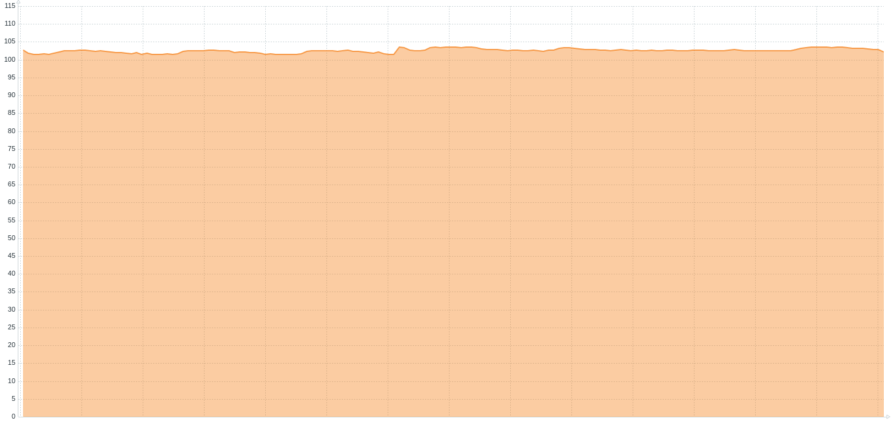 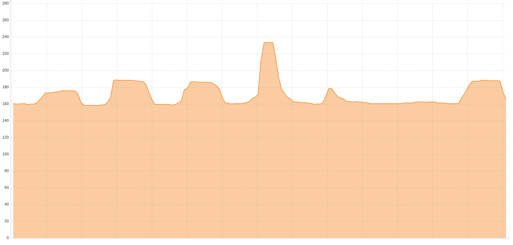 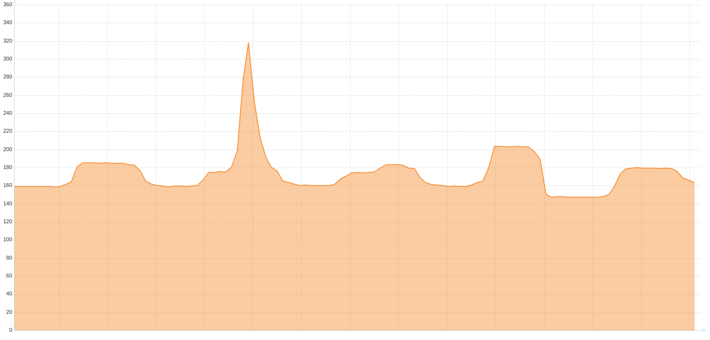

- Object name - `java.lang:type=Threading`
- Attributes - `ThreadCount`

Possible failures:

- **Thread leak**
- **Huge increase** in a **short** period

There are some situations where the application has thread leak, they are very rare. That situation can be diagnosed the same way as creating too many threads. The **huge increase** of threads in a **short** period means pretty much the same as increasing the tomcat connection count. The application needs more threads to do its work. We can find the reason with **async-profiler** in **wall** mode.

## Afterword

As I said in the foreword, a dashboard with all those metrics helps me handle the outages, here are some examples:

- If there is a huge **CPU** utilization, and it is not done by my JVM then it’s **noisy neighbor** situation, we need to deal with the process that eats our resource
- If there is a huge **CPU** utilization, and it is done by my JVM, the application runs slow, and the **code cache** is almost full then I look at log if the JIT compiler has been disable
- If there is a huge **CPU** utilization, and it is done by my JVM, the application runs slow, and the **full GC** is happening all the time, I need a **heap dump** and **GC logs** to diagnose what is going on
- If there is a huge **CPU** utilization, and it is done by my JVM, and the **GC** runs very frequently, starting its work too soon then I need **GC logs** to understand why this is happening
- If there is a huge **CPU** utilization, and it is done by my JVM (and it is not any of previous situations), I need **CPU profiling**
- If there are multiple **threads awaiting database connection** then I need **wall profiling** and access to DB performance tool
- It there was a **0 available RAM** for a while, and now there is no **java process** then I check in OS logs if there was **OOM killer** activity logged

… and so on.

Those charts do not solve the outage but show you where you should focus on your diagnosis. Remember, I just covered the technology I use. **You may have other metrics worth gathering** (MQ, Kafka, custom thread pools and so on).

After fifteen years of handling different kinds of outages I can tell you one thing: **I never start the diagnosis from the application log**.
