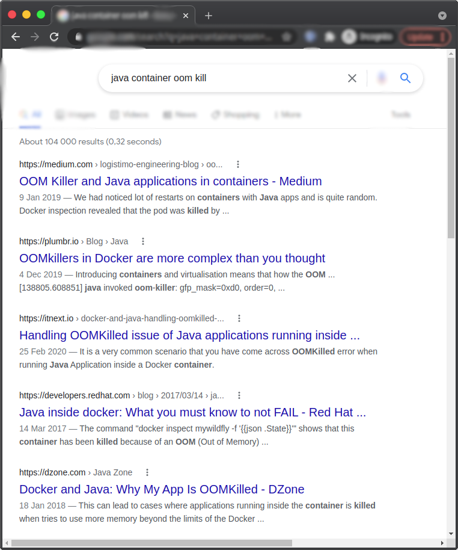
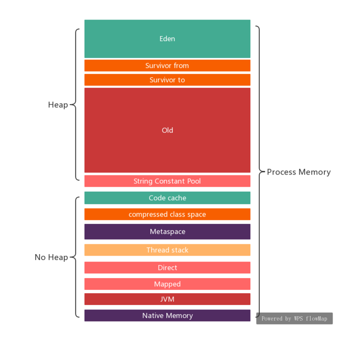
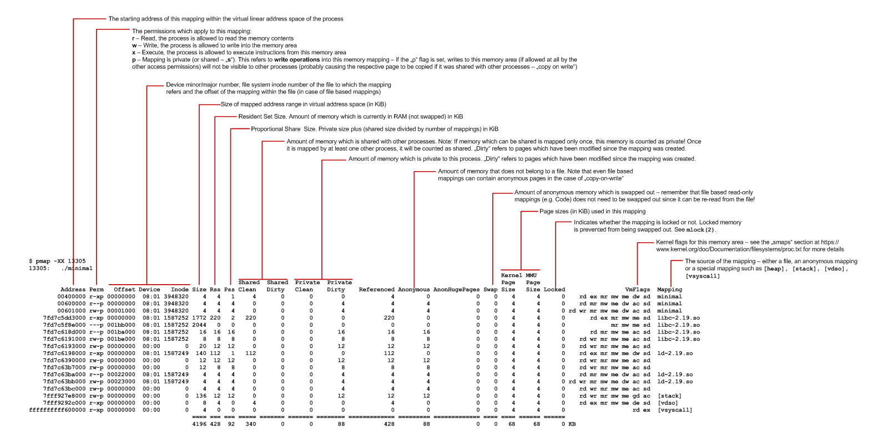

*[图片源：https://bell-sw.com/announcements/2020/10/28/JVM-in-Linux-containers-surviving-the-isolation/]*


- [介绍](#介绍)
- [测试环境](#测试环境)
- [配置容量](#配置容量)
    - [POD 容量配置](#pod-容量配置)
    - [JVM 容量配置](#jvm-容量配置)
      - [神秘的 `MaxDirectMemorySize` 默认值](#神秘的-maxdirectmemorysize-默认值)
      - [`maxThreadCount` 最大线程数来源](#maxthreadcount-最大线程数来源)
- [使用量](#使用量)
  - [Java 的视角看使用量](#java-的视角看使用量)
    - [如何采集`实际使用量`](#如何采集实际使用量)
  - [原生应用的视角看使用量](#原生应用的视角看使用量)
    - [*lib.so 动态库占用](#libso-动态库占用)
    - [*.jar mapping 占用](#jar-mapping-占用)
    - [glibc malloc 消耗](#glibc-malloc-消耗)
    - [GC 内存消耗](#gc-内存消耗)
    - [tmpfs 内存消耗](#tmpfs-内存消耗)
  - [操作系统 RSS](#操作系统-rss)
    - [CGroup 限制](#cgroup-限制)
- [潜在问题和推荐解决方法](#潜在问题和推荐解决方法)
    - [Native Buffer 限制](#native-buffer-限制)
    - [glibc malloc `arena` 的浪费](#glibc-malloc-arena-的浪费)
    - [Jetty 线程池](#jetty-线程池)
    - [Java code cache 慢涨](#java-code-cache-慢涨)
    - [容器的内存限制](#容器的内存限制)
- [展望](#展望)
- [免责声明](#免责声明)
- [体会](#体会)


## 介绍

相信很多人都知道，云环境中，所有服务都必须作资源限制。内存作为一个重要资源当然不会例外。限制说得容易，但如何在限制的同时，保证服务的性能指标(SLA)就是个技术和艺术活。

为应用内存设置上限，从来不是个容易的事。因为设置上限的理据是：
- 应用程序对内存的使用和回收逻辑，而这个逻辑一般异常地复杂
- 现代操作系统复杂的虚拟内存管理、物理内存分配、回收机制

如果是 Java ，还要加上：
- JVM 中各类型组件的内存管理机制

以上 3 个方面还可以进一步细分。每一个细分都有它的内存机制。而只要我们漏算了其中一个，就有可能让应用总内存使用超限。

**而让人揪心的是，当应用总内存使用超限时，操作系统会无情地杀死应用进程(OOM, Out Of Memory)**。而很多人对这一无所觉，只知道容器重启了。而这可能是连锁反应的开端：
- 如果容器 OOM 的原因只是个偶然，那还好说。如果是个 BUG 引起的，那么这种 OOM 可能会在服务的所有容器中逐个爆发，最后服务瘫痪
- 原来服务容器群的资源就紧张，一个容器 OOM 关闭了，负载均衡把流量分到其它容器，于是其它容器也出现同样的 OOM。最后服务瘫痪

JVM 是个 Nice 的经理，在发现内存紧张时，就不厌其烦地停止应用线程和执行 GC，而这种内存紧张的信号，在设计界称为“背压(Backpressure)”。
但操作系统相反，是个雷厉风行的司令，一发现有进程超限，直接一枪 OOM Killed。

> *或者你深入研究过 cgroup memory，它其实也有一个 Backpressure 的通知机制，不过现在的容器和 JVM 均忽略之。*

终上所述，容器进程 OOM Kllled 是件应该避免，但需要深入研究才能避免的事情。

网路上，我们可以找到很多现实案例和教训:


Java 内存管理很复杂。我们对它了解越多，应用出现 OOM Killed 的可能性就越低。下面我拿一个遇到的测试案例进行分析。

分析报告分为两个部分:
1. 研究应用实测出的指标、内存消耗，内存限制配置
2. 潜在的问题和改进建议

## 测试环境

```
主机：裸机(BareMetal)
CPU: 40 cores, 共 80 个超线程
Linux:
  Kernel: 5.3.18
  glibc: libc-2.26.so
Java: 1.8.0_261-b12
Web/Servlet 容器： Jetty
```

## 配置容量

#### POD 容量配置

```yaml
    resources:
      limits:
        cpu: "8"
        memory: 4Gi
        # 4Gi = 4 * 1024Mb = 4*1024*1024k = 4194304k = 4294967296 bytes = 4096Mb
      requests:
        cpu: "2"
        memory: 4Gi
```

#### JVM 容量配置

开始说 JVM 容量配置前，我假设你已经对 JVM 内存使用情况有个基本印象:


*图片源：https://www.twblogs.net/a/5d80afd1bd9eee541c349550?lang=zh-cn*


下面是我在测试环境收集到的配置:

|   | 配置 | 实际生效配置(Mbyte) |
|---|---|---|
| Young Heap + Old Heap  | `-Xmx3G` -XX:+AlwaysPreTouch   | 3072 |
|  MaxMetaspaceSize | [默认] | Unlimited |
| CompressedClassSpaceSize | [默认] | 1024  |
|  MaxDirectMemorySize |  [默认] | 3072  |
|  ReservedCodeCacheSize |  [默认] | 240  |
| ThreadStackSize*maxThreadCount | [默认] * 276(实测线程数) | 276 |
|||
|**汇总**||**7684 + (没限制 MaxMetaspaceSize)** |


##### 神秘的 `MaxDirectMemorySize` 默认值

`MaxDirectMemorySize` 默认值，https://docs.oracle.com/javase/8/docs/technotes/tools/unix/java.html 如事说：
> Sets the maximum total size (in bytes) of the New I/O (the java.nio package) direct-buffer allocations. Append the letter k or K to indicate kilobytes, m or M to indicate megabytes, g or G to indicate gigabytes. By 默认, the size is set to 0, meaning that the JVM chooses the size for NIO direct-buffer allocations automatically.

意思就是说了等于没说 🤨。

在我的测试环境中, 我使用 `Arthas` attached 到 JVM 然后查看内部的静态变量:
```bash
[arthas@112]$ dashboard
ognl -c 30367620 '@io.netty.util.internal.PlatformDependent@maxDirectMemory()'
@Long[3,221,225,472]

ognl '@java.nio.Bits@maxMemory'
@Long[3,221,225,472]
```

3221225472/1024/1024 = 3072.0 Mb

> 如果你想深入，请参考资料:
> * http://www.mastertheboss.com/java/troubleshooting-outofmemoryerror-direct-buffer-memory/
> * https://developer.aliyun.com/article/2948
> ```
> MaxDirectMemorySize ~= `from -Xmx (Young Heap + Old Heap )` - `Survivor(Young) Capacity` ~= 3G
> ```

##### `maxThreadCount` 最大线程数来源

既然上面用了 `Arthas` ， 下面学是继续 `Arthas` 吧:

```bash
[arthas@112]$ dashboard
   Threads Total: 276
```

应用使用的是 Jetty， 线程池配置 `jetty-threadpool.xml`
```xml
<Configure>
  <New id="threadPool" class="org.eclipse.jetty.util.thread.QueuedThreadPool">
    <Set name="maxThreads" type="int"><Property name="jetty.threadPool.maxThreads" deprecated="threads.max" default="200"/></Set>
...
  </New>
</Configure>
```

因为除了 Jetty，还有其它各种线程。

## 使用量

### Java 的视角看使用量

|   | 容量配置 | 生效配置(Mbyte) | 实际使用(Mbyte) |
|---|---|---|---|
| Young Heap + Old Heap  | `-Xmx3G` -XX:+AlwaysPreTouch   | 3072 | 3072 |
|  MaxMetaspaceSize | [默认] | Unlimited | 128 |
| CompressedClassSpaceSize | [默认] | 1024  |15 |
|  MaxDirectMemorySize |  [默认] | 3072  | 270 |
|  ReservedCodeCacheSize |  [默认] | 240  | 82 |
| ThreadStackSize*maxThreadCount | [默认]*276线程 | 276 | 276 |
|||
|**Sum**||**7684 + (没限制 MaxMetaspaceSize)** | **3843** |


#### 如何采集`实际使用量`

- ReservedCodeCache

在应用经过热身、压力测试之后，用 `Arthas` attached:
```bash
[arthas@112]$ dashboard
code_cache : 82Mb
```

- DirectMemory

```bash
[arthas@112]$ 
ognl '@java.nio.Bits@reservedMemory.get()'
@Long[1,524,039]
ognl -c 30367620 '@io.netty.util.internal.PlatformDependent@usedDirectMemory()'
@Long[268,435,456]
```

- Metaspace
- CompressedClassSpaceSize

```bash
$ jcmd $PID GC.heap_info

 garbage-first heap   total 3145728K, used 1079227K [0x0000000700000000, 0x0000000700106000, 0x00000007c0000000)
  region size 1024K, 698 young (714752K), 16 survivors (16384K)
 Metaspace       used 127,323K, capacity 132,290K, committed 132,864K, reserved 1,167,360K
  class space    used 14,890K, capacity 15,785K, committed 15,872K, reserved 1,048,576K
```

### 原生应用的视角看使用量

原生应用的视角看使用量，包括下面这个方面：

* *lib.so 动态库占用: 16Mb
* *.jar 文件映射占用: 8Mb
* GC 算法消耗: 未调查
* glibc malloc 空间回收不及时消耗: 158Mb

总的原生应用消耗: 16+8+158 = 182Mb

**小结一下:**
Java 角度看使用量: 3843Mb
总应用使用量 = 3843 + 158 ~= 4001Mb 


4001Mb，这里我们没有算 `*lib.so 动态库占用` 和 `*.jar 文件映射占用`。为什么？将在下面内容中作出解释。
4001Mb 这个数字有点可怕，离容器配置的上限 4096Mb 不远了。但这个数字有一定水分。为什么？将在下面内容中作出解释。

以下我尝试分析每个子项的数据来源

#### *lib.so 动态库占用

运行命令：
```bash
pmap -X $PID
```

部分输出：
```
         Address Perm   Offset Device      Inode     Size     Rss     Pss Referenced Anonymous  Mapping
...
    7f281b1b1000 r-xp 00000000  08:03 1243611251       48      48       3         48         0  /lib64/libcrypt-2.26.so
    7f281b1bd000 ---p 0000c000  08:03 1243611251     2044       0       0          0         0  /lib64/libcrypt-2.26.so
    7f281b3bc000 r--p 0000b000  08:03 1243611251        4       4       4          4         4  /lib64/libcrypt-2.26.so
    7f281b3bd000 rw-p 0000c000  08:03 1243611251        4       4       4          4         4  /lib64/libcrypt-2.26.so
...
    7f28775a5000 r-xp 00000000  08:03 1243611255       92      92       5         92         0  /lib64/libgcc_s.so.1
    7f28775bc000 ---p 00017000  08:03 1243611255     2048       0       0          0         0  /lib64/libgcc_s.so.1
    7f28777bc000 r--p 00017000  08:03 1243611255        4       4       4          4         4  /lib64/libgcc_s.so.1
    7f28777bd000 rw-p 00018000  08:03 1243611255        4       4       4          4         4  /lib64/libgcc_s.so.1
    7f28777be000 r-xp 00000000  08:03 1800445487      224      64       4         64         0  /opt/jdk1.8.0_261/jre/lib/amd64/libsunec.so
    7f28777f6000 ---p 00038000  08:03 1800445487     2044       0       0          0         0  /opt/jdk1.8.0_261/jre/lib/amd64/libsunec.so
    7f28779f5000 r--p 00037000  08:03 1800445487       20      20      20         20        20  /opt/jdk1.8.0_261/jre/lib/amd64/libsunec.so
    7f28779fa000 rw-p 0003c000  08:03 1800445487        8       8       8          8         8  /opt/jdk1.8.0_261/jre/lib/amd64/libsunec.so
...
    7f28f43a7000 r-xp 00000000  08:03 1243611284       76      76       3         76         0  /lib64/libresolv-2.26.so
    7f28f43ba000 ---p 00013000  08:03 1243611284     2048       0       0          0         0  /lib64/libresolv-2.26.so
    7f28f45ba000 r--p 00013000  08:03 1243611284        4       4       4          4         4  /lib64/libresolv-2.26.so
    7f28f45bb000 rw-p 00014000  08:03 1243611284        4       4       4          4         4  /lib64/libresolv-2.26.so
    7f28f45bc000 rw-p 00000000  00:00          0        8       0       0          0         0  
    7f28f45be000 r-xp 00000000  08:03 1243611272       20      20       1         20         0  /lib64/libnss_dns-2.26.so
    7f28f45c3000 ---p 00005000  08:03 1243611272     2044       0       0          0         0  /lib64/libnss_dns-2.26.so
    7f28f47c2000 r--p 00004000  08:03 1243611272        4       4       4          4         4  /lib64/libnss_dns-2.26.so
    7f28f47c3000 rw-p 00005000  08:03 1243611272        4       4       4          4         4  /lib64/libnss_dns-2.26.so
    7f28f47c4000 r-xp 00000000  08:03 1243611274       48      48       2         48         0  /lib64/libnss_files-2.26.so
    7f28f47d0000 ---p 0000c000  08:03 1243611274     2044       0       0          0         0  /lib64/libnss_files-2.26.so
    7f28f49cf000 r--p 0000b000  08:03 1243611274        4       4       4          4         4  /lib64/libnss_files-2.26.so
    7f28f49d0000 rw-p 0000c000  08:03 1243611274        4       4       4          4         4  /lib64/libnss_files-2.26.so
    7f28f49d1000 rw-p 00000000  00:00          0     2072    2048    2048       2048      2048  
    7f28f4bd7000 r-xp 00000000  08:03 1800445476       88      88       6         88         0  /opt/jdk1.8.0_261/jre/lib/amd64/libnet.so
    7f28f4bed000 ---p 00016000  08:03 1800445476     2044       0       0          0         0  /opt/jdk1.8.0_261/jre/lib/amd64/libnet.so
    7f28f4dec000 r--p 00015000  08:03 1800445476        4       4       4          4         4  /opt/jdk1.8.0_261/jre/lib/amd64/libnet.so
    7f28f4ded000 rw-p 00016000  08:03 1800445476        4       4       4          4         4  /opt/jdk1.8.0_261/jre/lib/amd64/libnet.so
    7f28f4dee000 r-xp 00000000  08:03 1800445477       68      64       4         64         0  /opt/jdk1.8.0_261/jre/lib/amd64/libnio.so
    7f28f4dff000 ---p 00011000  08:03 1800445477     2044       0       0          0         0  /opt/jdk1.8.0_261/jre/lib/amd64/libnio.so
    7f28f4ffe000 r--p 00010000  08:03 1800445477        4       4       4          4         4  /opt/jdk1.8.0_261/jre/lib/amd64/libnio.so
    7f28f4fff000 rw-p 00011000  08:03 1800445477        4       4       4          4         4  /opt/jdk1.8.0_261/jre/lib/amd64/libnio.so
```

> 💡 如果你不太了解 Linux 的 memory map 和 pmap 的输出，建议阅读： https://www.labcorner.de/cheat-sheet-understanding-the-pmap1-output/ 。
如果你懒惰如我，我还是上个图吧：
> 

大家知道，现代操作系统都有进程间共享物理内存的机制，以节省物理内存。如果你了解COW(Copy on Write)就更好了。一台物理机上，运行着多个容器，而容器的镜像其实是分层的。对于同一个机构生成的不同服务的镜像，很多时候是会基于同一个基础层，而这个基础层包括是 Java 的相关库。而所谓的层不过是主机上的目录。即不同容器可能会共享读(Mapping)同一文件。

回到我们的主题，内存限制。容器通过 cgroup 限制内存。而 cgroup 会记账容器内进程的每一次内存分配。而文件映射共享内存的计算方法显然要特别处理，因为跨了进程和容器。现在能查到的资料是说，只有第一个读/写这块 mapping 内存的 cgroup 才记账(https://www.kernel.org/doc/Documentation/cgroup-v1/memory.txt 中 [2.3 Shared Page Accounting])。所以这个账比较难预计的，一般我们只做最坏情况的保留。

#### *.jar mapping 占用
```bash
pmap -X $PID
```

记账原理和上面的 *.so 类似。不过 Java 9 后，就不再做 *.jar mapping 了。就算是 Java 8 ，也只是 mapping 文件中的目录结构部分。

在我的测试中，只使用了 8Mb 内存.

#### glibc malloc 消耗

Java 在两种情况下使用 glibc malloc:
1. NIO Direct Byte Buffer / Netty Direct Byte Buffer
2. JVM 内部基础程序


业界对 `glibc malloc` 的浪费颇有微词. 主要集中在不及时的内存归还(给操作系统）。这种浪费和主机的 CPU 数成比例，可参考:
* https://medium.com/nerds-malt/java-in-k8s-how-weve-reduced-memory-usage-without-changing-any-code-cbef5d740ad
* https://systemadminspro.com/java-in-docker-cpu-limits-server-class-machine/
* https://www.cnblogs.com/seasonsluo/p/java_virt.html


不幸的是，我的测试环境是祼机，所有 CPU 都给容器看到了。而主机是 80 个 CPU 的。那么问题来了，如何测量浪费了多少？
`glibc` 提供了一个 `malloc_stats(3)` 函数，它会输出堆信息（包括使用和保留）到标准输出流。那么问题又来了。如何调用这个函数？修改代码，写JNI吗？当然可以。不过，作为一个 Geek，当然要使用 `gdb` 。

```bash
cat <<"EOF" > ~/.gdbinit
handle SIGSEGV nostop noprint pass
handle SIGBUS nostop noprint pass
handle SIGFPE nostop noprint pass
handle SIGPIPE nostop noprint pass
handle SIGILL nostop noprint pass
EOF

export PID=`pgrep java`
gdb --batch --pid $PID --ex 'call malloc_stats()'
```

输出：
```
Arena 0:
system bytes     =     135168
in use bytes     =      89712
Arena 1:
system bytes     =     135168
in use bytes     =       2224
Arena 2:
system bytes     =     319488
in use bytes     =      24960
Arena 3:
system bytes     =     249856
in use bytes     =       2992
...
Arena 270:
system bytes     =    1462272
in use bytes     =     583280
Arena 271:
system bytes     =   67661824
in use bytes     =   61308192


Total (incl. mmap):
system bytes     =  638345216
in use bytes     =  472750720
max mmap regions =         45
max mmap bytes   =  343977984
```


所以结果是: 638345216 - 472750720 = 165594496 ~= 158Mb
即浪费了 158Mb。因为我测试场景负载不大，在负载大，并发大的场景下，80个CPU 的浪费远不止这样。

有一点需要指出的，操作系统物理内存分配是 Lazy 分配的，即只在实际读写内存时，才分配，所以，上面的 158Mb 从操作系统的 RSS 来看，可能会变小。

#### GC 内存消耗

*未调查*

#### tmpfs 内存消耗

*未调查*

### 操作系统 RSS

RSS(pmap -X $PID) = 3920MB。即操作系统认为使用了 3920MB 的物理内存。

#### CGroup 限制
cgroup limit 4Gi = 4*1024Mb = 4096Mb
pagecache 可用空间 : 4096 - 3920 = 176Mb

下面看看 cgroup 的 `memory.stat` 文件
```bash
$ cat cgroup `memory.stat` file
    rss 3920Mb
    cache 272Mb
    active_anon 3740Mb
    inactive_file 203Mb
    active_file 72Mb  # bytes of file-backed memory on active LRU list
```

细心如你会发现:
```
3920 + 272 = 4192 > 4096Mb
```

不对啊，为何还不 OOM killed? 

说来话长， pagecache 是块有弹性的内存空间，当应用需要 anonymous 内存时，内核可以自动回收 pagecache.
> 💡 *感兴趣可参考:*
> https://engineering.linkedin.com/blog/2016/08/don_t-let-linux-control-groups-uncontrolled
> https://github.com/kubernetes/kubernetes/issues/43916
> https://www.kernel.org/doc/html/latest/admin-guide/cgroup-v1/memory.html


## 潜在问题和推荐解决方法

#### Native Buffer 限制

默认 `MaxDirectMemorySize` ~= `-Xmx` - `survivor size` ~= 3G .

这在高并发时，内存得不到及时回收时，会使用大量的 Direct Byte Buffer。所以建议显式设置限制：
```bash
java ... -XX:MaxDirectMemorySize=350Mb
```

> 💡 *感兴趣可参考:*
> - `Cassandra` 客户端和 `Redisson` 均基于 `Netty`，固均使用了 `Native Buffer`. 注意的是 `Netty` 在 `Unsafe.class` 基础上，还有内部的内存池。

#### glibc malloc `arena` 的浪费

在我的测试环境中，主机有 80 个CPU。glibc 为了减少多线程分配内存时的锁竞争，在高并发时最多为每个 CPU 保留 8 个内存块(`Arena`)，而 `Arena` 的空间归还给操作系统的时机是不可预期的，和堆中内存碎片等情况有关。
在我的测试环境中观察的结果是：共创建了 271 个`Arena`。使用了 608Mb 的 RSS。而实际程序用到的内存只有 450Mb。**浪费了 157 Mb**。浪费的情况有随机性，和内存碎片等情况有关。对于容器，我们不可能分配所有主机的 CPU。可以设置一个显式上限是合理的，且这个上限和容器的 memory limit、CPU limit 应该联动。

`MALLOC_ARENA_MAX` 这个环境变量就是用于配置这个上限的。

* 和内存使用的联系:
我们实测中，共使用了 700Mb glibc 堆内存. 而每个 `Arena` 大小为 64Mb. 所以:
```
700/64=10 Arena
```

* 和容器 cpu limit 的联系:
```
8 cpu * (每个cpu 8 arena) = 64 Arena.
```

我们保守地使用大的保留空间:

```bash
export MALLOC_ARENA_MAX=64
```

> 💡 *感兴趣可参考:*
> https://www.gnu.org/software/libc/manual/html_node/Memory-Allocation-Tunables.html

#### Jetty 线程池

经调查，每 API 的调用用时大约 100 ms。而现有配置指定了最大 200 个线程。所以:

```
200 thread / 0.1s = 2000 TPS
```

在我们的测试中，单容器的 TPS 不出 1000。所以 100 个线程足以。减少线程数的好处是，可以同时可以减少过度的线程上下文切换、cgroup CPU 限流(cpu throttling)、线程堆栈内存、Native Buffer 内存。让请求堆在 Request Queue，而不是内核的 Runnale Queue。

```xml
<!-- jetty-threadpool.xml -->
<Configure>
  <New id="threadPool" class="org.eclipse.jetty.util.thread.QueuedThreadPool">
...
    <Set name="maxThreads" type="int"><Property name="jetty.threadPool.maxThreads" deprecated="threads.max" default="100"/></Set>
...
  </New>
</Configure>
```

#### Java code cache 慢涨

在我们测试中，在经过系统预热后，Java code cache 仍然会慢涨。Java 8 的 code cache 最大值是 240Mb。 如果 code cache 消耗了大量的内存，可能会触发 OOM killed。 所以还是要作显式限制的。 从测试环境的观察，100Mb 的空间已经足够。

```bash
java ... -XX:ReservedCodeCacheSize=100M -XX:UseCodeCacheFlushing=true
```

> 💡 *感兴趣可参考:*
> https://docs.oracle.com/javase/8/embedded/develop-apps-platforms/codecache.htm


#### 容器的内存限制

从上面的调查可知，  `3G java heap` + `JVM overhead` + `DirectByteBuffer` 已经很接近 `4Gi` 的容器内存上限了。在高并发情况下，OOM killed 风险还是很高的。而且这个问题在测试环境不一定能出现，有它的随机性。

cgroup 对容器接近 OOM 的次数是有记录(memory.failcnt)的，在测试时发现这个数字在慢张。在内存紧张的时候，内核通过丢弃文件缓存(pagecache)来优先满足应用对内存的需求。而丢弃文件缓存意味什么？更慢的读，更频繁和慢的写硬盘。如果应用有读写IO压力，如果读 *.jar，写日志，那么 IO 慢问题会随之而来。

```bash
watch cat ./memory.failcnt 
19369
```

> 💡 *感兴趣可参考:*
> https://engineering.linkedin.com/blog/2016/08/don_t-let-linux-control-groups-uncontrolled
> https://www.kernel.org/doc/Documentation/cgroup-v1/memory.txt
> https://srvaroa.github.io/jvm/kubernetes/memory/docker/oomkiller/2019/05/29/k8s-and-java.html

对于我的应用，我建议是放宽内存限制：

```yaml
    resources:
      limits:
        memory: 4.5Gi
      requests:
        memory: 4.5Gi
```

## 展望

不全面地说，从服务运维者的角度看, **服务的资源分配基于这些系数**:
* 容器的 SLA
  * 目标容器的呑吐量

如我把上面系数作为一个工具程序的 `输入`, 那么 `输出` 应该是:
* 应该部署多少个容器
* 每个容器的资源配置应该如何
  * CPU
    * 容器 CPU limit
    * 应用线程池 limit
  * Memory
    * 容器 memory limit
    * 应用线程池 limit: 
      * java: 堆内/堆外

> 💡 *有一个开源工具可参考:*
> https://github.com/cloudfoundry/java-buildpack-memory-calculator

## 免责声明
Every coin has two sides， 应用调优更是，每种调优方法均有其所需要的环境前提，不然就不叫调优，直接上开源项目的默认配置 Pull Request 了。大师常说，不要简单 copy 调参就用。要考虑自己的实际情况，然后作充分测试方可使用。

## 体会
2016 年开始，各大公司开始追赶时尚，把应用放入容器。而由于很多旧项目和组件在设计时，没考虑在一个受限容器中运行，说白了，就是非 contaier aware。时隔数年，情况有所好转，但还是有不少坑。而作为一个合格的架构师，除了 PPT 和远方外，我们还得有个玻璃心。

以上是对一个 Java 容器内存的分析，如果你对 Java 容器 CPU和线程参数有兴趣，请移步：[Java 容器化的历史坑（史坑） - 资源限制篇](https://blog.mygraphql.com/zh/posts/cloud/containerize/java-containerize/java-containerize-resource-limit/)。

用一个漫画了结本文：


