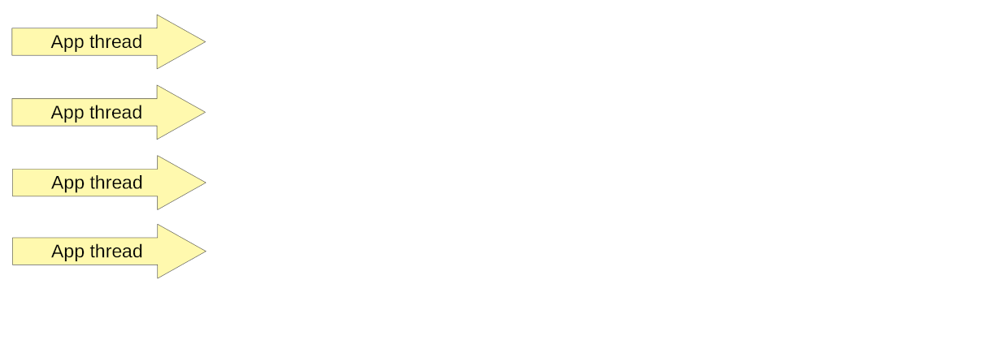
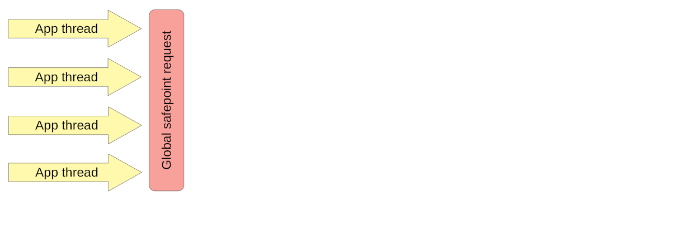
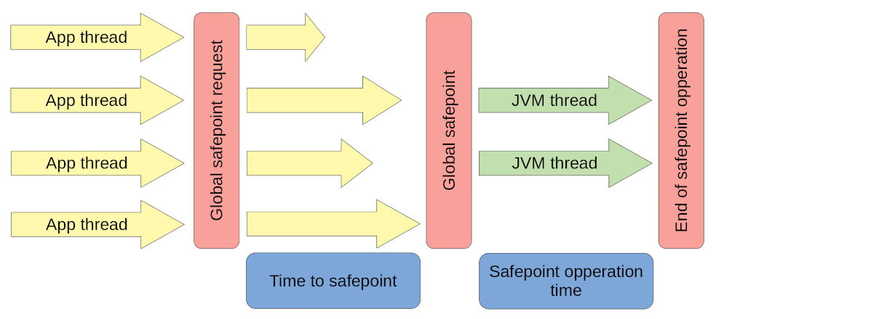
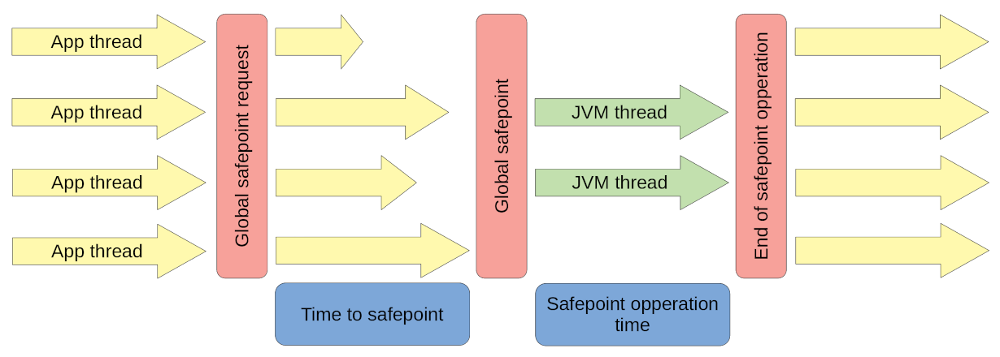
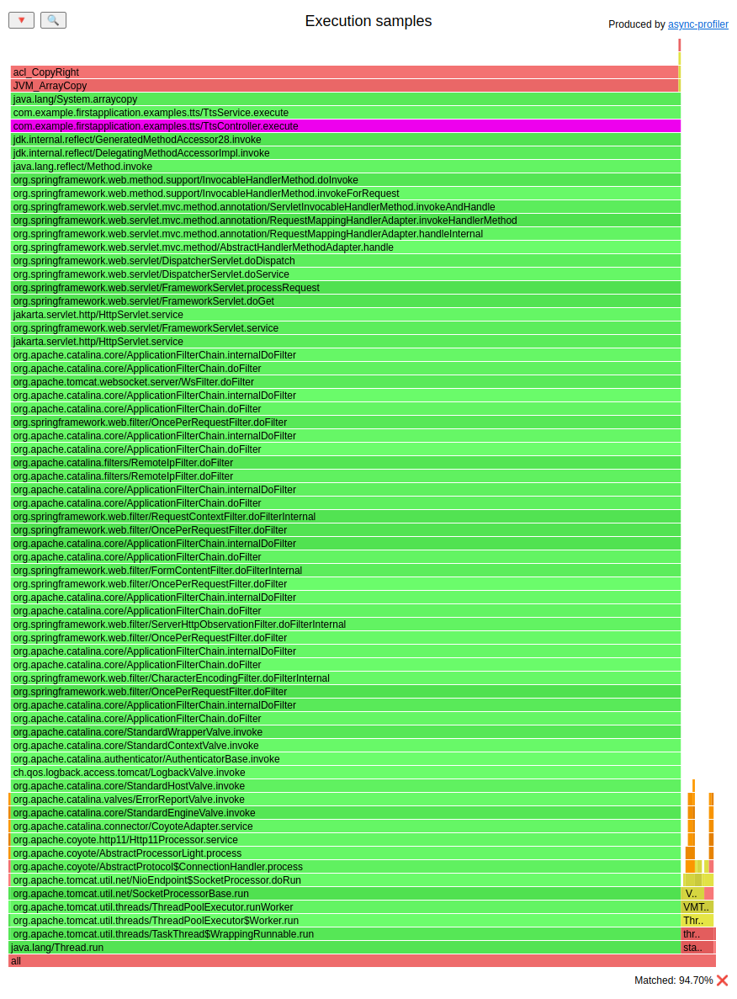
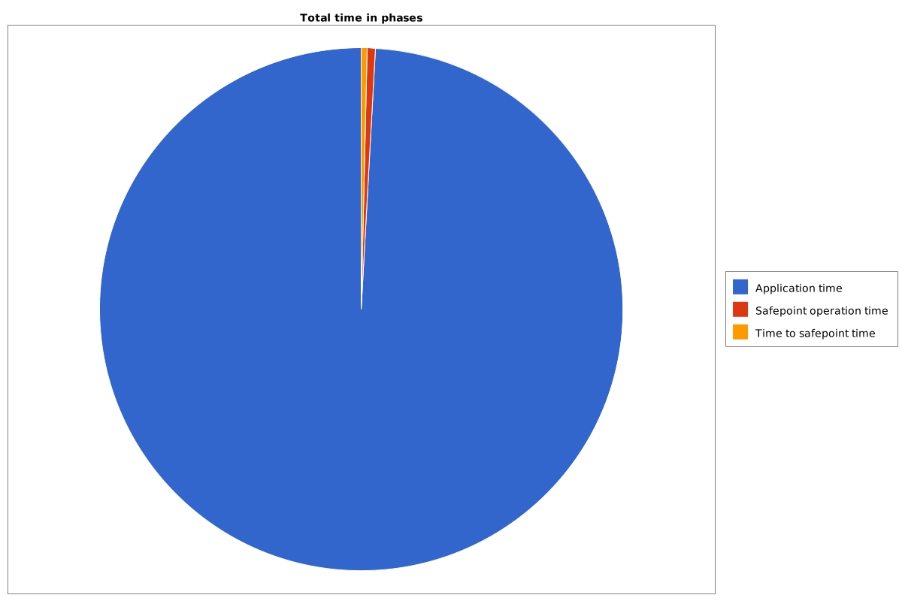
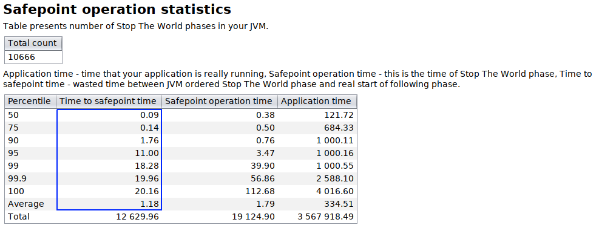
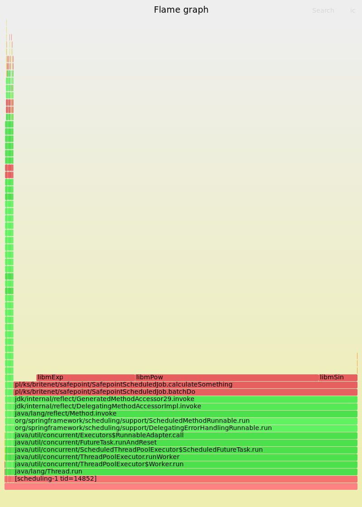
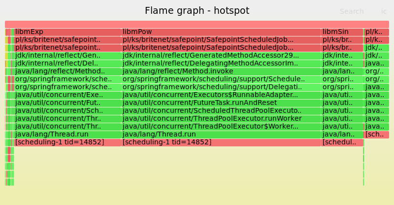
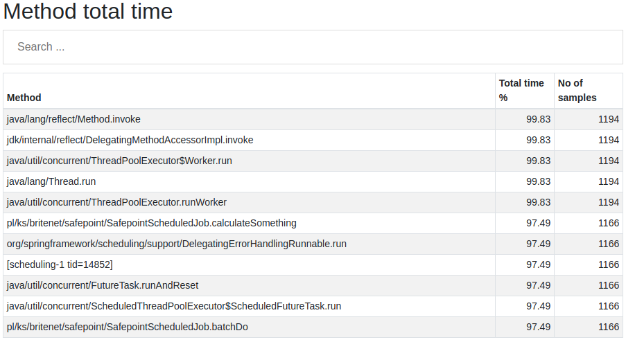

# Async-Profiler - Time to safepoint

> from https://krzysztofslusarski.github.io/2022/12/12/async-manual.html#tts


## Time to safepoint

The common misconception in the Java world is that *garbage collectors* need a Stop-the-world (STW) phase to clean dead objects: But **not only GC needs it**. Other internal mechanisms require application threads to be paused. For example, the JVM needs an STW phase to *deoptimize* some compilations and to revoke *biased locks*. Let’s get a closer look at how the STW phase works.

On our JVM, there are running some application threads:



While running those threads from time to time, JVM needs to do some work in the STW phase. So it starts this phase, with a *global safepoint request*, which informs every thread to go to “sleep”:



Every thread has to find out about this. Stopping at a safepoint is cooperative: Each thread checks at certain points in the code if it needs to suspend. The time in which threads will be aware of an STW phase is different for every thread. Every thread has to wait for the slowest one. The time between starting an STW phase, and the slowest thread suspension, is called *time to safepoint*:


JVM threads can do the work that needs the STW phase only after every thread is asleep. The time when all application threads sleep, is called *safepoint operation time*:



When the JVM finishes its work, application threads are wakened up:



If the application suffers from long STW phases, then most of the time, those are GC cycles, and that information can be found in the GC logs or JFR. But the situation is more tricky if the application has one thread that slows down every other from reaching the safepoint.

```
# preparation
curl http://localhost:8081/examples/tts/start
ab -n 100 -c 1 http://localhost:8081/examples/tts/execute

# profiling
./profiler.sh start --ttsp -f tts.jfr first-application-0.0.1-SNAPSHOT.jar
ab -n 100 -c 1 http://localhost:8081/examples/tts/execute
./profiler.sh stop -f tts.jfr first-application-0.0.1-SNAPSHOT.jar
```

In safepoint logs (you need to run your JVM with the `-Xlog:safepoint` flag), we can see:

```
[105,372s][info ][safepoint   ] Safepoint "ThreadDump", Time since last: 156842 ns, Reaching safepoint: 13381 ns, At safepoint: 120662 ns, Total: 134043 ns
[105,372s][info ][safepoint   ] Safepoint "ThreadDump", Time since last: 157113 ns, Reaching safepoint: 14738 ns, At safepoint: 120252 ns, Total: 134990 ns
[105,373s][info ][safepoint   ] Safepoint "ThreadDump", Time since last: 157676 ns, Reaching safepoint: 13700 ns, At safepoint: 120487 ns, Total: 134187 ns
[105,402s][info ][safepoint   ] Safepoint "ThreadDump", Time since last: 159020 ns, Reaching safepoint: 29524545 ns, At safepoint: 160702 ns, Total: 29685247 ns
```

*Reaching safepoint* contains the time to safepoint. Most of the time, it is **<15 ms**, but we also see one outlier: **29 ms**. Async-profiler in `--ttsp` mode collects samples between:

- `SafepointSynchronize::begin`, and
- `RuntimeService::record_safepoint_synchronized`

During that time, our application threads are trying to reach a safepoint: ([HTML](https://krzysztofslusarski.github.io/assets/async-demos/tts.html))



We can see that most of the gathered samples are executing `arraycopy`, invoked from `TtsController`. The time to safepoint issues that I have approached so far are:

- **arraycopy** - as in our example
- **old JDK + loops** - since JDK 11u4 we have an *loop strip mining* optimization working correctly (after fixing [JDK-8220374](https://bugs.java.com/bugdatabase/view_bug.do?bug_id=JDK-8220374)), before that if you had a counted loop, it could be compiled without any check for safepoint
- **swap** - when your application thread executes some work in *thread_in_vm* state (after calling some native method),
  and during that execution, it waits for some pages to be swapped in/out, which can slow down reaching the safepoint

The solution for the **arraycopy** issue is to copy larger arrays by some custom method, which might use **arraycopy** for smaller sub-arrays. It will be a bit slower, but it will not slow down the whole application when reaching a safepoint is required.

For the **swap** issue, just disable the swap.


## *Time to safepoint* - finally there is a tool to find long ones, and yes it is the async-profiler

> From https://krzysztofslusarski.github.io/2020/11/14/tts.html


## What are *safepoints* and *time to safepoint*?

If you are not familiar with those terms please read [this article](https://krzysztofslusarski.github.io/2020/11/13/stw.html) first.

## Problem to fix

As I mentioned in the article above one compilation can make a whole application slow. To do this it needs to have a **long \*time to safepoint\***. This problem is more visible if:

- there are **multiple application threads** running
- the JVM is doing **many \*safepoint operations\***
- compilations with **long \*time to safepoint\*** are run frequently

## How can we diagnose such a problem?

The easiest way is to enable *safepoint* logs and do an analysis of its output. I wrote how to do it in the article mentioned above. We can see on a following pie chart, that there is some visible time spent on *time to safepoint* (**orange** part of chart):



We can also calculate average and percentiles:



The **“100 percentile”** shows that there was a STW phase, where at least one thread needed **20.16ms** to reach *safepoint*. That is not a good result.

## What JVM offers us to find such a compilation?

There are **2 flags** that can help us in detection of long *time to safepoint*.

```
-XX:+SafepointTimeout
-XX:SafepointTimeoutDelay=100
```

Such settings will print an information about a thread that *time to safepoint* was **longer** than **100ms**. Sample output of that situation:

```
# SafepointSynchronize::begin: Timeout detected:
# SafepointSynchronize::begin: Timed out while spinning to reach a safepoint.
# SafepointSynchronize::begin: Threads which did not reach the safepoint:
# "main" #1 prio=5 os_prio=0 cpu=1191,10ms elapsed=16,19s tid=0x00007f58bc014000 nid=0x130d runnable  [0x0000000000000000]
   java.lang.Thread.State: RUNNABLE
# SafepointSynchronize::begin: (End of list)
```

In the fourth line we can see thread name that is causing troubles: **main**.

The other thing that we can do in newest JDKs is to add:

```
-XX:+UnlockDiagnosticVMOptions
-XX:+AbortVMOnSafepointTimeout
```

Sample output:

```
# A fatal error has been detected by the Java Runtime Environment:
#
#  SIGILL (0x4) at pc=0x00007f020091191f (sent by kill), pid=12321, tid=12325
#
# JRE version: OpenJDK Runtime Environment (11.0.6+10) (build 11.0.6+10-LTS)
# Java VM: OpenJDK 64-Bit Server VM (11.0.6+10-LTS, mixed mode, tiered, compressed oops, g1 gc, linux-amd64)
# Problematic frame:
# v  ~StubRoutines::libmPow
#
# Core dump will be written. Default location: Core dumps may be processed with "/lib/systemd/systemd-coredump %P %u %g %s %t 9223372036854775808 %h" (or dumping to /tmp/core.12321)
#
# An error report file with more information is saved as:
# /tmp/hs_err_pid12321.log
Compiled method (c2)   16223  221       4       pl.britenet.codecache.math.MathLock::calculateSomething (29 bytes)
 total in heap  [0x00007f02084be990,0x00007f02084beeb0] = 1312
 relocation     [0x00007f02084beb08,0x00007f02084beb10] = 8
 main code      [0x00007f02084beb20,0x00007f02084bee60] = 832
 stub code      [0x00007f02084bee60,0x00007f02084bee78] = 24
 oops           [0x00007f02084bee78,0x00007f02084bee80] = 8
 scopes data    [0x00007f02084bee80,0x00007f02084bee88] = 8
 scopes pcs     [0x00007f02084bee88,0x00007f02084beea8] = 32
 dependencies   [0x00007f02084beea8,0x00007f02084beeb0] = 8
Could not load hsdis-amd64.so; library not loadable; PrintAssembly is disabled
#
# If you would like to submit a bug report, please visit:
#   http://bugreport.java.com/bugreport/crash.jsp
#
```

Unfortunately this option **kills JVM** when it hits *time to safepoint* timeout. Most useful information from that output is:

```
# Problematic frame:
# v  ~StubRoutines::libmPow
```

It can also create *core dump* if you have proper settings on your OS level.

Now you have to connect that *StubRoutines::libmPow* is an ***intrinsic\* method**, and in the Java code it is `java.lang.Math.pow()`. It is not an easy task to do if you are not familiar with JIT internals.

## At last: solution! Async-profiler

There is a new feature in the **async-profiler** that allow you to pass to profiler:

- on which method the profiler should start its work
- on which method the profiler should end its work

As described in the [issue #74](https://github.com/jvm-profiling-tools/async-profiler/issues/74) it can be used to track *time to safepoints*. We simply need to pass following parameters to async-profiler.

```
--begin SafepointSynchronize::begin --end RuntimeService::record_safepoint_synchronized
```

This feature is available in **version 2.0**. While writing this article this version is already in “early access” stage.

## Demo time

Long time ago I prepared an application that suffered from a long *time to safepoint* issue. Let’s run the profiler on this application with parameters:

- **-t** - dump also thread names
- **-d 10** - duration time is 10 seconds
- **-o collapsed** - result file will be in *collapsed stack* format
- **-f /tmp/tts.collased** - result file path
- **–begin SafepointSynchronize::begin –end RuntimeService::record_safepoint_synchronized** - *time to safepoint* profiling
- **SafepointApplication** - it is a name of my main class

```
./profiler.sh -t -d 10 -o collapsed -f /tmp/tts.collased --begin SafepointSynchronize::begin --end RuntimeService::record_safepoint_synchronized SafepointApplication
```

### Demo result

The result is in *collapsed stack* format, I will use my own open source tool [collapsed-stack-viewer](https://github.com/krzysztofslusarski/collapsed-stack-viewer) to view it. First, let’s generate a **flame graph**:



This flame graph starts with a thread name at the **bottom**. From this one we can see that:

- There is one thread that caused long *time to safepoint*: `scheduling-1`
- Almost all the time application waited to reach the *safepoint* was spent in method `pl/ks/britenet/safepoint/SafepointScheduledJob.calculateSomething`

Source code of that method:

```
static double calculateSomething(int iterations, double start) {
    for (int i = 0; i < iterations; i++) {
        start += Math.pow(Math.exp(start), Math.sin(start));
    }
    return start;
}
```

### What is wrong with that method?

If you look in the source code of JDK you will find, that `Math.pow()`, `Math.exp()`, `Math.sin()` are *intrinsic* methods:

```
@HotSpotIntrinsicCandidate
public static double pow(double a, double b) {
    return StrictMath.pow(a, b); // default impl. delegates to StrictMath
}

@HotSpotIntrinsicCandidate
public static double exp(double a) {
    return StrictMath.exp(a); // default impl. delegates to StrictMath
}

@HotSpotIntrinsicCandidate
public static double sin(double a) {
    return StrictMath.sin(a); // default impl. delegates to StrictMath
}
```

Mind that the `@HotSpotIntrinsicCandidate` annotation was introduced in Java 9.

So this method is basically a loop where we count something using 3 *intrinsic* methods. In the loop there is used `int` as incremental value with known end value. For JVM this is something that is called ***counted loop\***. Now:

- *Counted loops* didn’t have *safepoint* before optimization ***loop strip mining\*** (introduced in Java **10**, working good in Java **11u4**, after fixing [JDK-8220374](https://bugs.openjdk.java.net/browse/JDK-8220374))
- *Intrinsics* doesn’t have *safepoint*

So the first *safepoint* in `calculateSomething` after being JIT compiled is at the end of the method.

One more thing about the *loop strip mining*: **it is not enabled by default with every GC**. As far as I know it is enabled only with **G1, Z and Shenandoah**. In other collectors, like **parallel or CMS**, you need to add additional VM arguments to make it work:

```
-XX:+UseCountedLoopSafepoints
-XX:LoopStripMiningIter=1000
```

### Problem with one thread is an easy one

If the flame graph with threads names would show that problem exists in multiple threads then I would generate a *hotspot flame graph*:



Also I would look for methods with a long *total time* in [collapsed-stack-viewer](https://github.com/krzysztofslusarski/collapsed-stack-viewer).



That is how I usually look for any resource consuming methods in my Java applications.

## Great, but how to fix it?

### Upgrade, upgrade, upgrade

I saw applications where simple upgrades form Java **11u2** to **11u4** solved the problem. The *loop strip mining* optimization helped.

### *Counted loops*

If you have an issue with *counted loops* you can make them *uncounted*, usually this is very simple, but you have to know which loop is *counted*. if you don’t know it here is [an article for you](http://psy-lob-saw.blogspot.com/2016/02/wait-for-it-counteduncounted-loops.html).

### Array copy :(

From JDK source code:

```
@HotSpotIntrinsicCandidate
public static native void arraycopy(Object src,  int  srcPos,
                                    Object dest, int destPos,
                                    int length);
```

I saw an application where this method was a problem. Whole `arraycopy` method has no *safepoint* at all, so if you are copying large arrays it may cause a long *time to safepoint*. If your application uses this method directly you can write your own `arraycopy`. Your implementation will not be as fast as the *intrinsic* one, but **only the thread that uses it will suffer**, not the whole application.

If problematic `arraycopy` is used by deep JDK internals or any of your framework then, well, you are screwed. I know some solutions, but they are very ugly.

## Divide and conquer

There are situations where you can take the problematic part of the application and move it to another one (or completely new). With this method you **won’t eliminate** the problem, but you will make the rest of your application not vulnerable to long *time to safepoint* issue.
