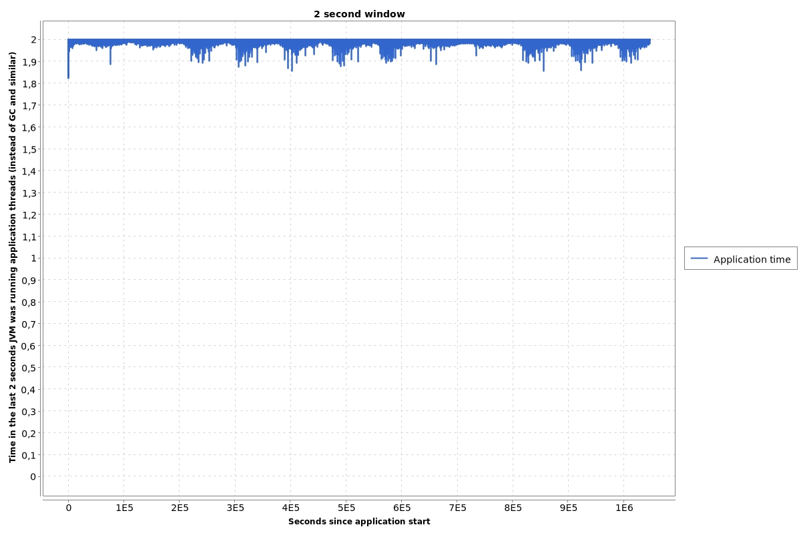
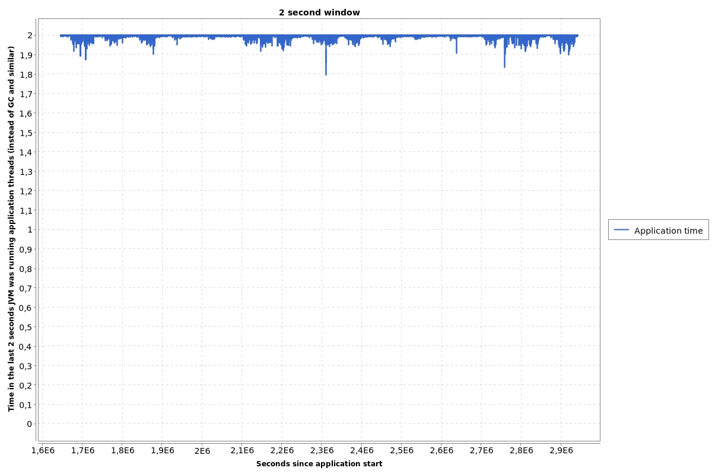
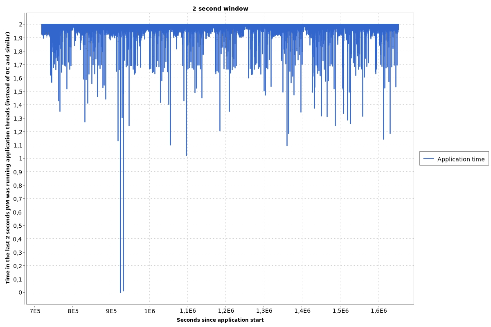
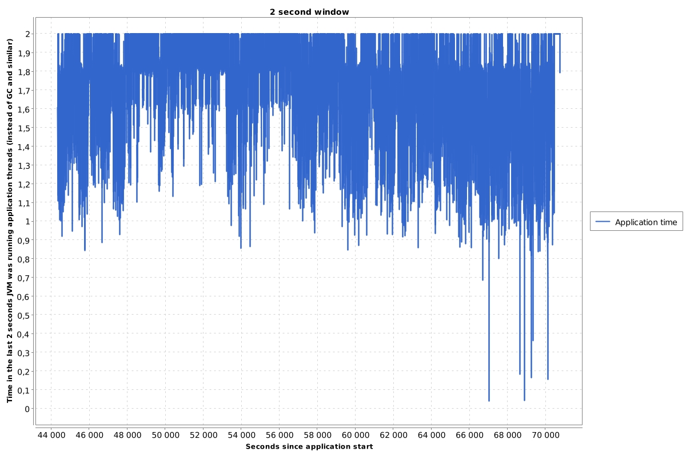
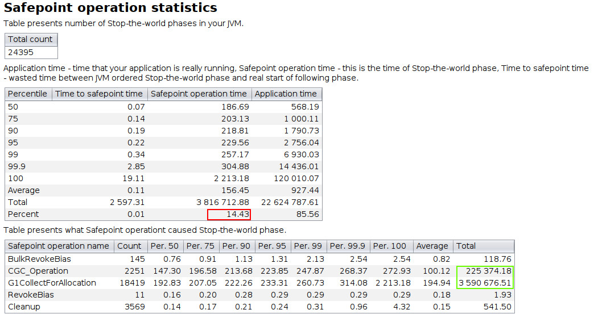
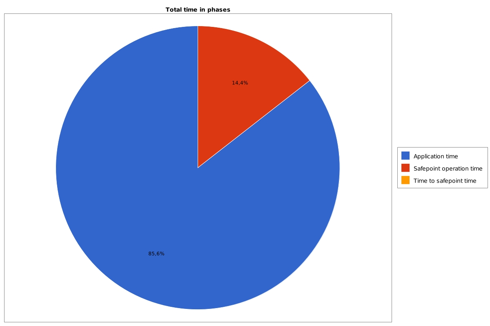
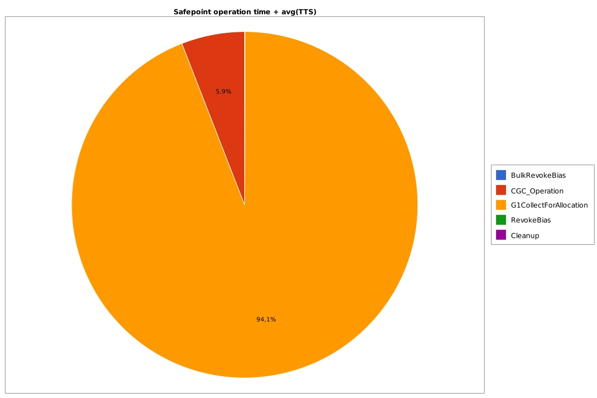

# JVM logs - introduction and safepoints logs

> https://krzysztofslusarski.github.io/2021/07/16/monday-intro.html


The JVM logs are **a powerful source of knowledge** on how our application works on the virtual machine. Unfortunately they are not very well documented. In this series of articles I will try to show you what you can read from them. I will not cover how the JVM works, but I will add references if I have one.

All charts that you will find in the series are generated by my [open-source project](https://github.com/krzysztofslusarski/jvm-gc-logs-analyzer).

JVM logs I recommend:

```
-Xlog:
    codecache+sweep*=trace,
    class+unload,
    class+load,
    os+thread,
    safepoint,
    gc*,
    gc+stringdedup=debug,
    gc+ergo=trace,
    gc+age=trace,
    gc+phases=trace,
    gc+humongous=trace,
    jit+compilation=debug
:file=/path_to_logs/app.log
:level,tags,time,uptime,pid
:filesize=104857600,filecount=5
```

## Reference - safepoints

[My previous article about the STW phase](https://krzysztofslusarski.github.io/2020/11/13/stw.html)

[YouTube - With GC Solved, What Else Makes a JVM Pause?](https://www.youtube.com/watch?v=Y39kllzX1P8)

## Logging

*Safepoints* has dedicated logs in a *unified logger*. You can enable it with `Xlog:safepoint`. A following example comes from **Java 11**:

```
[safepoint        ] Application time: 0.1950250 seconds
[safepoint        ] Entering safepoint region: RevokeBias
[safepoint        ] Leaving safepoint region
[safepoint        ] Total time for which application threads were stopped: 0.0003424 seconds, Stopping threads took: 0.0000491 seconds
```

A little bit of explanation what that means:

- First line “Application time: **0.1950250**”: this is a time from last STW phase
- Second line “Entering safepoint region: **RevokeBias**”: this is a name of *safepoint operation* that needed STW phase
- Last line “Total time for which application threads were stopped: **0.0003424**”: this is a sum of *time to safepoint* and *safepoint operation time*
- Last line “Stopping threads took: **0.0000491**”: this is a *time to safepoint*

The format is different in **Java 8** and **Java >= 13**, but other formats contain the same information.

## *The mother of all chats*

When I profile an application that is running on the JVM the first chart I’m looking at is the chart that shows me in a **2 seconds window** how much time was wasted by the **stop-the-world** phases. Drawing that chart is a little pain in the ass, but my *JVM logs viewer* has such a functionality.



That chart shows **12 days** of running a very huge application. This chart shows that **in the 2 seconds window** the application always runs over **1.8** seconds, usually over **1.9** seconds.

The other example for a small application:



Here is an example of the application which doesn’t work well on the JVM:



This example shows the application which doesn’t work at all on the JVM:



## Safepoints statistics

If we know that our application doesn’t work well on the JVM we can generate statistics that show us, which **STW phase** is responsible for that issue.



These tables show that **14,43%** (marked as red) of total application time our JVM executes operations in **STW phase**. This value should be less than **1%**. The two most time-consuming operations are (marked as green):

- G1CollectForAllocation
- CGC_Operation

Both operations are related to G1GC.

We can also present this statistics as charts:

## Total time in phases



## Which *safepoint operation* is most time-consuming



## Why are *safepoint logs* so important?

Most Java developers think that the **STW phase** is needed for *Garbage Collector*. Yes, most of the issues on JVM level are related to GC, but not all of them. If you have an issue with:

- other *safepoint opperation*, not related to GC
- *time to safepoint*

you will not find the cause in the *GC logs*, you need *safepoints logs*.
