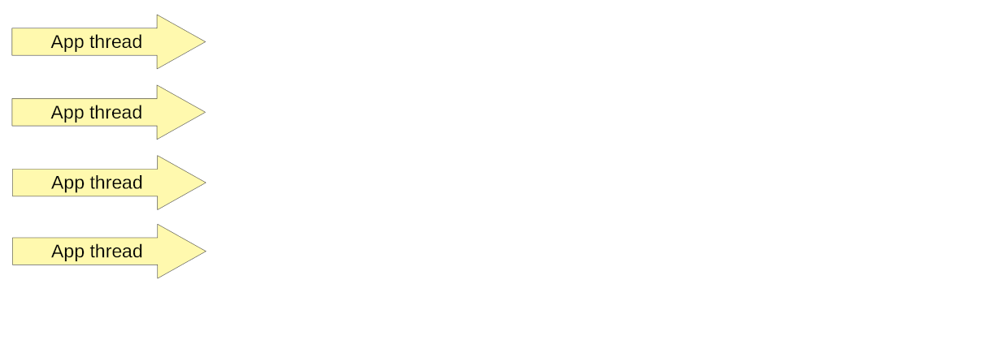
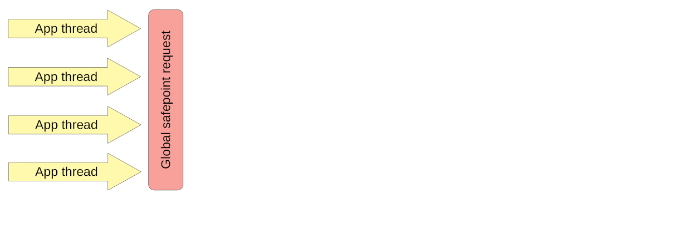
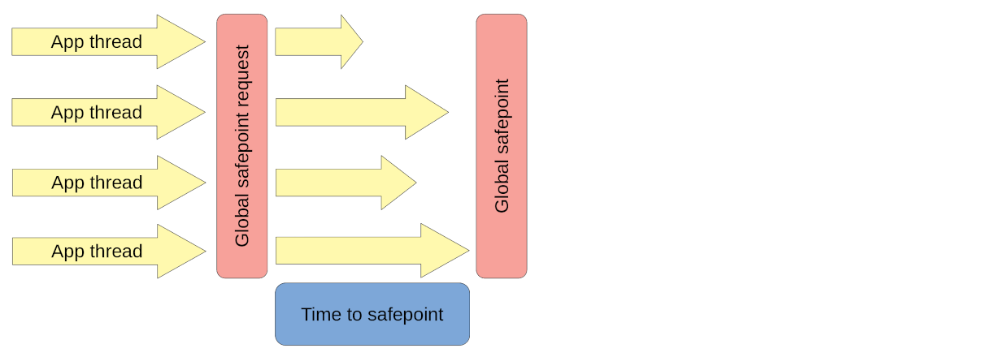
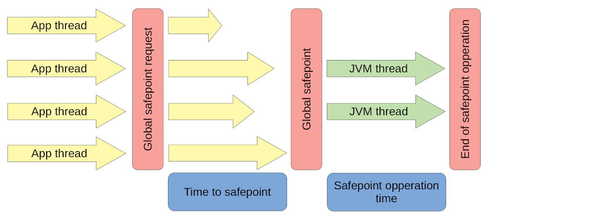
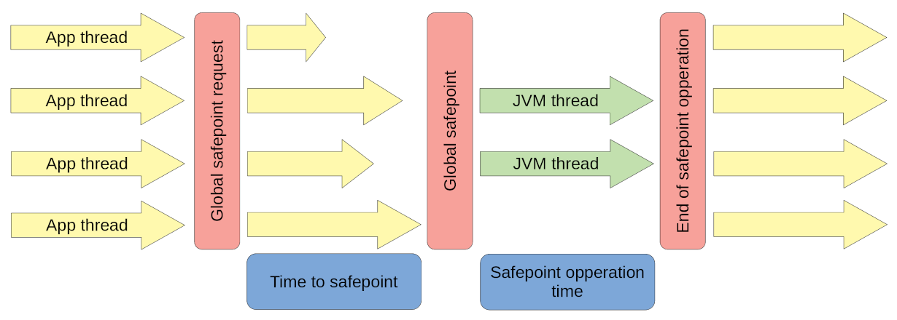
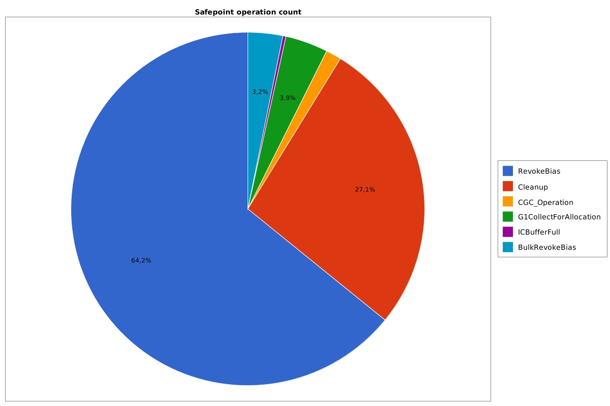
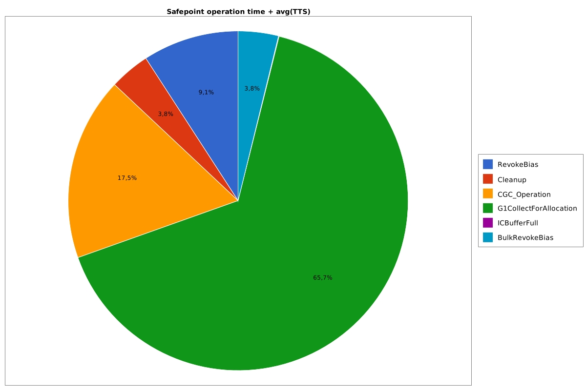
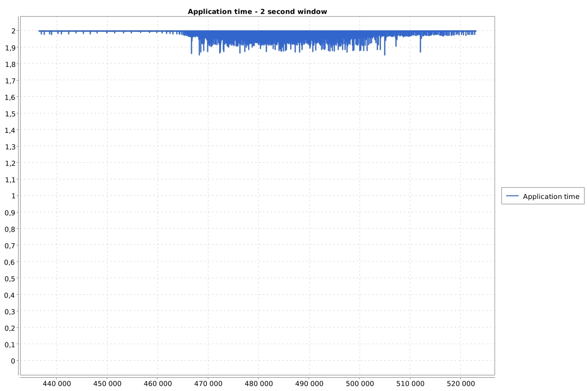
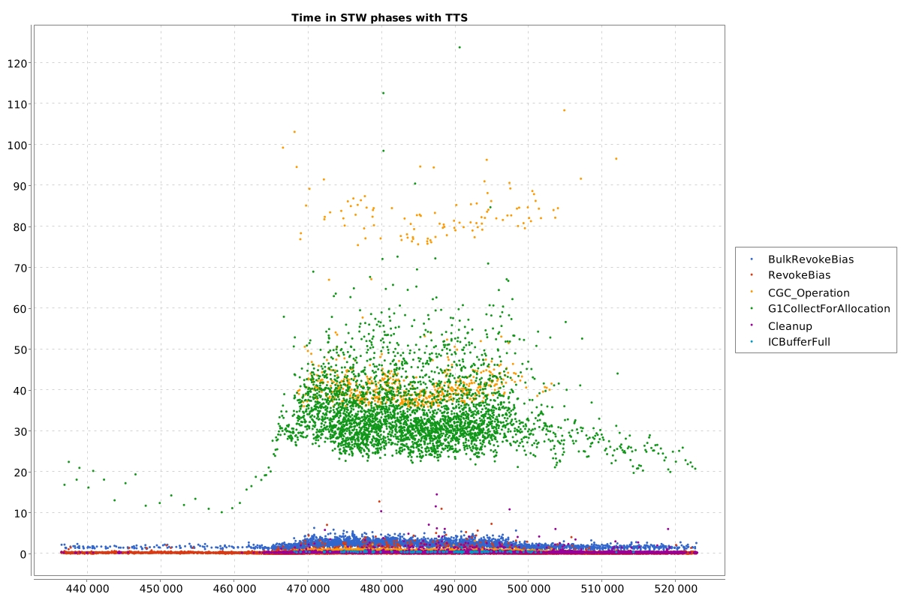

# JVM internals basics - Stop-the-world phase (safepoints) - how it works?

> https://krzysztofslusarski.github.io/2020/11/13/stw.html


# [Java][JVM] JVM internals basics - Stop-the-world phase (safepoints) - how it works?

## Why does the JVM need STW phase?

The common knowledge in the Java developers world is that *garbage collectors* need STW phase to clean dead objects. First of all, **not only GC needs it**. There are other internal mechanisms that need to do some work, that require application threads to be hanged . For example JIT compiler needs STW phase to *deoptimize* some compilations and to revoke *biased locks*.

## How it works step by step

On your JVM there are running some application threads:



While running those threads from time to time JVM needs to do some work in the STW phase. So it start it with *global safepoint request*, which is an information for every thread to go to sleep:



Every thread has to find out about this information. Checking if it needs to fall asleep is simply a line on assembly code generated by the JIT compiler and a simple step in the interpreter. Of course every thread can now execute a different method/JIT compilation, so time in which threads are going to be aware of STW phase is different for every thread.
Every thread has to wait for the slowest one. Time between starting STW phase, and the slowest thread finding that information is called *time to safepoint*:



Only after every thread is asleep, JVM threads can do the work that needed STW phase. A time when application threads were sleeping is called *safepoint operation time*:



When JVM finishes its work application threads are waken up:



## What is important from all of this?

- **Not only GC causes STW phases**
- If your application has a **long \*time to safepoint\*** then without that knowledge you probably won’t find it
- **STW phase stops entire JVM**, so if you have multiple applications deployed on one JVM, one application has impact to all the rest
- ***Time to safepoint\*** is the time of the slowest thread to reach the *safepoint*, **single compilation** can make a whole application slow, if it is running frequently

## Logging

*Safepoints* has dedicated logs in a *unified logger*. You can enable it with `Xlog:safepoint`. A following example comes from **Java 11**:

```
[safepoint        ] Application time: 0.1950250 seconds
[safepoint        ] Entering safepoint region: RevokeBias
[safepoint        ] Leaving safepoint region
[safepoint        ] Total time for which application threads were stopped: 0.0003424 seconds, Stopping threads took: 0.0000491 seconds
```

A little bit of explanation what that means:

- First line “Application time: **0.1950250**”: this is a time from last STW phase
- Second line “Entering safepoint region: **RevokeBias**”: this is a name of *safepoint operation* that needed STW phase
- Last line “Total time for which application threads were stopped: **0.0003424**”: this is a sum of *time to safepoint* and *safepoint operation time*
- Last line “Stopping threads took: **0.0000491**”: this is a *time to safepoint*

From that log we can generate cool charts. The first one is a pie chart that shows where our application is spending its time:


Second one shows distribution of count of each *safepoint operation*:



Next one shows distribution of time wasted by *safepoint operation*:



Next one is probably **the most important** one, it shows in two second window which fraction of that time we spent running our application. If I have an issue in any JVM application this is the first chart I look on.



The last one shows distribution of time wasted in STW phases over time:



## Final words

The *Safepoints* logs are the only place where you can find complex information about all STW phases with *time to safepoint*. You should have them enabled on every JVM.
