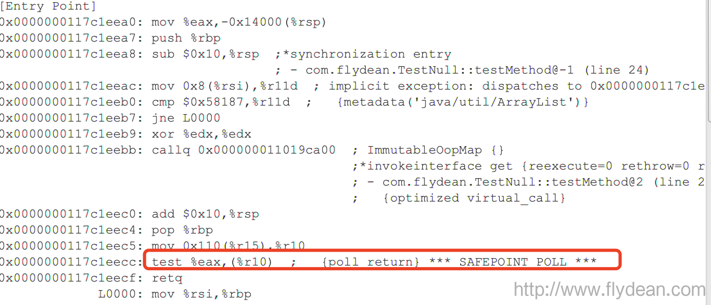
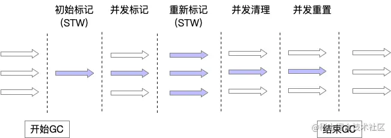
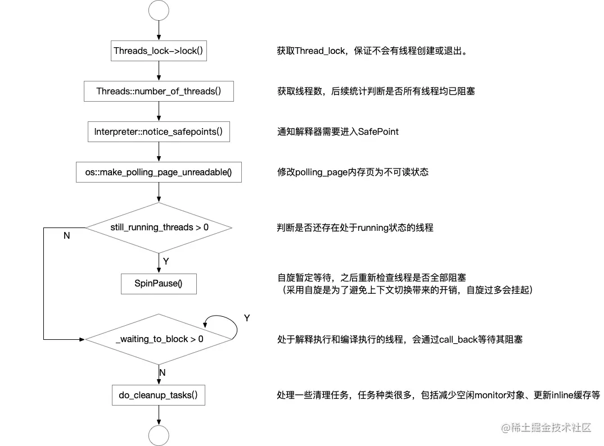
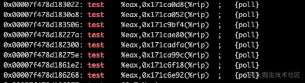
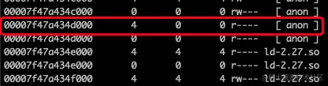
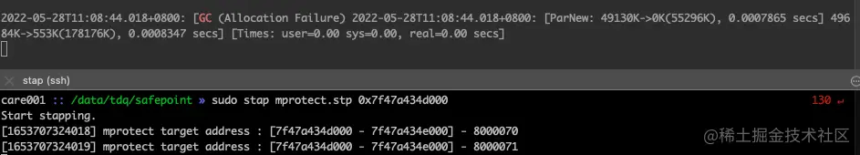

# JVM internals basics - Stop-the-world phase (safepoints) - how it works?

> https://krzysztofslusarski.github.io/2020/11/13/stw.html


# [Java][JVM] JVM internals basics - Stop-the-world phase (safepoints) - how it works?

## Why does the JVM need STW phase?

The common knowledge in the Java developers world is that *garbage collectors* need STW phase to clean dead objects. First of all, **not only GC needs it**. There are other internal mechanisms that need to do some work, that require application threads to be hanged . For example JIT compiler needs STW phase to *deoptimize* some compilations and to revoke *biased locks*.

## How it works step by step

On your JVM there are running some application threads:


While running those threads from time to time JVM needs to do some work in the STW phase. So it start it with *global safepoint request*, which is an information for every thread to go to sleep:


Every thread has to find out about this information. Checking if it needs to fall asleep is simply a line on assembly code generated by the JIT compiler and a simple step in the interpreter. Of course every thread can now execute a different method/JIT compilation, so time in which threads are going to be aware of STW phase is different for every thread.
Every thread has to wait for the slowest one. Time between starting STW phase, and the slowest thread finding that information is called *time to safepoint*:


Only after every thread is asleep, JVM threads can do the work that needed STW phase. A time when application threads were sleeping is called *safepoint operation time*:


When JVM finishes its work application threads are waken up:


## What is important from all of this?

- **Not only GC causes STW phases**
- If your application has a **long \*time to safepoint\*** then without that knowledge you probably won’t find it
- **STW phase stops entire JVM**, so if you have multiple applications deployed on one JVM, one application has impact to all the rest
- ***Time to safepoint\*** is the time of the slowest thread to reach the *safepoint*, **single compilation** can make a whole application slow, if it is running frequently

## Logging

*Safepoints* has dedicated logs in a *unified logger*. You can enable it with `Xlog:safepoint`. A following example comes from **Java 11**:

```
[safepoint        ] Application time: 0.1950250 seconds
[safepoint        ] Entering safepoint region: RevokeBias
[safepoint        ] Leaving safepoint region
[safepoint        ] Total time for which application threads were stopped: 0.0003424 seconds, Stopping threads took: 0.0000491 seconds
```

A little bit of explanation what that means:

- First line “Application time: **0.1950250**”: this is a time from last STW phase
- Second line “Entering safepoint region: **RevokeBias**”: this is a name of *safepoint operation* that needed STW phase
- Last line “Total time for which application threads were stopped: **0.0003424**”: this is a sum of *time to safepoint* and *safepoint operation time*
- Last line “Stopping threads took: **0.0000491**”: this is a *time to safepoint*

From that log we can generate cool charts. The first one is a pie chart that shows where our application is spending its time:


Second one shows distribution of count of each *safepoint operation*:


Next one shows distribution of time wasted by *safepoint operation*:


Next one is probably **the most important** one, it shows in two second window which fraction of that time we spent running our application. If I have an issue in any JVM application this is the first chart I look on.


The last one shows distribution of time wasted in STW phases over time:


## Final words

The *Safepoints* logs are the only place where you can find complex information about all STW phases with *time to safepoint*. You should have them enabled on every JVM.


## JVM系列之:再谈java中的safepoint

> From http://www.flydean.com/jvm-safepoint2/

# safepoint是什么

java程序里面有很多很多的java线程，每个java线程又有自己的stack，并且共享了heap。这些线程一直运行呀运行，不断对stack和heap进行操作。

这个时候如果JVM需要对stack和heap做一些操作该怎么办呢？

比如JVM要进行GC操作，或者要做heap dump等等，这时候如果线程都在对stack或者heap进行修改，那么将不是一个稳定的状态。GC直接在这种情况下操作stack或者heap，会导致线程的异常。

怎么处理呢？

这个时候safepoint就出场了。

safepoint就是一个安全点，所有的线程执行到安全点的时候就会去检查是否需要执行safepoint操作，如果需要执行，那么所有的线程都将会等待，直到所有的线程进入safepoint。

然后JVM执行相应的操作之后，所有的线程再恢复执行。

# safepoint的例子

我们举个例子，一般safepoint比如容易出现在循环遍历的情况，还是使用我们之前做null测试用的例子：

```java
public class TestNull {

    public static void main(String[] args) throws InterruptedException {
        List<String> list= new ArrayList();
	list.add("www.flydean.com");
        for (int i = 0; i < 10000; i++)
        {
            testMethod(list);
        }
        Thread.sleep(1000);
    }

    private static void testMethod(List<String> list)
    {
        list.get(0);
    }
}
```

运行结果如下：



标红的就是传说中的safepoint。

# 线程什么时候会进入safepoint

那么线程什么时候会进入safepoint呢？

一般来说，如果线程在竞争锁被阻塞，IO被阻塞，或者在等待获得监视器锁状态时，线程就处于safepoint状态。

如果线程再执行JNI代码的哪一个时刻，java线程也处于safepoint状态。因为java线程在执行本地代码之前，需要保存堆栈的状态，让后再移交给native方法。

如果java的字节码正在执行，那么我们不能判断该线程是不是在safepint上。


## 带你彻底了解JVM SafePoint

> From https://juejin.cn/post/7102632781620084767


## 从GC说起

我们知道在GC的过程中，JVM使用可达性分析来判断对象是否有被使用，分析的起点就是`GC Root`。

以CMS为例。



其中，为了能准确的找到`GC Root`关联的引用对象，需要一个机制来保证遍历过程中不会出现引用关系变化，这个机制就是`STW`。

**STW (Stop The World)**，通过字面很容易猜到，该操作仿佛会暂定整个JVM，类似做了一次快照，此时JVM会暂停所有的应用线程，对象引用、线程栈和寄存器、静态对象等均不会被修改变化。

那么问题来了，
 STW是如何实现的呢？
 要怎样才能在需要的时候通知所有应用线程暂停？
 应用线程又是如何知道需要暂停？


答案就是，*SafePoint*， 今天就带你深入底层， 真正了解什么是`SafePoint`。

## SafePoint

### 什么是SafePoint

先来看看HotSpot术语表是如何描述的：

```sql
sql
复制代码A point during program execution at which all GC roots are known and all heap object contents are consistent. From a global point of view, all threads must block at a safepoint before the GC can run. (Except thread running JNI code)
```

在`SafePoint`时，所有的 GC Roots 和堆对象内容将保持一致。从全局来看，所有的线程需要在该时刻阻塞，以便于执行 GC。

### 在哪些场景会进入SafePoint

在JVM中，存在一个单例的原始线程`VM Thread`，它会产生创建所有其他JVM线程，同时也会被其他线程用于执行一些成本较高的`VM Operions`。这些`VM Operations`会保存在`VMOperationQueue`中，通过自轮询方法`loop()`进行处理。（可参考源码/hotspot/src/share/vm/runtime/vmThread.cpp）

而在`VM Thread`退出及轮询处理`VM Operations`的过程中，需要`STW`来保证结果的准确性，就调用 SafepointSynchronize::begin() 进入`SafePoint`。而处理完`VM Operations`后，通过调用 SafepointSynchronize::end() 退出。

- **VM Thread 退出时**

意味着JVM即将关闭，此时会进入`SafePoint`，进行退出前的检查，并等待native thread执行完毕，最终关闭整个JVM。

> 通过源码可以发现，此时的`SafePoint`过程只有begin，没有end。因为JVM已经要关闭了，没有必要再退出。

- **处理VM Operations时**

在处理一些JVM行为时，会进入`SafePoint`，这些JVM行为定义在/hotspot/src/share/vm/runtime/vm_operations.hpp 中。

```scss
scss复制代码#define VM_OPS_DO(template)                       \
  template(Dummy)                                 \
  template(ThreadStop)                            \
  template(ThreadDump)                            \
  template(PrintThreads)                          \
  template(FindDeadlocks)                         \
  template(ForceSafepoint)                        \
  template(ForceAsyncSafepoint)                   \
  template(Deoptimize)                            \
  template(DeoptimizeFrame)                       \
  template(DeoptimizeAll)                         \
  template(ZombieAll)                             \
  template(UnlinkSymbols)                         \
  template(Verify)                                \
  template(PrintJNI)                              \
  template(HeapDumper)                            \
  template(DeoptimizeTheWorld)                    \
  template(CollectForMetadataAllocation)          \
  template(GC_HeapInspection)                     \
  template(GenCollectFull)                        \
  template(GenCollectFullConcurrent)              \
  template(GenCollectForAllocation)               \
  template(ParallelGCFailedAllocation)            \
  template(ParallelGCSystemGC)                    \
  template(CGC_Operation)                         \
  template(CMS_Initial_Mark)                      \
  template(CMS_Final_Remark)                      \
  template(G1CollectFull)                         \
  template(G1CollectForAllocation)                \
  template(G1IncCollectionPause)                  \
  template(DestroyAllocationContext)              \
  template(EnableBiasedLocking)                   \
  template(RevokeBias)                            \
  template(BulkRevokeBias)                        \
  template(PopulateDumpSharedSpace)               \
  template(JNIFunctionTableCopier)                \
  template(RedefineClasses)                       \
  template(GetOwnedMonitorInfo)                   \
  template(GetObjectMonitorUsage)                 \
  template(GetCurrentContendedMonitor)            \
  template(GetStackTrace)                         \
  template(GetMultipleStackTraces)                \
  template(GetAllStackTraces)                     \
  template(GetThreadListStackTraces)              \
  template(GetFrameCount)                         \
  template(GetFrameLocation)                      \
  template(ChangeBreakpoints)                     \
  template(GetOrSetLocal)                         \
  template(GetCurrentLocation)                    \
  template(EnterInterpOnlyMode)                   \
  template(ChangeSingleStep)                      \
  template(HeapWalkOperation)                     \
  template(HeapIterateOperation)                  \
  template(ReportJavaOutOfMemory)                 \
  template(JFRCheckpoint)                         \
  template(Exit)                                  \
  template(LinuxDllLoad)                          \
  template(RotateGCLog)                           \
  template(WhiteBoxOperation)                     \
  template(ClassLoaderStatsOperation)             \
  template(JFROldObject)                          \
```

从中看到一些我们熟悉的身影，包括CMS中的两次STW（CMS_Initial_Mark、CMS_Final_Remark）、JVM thread dump时的STW（ThreadDump）等等。

总体可以归结在以下几个行为类别中：

（1）GC行为
 （2）偏向锁相关行为
 （3）调试行为（threaddump、heapdump、stacktrace等）
 （4）反优化行为
 （5）部分JNI相关行为

### SafePoint的进入过程



### 如何进入SafePoint

这就是一个比较复杂的过程了，JVM线程可能在处理不同的事务，处于不同的状态，为了能够让它们能够进入`SafePoint`，JVM设计了不同的机制。

| 线程状态             | 机制                                                         |
| -------------------- | ------------------------------------------------------------ |
| 解释执行中           | 修改解释器dispatch table，在下一条字节码执行前，强制检查`SafePoint`条件 |
| 本地方法代码段执行中 | 当线程从本地方法调用返回时，必须检查`SafePoint`条件          |
| 编译执行中           | JIT会在编译后的指令中插入检查点，检查点会进行`SafePoint`条件判断 |
| 阻塞中               | 已处于阻塞中，使线程保持阻塞状态即可                         |
| 状态转换中           | 此时会等待线程完成状态转换后阻塞其自身                       |

### 底层原理

看到这里你可能会好奇，线程会在不同的时机检查自己是否需要进入`SafePoint`，但是这个过程是怎样的呢？


对于解释执行来说，只需要告诉解释器在下一条字节码执行前，做条件检查即可，而JNI方法调用结束时，会默认进行`SafePoint`检查。

但是对于JIT编译执行的代码段，已经全部编译生成为可执行的机器码，要怎么判断是否要进入`SafePoint`呢？

在回答这个问题之前，我们先来了解一些概念。

- **Polling Page**

`Polling Page`可以理解为是JVM申请的一块页空间，是专门用于`SafePoint`检测。

在JVM初始化时，会通过mmap申请一块大小为`Linux:page_siez()`（即4K）的空间作为`Polling Page`。

```css
css
复制代码polling_page = (address) ::mmap(NULL, Linux::page_size(), PROT_READ, MAP_PRIVATE|MAP_ANONYMOUS, -1, 0);
```

在初始化时，页空间会设置为可读。

- **SIGSEGV**

这是一个内核发送出来的信号，当线程尝试访问不被允许访问的内存区域，或以错误的类型访问内存区域时，会发出该信号。

- **JVM线程中的信号处理**

JVM线程会通过函数 JVM_handle_linux_signal 来处理收到的信号，在函数内会根据信号的类型进行不同的处理。

当收到`SIGSEGV`信号，且接收信号的线程是应用线程，就会判断发生段错误的地址是不是`Polling Page`。

```rust
rust复制代码if (thread->thread_state() == _thread_in_Java) {
  if (sig == SIGSEGV && os::is_poll_address((address)info->si_addr)) {
    stub = SharedRuntime::get_poll_stub(pc);
  }
}

static bool is_poll_address(address addr)  { 
    return addr >= _polling_page && addr < (_polling_page + os::vm_page_size()); 
}
```

此时，如果发生段错误的地址高于`_polling_page`地址，且在以`_polling_page`地址为起始的一个页空间内，则认为是`Polling Page`发生了段错误，触发`stub`地址对应的注册函数进行处理，而这个注册函数，就是 SafepointSynchronize::handle_polling_page_exception 。

- **JIT埋入的test指令**

我们都知道，JIT会将热点代码编译为本地指令，以加速执行过程。在这个过程中，JIT会在代码段的不同位置埋入`test`指令，该指令会对读取两个参数进行与运算，并将结果保存在标志寄存器中。

- **底层实现**

那么问题的答案就很简单，只要把上面的过程串联起来。

`test`指令就是实现`SafePoint`检查的关键，指令的其中一个参数会设置为`Polling Page`的起始地址。

（1）当不需要进入`SafePoint`时，由于`Polling Page`会初始化为可读状态，所以`test`执行会执行成功，线程继续执行；

（2）当需要进入`SafePoint`时，JVM会将`Polling Page`设置为不可读，此时`test`命令由于尝试读取一块并不允许访问的内存区域而触发段错误，内核发出`SIGSEGV`信号，此时线程收到信号后，就会调用注册的 handle_polling_page_exception 函数进行处理，最终进入`SafePoint`。

### 如何验证

扯了这么多，谁知道你是不是瞎扯，怎么验证呢？


方法很简单，我们找一个业务上用到的JAR包来试试看。

在启动时，带上参数`-XX:+PrintAssembly`，让JVM在执行过程中打印出原始的汇编指令，搜索`test`指令可以看到下面的结果。



第一个参数不重要，重点看第二个参数，（%rip）表示需要使用RIP相对寻址，实际的地址空间需要通过指令地址及偏移量计算出来，以第一条为例：

```ini
ini
复制代码实际地址 = 0x00007f478d183022 + 0x171ca0d8 = 0x7f47a434d0fa
```

此时也能会发现，通过下面的其他`test`指令，算出来的实际地址都指向了同一个内存地址`0x7f47a434d0fa`。

`pmap`一把，看看这块虚拟地址空间。



可以看到是一块4K大小的匿名空间，且处于可读状态。这块区域大概率就是我们要找的`Polling Page`，但是怎么验证进入`SafePoint`时的状态变化呢？

是时候掏出神器`systemtap`，看看对应的内核函数参数就知道了。

Linux内核对VMA的状态修改使用的是`mprotect`中的`mprotect_fixup`，我们来hook一把。

先来看看`mprotect_fixup`方法。

```arduino
arduino复制代码int mprotect_fixup (
        struct vm_area_struct *vma, 
        struct vm_area_struct **pprev,
	unsigned long start, 
        unsigned long end, 
        unsigned long newflags
)
```

其中，`start`和`end`分别是要修改区域的起始和结束位置，`newflags`就是更改后的VMA Mode。

相对应的systemtap脚本如下：

```less
less复制代码probe kernel.function("mprotect_fixup").call {
        time_now = gettimeofday_ms();
        target_address = strtol(@1, 16);
        if ($start == target_address) {
                printf("[%ld] mprotect target address : [%lx - %lx] - %lx\n", time_now, $start, $end, $newflags);
        }
}
```

脚本会传入要监控的虚拟地址，在`mprotect_fixup`调用时，检查是否对指定地址就行变更，如果是，则打印日志输出`newflags`。

为了更明显的看到效果，我们通过GC时的`SafePoint`检查来进行验证，同时在日志中打印了GC时间和mprotect时间，以此来对应数据。



先来看时间，`mprotect`被执行的时间是1653707324018，即2022-05-28 11:08:44.015，和上面的GC时间吻合，意味着在这次YGC时，使用了`mprotect`对地址`0x7f47a434d000 ~ 0x7f47a434e000`进行了状态修改，大小4K，与我们之前找到的`Polling Page`地址段一致。

在这个过程中，`Polling Page`的状态做了两次调整，先修改为了`8000070`，之后立刻修改为了`8000071`，对应状态的含义可以在内核源码`mm.h`中找到。

```arduino
arduino复制代码#define VM_READ		0x00000001

#define VM_MAYREAD	0x00000010	
#define VM_MAYWRITE	0x00000020
#define VM_MAYEXEC	0x00000040

#define VM_MERGEABLE	0x80000000
```

VMA的mode状态是由不同的状态位或运算的结果，`8000071`表示该内存区域可进行合并，可配置读写及执行权限，当前处于可读状态；`8000070`则是在此基础之上关闭了当前的读状态。

由此可见，在进行GC之前，JVM将`Polling Page`设置为`8000070`的不可读状态，此时`test`指令读取地址内容失败，触发段错误，最终进入`SafePoint`。待GC结束后，将`Polling Page`设置为可读状态，结束`SafePoint`。

## 小结

综上所述，JVM通过`SafePoint`来通知所有线程需要阻塞，以此来实现`STW`，在底层实现上方法也比较巧妙，通过控制内存页空间的状态来触发段错误，在处理`SIGSEGV`信号时来实现线程进入`SafePoint`。


## Other Ref.

- [没有发生GC也进入了安全点？这段关于安全点的JVM源码有点意思！](https://segmentfault.com/a/1190000040007821)


