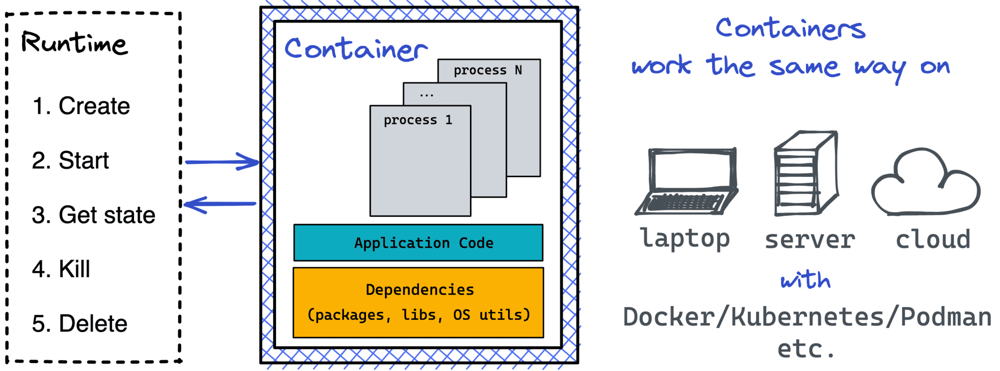
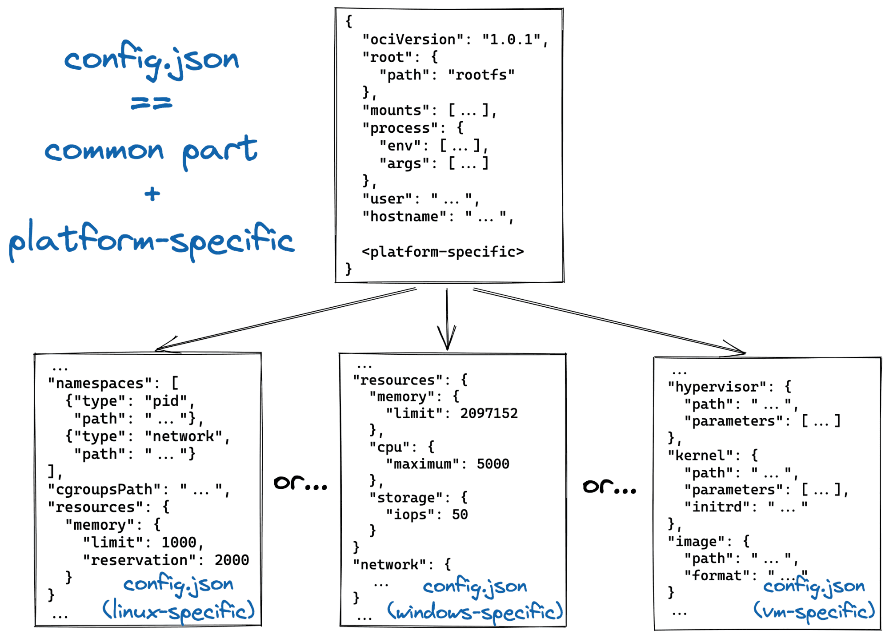
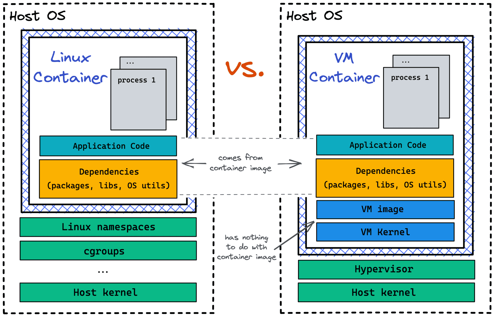

# What Is a Standard Container: Diving Into the OCI Runtime Spec Containers Aren't Linux Processes


> https://iximiuz.com/en/posts/oci-containers/


**TL;DR** Per [OCI Runtime Specification](https://github.com/opencontainers/runtime-spec):

- Containers are isolated and restricted boxes for running processes 📦
- Containers pack an app and all its dependencies (including OS libs) together
- Containers are for portability - any compliant runtime can run a *standard ~~image~~ bundle*
- Containers can be implemented using Linux, Windows, and other OS-es
- Virtual Machines also can be used as *standard* containers 🤐


There are many ways to create containers, especially on Linux and alike. Besides the super widespread Docker implementation, you may have heard about [LXC](https://github.com/lxc/lxc), [systemd-nspawn](https://www.linux.org/docs/man1/systemd-nspawn.html), or maybe even [OpenVZ](https://en.wikipedia.org/wiki/OpenVZ).

The general concept of the container is quite vague. What's true and what's not often depends on the context, but the context itself isn't always given explicitly. For instance, there is a common saying that [containers are Linux processes](https://www.redhat.com/en/blog/containers-are-linux) or that [containers aren't Virtual Machines](https://learn.microsoft.com/en-us/virtualization/windowscontainers/about/containers-vs-vm). However, the first statement is just an oversimplified attempt to explain Linux containers. And the second statement simply isn't always true.

In this article, I'm not trying to review all possible ways of creating containers. Instead, the article is an analysis of the [OCI Runtime Specification](https://github.com/opencontainers/runtime-spec). The spec turned out to be an insightful read! For instance, it gives a definition of the *standard container* (and no, it's not a process) and sheds some light on *when Virtual Machines can be considered containers*.

Containers, as they brought to us by Docker and Podman, are OCI-compliant. Today we even use the terms *container*, *Docker container*, and *Linux container* interchangeably. However, this is just one type of OCI-compliant container. So, let's take a closer look at the [OCI Runtime Specification](https://github.com/opencontainers/runtime-spec).

## What is Open Container Initiative (OCI)

Open Container Initiative (OCI) is an open governance structure that was established in 2015 by Docker and other prominent players of the container industry to *[express the purpose of creating open industry standards around container formats and runtimes](https://opencontainers.org/)*. In other words, *[OCI develops specifications for standards on Operating System process and application containers.](https://github.com/opencontainers/runtime-spec)*

<details open="" style="box-sizing: border-box; color: rgb(255, 255, 255); font-family: &quot;Helvetica Neue&quot;, Helvetica, &quot;Segoe UI&quot;, Arial, freesans, sans-serif, &quot;Apple Color Emoji&quot;, &quot;Segoe UI Emoji&quot;, &quot;Segoe UI Symbol&quot;; font-size: 17px; font-style: normal; font-variant-ligatures: normal; font-variant-caps: normal; font-weight: 400; letter-spacing: normal; orphans: 2; text-align: start; text-indent: 0px; text-transform: none; white-space: normal; widows: 2; word-spacing: 0px; -webkit-text-stroke-width: 0px; background-color: rgb(26, 26, 24); text-decoration-thickness: initial; text-decoration-style: initial; text-decoration-color: initial;"><summary style="box-sizing: border-box; cursor: pointer; color: rgb(190, 195, 191); margin: 20px 0px;">Also think it's too many fancy words for such a small paragraph?</summary><p style="margin: 0px 0px 16px; padding: 0px; border: 0px; outline: 0px; font-weight: inherit; font-style: inherit; font-family: &quot;Helvetica Neue&quot;, Helvetica, &quot;Segoe UI&quot;, Arial, freesans, sans-serif, &quot;Apple Color Emoji&quot;, &quot;Segoe UI Emoji&quot;, &quot;Segoe UI Symbol&quot;; font-size: 17px; vertical-align: baseline; box-sizing: border-box;">Here is how I understand it. By 2015 Docker already gained quite some popularity, but there were other competing projects implementing their own containers like<span>&nbsp;</span><a href="https://github.com/rkt/rkt" style="color: rgb(190, 195, 191); margin: 0px; padding: 0px; border: 0px; outline: 0px; font-weight: inherit; font-style: inherit; font-family: &quot;Helvetica Neue&quot;, Helvetica, &quot;Segoe UI&quot;, Arial, freesans, sans-serif, &quot;Apple Color Emoji&quot;, &quot;Segoe UI Emoji&quot;, &quot;Segoe UI Symbol&quot;; font-size: 17px; vertical-align: baseline; box-sizing: border-box; background-color: transparent; text-decoration: none;">rkt</a><span>&nbsp;</span>and<span>&nbsp;</span><a href="https://github.com/google/lmctfy" style="color: rgb(190, 195, 191); margin: 0px; padding: 0px; border: 0px; outline: 0px; font-weight: inherit; font-style: inherit; font-family: &quot;Helvetica Neue&quot;, Helvetica, &quot;Segoe UI&quot;, Arial, freesans, sans-serif, &quot;Apple Color Emoji&quot;, &quot;Segoe UI Emoji&quot;, &quot;Segoe UI Symbol&quot;; font-size: 17px; vertical-align: baseline; box-sizing: border-box; background-color: transparent; text-decoration: none;">lmctfy</a>. Apparently, the OCI was established<span>&nbsp;</span><u style="box-sizing: border-box;"><i style="box-sizing: border-box;">to standardize the way of doing containers</i></u>. De facto, it made the Docker's container implementation a standard one, but some non-Docker parts were incorporated too.</p></details>

## What is an OCI Container

So, [how does OCI define a *Container* nowadays](https://github.com/opencontainers/runtime-spec/blob/20a2d9782986ec2a7e0812ebe1515f73736c6a0c/glossary.md#container)?

> A Standard Container is an environment for executing processes with configurable isolation and resource limitations.

[Why do we even need containers?](https://github.com/opencontainers/runtime-spec/blob/20a2d9782986ec2a7e0812ebe1515f73736c6a0c/principles.md#the-5-principles-of-standard-containers)

> [To] define a unit of software delivery ... The **goal of a Standard Container is to encapsulate a software component and all its dependencies** in a format that is self-describing and portable, so that **any compliant runtime can run it** without extra dependencies, regardless of the underlying machine and the contents of the container.

Ok, and [what can we do with containers?](https://github.com/opencontainers/runtime-spec/blob/20a2d9782986ec2a7e0812ebe1515f73736c6a0c/runtime.md)

> [Containers] can be created, started, and stopped using standard container tools; copied and snapshotted using standard filesystem tools; and downloaded and uploaded using standard network tools.



*Operations on containers that OCI runtimes must support: [Create](https://github.com/opencontainers/runtime-spec/blob/20a2d9782986ec2a7e0812ebe1515f73736c6a0c/runtime.md#create), [Start](https://github.com/opencontainers/runtime-spec/blob/20a2d9782986ec2a7e0812ebe1515f73736c6a0c/runtime.md#start), [Kill](https://github.com/opencontainers/runtime-spec/blob/20a2d9782986ec2a7e0812ebe1515f73736c6a0c/runtime.md#kill), [Delete](https://github.com/opencontainers/runtime-spec/blob/20a2d9782986ec2a7e0812ebe1515f73736c6a0c/runtime.md#delete), and [Query State](https://github.com/opencontainers/runtime-spec/blob/20a2d9782986ec2a7e0812ebe1515f73736c6a0c/runtime.md#query-state).*

Well, makes sense. But... **a container cannot be a process** then! In accordance with the OCI Runtime Spec, it's more like *an isolated and restricted box* for running one or more processes inside.

## Linux Container vs. Other Containers

Apart from the container's operations and lifecycle, the [OCI Runtime Spec also specifies the container's configuration and execution environment](https://github.com/opencontainers/runtime-spec/blob/20a2d9782986ec2a7e0812ebe1515f73736c6a0c/spec.md#abstract).

Per the OCI Runtime Spec, to create a container, one needs to provide a runtime with a so-called [*filesystem bundle*](https://github.com/opencontainers/runtime-spec/blob/20a2d9782986ec2a7e0812ebe1515f73736c6a0c/bundle.md) that consists of a mandatory [`config.json`](https://github.com/opencontainers/runtime-spec/blob/20a2d9782986ec2a7e0812ebe1515f73736c6a0c/config.md) file and an optional folder holding the future container's root filesystem.

***Off-topic**: A bundle is usually obtained by unpacking a \*container image\*, but images aren't a part of the Runtime Spec. Instead, they are subject to the dedicated [OCI Image Specification](https://github.com/opencontainers/image-spec).*

`config.json` contains data necessary to implement standard operations against the container (Create, Start, Query State, Kill, and Delete). But things start getting really interesting when it comes to the actual structure of the `config.json` file.

The configuration consists of the *common* and [*platform-specific*](https://github.com/opencontainers/runtime-spec/blob/20a2d9782986ec2a7e0812ebe1515f73736c6a0c/config.md#platform-specific-configuration) sections. The common section includes `ociVersion`, `root` filesystem path within the bundle, additional `mounts` beyond the `root`, a `process` to start in the container, a `user`, and a `hostname`. Hm... but where are the famous namespaces and cgroups?

By the time of writing this article, OCI Runtime Spec defines containers for the following platforms: [Linux](https://github.com/opencontainers/runtime-spec/blob/20a2d9782986ec2a7e0812ebe1515f73736c6a0c/config-linux.md), [Solaris](https://github.com/opencontainers/runtime-spec/blob/20a2d9782986ec2a7e0812ebe1515f73736c6a0c/config-solaris.md), [Windows](https://github.com/opencontainers/runtime-spec/blob/20a2d9782986ec2a7e0812ebe1515f73736c6a0c/config-windows.md), [z/OS](https://github.com/opencontainers/runtime-spec/blob/20a2d9782986ec2a7e0812ebe1515f73736c6a0c/config-zos.md), and [Virtual Machine](https://github.com/opencontainers/runtime-spec/blob/20a2d9782986ec2a7e0812ebe1515f73736c6a0c/config-vm.md).

*Wait, what?! VMs are Containers??!* 🤯

In particular, the [Linux-specific section](https://github.com/opencontainers/runtime-spec/blob/20a2d9782986ec2a7e0812ebe1515f73736c6a0c/config-linux.md) brings in (among other things) pid, network, mount, ipc, uts, and user namespaces, control groups, and seccomp. In contrast, the [Windows-specific](https://github.com/opencontainers/runtime-spec/blob/20a2d9782986ec2a7e0812ebe1515f73736c6a0c/config-windows.md) section comes with its own isolation and restriction mechanisms provided by the [Windows Host Compute Service (HCS)](https://learn.microsoft.com/en-us/virtualization/community/team-blog/2017/20170127-introducing-the-host-compute-service-hcs).



Thus, **only Linux containers rely on namespaces and cgroups. However, not all standard containers are Linux.**

## Virtual Machines vs. Containers

The most widely-used OCI runtimes are [runc](https://github.com/opencontainers/runc) and [crun](https://github.com/containers/crun). Unsurprisingly, both implement Linux containers. But as we just saw, OCI Runtime Spec mentions Windows, Solaris, and other containers. And what's even more intriguing for me, it defines VM containers!

*Aren't containers were meant to replace VMs as a more lightweight implementation of the same [execution environment](https://en.wikipedia.org/wiki/Computing_platform) abstraction?*

Anyways, let's take a closer look at VM containers.

Clearly, they are not backed by Linux namespaces and cgroups. Instead, the [Virtual-machine-specific Container Configuration](https://github.com/opencontainers/runtime-spec/blob/20a2d9782986ec2a7e0812ebe1515f73736c6a0c/config-vm.md) mentions a hypervisor, a kernel, and a VM image. So, the isolation is achieved by virtualizing some hardware (hypervisor) and then booting a full-fledged OS (kernel + image) on top of it. The resulting environment is our box, i.e., a container.



Notice that the VM image mentioned by the OCI Runtime Spec has nothing to do with the traditional container image that is used to create a bundle. The bundle root filesystem is mounted into a VM container separately.

Thus, VM-based containers is a thing!

However, [the only non-deprecated implementation of OCI VM containers](https://github.com/opencontainers/runtime-spec/blob/20a2d9782986ec2a7e0812ebe1515f73736c6a0c/implementations.md#runtime-virtual-machine), Kata containers, [has the following in its FAQ](https://katacontainers.io/learn/):

> Kata Containers is still in its formational stages, but the technical basis for the project - Clear Containers and runV - are used globally at enterprise scale by organizations like JD.com, China's largest ecommerce company (by revenue).

~~That is, the good old Linux containers remain the default production choice. So, containers are still just [boxed] processes.~~

**UPD:** Adel Zaalouk ([@ZaNetworker](https://twitter.com/ZaNetworker)) kindly pointed me to the [OpenShift Sandboxed Containers project](https://docs.openshift.com/container-platform/4.8/sandboxed_containers/understanding-sandboxed-containers.html). It's an attempt to make ~~Kubernetes~~ Open Shift workloads more secure. Long story short, it uses Kata Containers to run ~~Kubernetes~~ Open Shift Pods inside lightweight Virtual Machines. And it's already in the technology preview mode. Here is a [nice intro](https://cloud.redhat.com/blog/the-dawn-of-openshift-sandboxed-containers-overview) and the [coolest diagram ever showing *how* in great detail](https://raw.githubusercontent.com/kata-containers/kata-containers/9bbaa66f3973a91e79752a4237d3ac79e80ab47c/docs/design/arch-images/katacontainers-e2e-with-bg.jpg) (and [its interactive counterpart](https://www.thinglink.com/card/1401236075678007299)). Do have this addition in mind while reading the following section :)

## MicroVMs vs. Containers

One of the coolest parts of **Linux containers** is that they are much more lightweight than Virtual Machines. The startup time is under a second, and there is almost no space and runtime overhead. However, their strongest part is their weakness as well. Linux containers are so fast because they are regular processes. So, they are as secure as the underlying Linux host. Thus, Linux containers are only good for trusted workloads.

Since shared infrastructure becomes more and more common, the need for stronger isolation remains. Serverless/FaaS computing is probably one of the most prominent examples. By running code in AWS Lambda or alike, you just don't deal with the *server* abstraction anymore. Hence, there is no need for virtual machines or containers for development teams. But from the platform provider standpoint, using Linux containers to run workloads of different customers on the same host would be a security nightmare. Instead, functions need to be run in something as lightweight as Linux containers and as secure as Virtual Machines.

[AWS Firecracker to the rescue!](https://aws.amazon.com/blogs/aws/firecracker-lightweight-virtualization-for-serverless-computing/)

> The main component of Firecracker is a virtual machine monitor (VMM) that uses the Linux Kernel Virtual Machine (KVM) to create and run microVMs. Firecracker has a minimalist design. It excludes unnecessary devices and guest-facing functionality to reduce the memory footprint and attack surface area of each microVM. This improves security, decreases the startup time, and increases hardware utilization. Firecracker has also been integrated in container runtimes, for example Kata Containers and Weaveworks Ignite.

But surprisingly or not, Firecracker is not OCI-compliant runtime on itself... However, there seems to be a way to put an OCI runtime into a Firecracker microVM and get the best of all worlds - portability of containers, lightness of Firecracker microVMs, and full isolation from the host operating system. I'm definitely going to have a closer look at this option and I'll share my finding in the future posts.

***UPD:** Check out this [awesome drawing](https://raw.githubusercontent.com/kata-containers/kata-containers/9bbaa66f3973a91e79752a4237d3ac79e80ab47c/docs/design/arch-images/katacontainers-e2e-with-bg.jpg) showing how Kata Containers does it. In particular, Kata Containers can use Firecracker as VMM.*

Another interesting project in the area of secure containers is Google's [gVisor](https://github.com/google/gvisor):

> gVisor is an application kernel, written in Go, that implements a substantial portion of the Linux system surface. It includes an Open Container Initiative (OCI) runtime called runsc that provides an isolation boundary between the application and the host kernel. The runsc runtime integrates with Docker and Kubernetes, making it simple to run sandboxed containers.

Unlike Firecracker, gVisor provides an OCI-complaint runtime. But there is no full-fledged hypervisor like KVM for gVisor-backed containers. Instead, it emulates the kernel in the user-space. Sounds pretty cool, but the runtime overhead is likely to be noticeable.

## Instead of conclusion

To summarize, containers aren't just slightly more isolated and restricted Linux processes. Instead, they are standardized execution environments improving workload portability. Linux containers are the most widespread form of containers nowadays, but the need for more secure containers is growing. The OCI Runtime Spec defines the VM-backed containers, and the Kata project makes them real. So, it's an exciting time to explore the containerverse!


```{toctree}
OCI-container-runtime-runc.md
```