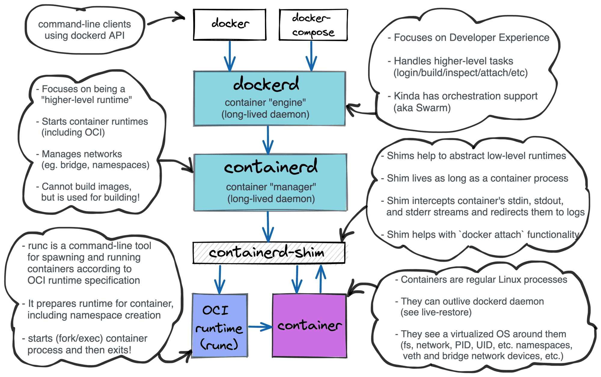
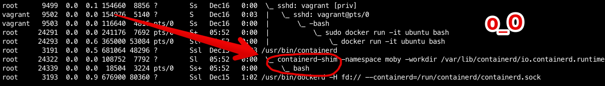
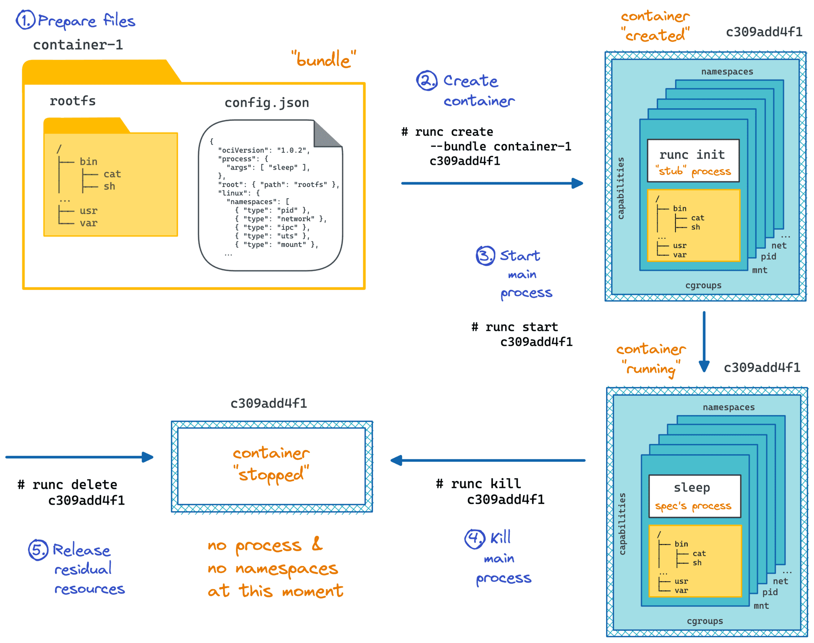
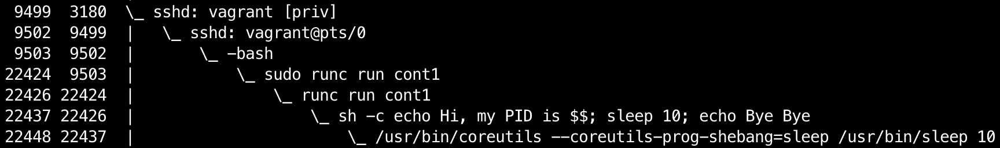
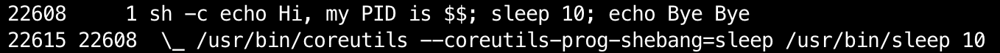

# Implementing Container Runtime Shim: runc


> [https://iximiuz.com/en/posts/implementing-container-runtime-shim/](https://iximiuz.com/en/posts/implementing-container-runtime-shim/)


## What is a shim?

[A container runtime shim](https://iximiuz.com/en/posts/journey-from-containerization-to-orchestration-and-beyond/#runtime-shims) is a piece of software that resides in between [a container manager (*containerd*, *cri-o*, *podman*)](https://iximiuz.com/en/posts/journey-from-containerization-to-orchestration-and-beyond/#container-management) and [a container runtime (*runc*, *crun*)](https://iximiuz.com/en/posts/journey-from-containerization-to-orchestration-and-beyond/#container-runtimes) solving the integration problem of these counterparts.



*Layered Docker architecture*

The easiest way to spot a shim is to inspect the process tree on a Linux host with a running docker container:



*`ps auxf` output on a host running `docker run -it ubuntu bash`; notice `containerd-shim` process in between `containerd` and `bash`.*

On the one hand, runtimes need shims to be able to survive managers restarts. On the other hand, shims are helping container managers to deal with the quirky behavior of runtimes. As a part of [the container manager implementation series](https://iximiuz.com/en/posts/conman-the-container-manager-inception/), we will try to create our own shim and then integrate it with [*conman*](https://github.com/iximiuz/conman), an experimental container manager. Hopefully, during the development, we will gain an in-depth understanding of the topic.

However, before jumping to the shim development, we need to familiarize ourselves with the container runtime component of the choice. Unsurprisingly, *conman* uses *runc* as a container runtime, so I will start the article by covering basic *runc* use cases alongside its design quirks. Then I'll show the naive way to use *runc* from code and explain some related pitfalls. The final part of the article will provide an overview of the shim's design.

## Playing with runc

The detailed explanation of *what is a container runtime* and *why do we need one* is out of the scope of this article. If you are lacking this knowledge, read [this section first](https://iximiuz.com/en/posts/journey-from-containerization-to-orchestration-and-beyond/#container-runtimes), then check out [*runc*](https://github.com/opencontainers/runc) README file, and try out `runc --help`.

Long story short, *runc* is **a command-line tool** for running containerized applications. If this sentence sounds too fancy, you can think of *runc* as just a tool to spawn a new ordinary Linux process but inside of an isolated environment. The isolation among other things includes a dedicated root file system and a new process tree and is being achieved via Linux *namespaces* and *cgroups* facilities. Let's call this new process that *runc* launches **a container process**. This process becomes the first process (i.e. *PID=1*) inside of the newly started container. We will be referring to this process frequently throughout the rest of the article.

Even though *runc* is most often used behind *Docker* (through *containerd*) or *cri-o* daemons while both oftentimes reside behind a *kubelet*, it's a standalone executable file, i.e. *runc* is by no means a library. We will see further on how this design makes the usage of *runc* from another software somewhat complicated, but now let's try to just play with this tool in our favorite terminal emulator:

runc supports running containers controlled by a [Linux pseudoterminal](https://iximiuz.com/en/posts/linux-pty-what-powers-docker-attach-functionality/), but today we will not use this functionality and leave its consideration to a separate article.



```bash
# Prepare some directories.
$ mkdir -p container1/rootfs
$ cd container1

# Use docker to create a root
# filesystem for our new container.
$ sudo bash -c 'docker export $(docker create busybox) | tar -C rootfs -xvf -'

# Create a default bundle (i.e. container) config.
$ runc spec

# Change the default command (sh) to
# sh -c 'echo Hi, my PID is $$; sleep 10; echo Bye Bye'
$ sed -i 's/"sh"/"sh", "-c", "echo Hi, my PID is $$; sleep 10; echo Bye Bye"/' config.json

# Do not use pseudoterminal (PTY) to control the container process.
# PTY use cases lie out of the scope of this article.
$ sed -i 's/"terminal": true/"terminal": false/' config.json

# Review the bundle config (optional).
$ less config.json

# Run the container with ID cont1.
$ sudo runc run cont1
```

If we check the corresponding process tree using `ps axfo pid,ppid,command` in the separate terminal session we will see something similar to this:




The process hierarchy seems absolutely normal. Our login *bash* session (*PID 9503*) [fork-execed](https://en.wikipedia.org/wiki/Fork–exec) an [intermediary *sudo* process](https://unix.stackexchange.com/a/254798/163830) (*PID 22424*) which in turn fork-execed the *runc* process (*PID 22425*, not on the screenshot). The runc process then forked itself (due to [PID namespace implementation related reasons](https://man7.org/linux/man-pages/man7/pid_namespaces.7.html), see [this diagram](https://twitter.com/iximiuz/status/1433694551940681754) for more) and the second fork (*PID 22426*) finally launched the *sh* shell (*PID 22437*) inside of the containerized environment.

Now, let's take a look at the produced output:

```perl
Hi, my PID is 1
Bye Bye
```

Notice, that even though from the host system we see the PID of the *sh* process as *22437*, our tiny script printed out `Hi, my PID is 1`. That's perfect proof that it got its own process ID namespace. We also should set our eyes on the fact that the *stdout* content of the container was just printed out to our terminal, meaning that *stdio streams* of our login bash shell have been [passed through](https://github.com/opencontainers/runc/blob/201b06374548b64212f4ceb1529688d435e42899/docs/terminals.md#-pass-through) to the container and then set as its own *stdio streams*. **That’s an important observation we need to keep in mind.** We can try to represent the process structure as follows:


The approach to run containers we just explored is called [**foreground**](https://github.com/opencontainers/runc/blob/201b06374548b64212f4ceb1529688d435e42899/docs/terminals.md#foreground) in *runc* terminology. It means that the *runc* process always stays in between the container process and the launching process (bash shell in our example). There is another mode supported by *runc*, called [**detached**](https://github.com/opencontainers/runc/blob/201b06374548b64212f4ceb1529688d435e42899/docs/terminals.md#detached). Let's try to use it:

```bash
# from the container1 folder
sudo runc run --detach cont1-detached
```

Notice, how *runc* releases the execution back to our login shell almost instantly. If we check the corresponding process tree, we will see the following picture:




Seems like *runc* exited completely after it has spawned the container process. And the container process has been reparented to the host's *PID 1* process. There is no connection between the launching process (our login shell) and the container process... except for the passed-through *stdio streams*! The output of the container process once again has been printed out to our terminal, but this time the lines produced by the container are interleaved with the login shell prompt appearance:

```ruby
$ sudo runc run --detach cont1-detached
Hi, my PID is 1
$ Bye Bye
```

We can try to depict the corresponding structure of the involved processes and their *stdio streams* as follows:


That's how the detached mode is described by *runc* [documentation](https://github.com/opencontainers/runc/blob/201b06374548b64212f4ceb1529688d435e42899/docs/terminals.md#detached):

> In contrast to foreground mode, in detached mode there is no long-running foreground runc process once the container has started. In fact, there is no long-running `runc` process at all. However, this means that it is up to the caller to handle the stdio after `runc` has set it up for you. In a shell this means that the `runc` command will exit and control will return to the shell, after the container has been set up.

> You can run `runc` in detached mode in one of the following ways:

> - `runc run -d` ... which operates similar to `runc run` but is detached.
> - `runc create` followed by `runc start` which is the standard container lifecycle defined by the OCI runtime specification (`runc create` sets up the container completely, waiting for `runc start` to begin execution of user code).

> The main use-case of detached mode is for higher-level tools that want to be wrappers around `runc`. By running `runc` in detached mode, those tools have far more control over the container's `stdio` without `runc` getting in the way (most wrappers around `runc` like `cri-o` or `containerd` use detached mode for this reason).

> Unfortunately using detached mode is a bit more complicated and requires more care than the foreground mode -- mainly because it is now up to the caller to handle the `stdio` of the container.

We need to admit, that the foreground mode has some significant drawbacks and the detached mode has been designed in a way to eliminate them. From [the same document](https://github.com/opencontainers/runc/blob/201b06374548b64212f4ceb1529688d435e42899/docs/terminals.md#foreground):

> The main drawback of the foreground mode of operation is that it requires a long-running foreground runc process. If you kill the foreground runc process then you will no longer have access to the stdio of the container (and in most cases this will result in the container dying abnormally due to SIGPIPE or some other error). By extension this means that any bug in the long-running foreground runc process (such as a memory leak) or a stray OOM-kill sweep could result in your container being killed through no fault of the user. In addition, there is no way in foreground mode of passing a file descriptor directly to the container process as its stdio (like --preserve-fds does).

## A naive attempt to use runc from code

By this time we already know how quirky *runc* is when it comes to handling its *stdio* streams. We also know the desired mode to use if we want to run *runc* from container management software. Let's try to make a naive program launching a container with the following *sh* program:

```bash
#!/bin/sh

function report_sigpipe() {
    echo "got SIGPIPE, exiting..." > /var/trap.log;
    exit 1;
}

trap report_sigpipe SIGPIPE;

while sleep 1
do
    echo "time is $(date)";
done
```

The idea of the script is fairly simple. Every second it writes the current time to its *stdout*. Additionally, it catches the *SIGPIPE* signal (using [`trap`](https://man7.org/linux/man-pages/man1/trap.1p.html)) and reports it by writing `/var/trap.log` file, then exits.

Now, let's prepare a *runc* bundle:

```bash
$ mkdir -p container2/rootfs
$ cd container2

$ sudo bash -c 'docker export $(docker create busybox) | tar -C rootfs -xvf -'

$ cat > rootfs/entrypoint.sh <<EOF
#!/bin/sh

function report_sigpipe() {
    echo "got SIGPIPE, exiting..." > /var/trap.log;
    exit 1;
}

trap report_sigpipe SIGPIPE;

while sleep 1
do
    echo "time is $(date)";
done
EOF

$ runc spec

$ sed -i 's/"sh"/"sh", "entrypoint.sh"/' config.json
$ sed -i 's/"terminal": true/"terminal": false/' config.json

# Make the rootfs writable to be able to save /var/trap.log.
$ sed -i 's/"readonly": true/"readonly": false/' config.json
```

Finally, let's quickly make a tiny *Go* container management program. As any container manager, it should be interested in the container's *stdout* content. It will be reading the data written by the container to its *stdout* and reporting it back to us. And as we learned earlier, we need to use *runc* in the detached mode:

```go
package main

import (
    "fmt"
    "os"
    "os/exec"
    "strings"
)

func main() {
    // We want to have a full control on the container's
    // stdout, so we are creating a pipe to redirect it.
    rd, wr, err := os.Pipe()
    if err != nil {
        panic(err)
    }
    defer rd.Close()
    defer wr.Close()

    // Start runc in detached mode.
    fmt.Println("Launching runc")

    cmd := exec.Command("runc", "run", "--detach", os.Args[1])
    cmd.Stdin = nil  // i.e. /dev/null
    cmd.Stderr = nil // i.e. /dev/null
    cmd.Stdout = wr
    if err := cmd.Run(); err != nil {
        panic(err)
    }

    // Read some data from the container's stdout.
    buf := make([]byte, 1024)
    for i := 0; i < 10; i++ {
        n, err := rd.Read(buf)
        if err != nil {
            panic(err)
        }
        output := strings.TrimSuffix(string(buf[:n]), "\n")
        fmt.Printf("Container produced: [%s]\n", output)

    }

    // Get bored quickly, give up and exit.
    fmt.Println("We are done, exiting...")
}
```

Now let's try to use our manager to run a container with the aforementioned script:

```bash
$ sudo `which go` run main.go cont2
Launching runc
Container produced: [time is Sun Dec 15 16:34:25 UTC 2019]
Container produced: [time is Sun Dec 15 16:34:25 UTC 2019]
Container produced: [time is Sun Dec 15 16:34:25 UTC 2019]
Container produced: [time is Sun Dec 15 16:34:25 UTC 2019]
Container produced: [time is Sun Dec 15 16:34:25 UTC 2019]
Container produced: [time is Sun Dec 15 16:34:25 UTC 2019]
Container produced: [time is Sun Dec 15 16:34:25 UTC 2019]
Container produced: [time is Sun Dec 15 16:34:25 UTC 2019]
Container produced: [time is Sun Dec 15 16:34:25 UTC 2019]
Container produced: [time is Sun Dec 15 16:34:25 UTC 2019]
We are done, exiting...
```

It seems like a successful attempt. However, if we check the status of the container after the manager's exit we will notice that the container has been stopped as well:

```bash
$ sudo runc state cont2
{
  "ociVersion": "1.0.1-dev",
  "id": "cont2",
  "pid": 0,
  "status": "stopped",
  "bundle": "/home/vagrant/container2",
  "rootfs": "/home/vagrant/container2/rootfs",
  "created": "2019-12-15T17:03:24.266072187Z",
  "owner": ""
}
```

This is obviously not the desired behavior. Even though the container manager exited, we want to have the container running indefinitely. We even used the detached mode, so we know that the container process was reparented to the host's *init* process right after the `runc run --detach` execution. So, what happened to the container?

It's not hard to guess, that the actual container termination reason should have something to do with the ability to write to its *stdout*. If we check the `/var/trap.log` file we will prove that theory quickly:

```bash
$ cat rootfs/var/trap.log
got SIGPIPE, exiting...
```

**This exercise shows that if we want to keep control of the container's \*stdio\* streams, the container process cannot be independent of the launching process.** And since we know, that the container manager can be restarted due to a crash, update, or some other reasons, that makes it impossible to launch *runc* directly from the container manager process. Thus, we need to have a helper process living as long as the underlying container process and serving it. And such a process called **container runtime shim**.

## The full scope of the shim

A container runtime shim is a lightweight daemon launching *runc* and controlling the container process. The shim's process is tightly bound to the container's process but is completely detached from the manager's process. All the communications between the container and the manager happen through the shim. Examples of the production-ready shims out there is [conmon](https://github.com/containers/conmon) and containerd [*runtime shim*](https://github.com/containerd/containerd/blob/753f95e23f588af131fbfea8825229303fe15d9a/runtime/v2/shim.go). The shim usually is responsible for the following (and probably some other) things:

- Serves container's *stdout* and *stderr* streams even during the manager restart. This allows container managers to have containers *stdout* and *stderr* forwarded to log files at any given moment. This is the feature powering `docker logs <container>` and `kubectl logs <pod> -c <container>` commands. When a container manager is being requested to provide some container logs, it just can read them directly from the predefined location on disk. For instance, `kubectl logs` triggers the following delegation chain `kubectl <-- network --> Kubernetes Core API <-- network --> kubelet <-- (CRI gRPC API) --> CRI Runtime Service (cri-o, containerd, docker) <-- read() --> logs on node's disk`.
- Attaches to a running container. Container managers usually provide ways to stream some data in and out from the container, including PTY-controlled scenarios. For that, the shim needs to keep the *stdin* of the container also open. The shim can establish a socket server accepting connections and performing the streaming to and from the container's *stdio* to the attached clients. This powers `kubectl run -i`, `podman run -i --tty`, as well as the famous PTY-controlled interactive Docker use case (eg. `docker run -it ubuntu:latest bash`).
- Keeps track of container exit code. In the detached mode, *runc* deliberately daemonizes the container process by forking and then exiting the foreground process. The container process then gets reparented, by default to the host's *init* process. Having containers detached leads to an absence of container status update. One way to address this problem is to make the shim process a [*subreaper*](https://iximiuz.com/en/posts/dealing-with-processes-termination-in-Linux/#awaiting-a-grandchild-process-termination). This way the container process will be reparented to the shim process. Then the shim can wait for the container's process termination and report its exit code to a predefined destination (eg. a file on the disk). The corresponding container manager can pick it up later.

- Synchronizes container manager with the container creation status. Since *runc* daemonizes the container creation process we need a side-channel (eg. a Unix socket) to communicate the actual start (or failure) of the container back to the container manager. `runc` reports the container creation error via its *stderr*. Since exactly the same file descriptor, later on, can become the container process' *stderr* the shim needs to carefully consume all the data in it until the runtime process termination occurs and report it to the container manager immediately. Thus, if we make a typo in our container command, the actual error will be reported back to us during the container creation phase: `docker run -it ubuntu bahs docker: Error response from daemon: OCI runtime create failed: container_linux.go:345: starting container process caused "exec: \"bahs\": executable file not found in $PATH": unknown.`

## Shim implementation overview

We already know that the container runtime shim has to be a long-lived daemon tightly bound to the container process. Its structure can be expressed as the following diagram:


The main process of the shim is short-lived and serves the purpose of the daemonization of the shim. It forks the actual shim daemon process, writes its PID on disk and exits immediately, leaving the shim detached from the launching process (i.e. a container manager). The long-lived shim daemon process starts from creating a new session and detaching its *stdio* streams from the parent (by redirecting them to `/dev/null`). This is somewhat common steps for any daemon-alike software. Then it forks one more process, the predecessor of the container process. This process `exec`s `runc create` with the provided parameters (bundle dir, config.json, etc). The shim daemon process waits for the termination of the container predecessor and then reports the status of this operation back to the container manager. At this point, we have only a single shim daemon process and a detached container process. However, shim process is a subreaper of the container process. At last, the shim daemon process can start serving the container's *stdio* streams as well as awaiting the container termination. Once the container termination status is known, the shim process writes it to a predefined location on disk and exits.

## Stay tuned

In the following articles, we will see:

- [How to implement a basic container runtime shim in Rust](https://iximiuz.com/en/posts/implementing-container-runtime-shim-2/) and integrate it with the [experimental container manager](https://github.com/iximiuz/conman).
- [How to implement *attach* functionality, bringing interactive containers support](https://iximiuz.com/en/posts/implementing-container-runtime-shim-3/) and revealing the magic behind `docker run -i` and `kubectl run --stdin`.
- How to unleash the power of PTY-controlled containers and shed some light on technologies behind `docker run -it` and `kubectl run --stdin --tty`.

Make code, not war!
