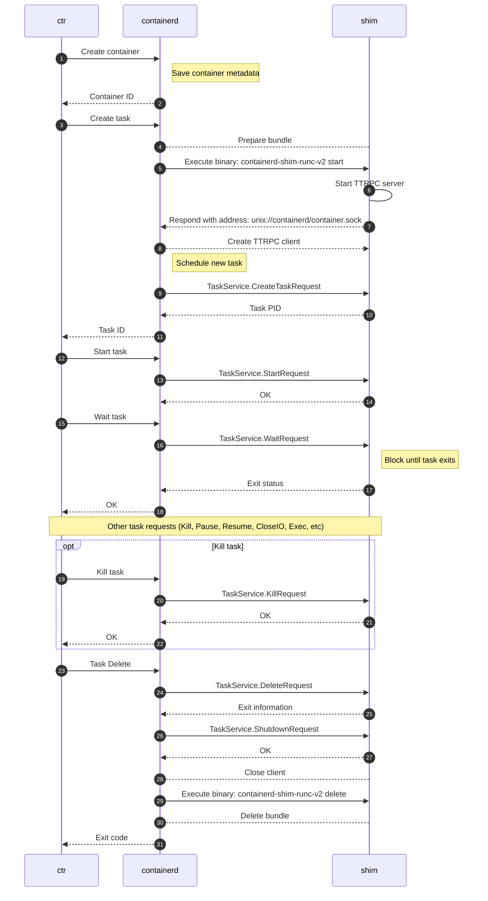

# containerd-shim-runc-v2

> https://github.com/containerd/containerd/blob/main/runtime/v2/README.md

## Flow

The following sequence diagram shows the flow of actions when `ctr run` command executed.

