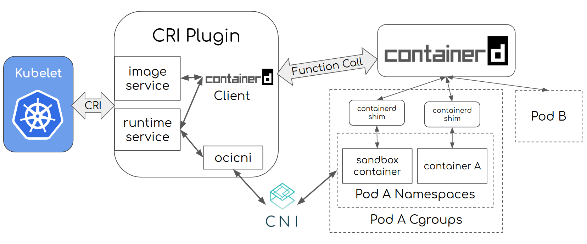
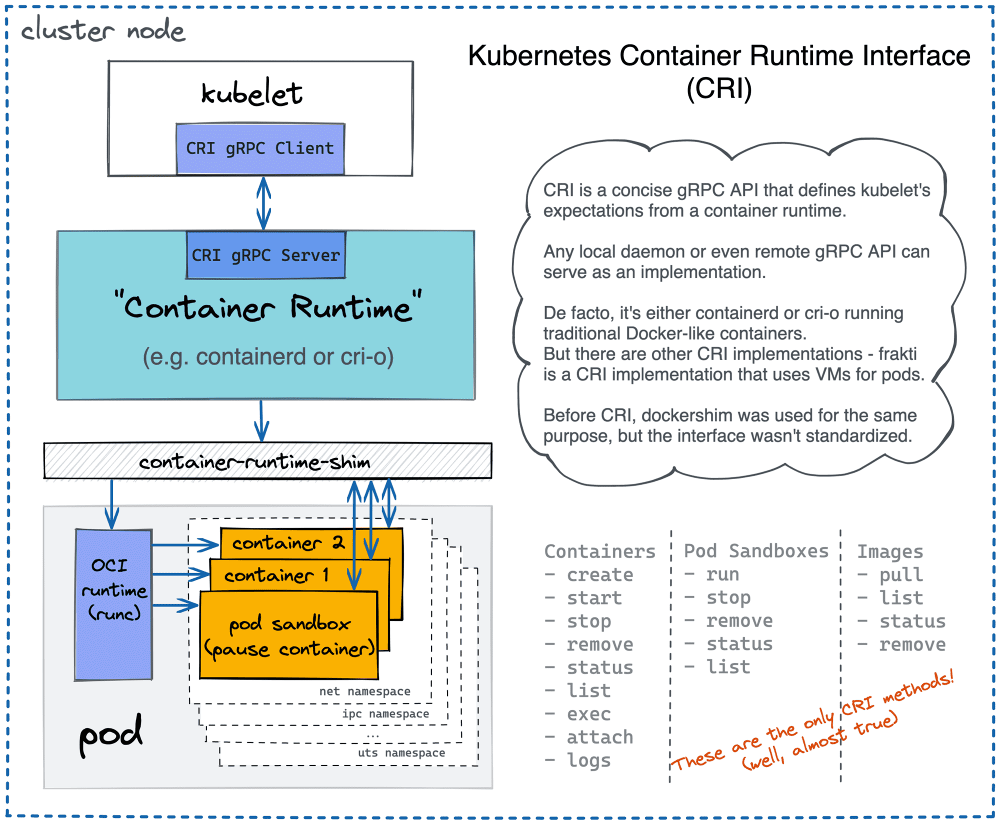

## Introducing Container Runtime Interface (CRI) in Kubernetes

> https://kubernetes.io/blog/2016/12/container-runtime-interface-cri-in-kubernetes/

 In the Kubernetes 1.5 release, we are proud to introduce the [Container Runtime Interface](https://github.com/kubernetes/kubernetes/blob/242a97307b34076d5d8f5bbeb154fa4d97c9ef1d/docs/devel/container-runtime-interface.md) (CRI) -- a plugin interface which enables kubelet to use a wide variety of container runtimes, without the need to recompile. CRI consists of a [protocol buffers](https://developers.google.com/protocol-buffers/) and [gRPC API](http://www.grpc.io/), and [libraries](https://github.com/kubernetes/kubernetes/tree/release-1.5/pkg/kubelet/server/streaming), with additional specifications and tools under active development. CRI is being released as Alpha in [Kubernetes 1.5](https://kubernetes.io/blog/2016/12/kubernetes-1-5-supporting-production-workloads).


### Overview of CRI

Kubelet communicates with the container runtime (or a CRI shim for the runtime) over Unix sockets using the gRPC framework, where kubelet acts as a client and the CRI shim as the server.


The protocol buffers [API](https://github.com/kubernetes/kubernetes/blob/release-1.5/pkg/kubelet/api/v1alpha1/runtime/api.proto) includes two gRPC services, 

- `ImageService`, 

  - The `ImageService` provides RPCs to pull an image from a repository, inspect, and remove an image. 

- `RuntimeService`. 

  - The `RuntimeService` contains RPCs to manage the lifecycle of the pods and containers, as well as calls to interact with containers (exec/attach/port-forward)

  

 A monolithic container runtime that manages both images and containers (e.g., Docker and rkt) can provide both services simultaneously with a single socket. The sockets can be set in Kubelet by `--container-runtime-endpoint` and `--image-service-endpoint` flags.


```go
service RuntimeService {

    // Sandbox operations.

    rpc RunPodSandbox(RunPodSandboxRequest) returns (RunPodSandboxResponse) {}  
    rpc StopPodSandbox(StopPodSandboxRequest) returns (StopPodSandboxResponse) {}  
    rpc RemovePodSandbox(RemovePodSandboxRequest) returns (RemovePodSandboxResponse) {}  
    rpc PodSandboxStatus(PodSandboxStatusRequest) returns (PodSandboxStatusResponse) {}  
    rpc ListPodSandbox(ListPodSandboxRequest) returns (ListPodSandboxResponse) {}  

    // Container operations.  
    rpc CreateContainer(CreateContainerRequest) returns (CreateContainerResponse) {}  
    rpc StartContainer(StartContainerRequest) returns (StartContainerResponse) {}  
    rpc StopContainer(StopContainerRequest) returns (StopContainerResponse) {}  
    rpc RemoveContainer(RemoveContainerRequest) returns (RemoveContainerResponse) {}  
    rpc ListContainers(ListContainersRequest) returns (ListContainersResponse) {}  
    rpc ContainerStatus(ContainerStatusRequest) returns (ContainerStatusResponse) {}

    ...  
}
```

A `Pod` is composed of a group of application containers in an isolated environment with resource constraints. In CRI, this environment is called `PodSandbox`. We intentionally leave some room for the container runtimes to interpret the PodSandbox differently based on how they operate internally. For hypervisor-based runtimes, **PodSandbox might represent a virtual machine. For others, such as Docker, it might be Linux namespaces. The PodSandbox must respect the pod resources specifications.** In the v1alpha1 API, this is achieved by launching all the processes within the pod-level cgroup that kubelet creates and passes to the runtime.


Before starting a pod, kubelet calls `RuntimeService.RunPodSandbox` to create the environment. This includes setting up networking for a pod (e.g., allocating an IP). Once the `PodSandbox` is active, individual containers can be created/started/stopped/removed independently. To delete the pod, kubelet will stop and remove `containers` before stopping and removing the `PodSandbox`.


### design-docs-and-proposals

> https://github.com/kubernetes/community/blob/master/contributors/devel/sig-node/container-runtime-interface.md#design-docs-and-proposals

### Container Runtime Interface (CRI) Networking Specifications

> https://github.com/kubernetes/community/blob/master/contributors/devel/sig-node/kubelet-cri-networking.md


[Container Runtime Interface (CRI)](https://github.com/kubernetes/community/blob/master/contributors/devel/sig-node/container-runtime-interface.md) is an ongoing project to allow container runtimes to integrate with kubernetes via a newly-defined API. This document specifies the network requirements for container runtime interface (CRI). CRI networking requirements expand upon kubernetes pod networking requirements. This document does not specify requirements from upper layers of kubernetes network stack, such as `Service`. More background on k8s networking could be found [here](http://kubernetes.io/docs/admin/networking/)

#### Requirements

1. Kubelet expects the runtime shim to manage pod's network life cycle. Pod networking should be handled accordingly along with pod sandbox operations.
   - `RunPodSandbox` must set up pod's network. This includes, but is not limited to allocating a pod IP, configuring the pod's network interfaces and default network route. Kubelet expects the pod sandbox to have an IP which is routable within the k8s cluster, if `RunPodSandbox` returns successfully. `RunPodSandbox` must return an error if it fails to set up the pod's network. If the pod's network has already been set up, `RunPodSandbox` must skip network setup and proceed.
   - `StopPodSandbox` must tear down the pod's network. The runtime shim must return error on network tear down failure. If pod's network has already been torn down, `StopPodSandbox` must skip network tear down and proceed.
   - `RemovePodSandbox` may tear down pod's network, if the networking has not been torn down already. `RemovePodSandbox` must return error on network tear down failure.
   - Response from `PodSandboxStatus` must include pod sandbox network status. The runtime shim must return an empty network status if it failed to construct a network status.
2. User supplied pod networking configurations, which are NOT directly exposed by the kubernetes API, should be handled directly by runtime shims. For instance, `hairpin-mode`, `cni-bin-dir`, `cni-conf-dir`, `network-plugin`, `network-plugin-mtu` and `non-masquerade-cidr`. Kubelet will no longer handle these configurations after the transition to CRI is complete.
3. Network configurations that are exposed through the kubernetes API are communicated to the runtime shim through `UpdateRuntimeConfig` interface, e.g. `podCIDR`. For each runtime and network implementation, some configs may not be applicable. The runtime shim may handle or ignore network configuration updates from `UpdateRuntimeConfig` interface.


## containerd CRI plugin e.g

> https://github.com/containerd/containerd/blob/main/docs/cri/architecture.md


This document describes the architecture of the `cri` plugin for `containerd`.

This plugin is an implementation of Kubernetes [container runtime interface (CRI)](https://github.com/kubernetes/kubernetes/blob/master/staging/src/k8s.io/cri-api/pkg/apis/runtime/v1/api.proto). Containerd operates on the same node as the [Kubelet](https://kubernetes.io/docs/reference/command-line-tools-reference/kubelet/). The `cri` plugin inside containerd handles all CRI service requests from the Kubelet and uses containerd internals to manage containers and container images.

The `cri` plugin uses containerd to manage the full container lifecycle and all container images. As also shown below, `cri` manages pod networking via [CNI](https://github.com/containernetworking/cni) (another CNCF project).

[](https://github.com/containerd/containerd/blob/main/docs/cri/architecture.png)

Let's use an example to demonstrate how the `cri` plugin works for the case when Kubelet creates a single-container pod:

- Kubelet calls the `cri` plugin, via the CRI runtime service API, to create a pod;
- `cri` creates the pod’s network namespace, and then configures it using CNI;
- `cri` uses containerd internal to create and start a special [pause container](https://www.ianlewis.org/en/almighty-pause-container) (the sandbox container) and put that container inside the pod’s cgroups and namespace (steps omitted for brevity);
- Kubelet subsequently calls the `cri` plugin, via the CRI image service API, to pull the application container image;
- `cri` further uses containerd to pull the image if the image is not present on the node;
- Kubelet then calls `cri`, via the CRI runtime service API, to create and start the application container inside the pod using the pulled container image;
- `cri` finally uses containerd internal to create the application container, put it inside the pod’s cgroups and namespace, then to start the pod’s new application container. After these steps, a pod and its corresponding application container is created and running.


## Kubernetes uses different container runtimes via CRI API.

> [https://iximiuz.com/en/posts/conman-the-container-manager-inception/](https://iximiuz.com/en/posts/conman-the-container-manager-inception/)




## Ref

API: https://github.com/kubernetes/kubernetes/blob/master/staging/src/k8s.io/cri-api/pkg/apis/runtime/v1alpha2/api.proto

crictl: https://github.com/kubernetes-sigs/cri-tools/blob/master/docs/crictl.md
