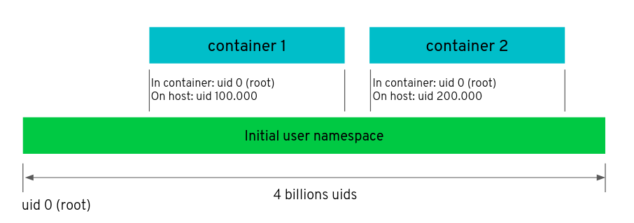
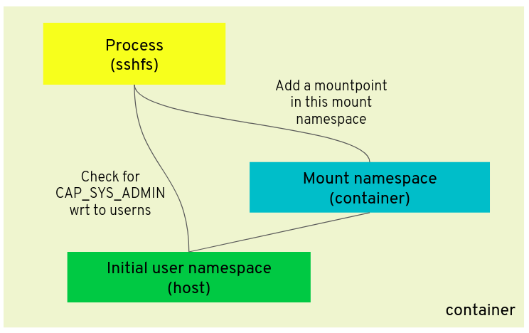
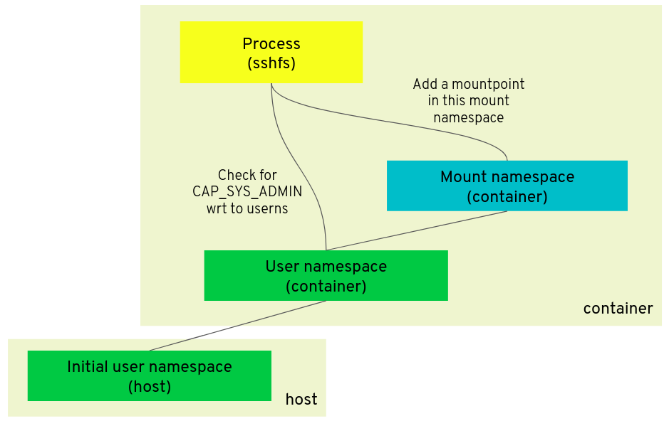
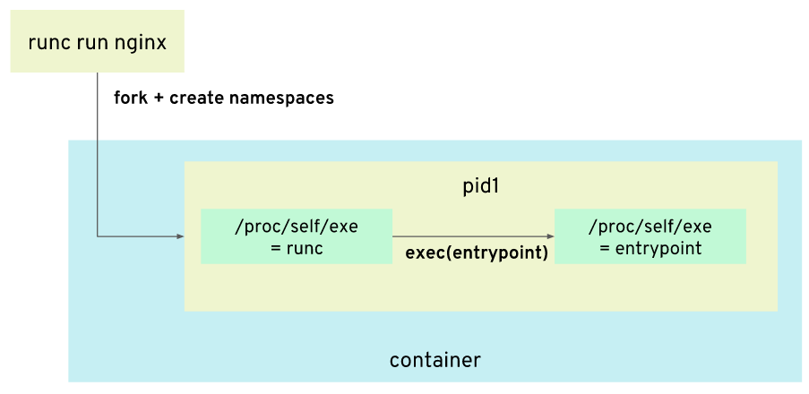
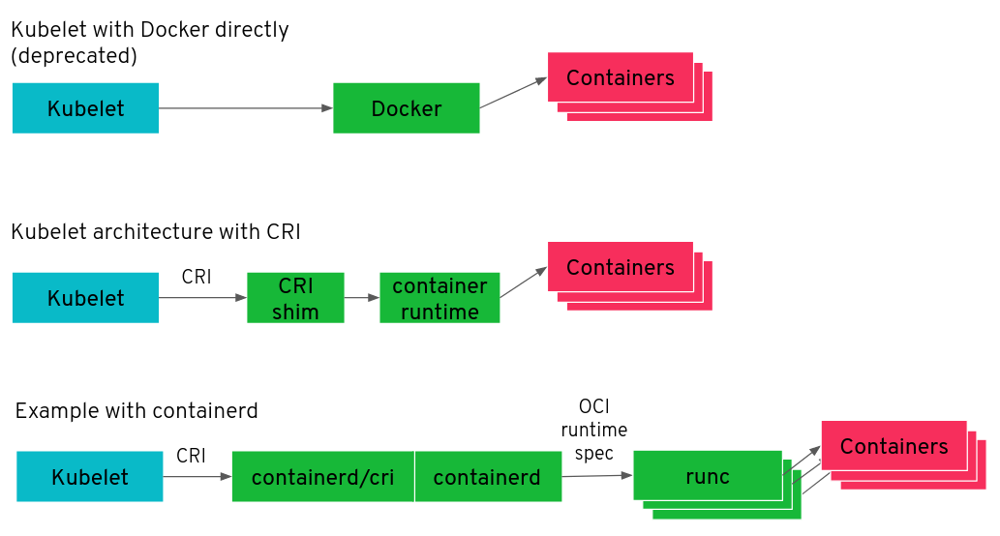
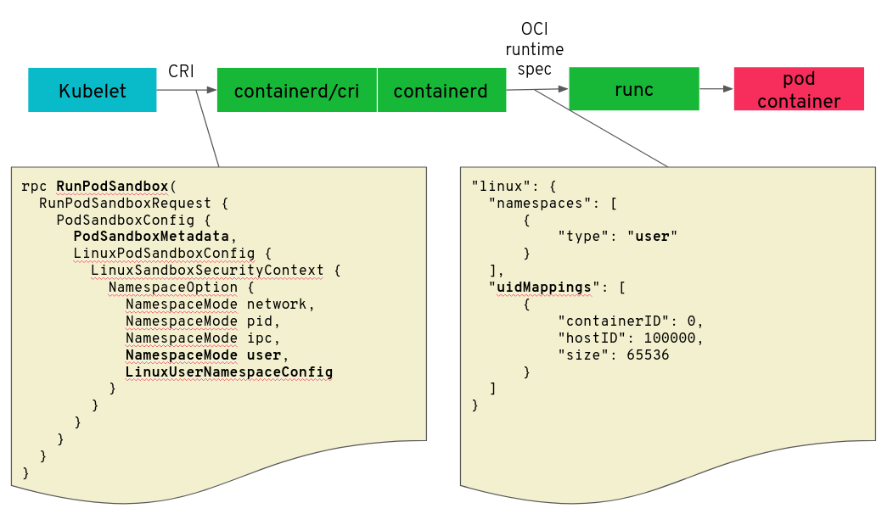
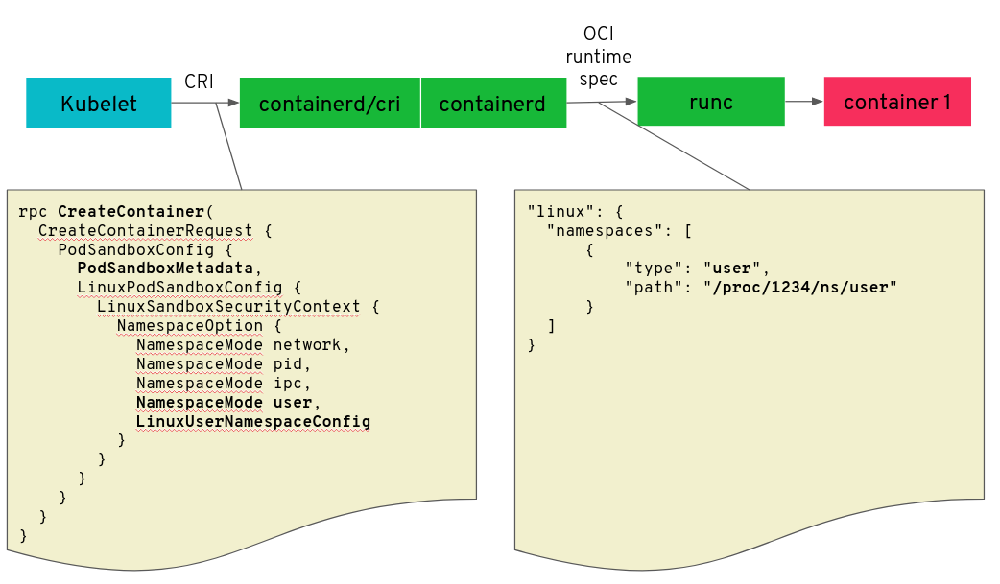
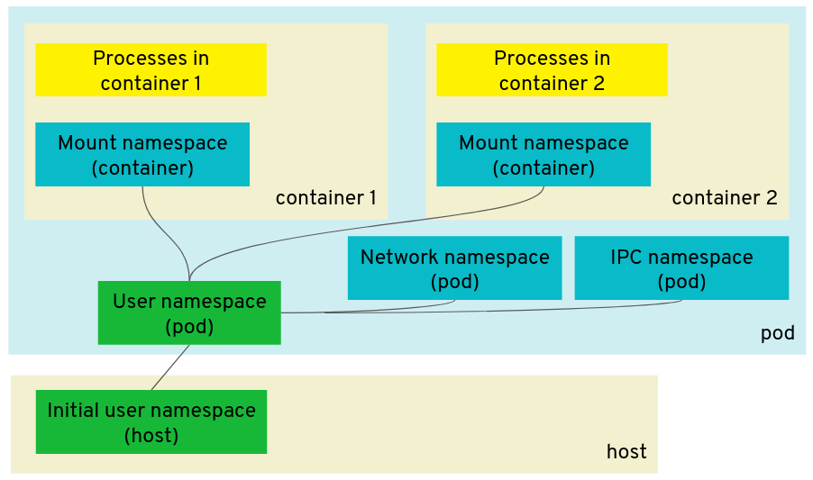
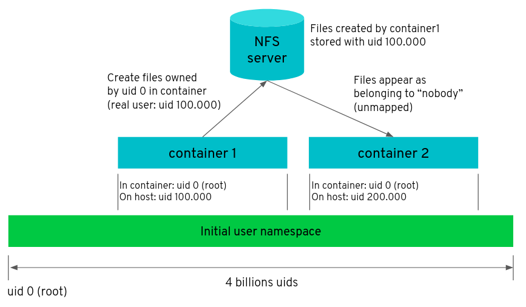

> [Improving Kubernetes and container security with user namespaces](https://kinvolk.io/blog/2020/12/improving-kubernetes-and-container-security-with-user-namespaces/)

## What are user namespaces?

Containers on Linux are not a first-class concept, instead they are built upon namespaces, cgroups and other Linux primitives. The Linux API offers different kinds of namespaces and they each isolate a specific aspect of the operating system. For example, two containers in different network namespaces will not see each other’s network interfaces. Two containers in different PID namespaces will not see each other’s processes.

[User namespaces](https://man7.org/linux/man-pages/man7/user_namespaces.7.html) are similar: they isolate user IDs and group IDs from each other. On Linux, all files and all processes are owned by a specific user id and group id, usually defined in /etc/passwd and /etc/group. A user namespace can be configured to let a container only see a subset of the host’s user IDs and group IDs.

In the example below, the two containers are configured to use distinct sets of user IDs, offering more isolation between themselves and between the containers and the host. Processes and files in *container 1* of the example might have the illusion of being `root` (user id 0), but are in fact using user id 100000 on the host.




### User namespaces and capabilities

This possibility to appear as user “`root`” in the container but, in fact, be another user is an important feature of user namespaces. To go in more details about this, let me first sum up the history of this feature in the Linux kernel:

- Before Linux 2.2, there was one user, “`root`” with user id 0, who could do privileged operations like configuring the network and mounting new filesystems. Regular users couldn’t do those privileged operations.
- Since Linux 2.2, the privileges from the “root” user are split into different [capabilities](https://man7.org/linux/man-pages/man7/capabilities.7.html) , e.g. `CAP_NET_ADMIN` to configure the network and `CAP_SYS_ADMIN` to mount a new filesystem.
- Linux 3.8 introduced user namespaces in 2013 and, with it, capabilities are no longer global but interpreted in the context of a user namespace.

As an example of what that means, we’ll consider the scenario where a container executes the program “`sshfs`” to mount a ssh filesystem using fuse. Mounting a filesystem requires the capability `CAP_SYS_ADMIN`. This is not something normally granted to containers as it would give them too much power and defeats the purpose of isolation between the host and container.

When a container is set up without a new user namespace, the only way to allow it to execute “`sshfs`” successfully is to give `CAP_SYS_ADMIN` to it, which is unfortunate due to the negative security implications discussed above—even though “`sshfs`” does not want to impact the host.



But when the container is using a new user namespace, it can be given `CAP_SYS_ADMIN` in that user namespace without having `CAP_SYS_ADMIN` on the host user namespace. Being “root” (user id 0) in the container does not impact the host because the real user id is not root on the host.

More precisely, to mount a filesystem in the mount namespace of the container requires the process to have `CAP_SYS_ADMIN` in the user namespace owning that mount namespace.



### User namespaces and filesystems

From the explanation above, it looks like thanks to user namespaces, it is possible to allow containers to mount filesystems without being root on the host. But depending on the filesystem, there are more pieces that come into play. Linux keeps a list of filesystems deemed safe for mounting in user namespaces, marked with the [`FS_USERNS_MOUNT` flag](https://lwn.net/Articles/652468/) . Creating a new mount in a non-initial user namespace is only allowed with those filesystem types. You can find the list in the Linux git repository with:

```shell
git grep -nw FS_USERNS_MOUNT
```

As you can see in the table below, new filesystem mounts in non-initial user namespaces were initially restricted to only procfs and sysfs, and then more and more filesystems were allowed along the years to be mounted in user namespaces. This is because it takes time to ensure that a filesystem is safe to use by unprivileged users.

|       filesystem       | Allowed in user namespaces? ( [`FS_USERNS_MOUNT` flag](https://lwn.net/Articles/652468/) ) |
| :--------------------: | :----------------------------------------------------------: |
|     Procfs, sysfs      | Yes, since Linux 3.8, 2012 ( [4f326c0064b20](https://github.com/torvalds/linux/commit/4f326c0064b20) ) |
|         tmpfs          | Yes, since Linux 3.9, 2013 ( [b3c6761d9b5cc](https://github.com/torvalds/linux/commit/b3c6761d9b5cc) ) |
|        cgroupfs        | Yes, since Linux 4.6, 2016 ( [1c53753e0df1a](https://github.com/torvalds/linux/commit/1c53753e0df1a) ) |
|    FUSE filesystem     | Yes, since Linux 4.18, 2018 ( [4ad769f3c346](https://github.com/torvalds/linux/commit/4ad769f3c346) ), or sooner on Ubuntu kernels |
|   overlay filesystem   | Yes, for (Linux [5.11](https://git.kernel.org/pub/scm/linux/kernel/git/torvalds/linux.git/commit/?id=92dbc9dedccb9759c7f9f2f0ae6242396376988f) , 2020, and sooner on Ubuntu kernels ( [patch](https://git.launchpad.net/~ubuntu-kernel/ubuntu/+source/linux/+git/bionic/commit/?id=3b7da90f28fe1ed4b79ef2d994c81efbc58f1144) )) |
| NFS, ext4, btrfs, etc. |                              No                              |

### Impact on container security

User namespaces is another layer of security that isolates the host from the container. There has been a series of container vulnerabilities that were mitigated with user namespaces and it would be safe to assume that future vulnerabilities would be mitigated as well.

As an example, there was [CVE-2019-5736](https://www.openwall.com/lists/oss-security/2019/02/11/2) ( [fix in runc](https://github.com/opencontainers/runc/commit/0a8e4117e7f715d5fbeef398405813ce8e88558b) ) where the host runc binary could be overwritten from the container. The announcement of the vulnerability mentions that using user namespaces is one of the possible mitigations.

This is because even though the vulnerability allows a process in the container to have a reference to runc on the host via /proc/self/exe, the runc binary would be owned by a user (`root`) that is not mapped in the container. The container would perceive runc as belonging to the special user “`nobody`” and the “`root`” user in the container would not have write rights on it.

We had a [blog post](https://kinvolk.io/blog/2019/02/runc-breakout-vulnerability-mitigated-on-flatcar-linux/) explaining the details of the issue and how Flatcar Container Linux mitigated it in a different way, by using a read-only filesystem for hosting the runc binary. The diagram below shows the sequence of steps used by runc to create a container, and how the /proc/self/exe can be a reference to runc. For more details about how that works, see our [blog post](https://kinvolk.io/blog/2019/02/runc-breakout-vulnerability-mitigated-on-flatcar-linux/) .



The Kubernetes User Namespaces KEP ( [KEP/127](https://github.com/kubernetes/enhancements/pull/2101) ) lists a couple of other vulnerabilities that can be mitigated with user namespaces.

## Bringing user namespaces to Kubernetes

Although user namespaces are supported in OCI container runtimes like runc, this feature is not available in Kubernetes. Ongoing, unsuccessful, efforts in Kubernetes to add user namespace support date back to 2016 starting with [this enhancement issue](https://github.com/kubernetes/enhancements/issues/127) .

At the time of this first attempt, Kubernetes had already introduced the [Container Runtime Interface (CRI)](https://kubernetes.io/blog/2016/12/container-runtime-interface-cri-in-kubernetes/) but it was not yet the default. Nowadays, however, the Kubelet communicates with the container runtime via the CRI’s gRPC interface and is the main target to introduce support for user namespaces.



The diagram above shows different architectures for the Kubelet’s communication with the container runtimes:

1. The old way: the Kubelet talks to Docker directly to start containers using the Docker API (deprecated)
2. The new way: the Kubelet talks to the container runtime via the CRI’s gRPC interface. The container runtime might have a “CRI shim” component that understands the CRI protocol.
3. The new way when using containerd as the container runtime: containerd is compiled with containerd/cri to understand the CRI protocol. They receive CRI commands from the Kubelet and start containers using runc and the OCI runtime spec.


### CRI changes for user namespaces

The exact changes in the CRI to support user namespaces are still in discussion. But the general idea is the following:

1. The Kubelet asks the container runtime to start the “pod” sandbox with the `RunPodSandbox()` method. This will create a “sandbox” container (also known as the “infrastructure” container) that will hold the shared namespaces among the different containers of the pod. The user namespace will be configured at this stage with specific uid and gid mappings, as you can see in the OCI runtime configuration given to runc.



1. Then, the Kubelet will call the method `CreateContainer()` for each container of the pod with a reference to the sandbox previously created. The OCI runtime configuration will specify to reuse the user namespace of the sandbox.



In this way, the user namespace will be shared by the different containers in the pod.

The IPC and network namespaces are also shared at the pod level, allowing the different containers to communicate with each other using IPC mechanisms and with the network loopback interface respectively. The IPC network and network namespace are owned by the user namespace of the pod, allowing the capabilities of those namespace types to be effective in the pod but not on the host. For example, if a container is given CAP_NET_ADMIN in the user namespace, it will be allowed to configure the network of the pod but not of the host. If a container is given `CAP_IPC_OWNER`, it can bypass the permissions of IPC objects in the pod but not on the host.

The mount namespace in each container is also owned by the pod user namespace. Thus, if a container is given `CAP_SYS_ADMIN`, it will be able to perform mounts in its mount namespace but that capability will not be effective for the host mount namespace because the host mount namespace is not owned by the user namespace of the pod.




### Kubernetes volumes

A big challenge for user namespaces in Kubernetes is support for volumes. I mentioned in the introduction that different containers should ideally have different sets of user IDs so that they have better isolation from each other. But it introduces a problem when the different containers need to access the same volumes.

Consider the scenario below:

1. Container1 writes files on a NFS share. The files belong to the user ID 100000 because that’s the user mapped in the container.
2. Container2 reads the files from the NFS share. Since the user ID 100000 is not mapped in the container 2, the files are seen as belonging to the pseudo user id 65534, special code for “`nobody`”. This can introduce a file access permission problem.



There are different possibilities to address this problem:

1. Use the same user id mapping for all pods. This reduces the isolation between containers, although this would still provide better security than the status quo without user namespaces. The files on the volume would be owned by a user id such as 100000 and administrator would need to take care that the user id mapping in the Kubernetes configuration does not change during the lifetime of the volume.
2. Use different user id mappings for each pod but use an additional mechanism to convert the user id of files on the fly. There are different kernel mechanisms in the works providing that: [shiftfs](https://lwn.net/Articles/757650/) , [fsid mappings](https://lwn.net/Articles/812221/) or [new mount API](https://lwn.net/Articles/753473/) in the Linux kernel. But so far, none of those solutions are ready in Linux upstream.

Our current proposal makes it possible to use the first possibility and it could be extended later when a better solution arises.

Note that there are plenty of workloads without volumes that would benefit from user namespaces today, so not having a complete solution today should not block us from incrementally implementing user namespaces in Kubernetes.

## Conclusion

User namespaces is a Linux primitive that is useful for providing an additional layer of security to containers. It has proven to be a useful mitigation in several past vulnerabilities. Although it still suffers for some shortcomings with volumes support, Linux kernel development is active in that area. I expect future improvements to build on the improvements that have been made over the last years.

We’re proud to contribute to that community effort in Kubernetes. Once Kubernetes support for user namespaces is complete, Kubernetes will gain a better security isolation between container workloads and the Linux hosts. It will also open the door for new use cases of running containers with more privileges, something that is today — without user namespace support — too dangerous to do.
