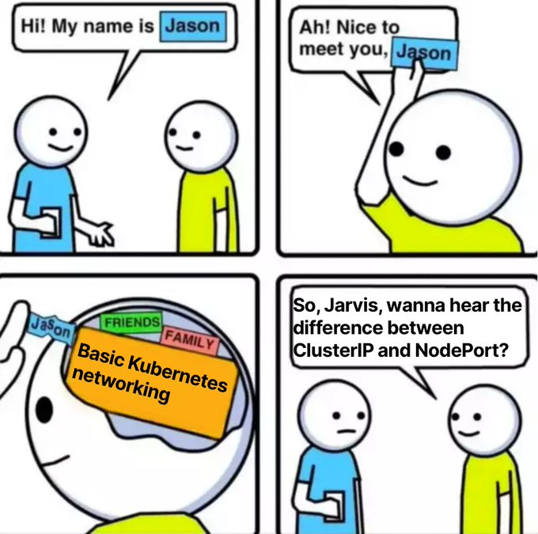
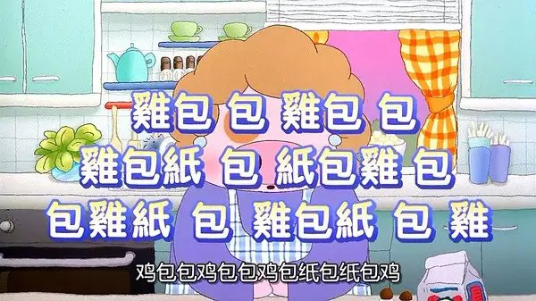
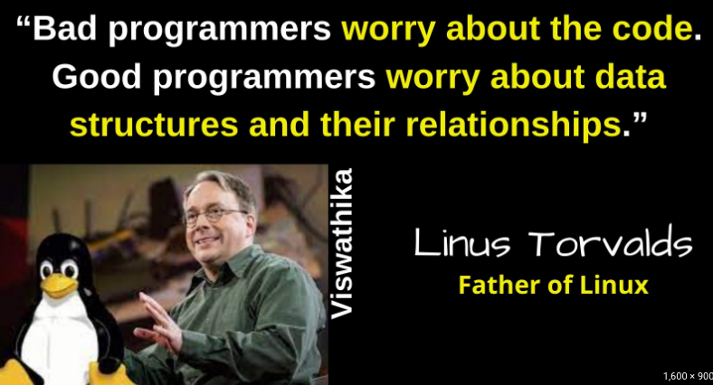
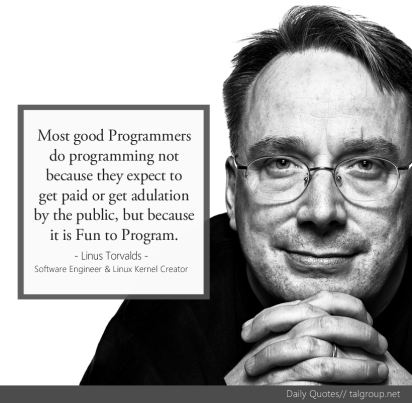

# K8s CSI & ceph 构架图解，还有一些闲话

> [https://blog.mygraphql.com/zh/posts/cloud/csi/ceph-csi-arch/](https://blog.mygraphql.com/zh/posts/cloud/csi/ceph-csi-arch/)

*图源：Mr. Bean's Holiday (2007) - Bean 经历万难，最终发现他的假期目的地*

云存储的学习困难，难于 K8s CSI 框架复杂性，再加上如 `ceph` 分布式存储的复杂性。本文试图用互动式图例，让读者串联起两个领域自身与领域间的知识点，从而对整个流程有一个总体的感知；避免盲目深入一个一个零散的知识点孤岛而迷路。

> 注：由于是在 2023 年五一假期写的，本文的口味会轻松点。也可能会跑题和闲话，毕竟这只是个个人博客，不是个“极客时间”上的收费文章，不能要求太高了 :)

## 引

最近由于生存需要，学习了之前一直写在学习清单，而总想逃避的 k8s 存储架构。为备忘，写下这个笔记。如果能帮助到更多的人去学习这个技术难点，当然更好了。

### K8s 几大难点

学习过 k8s 的人，我想都觉得有点记忆过载，设计复杂，资料多而散，说抽象的太多说实现的少。用麦兜的一句经典表达是：

> 
>
> 教大家一味很別緻的小菜----包雞紙包雞紙包雞，首先將紙包雞小心臟撩開，大家就會有一張包雞紙及一塊雞，拿著雞包紙像我這樣子包住那塊雞，然後再像這種子用包雞紙包包住它，那一味包雞紙包雞包紙包雞就完成了！是不是很簡單單啊？還真有一塊雞吃呢！

我觉得有几个难点，同时也是重点：

- 对象（期望状态）、现实状态、监听、事件、调和
- 网络：之前写过的 calico 文章：[《一个IP包的旅行 —— K8s 网络之 Calico 浅度解构》](https://blog.mygraphql.com/zh/notes/cloud/calico/)
- CSI：本文
- CRI：未深入

多年信息技术学习，积累的学习方法不多，但有一点我坚信不移：

> “Bad programmers worry about the `code`. Good programmers worry about` data structures` and their `relationships`.”
>
> ― Linus Torvalds

在所谓的微服务架构下，道理也是类似的：

- 学习核心数据模型与联系，我称之类静态模型
- 学习服务之间的状态变化与数据流转的关系，我称之为动态行为

### 如何开始

#### 如何学习抽象

学习抽象的知识（如 k8s CSI）时，最好的方法是不要直接学习抽象的知识。如何理解？抽象是设计者在知识领域充分积累和提炼后的输出，抽象本身是精简且易于传播的。但和过分提炼的食物一样，也通常是难于消化的。

人脑自然上是比较适合学习具体事物，然后提炼出抽象。且不是直接学习抽象。如果你学习 k8s CSI，那么找个实例来玩弄，是最快的学习过程。

下面，我们用自底向上+用实例代替抽象的方法，学习一下 k8s CSI 与 Ceph。

### 本文的阅读方法

#### 互动图片

📢  本文提供的技术相关图片，均可点击 “*用 Draw.io 打开*” 后，进入互动图片状态。图中很多元素（带下划线）提供链接到相关资料文档。可以做交叉参考，是进一步深入的入口，也是图的可信性取证。
本文的大部分内容是放在图中了。看图比文字更重要。

#### 读者对象

假设你已经大概读过 Ceph 的文档，也大概知道 CSI 和 Rook 是什么。

## 基本的依赖关系

研究一个大型的开源项目设计，起点一定包括研究其组件的依赖关系。明白了依赖关系，就可以在研究流程细节时知道：

- who knows who
- who knows what
- who doesn't know who
- who doesn't know what

这点对保证研究方向正确由为重要。因为优秀的开源设计，一定有专业的人去保证这一点设计原则的，不然随着项目的发展，很容易就发生依赖混乱，循环依赖的情况。

*Rook/CSI spec/CSI sidecar/ceph/ceph-CSI-driver(plugin) 的关系*

*[如上图排版有问题，请点这里用 Draw.io 打开](https://app.diagrams.net/?ui=sketch#Uhttps%3A%2F%2Fblog.mygraphql.com%2Fzh%2Fposts%2Fcloud%2Fcsi%2Fceph-csi-arch%2Findex.assets%2Frook-csi-ceph-stack.drawio.svg)*

## Ceph Cluster

下图讲述了，rook + ceph + rbd 下，各个 `Ceph Cluster` 组件的内部配置与组件间的联系。

*Ceph Components*

*[如上图排版有问题，请点这里用 Draw.io 打开](https://app.diagrams.net/?ui=sketch#Uhttps%3A%2F%2Fblog.mygraphql.com%2Fzh%2Fposts%2Fcloud%2Fcsi%2Fceph-csi-arch%2Findex.assets%2Fceph-conf.drawio.svg)*

## CSI

下图讲述 k8s CSI 存储相关 Object 的关系，以及 Ceph 之间的关系。

*CSI k8s Objects and Ceph Mapping*

*[如上图排版有问题，请点这里用 Draw.io 打开](https://app.diagrams.net/?ui=sketch#Uhttps%3A%2F%2Fblog.mygraphql.com%2Fzh%2Fposts%2Fcloud%2Fcsi%2Fceph-csi-arch%2Findex.assets%2Fcsi-spec-eg.drawio.svg)*

## Ceph-CSI Driver

下图说明了 CSI 在几个存储状态下的流程和关系：

1. PVC/PV/rbd Volume 的创建 (provision) 过程。
2. 提交 PV 挂载要求的过程
3. worker node 实际挂载 rbd volume 的过程

*CSI and Ceph processes*

*[如上图排版有问题，请点这里用 Draw.io 打开](https://app.diagrams.net/?ui=sketch#Uhttps%3A%2F%2Fblog.mygraphql.com%2Fzh%2Fposts%2Fcloud%2Fcsi%2Fceph-csi-arch%2Findex.assets%2Fceph-csi.drawio.svg)*

## 小结

高高举起，轻轻放下，一直是我的写博风格。除非必要，我几乎不会去在文章中说一些比较局部细小的知识点。本文也不例外。文字内容少，不代表我没认真去画上面的图。相反，上面的图均是在大量资料和环境实地推敲和经历多翻修订后完成的。

我不想在文章中直接说太长篇的细节：

- 一个是我相信读者们如果真有动力去学东西，这些图可以帮助你去系统学习和串联知识面，而不至于迷路。
- 我不想重复官方文档的知识点，只提供到官方文档的引用。
- 希望是授人以渔，而非鱼，虽然可能我能力有限，未能做到。

谢谢阅读！

## 闲话

从业快20年，不敢说阅人无数，也总算经历过一些东西和场面。程序员这个职业，其实在我国时间大概就是30年。10前，我看到更多的程序员是喜欢 coding 这件事，现在，我看到更多的是职业程序员。

不要误会，这里不存在褒贬，我尊敬所有敬业的人，无论他是内心喜欢做这事，还是由于各种原因去做这件事。

但，请为前者（内心喜欢做这事）的人留一条在这个行业生存的活路，因为二者的共存是这个行业健壮发展的保证。但前者在我们丛林法则环境下的生存能力通常是脆弱的。

*注：Bad 与 Good的定义只是对于底层技术的创新能力，而非现实上的执行力*

### AI / ChatGPT

记得看电影和一些老科幻小说时，里面总有一些固执的老一辈武林高手的角色，藐视那些用枪的人：“用这些东西，算什么武功”。但可悲的现实是，这些 “老一辈武林高手” 最后就是 killed 在枪下。我最近的感觉是，自己越来越像这些 “固执的老一辈武林人（还不算是高手）”。而这个先进科技，当然就是 AI / ChatGPT 了。

####  “不可控” 天然的抗拒

老程序员，或多或少，对 “不可控” 有天然的抗拒。因为大部分时候，程序想做到的就是考虑一切可能，然后用程序逻辑去控制一切可能。虽然这个目标永远只能接近而不可能达到。

#### 只要 how，还是要 why

搜索引擎到来时，有人说搜索只是解决了问题，而没有让人知道为什么。但 Chat AI 下这个问题似乎更加严重。因为 Chat 的回复比搜索更加精准和智能定制。就像说：“我告诉你答案，你照着抄就是了”。当然，你可以进一步问他 why。但有几个人真那么有好奇心呢？

回到上面说的“老一辈武林高手” 最后就是 killed 在枪下，这个故事。我觉得自己迟早也是这个结局，除了小数几个哲学家，没几个人能逃过时代的车轮。只是，每个人都可以有自己的选择，可以选择理性和现实；也可以选择固执和书呆子。这不是个对错的问题，只要知道自己为何作出选择，选择的结果是什么，就可以了。

*图源：Mr. Bean's Holiday (2007) - 结局*
