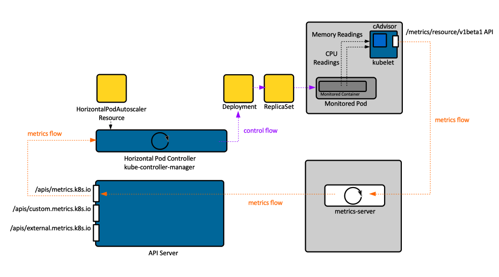
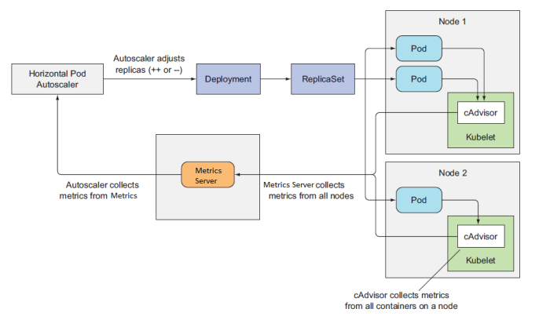
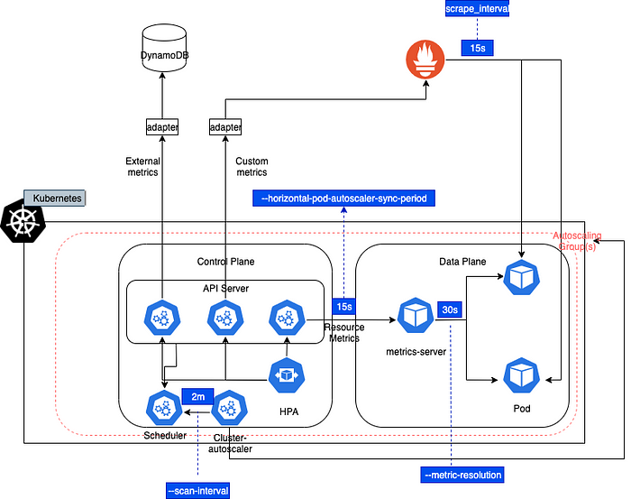
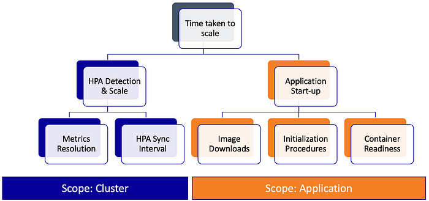
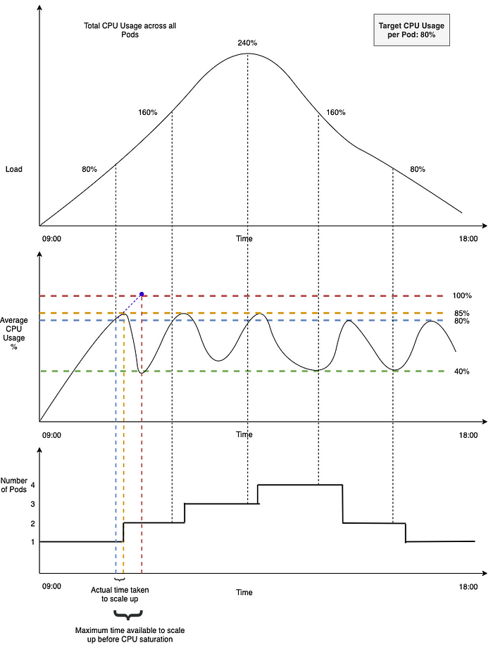

# HPA

## design-proposals

- [Horizontal Pod Autoscaling](https://github.com/kubernetes/design-proposals-archive/blob/main/autoscaling/horizontal-pod-autoscaler.md)


## HPA Architecture


> https://kb.novaordis.com/index.php/Kubernetes_Horizontal_Pod_Autoscaler




> https://ramzibot.wordpress.com/2019/10/26/kubernetes-hpa-horizontal-pod-autoscalar-the-right-way-to-do-it/




> https://medium.com/expedia-group-tech/autoscaling-in-kubernetes-why-doesnt-the-horizontal-pod-autoscaler-work-for-me-5f0094694054





The following explains various steps in the above illustration.

1. HPA does not receive events when there is a spike in the metrics. Rather, HPA **polls for metrics from the metrics-server**, every few seconds (configurable via --_horizontal-pod-autoscaler-sync-period_ flag, 15 seconds in this example)
2. The metrics server, which HPA polls for metrics by default, itself polls for **aggregate metrics** over a period of time, once every few seconds (configurable via --_metric-resolution_ flag, 30 sec in this example)
3. In this example, HPA is configured to scale based on the **targetAverageCPUUtilization** metric. Two keywords that warrant attention in the name of this metric are — Average and Utilization.


## Responsiveness

> [Autoscaling in Kubernetes: Why doesn’t the Horizontal Pod Autoscaler work for me](https://medium.com/expedia-group-tech/autoscaling-in-kubernetes-why-doesnt-the-horizontal-pod-autoscaler-work-for-me-5f0094694054)





## Illustrated Case

> [Autoscaling in Kubernetes: Why doesn’t the Horizontal Pod Autoscaler work for me](https://medium.com/expedia-group-tech/autoscaling-in-kubernetes-why-doesnt-the-horizontal-pod-autoscaler-work-for-me-5f0094694054)


### Target Utilization

The figure below considers the example of a service with a steady workload. There are 3 graphs in the figure. Ordered from top to bottom, they describe the following:


1. **Load on the service**, in terms of the Total CPU usage across all Pods. Total CPU usage refers to the CPU capacity required to handle the cumulative workload on the service. **_For example,_** A Total CPU usage of 240% indicates that the service requires at least 240%÷100% = 2.4 pods to handle the workload.  
    _\* 100% refers to the capacity of 1 pod_
2. **Average CPU usage** % across all the pods (= Total CPU usage % ÷ Number of pods)。按 pod 平均化的 cpu 使用率。
3. The **number of pods running** at any given point in time





The service is configured to autoscale with the HPA. As can be seen in the top right corner of the above figure, it is configured to run at the <mark>desired CPU usage of 80%</mark>, with the *minReplicas* parameter set to 1.


With these points in mind, let’s look at what happens over time in the above example.


1. The workload on the service steadily increases from around 9 AM until it reaches the peak, just after midday. Then it steadily tapers off towards the end of the day
2. Up until the first dropline (black vertical dotted line which extends down into the vertical blue dotted line), the total CPU required to handle the workload is < 80% (< **_targetCPUUtilizationPercentage_**). So, the HPA does not scale and the number of pods running = 1
3. Beyond this point, the total CPU usage required to handle the workload increases above 80%
4. HPA scales up the deployment to add one more replica, so the total number of pods running = 2
5. Now, with 2 pods running and a cumulative CPU load of ~85%, the average CPU usage across all pods ~ 43%
6. All of this is expected behavior. The HPA responds to an increase in workload by adding more replicas and manages to keep the average CPU utilization to ~ **_targetCPUUtilizationPercentage_** configured


## Concerns

Let’s focus on a couple of things in the figure that we haven’t yet described — The vertical blue dotted line and the vertical orange dotted line.

- **The Blue dotted line** is a marker for the time at which the 80% threshold was breached
- **Orange dotted line** is a market for the time at which an additional replica was up and running

> There is a time lag between detection and scaling

As can be seen in the figure, there is a time lag between these two (i.e.) there is a **time lag\*** between when the target CPU usage threshold was breached and when the additional replica was up and running.

** The reasons for this lag will be described later in this post*

```
Autoscaling lag = Time lag between when the target CPU usage threshold was breached and when the additional replica was up and running
```

Let’s now focus on the **red dotted line**. This is a marker for the time at which the pod would reach 100% CPU utilization if the service wasn’t scaled. Let’s assume you do not want your pod’s CPU usage to reach this level because you observe plenty of throttling at this level — leading to severe degradation and failures.

```
Maximum time available to autoscale = Time lag between when the target CPU usage threshold was breached and when the pod would reach 100% CPU utilization
```

For the autoscaling solution to be effective, a **key** **requirement** is to have **autoscaling lag < maximum time available to autoscale**


